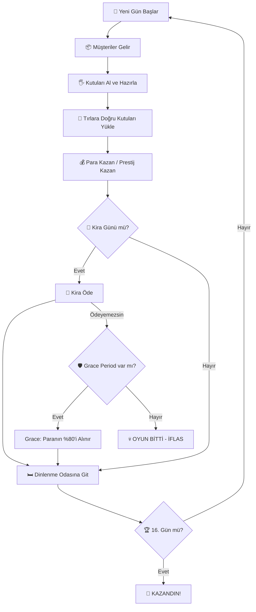
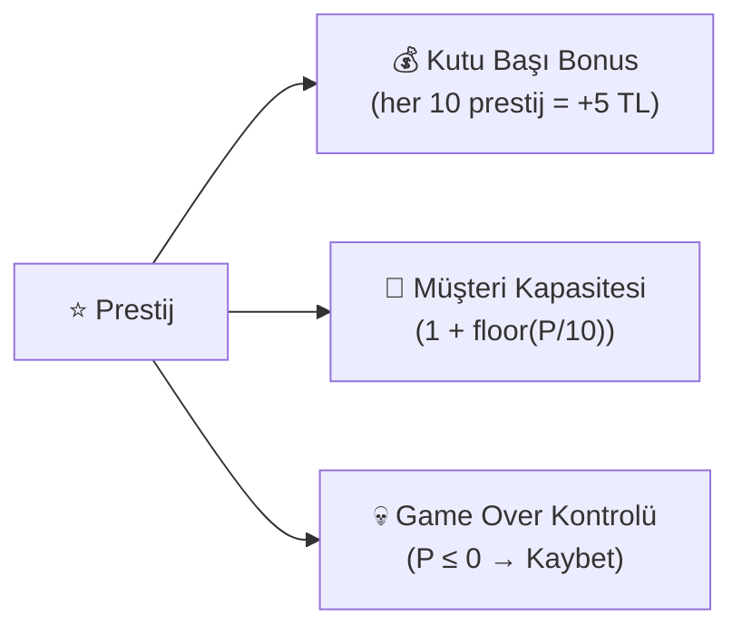
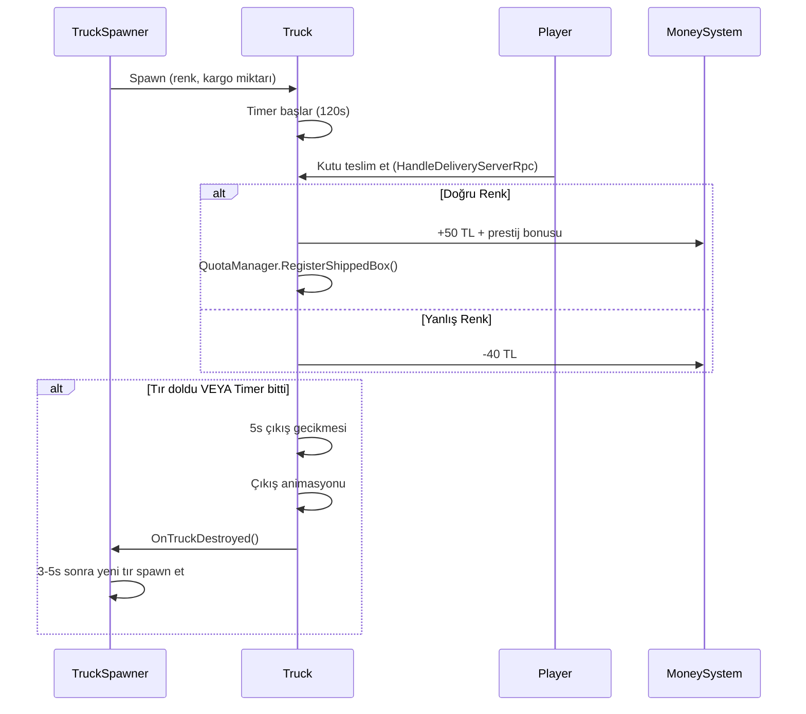
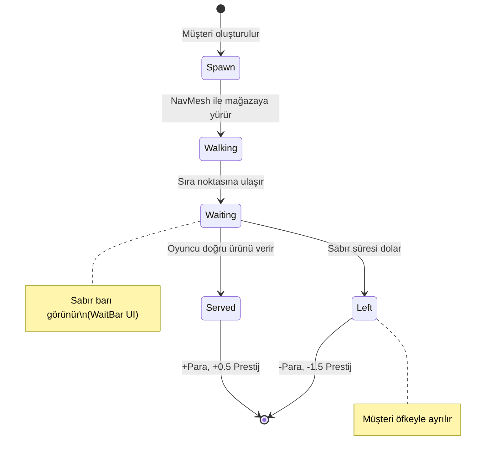
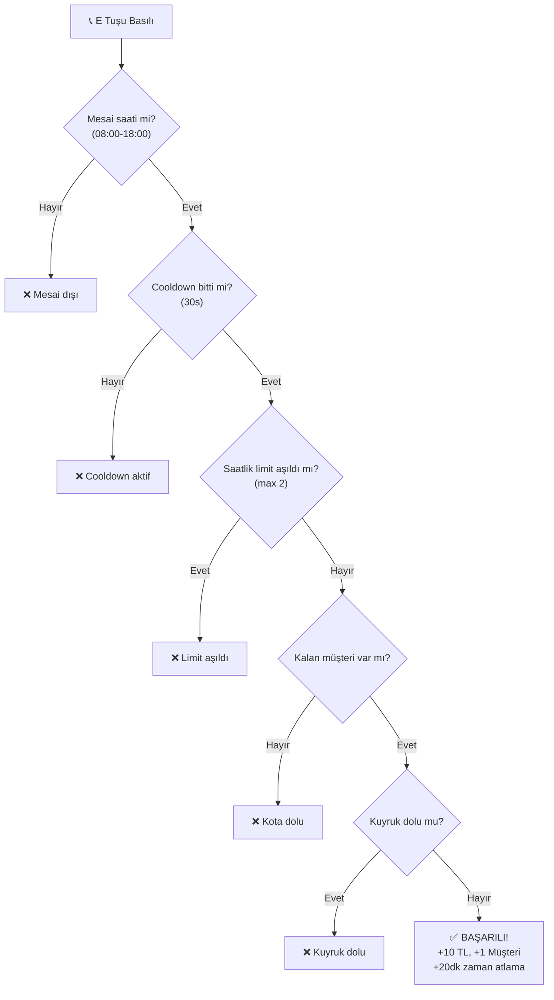
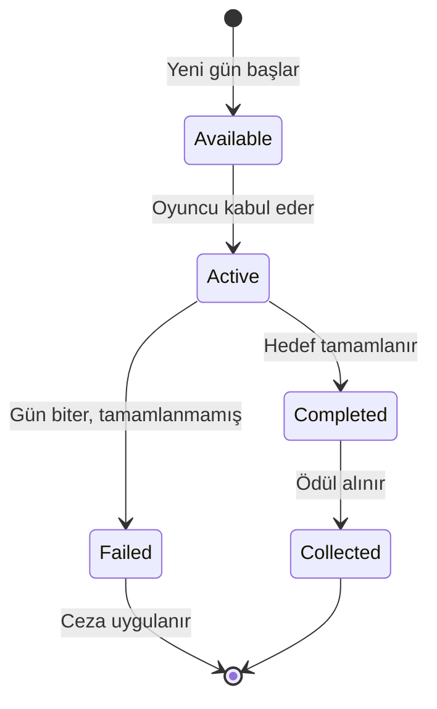
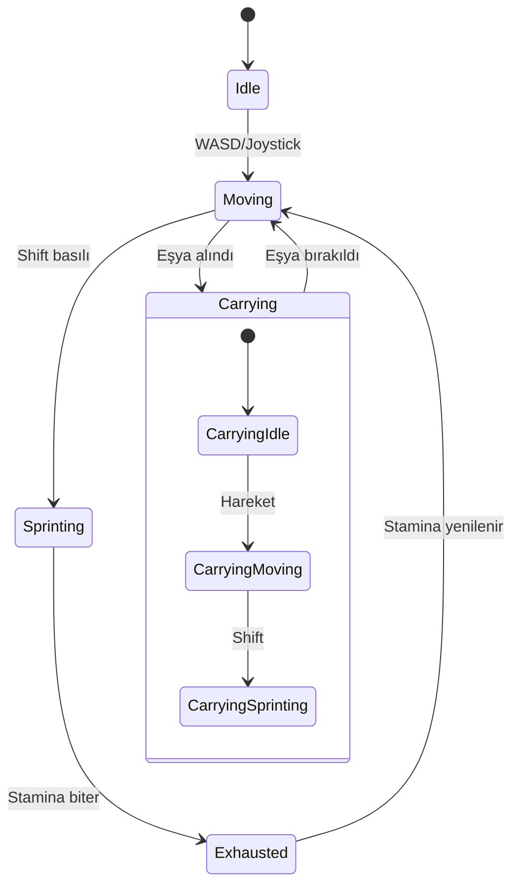
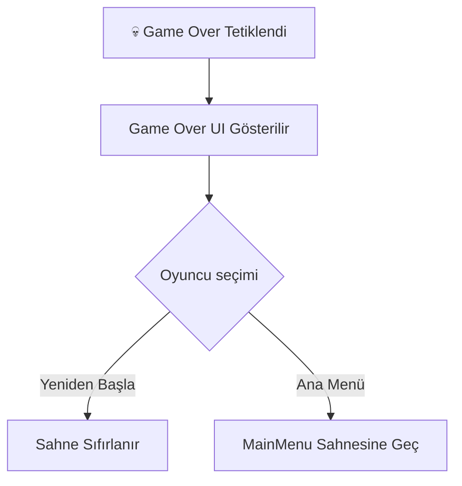
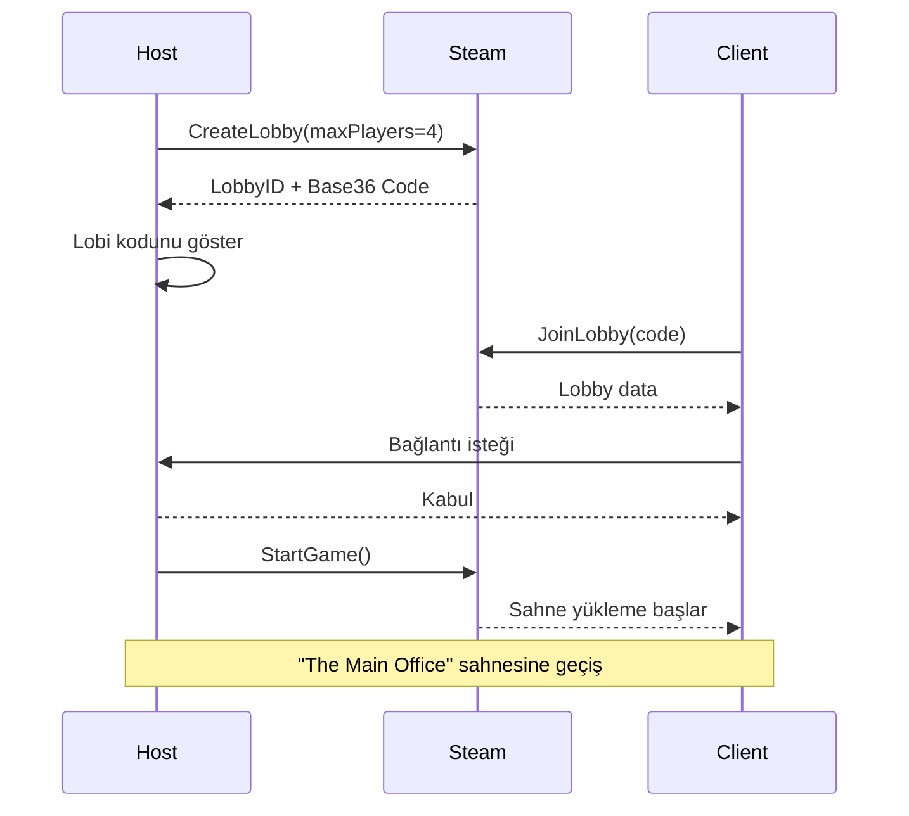
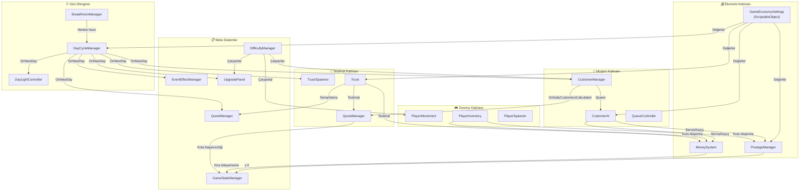

# 📦 CARGOR — Game Design Document (GDD)

> **Stüdyo**: Eclion Software
> **Proje Adı**: Cargor
> **Motor**: Unity (Netcode for GameObjects)
> **Platform**: PC (Steam)
> **Tür**: Co-op Kargo / Mağaza Yönetimi Simülasyonu
> **Oyuncu Sayısı**: 1–4 (Online Co-op)
> **Durum**: Geliştirme Aşamasında
> **Son Güncelleme**: 6 Temmuz 2026

---

## 📑 İçindekiler

1. [Oyun Vizyonu ve Konsepti](#1--oyun-vizyonu-ve-konsepti)
2. [Temel Oynanış Döngüsü](#2--temel-oynanış-döngüsü)
3. [Gün Döngüsü Sistemi](#3--gün-döngüsü-sistemi)
4. [Ekonomi Sistemi](#4--ekonomi-sistemi)
5. [Kira Sistemi](#5--kira-sistemi)
6. [Prestij Sistemi](#6--prestij-sistemi)
7. [Kota Sistemi](#7--kota-sistemi)
8. [Tır / Teslimat Sistemi](#8--tır--teslimat-sistemi)
9. [Müşteri Sistemi](#9--müşteri-sistemi)
10. [Kutu ve Eşya Sistemi](#10--kutu-ve-eşya-sistemi)
11. [Pickup / Envanter Sistemi](#11--pickup--envanter-sistemi)
12. [Raf ve Masa Sistemi](#12--raf-ve-masa-sistemi)
13. [Yükseltme (Upgrade) Sistemi](#13--yükseltme-upgrade-sistemi)
14. [Telefon Sistemi](#14--telefon-sistemi)
15. [Etkinlik (Event) Sistemi](#15--etkinlik-event-sistemi)
16. [Görev (Quest) Sistemi](#16--görev-quest-sistemi)
17. [Oyuncu Hareketi ve Fizik](#17--oyuncu-hareketi-ve-fizik)
18. [Dinlenme Odası Sistemi](#18--dinlenme-odası-sistemi)
19. [Zorluk Sistemi](#19--zorluk-sistemi)
20. [Gece-Gündüz Aydınlatma](#20--gece-gündüz-aydınlatma)
21. [Oyun Durumu: Kazanma ve Kaybetme](#21--oyun-durumu-kazanma-ve-kaybetme)
22. [Tutorial Sistemi](#22--tutorial-sistemi)
23. [Multiplayer ve Ağ Mimarisi](#23--multiplayer-ve-ağ-mimarisi)
24. [Steam Entegrasyonu](#24--steam-entegrasyonu)
25. [Discord Entegrasyonu](#25--discord-entegrasyonu)
26. [UI / UX Tasarımı](#26--ui--ux-tasarımı)
27. [Ses Tasarımı](#27--ses-tasarımı)
28. [Lokalizasyon](#28--lokalizasyon)
29. [Teknik Mimari](#29--teknik-mimari)
30. [Sistem Bağlantı Haritası](#30--sistem-bağlantı-haritası)
31. [Ekonomi Simülasyon Verileri](#31--ekonomi-simülasyon-verileri)
32. [Bilinen Riskler ve Açık Sorular](#32--bilinen-riskler-ve-açık-sorular)

---

## 1. 🎯 Oyun Vizyonu ve Konsepti

### 1.1 Elevator Pitch

> *Cargor, 1-4 oyuncunun bir kargo mağazasını birlikte yönettiği, müşterilere doğru kutuları hazırlayıp tırlara yüklediği, kirasını ödeyip mağazasını büyütmeye çalıştığı kooperatif bir simülasyon oyunudur. "Overcooked meets Warehouse Simulator" ruhunda, basit ama derinlikli mekanikler, artan zorluk ve kaotik co-op eğlence sunar.*

### 1.2 Temel Fantezi

Oyuncu, küçük bir kargo mağazasının çalışanıdır. Her gün gelen müşterilere doğru renkte kutuları hazırlamalı, tırlara doğru kutuları yüklemeli, kotasını doldurmalı ve gün sonunda kirasını ödeyebilecek kadar para kazanmalıdır. Mağaza büyüdükçe tırlara erişim artar, raf ve masa kapasitesi genişler, ama kira da artar. 16 gün boyunca iflas etmeden ve prestijini kaybetmeden ayakta kalmak temel hedeftir.

### 1.3 Hedef Kitle

- **Birincil**: Co-op oyun seven arkadaş grupları (Overcooked, Plate Up!, Moving Out hayranları)
- **İkincil**: Solo simülasyon severler
- **Yaş Aralığı**: 13+
- **Platform**: PC (Steam)

### 1.4 Benzersiz Satış Noktaları (USP)

1. **Kapasite-bazlı dinamik müşteri sistemi** — Müşteri sayısı oyuncunun mağaza kapasitesine bağlıdır, güne değil
2. **Çok katmanlı ekonomi** — Kira, prestij, kota ve upgrade vergisi iç içe geçmiş dengeli bir ekonomi
3. **17 farklı günlük etkinlik** — Her oyun farklı hissettiren rastgele olaylar
4. **Prestij-bazlı bonus sistemi** — İyi oynamak eksponansiyel ödüller getirir
5. **Kooperatif kaos** — 4 oyuncuya kadar eşzamanlı mağaza yönetimi

### 1.5 Referans Oyunlar

| Oyun | Alınan İlham |
|------|-------------|
| Overcooked | Kaotik co-op mekanikler, zaman baskısı |
| Plate Up! | Mağaza genişletme, upgrade sistemi |
| Supermarket Simulator | Müşteri servisi, raf yönetimi |
| Papers, Please | Günlük kira/kota baskısı, hikaye ilerleyişi |

---

## 2. 🔄 Temel Oynanış Döngüsü

### 2.1 Makro Döngü (16 Günlük Oyun)



### 2.2 Mikro Döngü (Tek Gün İçi)

Bir günün dakika dakika akışı:

| Oyun Saati | Gerçek Süre (≈) | Olay |
|------------|----------------|------|
| 07:00 | 0s | Gün başlar, etkinlik aktif olur |
| 08:00 | ~14s | Tırlar gelmeye başlar, müşteriler spawn olur |
| 10:00 | ~42s | Upgrade paneli açılır |
| 12:00-14:00 | ~70-98s | **Öğle Rush**: Max 6 eşzamanlı müşteri, ×1.5 spawn hızı |
| 14:00-15:00 | ~98-112s | Öğleden sonra durgunluk: Max 2 müşteri |
| 16:00-17:00 | ~126-140s | **Akşam Rush**: Max 4 müşteri, ×1.3 spawn hızı |
| 17:00 | ~140s | Tırlar son çıkışlarını yapar |
| 18:00 | ~160s | Gün biter, kira kontrolü yapılır |

### 2.3 Oyuncu Eylemleri (Tek Seferde)

1. **Yürü / Koş** → Mağazada hareket et
2. **Al** → Raftan veya yerden kutu al
3. **Koy** → Masaya veya yere kutu bırak
4. **Fırlat** → Kutuyu fırlat (riskli — düşerse ceza)
5. **Teslim Et** → Tıra doğru renk kutuyu ver
6. **Telefon Aç** → Ekstra müşteri çağır + zaman atla
7. **Upgrade Satın Al** → Mağazayı geliştir

---

## 3. ⏰ Gün Döngüsü Sistemi

> **Kaynak**: [DayCycleManager.cs](file:///c:/Users/cicek/Documents/GitHub/Cargor/Assets/NewCss/GameState/DayCycleManager.cs)

### 3.1 Temel Parametreler

| Parametre | Değer | Açıklama |
|-----------|-------|----------|
| Toplam gün sayısı | **16** (`MAX_DAYS`) | Oyunun toplam uzunluğu |
| Gün başlangıç saati | **07:00** | Oyun içi sabah |
| Gün bitiş saati | **18:00** | Oyun içi akşam |
| Baz gün süresi | **160 saniye** | İlk 3 günün gerçek süresi |
| Günlük süre artışı | **+10 saniye/gün** | 4. günden itibaren her gün uzar |
| UI güncelleme hızı | **10 FPS** | Performans için throttle |

### 3.2 Gün Süresi Formülü

$$\text{GünSüresi}(g) = \begin{cases} 160\text{s} & g \leq 3 \\ 160 + (g - 3) \times 10\text{s} & g > 3 \end{cases}$$

| Gün | Süre (saniye) | Süre (dakika) |
|-----|--------------|---------------|
| 1-3 | 160s | 2:40 |
| 4 | 170s | 2:50 |
| 5 | 180s | 3:00 |
| 8 | 210s | 3:30 |
| 12 | 250s | 4:10 |
| 16 | 290s | 4:50 |

### 3.3 Gün Sonu Akışı


### 3.4 `OnNewDay` Event Hub

Yeni gün başladığında tetiklenen merkezi event. Aşağıdaki sistemler bu event'e abone olur:

- **TruckSpawner** → Tüm tırları despawn et, yenilerini spawn et
- **CustomerManager** → Günlük müşteri kotasını sıfırla ve yeniden hesapla
- **QuestManager** → Yeni görevler ata, tamamlanmamışlara ceza ver
- **EventEffectManager** → Günün etkinliğini uygula
- **UpgradePanel** → Bekleyen yükseltmeleri aktifleştir
- **DayLightController** → Aydınlatmayı sıfırla
- **QuotaManager** → Günlük kota hesapla

---

## 4. 💰 Ekonomi Sistemi

> **Kaynak**: [GameEconomySettings.cs](file:///c:/Users/cicek/Documents/GitHub/Cargor/Assets/NewCss/GameEconomySettings.cs) (ScriptableObject)

### 4.1 Para Sistemi

> **Kaynak**: [MoneySystem.cs](file:///c:/Users/cicek/Documents/GitHub/Cargor/Assets/NewCss/GameState/MoneySystem.cs)

| Parametre | Değer |
|-----------|-------|
| Başlangıç parası | **500 TL** (tüm oyuncu sayıları; kaynak: `DifficultyManager.baseStartingMoney`, `moneyMultiplierPerPlayer=1.0`) |
| Minimum para | **0 TL** (negatife düşmez) |
| Senkronizasyon | `NetworkVariable` (server-write, everyone-read) |

**Gelir Kaynakları**:
| Kaynak | Miktar | Koşul |
|--------|--------|-------|
| Doğru kutu teslimi | +50 TL/kutu | Tıra doğru renk kutu |
| Prestij bonusu | +5 TL/kutu × tier | Her 10 prestij = 1 tier |
| Telefon araması | +10 TL/arama | Başarılı arama |
| Görev ödülleri | Değişken | Göreve bağlı |

**Gider Kaynakları**:
| Kaynak | Miktar | Koşul |
|--------|--------|-------|
| Yanlış kutu teslimi | -40 TL/kutu | Tıra yanlış renk kutu |
| Kutu düşürme | -10 TL/düşürme | Kutu yere çarparsa |
| Kira ödemesi | Değişken | Her 4 günde bir |
| Upgrade satın alma | Değişken | Oyuncu tercihiyle |

### 4.2 Ekonomi Dengesi — Tam Parametre Tablosu

Tüm ekonomik değerler tek bir `GameEconomySettings` ScriptableObject'ten yönetilir:

```
📊 GameEconomySettings (EkonomiAyarlari)
│
├── 💸 KİRA AYARLARI
│   ├── baseRentByPlayerCount: [500, 900, 1200, 1500]
│   ├── rentGrowthMultiplier: 1.15 (%15 artış/dönem)
│   ├── wealthTaxRate: 0.1 (%10 upgrade vergisi — NOT: şu an etkisiz, GetTotalUpgradeValue orphan sistemi okuyor; bkz FAZ 2 C5 kararı)
│   ├── rentIntervalDays: 4 (her 4 günde bir kira)
│   └── gracePaymentPercent: 0.8 (%80 affedilme bedeli)
│
├── 🚚 TIR / TESLİMAT AYARLARI
│   ├── rewardPerBox: 50 TL (doğru teslimat)
│   ├── penaltyPerBox: 40 TL (yanlış teslimat)
│   ├── hangarStayDuration: 120s (tır bekleme)
│   ├── prestigePerBonus: 10 (bonus tier başına prestij)
│   └── bonusPerTier: 5 TL (tier başına ek ödül)
│
├── 📞 TELEFON AYARLARI
│   ├── callReward: 10 TL
│   ├── timeSkipAmount: 20 dakika (oyun içi)
│   ├── postCallCooldown: 30 saniye
│   └── maxCallsPerHour: 2
│
└── ⭐ PRESTİJ AYARLARI
    ├── customerLostPrestigePenalty: -1.5
    ├── customerServedPrestigeBonus: +0.5
    ├── wrongProductPrestigePenalty: -0.1
    └── boxDropPrestigePenalty: -0.05
```

### 4.3 Prestij-Bazlı Gelir Çarpanı

$$\text{KutuBaşıGelir} = \text{rewardPerBox} + \left\lfloor \frac{\text{prestige}}{\text{prestigePerBonus}} \right\rfloor \times \text{bonusPerTier}$$

| Prestij | Tier | Kutu Başı Gelir |
|---------|------|----------------|
| 0-9 | 0 | 50 TL |
| 10-19 | 1 | 55 TL |
| 20-29 | 2 | 60 TL |
| 30-39 | 3 | 65 TL |
| 40-49 | 4 | 70 TL |
| 50+ | 5 | 75 TL |

---

## 5. 🏠 Kira Sistemi

### 5.1 Kira Formülü

$$\text{Kira} = \left(\text{BaseRent}[P] \times 1.15^{\text{cycle}}\right) + \left(\text{TotalUpgradeValue} \times 0.10\right)$$

Burada:
- \(P\) = Oyuncu sayısı (1-4)
- \(\text{cycle}\) = Kaçıncı kira dönemi (0'dan başlar)
- \(\text{TotalUpgradeValue}\) = Bugüne kadar yapılan toplam upgrade harcaması
- **NOT (2026-07-13):** İkinci terim (`wealthTax`) şu an **etkisiz** — `GetTotalUpgradeValue()` orphan sistemi okuyor, gerçek harcamayı görmüyor → pratikte hep 0. Bkz FAZ 2 C5 kararı.

### 5.2 Oyuncu Sayısına Göre Baz Kira

| Oyuncu Sayısı | Baz Kira |
|--------------|----------|
| 1 Oyuncu | 500 TL |
| 2 Oyuncu | 900 TL |
| 3 Oyuncu | 1.200 TL |
| 4 Oyuncu | 1.500 TL |

### 5.3 Kira Dönemleri ve Büyüme (1 Oyuncu, 0 Upgrade)

| Gün | Dönem | Kira Miktarı |
|-----|-------|-------------|
| 4 | Dönem 0 | 500 TL |
| 8 | Dönem 1 | 575 TL |
| 12 | Dönem 2 | 661 TL |
| 16 | Dönem 3 | 760 TL |

### 5.4 Grace Period (Affedilme Mekanizması)

- **Tetiklenme**: Kira günü ve para yeterli değilse
- **Tek seferlik**: Oyun boyunca yalnızca 1 kez kullanılabilir
- **Maliyet**: Mevcut paranın %80'i alınır
- **İkinci kez ödeyemezse**: **GAME OVER — İFLAS**

### 5.5 Kira + Upgrade Vergisi Etkileşimi

> [!WARNING]
> **Upgrade Vergisi Tuzağı**: Her upgrade satın alımı, sonraki kira dönemlerinde kira miktarını artırır. 1000 TL'lik upgrade = her kira döneminde +100 TL ek kira. Oyuncu, upgrade'leri stratejik zamanlarda almalıdır.

**Örnek**:
- 1 oyuncu, dönem 2, toplam 2000 TL upgrade yapmış:
  - Kira = (500 × 1.15²) + (2000 × 0.10) = 661 + 200 = **861 TL** *(ikinci terim şu an etkisiz — bkz 5.1 notu / C5)*

---

## 6. ⭐ Prestij Sistemi

> **Kaynak**: [PrestigeManager.cs](file:///c:/Users/cicek/Documents/GitHub/Cargor/Assets/NewCss/CustomerSripts/PrestigeManager.cs)

### 6.1 Temel Parametreler

| Parametre | Değer |
|-----------|-------|
| Başlangıç prestiji | **15.0** |
| Minimum prestij | **0** (altına düşerse GAME OVER) |
| Maksimum prestij | **100** |
| Müşteri kapasitesi formülü | `1 + floor(prestige / 10)` |
| Maksimum müşteri kapasitesi | **20** |

### 6.2 Prestij Değişim Kaynakları

| Eylem | Prestij Değişimi | Sıklık |
|-------|-----------------|--------|
| Müşteriye başarılı servis | **+0.5** | Her başarılı servis |
| Müşteri kaçtı (sabır bitti) | **-1.5** | Her kaçan müşteri |
| Yanlış ürün gösterildi | **-0.1** | Her yanlış ürün |
| Kutu yere düştü | **-0.05** | Her düşürme |

### 6.3 Prestijin Oyuna Etkisi



### 6.4 Prestij Dengesi Analizi

> [!CAUTION]
> **Prestij yönetimi önemli.** Başlangıç prestiji 15.0 (Faz-1 dengesi); 10 müşteri kaçırma (10 × -1.5 = -15.0) oyunu bitirir. İlk günlerde prestij yönetimi yine de kritiktir.

Bir oyuncunun prestij dengesini sağlayabilmesi için:
- Her 1 kaçırılan müşteriye karşı **3 başarılı servis** yapılmalıdır (-1.5 / +0.5 = 3:1 oran)
- Her 1 yanlış ürüne karşı **1 başarılı servis** yeterlidir (-0.1 / +0.5)

---

## 7. 📊 Kota Sistemi

> **Kaynak**: [QuotaManager.cs](file:///c:/Users/cicek/Documents/GitHub/Cargor/Assets/NewCss/QuotaManager.cs)

### 7.1 Kota Formülü

$$\text{GünlükKota} = \max\left(\lceil \text{ToplamMüşteri} \times \text{ZorlukOranı} \rceil,\ 1\right)$$

| Parametre | Değer |
|-----------|-------|
| Zorluk oranı (`_difficultyRatio`) | **0.8** (%80) |
| Minimum kota | **1** |

### 7.2 Kota Mekanikleri

- **Hesaplama**: `CustomerManager.OnDailyCustomersCalculated` event'inde tetiklenir
- **İlerleme**: Her başarılı kutu teslimi `RegisterShippedBox()` ile sayılır
- **Tamamlanma**: `ShippedBoxes >= DailyQuota` olduğunda `OnQuotaCompleted` event'i tetiklenir
- **Başarısızlık**: Gün sonunda kota tutturulamamışsa `OnQuotaFailed` event'i tetiklenir → **GAME OVER**
- **UI**: "Kargo: 3/5" formatında gösterilir

### 7.3 Kota Örnekleri

| Toplam Müşteri | Kota (×0.8) | Anlamı |
|---------------|-------------|--------|
| 5 | 4 | 5 müşteriden 4'ünün siparişini tamamla |
| 10 | 8 | 10'dan 8'ini tamamla |
| 20 | 16 | 20'den 16'sını tamamla |
| 30 | 24 | 30'dan 24'ünü tamamla |

---

## 8. 🚚 Tır / Teslimat Sistemi

> **Kaynaklar**: [Truck.cs](file:///c:/Users/cicek/Documents/GitHub/Cargor/Assets/NewCss/TruckScripts/Truck.cs), [TruckSpawner.cs](file:///c:/Users/cicek/Documents/GitHub/Cargor/Assets/NewCss/TruckScripts/TruckSpawner.cs)

### 8.1 TruckSpawner — Tır Yöneticisi

| Parametre | Değer |
|-----------|-------|
| Çalışma saatleri | **08:00 – 17:00** |
| Respawn gecikmesi | **3–5 saniye** (rastgele) |
| Tır başına kargo miktarı | **3–7 kutu** (rastgele) |
| Kutu renk tipleri | **3**: Kırmızı, Sarı, Mavi |
| Renk belirleme | 5'li deterministik kuyruk sistemi |
| Hangar spawn noktaları | `requiredUpgradeLevel` ile kilitleme |

### 8.2 Tır Davranış Akışı



### 8.3 Teslimat Ekonomisi

**Doğru teslimat geliri** (prestij = 25 varsayımıyla):
$$\text{Gelir} = 50 + \left\lfloor \frac{25}{10} \right\rfloor \times 5 = 50 + 10 = 60\ \text{TL/kutu}$$

**Yanlış teslimat cezası**: -40 TL/kutu (sabit)

> [!IMPORTANT]
> Yanlış teslimat cezası (40 TL), doğru teslimat baz ödülüne (50 TL) yakındır ama altındadır. Yine de her yanlış teslimat ~0.8 doğru teslimatı siler; oyuncuyu dikkatli olmaya teşvik eder.

### 8.4 Tır Renk ve Görsel Sistemi

- Tır gövdesi ve kapıları, istenen kutu rengine boyanır (Kırmızı/Sarı/Mavi)
- Oyuncu, tırın renginden hangi kutuyu yüklemesi gerektiğini görsel olarak anlar
- 3D spatial audio: Giriş sesi, bekleme sesi (loop), çıkış animasyon sesi

### 8.5 Hangar ve Upgrade Entegrasyonu

- Başlangıçta **1 hangar** aktif
- **Truck upgrade** ile ek hangarlar açılır
- Her hangarın bir `requiredUpgradeLevel` değeri var
- Garaj kapıları (`GarageDoorController`) upgrade seviyesine göre açılır/kapanır

---

## 9. 👥 Müşteri Sistemi

> **Kaynaklar**: [CustomerAI.cs](file:///c:/Users/cicek/Documents/GitHub/Cargor/Assets/NewCss/CustomerSripts/CustomerAI.cs), [CustomerManager.cs](file:///c:/Users/cicek/Documents/GitHub/Cargor/Assets/NewCss/CustomerSripts/CustomerManager.cs)

### 9.1 CustomerManager — Müşteri Yöneticisi

**Server-authoritative** singleton. Günlük müşteri sayısını hesaplar ve dalga bazlı spawn yapar.

### 9.2 Dalga Bazlı Müşteri Yoğunluğu

> **Kaynak**: `WaveSettings` ScriptableObject

| Dalga | Saat Aralığı | Max Eşzamanlı | Spawn Hız Çarpanı | Atmosfer |
|-------|-------------|---------------|-------------------|----------|
| 🌅 Sabah | 08:00-12:00 | 4 | ×1.0 | Normal tempo |
| 🍽️ Öğle Rush | 12:00-14:00 | **6** | **×1.5** | Yoğun, kaotik |
| 😴 Öğleden Sonra Durgunluk | 14:00-15:00 | 2 | ×0.5 | Nefes alma |
| 🌤️ Öğleden Sonra | 15:00-16:00 | 3 | ×0.8 | Hafif tempo |
| 🌆 Akşam Rush | 16:00-17:00 | 4 | **×1.3** | Son dakika baskısı |
| 🌙 Kapanış | 17:00-18:00 | 2 | ×0.6 | Sessiz kapanış |

### 9.3 Müşteri AI Durumları



### 9.4 Müşteri Sabır Sistemi

- **Baz sabır**: 35-55 saniye (rastgele, DifficultyManager'dan)
- **Etkinlik çarpanları**: Angry Customers (-30%), Relaxed Day (+30%)
- **Görsel gösterge**: Müşterinin üzerinde azalan sabır barı (`WaitBar.cs`)
- **Billboard**: Sabır barı her zaman kameraya dönük (`Billboard.cs`)

### 9.5 Kuyruk Sistemi

> **Kaynaklar**: [QueueController.cs](file:///c:/Users/cicek/Documents/GitHub/Cargor/Assets/NewCss/CustomerSripts/QueueController.cs), [QueueWaypoint.cs](file:///c:/Users/cicek/Documents/GitHub/Cargor/Assets/NewCss/CustomerSripts/QueueWaypoint.cs)

- **Başlangıç kuyruk boyutu**: Sabit (upgrade ile artırılabilir)
- **Kuyruk pozisyonları**: `QueueWaypoint` noktaları ile tanımlı
- **Doluluk kontrolü**: Kuyruk doluysa yeni müşteri spawn olmaz
- **Event çarpanı**: `eventCustomerMultiplier` ile etkinliklerde müşteri sayısı değişir

### 9.6 Müşteri Spawn — Kapasite Bazlı Sistem (Yeni)

> **Kaynak**: [implementation_plan.md](file:///c:/Users/cicek/Documents/GitHub/Cargor/implementation_plan.md)

Eski lineer sistem (`base + (gün-1) × artış`) yerine kapasite-bazlı dinamik sistem:

$$\text{GünlükMüşteri} = \text{Clamp}\Big((\text{AktifRaflar} \times 3) + (\text{MağazaSeviyesi} \times 2) + \text{Random}(-2, +3),\ 1,\ 50\Big)$$

Bu sayede:
- Oyuncu gelişmezse müşteri sayısı artmaz (adil)
- Oyuncu hızlı gelişirse müşteri sayısı hızla artar (ödüllendirici)
- Soft cap 50 ile performans korunur

---

## 10. 📦 Kutu ve Eşya Sistemi

### 10.1 Kutu Tipleri

> **Kaynak**: [BoxInfo.cs](file:///c:/Users/cicek/Documents/GitHub/Cargor/Assets/NewCss/BoxScripts/BoxInfo.cs)

| Renk | Enum Değeri | Görsel |
|------|------------|--------|
| 🟡 Sarı | `Yellow` | Sarı kutu modeli |
| 🔵 Mavi | `Blue` | Mavi kutu modeli |
| 🔴 Kırmızı | `Red` | Kırmızı kutu modeli |

Her kutunun `isFull` (dolu/boş) bayrağı vardır.

### 10.2 Kutu Düşürme Cezası

> **Kaynak**: [BoxFallPenalty.cs](file:///c:/Users/cicek/Documents/GitHub/Cargor/Assets/NewCss/BoxScripts/BoxFallPenalty.cs)

| Parametre | Değer |
|-----------|-------|
| Para cezası | **-10 TL/düşürme** |
| Prestij cezası | **-0.05/düşürme** |
| Tetikleme eşiği | Hız > **1 m/s** ile yere çarpma |
| Ses efekti | 3D spatial audio |

> [!TIP]
> Fırlatma mekaniği riskli ama hızlıdır. Kutuyu fırlattığında yere düşerse ceza alırsın, ama başka bir oyuncuya atıp yakalamasını sağlarsan co-op avantajı elde edersin.

### 10.3 Network Dünya Eşyası

> **Kaynak**: [NetworkWorldItem.cs](file:///c:/Users/cicek/Documents/GitHub/Cargor/Assets/NewCss/NewPickup/NetworkWorldItem.cs)

- Ağ senkronize pickupable eşyalar
- Durumlar: `canBePickedUp`, `isOnTable`
- Fizik kontrolü: Masadayken `FreezePhysics()`, alınabilirken `UnfreezePhysics()`
- Darbe bazlı yıkım: **3 m/s** üstü hızla çarparsa hasar görebilir
- `ItemData` ScriptableObject ile `itemID`, `itemName` ve kategori

---

## 11. 🖐️ Pickup / Envanter Sistemi

> **Kaynak**: [PlayerInventory.cs](file:///c:/Users/cicek/Documents/GitHub/Cargor/Assets/NewCss/NewPickup/PlayerInventory.cs) (6 parçalı partial class)

### 11.1 Dosya Yapısı

| Dosya | Sorumluluk |
|-------|-----------|
| `PlayerInventory.cs` | Çekirdek: algılama ayarları, network değişkenleri, sabitler |
| `PlayerInventory.Detection.cs` | Koni tabanlı eşya algılama ve önceliklendirme |
| `PlayerInventory.Interaction.cs` | Alma / bırakma / fırlatma mekanikleri |
| `PlayerInventory.Shelf.cs` | Raf eşyası etkileşimi (scroll ile seçim) |
| `PlayerInventory.Visual.cs` | Tutma pozisyonu, outline sistemi |
| `PlayerInventory.Audio.cs` | Etkileşim ses efektleri |

### 11.2 Algılama Sistemi

```
         45° Koni
        ╱       ╲
       ╱    ●    ╲     ← Algılanan eşyalar
      ╱   Hedef   ╲
     ╱             ╲
    ╱───────────────╲
    ▲ Oyuncu (3m menzil)
```

| Parametre | Değer |
|-----------|-------|
| Algılama açısı | **45°** |
| Algılama menzili | **3 metre** |
| Etkileşim bekleme süresi (cooldown) | **0.1 saniye** |
| Input spam koruması | **0.15 saniye** |
| Pickup animasyon timeout | **2 saniye** |

### 11.3 Katman Önceliklendirmesi

Birden fazla eşya algılanırsa şu öncelik sırası uygulanır:

1. 🥇 **GroundItem** — Yerdeki eşyalar (en yüksek öncelik)
2. 🥈 **TableItem** — Masadaki eşyalar
3. 🥉 **ShelfItem** — Raftaki eşyalar (en düşük öncelik)

### 11.4 Outline Sistemi

- Hedeflenen eşyanın etrafında **sarı outline** gösterilir
- QuickOutline paketi kullanılır
- Sadece en yakın ve en yüksek öncelikli eşya outline alır

### 11.5 Çoklu Oyuncu Eşya Kilidi

- **Thread-safe statik dictionary** ile aynı eşyayı iki oyuncunun aynı anda alması engellenir
- Bir oyuncu eşyayı hedefleyince kilitlenir, bırakınca açılır

### 11.6 Tutma ve Bırakma Pozisyonları

- **HoldPosition**: Oyuncu modelinde adlandırılmış Transform — kutu burada tutulur
- **DropPosition**: Oyuncu modelinde adlandırılmış Transform — kutu bırakıldığında buraya düşer

---

## 12. 🗄️ Raf ve Masa Sistemi

### 12.1 Display Table (Sergi Masası)

> **Kaynak**: [DisplayTable.cs](file:///c:/Users/cicek/Documents/GitHub/Cargor/Assets/NewCss/TableScripts/DisplayTable.cs)

- Slot bazlı eşya yerleştirme sistemi
- Önceden tanımlanmış slot Transform pozisyonları
- Özellikleri: `IsFull`, `HasItems`, `AvailableSlotCount`
- Yerleştirilen eşyalar takip edilir, obje silindiğinde temizlenir

### 12.2 Networked Shelf (Ağ Senkronize Raf)

> **Kaynak**: [NetworkedShelf.cs](file:///c:/Users/cicek/Documents/GitHub/Cargor/Assets/NewCss/TableScripts/Shelf.cs)

| Parametre | Değer |
|-----------|-------|
| Slot sayısı | **3** (Kırmızı, Mavi, Sarı) |
| Otomatik yenileme | **Evet** |
| Yenileme gecikmesi | **1 saniye** |
| Senkronizasyon | NetworkVariable (network object ID) |

**Mekanizma**: Oyuncu raftan kutu aldığında, 1 saniye sonra otomatik olarak aynı slotta yeni kutu spawn olur. Bu sayede raf hiçbir zaman kalıcı olarak boşalmaz.

---

## 13. ⬆️ Yükseltme (Upgrade) Sistemi

> **Kaynaklar**: [UpgradePanel.cs](file:///c:/Users/cicek/Documents/GitHub/Cargor/Assets/NewCss/UpgradeScripts/UpgradePanel.cs), [UpgradeManager.cs](file:///c:/Users/cicek/Documents/GitHub/Cargor/Assets/NewCss/UpgradeScripts/UpgradeManager.cs), [UpgradeAssets.cs](file:///c:/Users/cicek/Documents/GitHub/Cargor/Assets/NewCss/UpgradeScripts/UpgradeAssets.cs)

### 13.1 Upgrade Kategorileri

| # | Kategori | Etki | Hedef Sistem |
|---|----------|------|-------------|
| 1 | **Kuyruk** | `maxQueueSize` artırır | CustomerManager |
| 2 | **Stamina** | `staminaRegenRate` artırır | PlayerMovement |
| 3 | **Para** | `rewardPerBox` artırır | Truck |
| 4 | **Tır** | Ek hangarlar açar | TruckSpawner |
| 5 | **Görev Tier** | Zor görevleri açar (daha iyi ödüller) | QuestManager |

### 13.2 Upgrade Maliyetleri

| Upgrade Tipi | Seviye 1 | Seviye 2 | Seviye 3 | Formül |
|-------------|----------|----------|----------|--------|
| Kapasite (MoreCapacity) | 100 TL | 200 TL | 300 TL | `100 × seviye` |
| Masa Slotları | 100 TL | 200 TL | — | `100 × seviye` |
| Kuyruk Kapasitesi | 150 TL | 300 TL | 450 TL | `150 × seviye` |

**Genel Maliyet Formülü**: `baseCost + (level × costStep)` — event çarpanı uygulanabilir (Opportunity Day = ×0.8)

### 13.3 Ertelenmiş Aktivasyon

> [!IMPORTANT]
> Satın alınan yükseltmeler **aynı gün aktif olmaz**! Yükseltme beklemededir (`pending`) ve **ertesi gün** aktifleşir. Bu tasarım kararı, oyuncunun stratejik planlama yapmasını zorunlu kılar.

### 13.4 Upgrade Panel Erişim Saati

Panel ancak oyun içi saat **10:00**'dan sonra açılabilir (`PANEL_OPEN_HOUR = 10`). Bu, oyuncuyu önce birkaç saat çalışıp para kazanmaya, ardından upgrade yapmaya teşvik eder.

### 13.5 Upgrade Görselleri

Her upgrade seviyesine karşılık gelen 3D objeler sahnede aktifleşir. Örneğin:
- Tır upgrade → Yeni garaj kapısı açılır
- Kapasite upgrade → Yeni raf/masa sahnede görünür

---

## 14. 📞 Telefon Sistemi

> **Kaynak**: [PhoneCallManager.cs](file:///c:/Users/cicek/Documents/GitHub/Cargor/Assets/NewCss/Phone/PhoneCallManager.cs)

### 14.1 Arama Mekanikleri

| Parametre | Değer |
|-----------|-------|
| Aktivasyon | E tuşunu **2 saniye** basılı tut |
| Çalışma saatleri | **08:00 – 18:00** |
| Cooldown | **30 saniye** |
| Saatlik limit | **2 arama/saat** |
| Para ödülü | **+10 TL** |
| Zaman atlaması | **20 dakika** (oyun içi) |

### 14.2 Doğrulama Zinciri

Bir arama yapılmadan önce 5 aşamalı doğrulama:



### 14.3 Görsel ve Ses Geri Bildirimi

- **PhoneWaitBar**: E tuşu basılıyken doluluk barı görünür (2 saniyelik ilerleme)
- **Başarı sesi**: Arama başarılı olduğunda
- **Başarısızlık sesi**: Arama reddedildiğinde
- Telefon **fiziksel olarak mağazada bir yerde** konumlandırılmıştır; oyuncunun oraya yürümesi gerekir

---

## 15. 🎪 Etkinlik (Event) Sistemi

> **Kaynaklar**: [EventCalendarUI.cs](file:///c:/Users/cicek/Documents/GitHub/Cargor/Assets/NewCss/Events/EventCalendarUI.cs), [EventEffectManager.cs](file:///c:/Users/cicek/Documents/GitHub/Cargor/Assets/NewCss/Events/EventEffectManager.cs)

### 15.1 Takvim Sistemi

- **16 hücreli ızgara** (16 gün)
- **İlk 3 gün**: Etkinlik yok (oyuncunun adapte olması için)
- **3. günden sonra**: Her 1-3 günde bir etkinlik
- **Garanti kuralları**:
  - İlk 2 etkinlik **mutlaka pozitif**
  - 3. etkinlik **mutlaka negatif**
  - Sonrası rastgele

### 15.2 Etkinlik Kataloğu (17 Etkinlik)

#### Pozitif Etkinlikler 🟢

| Etkinlik | Etki | Detay |
|----------|------|-------|
| **Delivery Bonus** | +%20 kutu ödülü | `rewardPerBox × 1.2` |
| **Relaxed Day** | +%30 sabır, -%30 müşteri | Rahat gün |
| **Express Cargo** | -%30 tır çıkış gecikmesi | Tırlar daha hızlı döner |
| **Golden Box Day** | +%30 ödül, +%20 hız, +%20 müşteri | En iyi etkinlik |
| **Opportunity Day** | -%20 upgrade maliyeti | Stratejik upgrade fırsatı |
| **VIP Service** | %10 mükemmel kutu şansı | Özel kutular |
| **Rainy Day** | -%20 müşteri | Yağmurlu gün, sakin tempo |
| **Festival Day** | Gün başında rastgele bonus | Sürpriz ödül |

#### Negatif Etkinlikler 🔴

| Etkinlik | Etki | Detay |
|----------|------|-------|
| **Busy Day** | +%50 müşteri | Kaotik yoğunluk |
| **Angry Customers** | -%30 sabır | Müşteriler çabuk gider |
| **Slow Logistics** | +%50 tır çıkış gecikmesi | Tırlar çok yavaş |
| **Heavy Boxes** | -%20 hareket/sprint hızı | Kutular ağır |
| **Fatigue Problem** | -%30 sprint, -%40 stamina regen | Yorgunluk |
| **Surprise Audit** | Çift ceza | Tüm cezalar ×2 |
| **Marketing Day** | +%20 müşteri, -%30 kazanç | Pazarlama günü |
| **Customer Support** | +%30 telefon çalması | Telefon kaçınılmaz |

#### Nötr Etkinlikler 🟡

| Etkinlik | Etki | Detay |
|----------|------|-------|
| **Quota Day** | Tüm tırlar tek renk ister | Tek renge odaklanma |

### 15.3 Etkinlik Uygulama Mekanizması

`EventEffectManager`, etkinliğin gerektirdiği çarpanları ilgili sistemlere uygular:

```
EventEffectManager
├── Truck.rewardPerBox → Çarpan uygula
├── CustomerAI.waitTime → Çarpan uygula
├── PlayerMovement.moveSpeed → Çarpan uygula
├── PlayerMovement.staminaRegenRate → Çarpan uygula
└── UpgradePanel.costMultiplier → Çarpan uygula
```

**Geri yükleme**: Orijinal değerler saklanır ve etkinlik sona erdiğinde (yeni gün başladığında) geri yüklenir.

---

## 16. 🏆 Görev (Quest) Sistemi

> **Kaynaklar**: [QuestManager.cs](file:///c:/Users/cicek/Documents/GitHub/Cargor/Assets/NewCss/Quest/QuestManager.cs), [QuestTracker.cs](file:///c:/Users/cicek/Documents/GitHub/Cargor/Assets/NewCss/Quest/QuestTracker.cs)

### 16.1 Görev Yapısı

| Parametre | Değer |
|-----------|-------|
| Günlük görev sayısı | **3** |
| Zorluk katmanları | Easy, Medium, Hard |
| Hard görev kilidi | Upgrade ile açılır |

### 16.2 Görev Durumları



### 16.3 Görev Tipleri

| # | Görev Tipi | Açıklama | Örnek |
|---|-----------|----------|-------|
| 1 | **CompleteMinigame** | Mini oyunu tamamla | "1 mini oyunu bitir" |
| 2 | **PlaceBoxOnShelf** | Rafa kutu koy (opsiyonel renk) | "3 mavi kutu rafa koy" |
| 3 | **CompleteTruck** | Tır teslimi tamamla | "2 tırı tamamen doldur" |
| 4 | **PackToy** | Oyuncak paketle | "5 oyuncak paketle" |
| 5 | **AnswerPhone** | Telefona cevap ver | "3 kez telefona cevap ver" |
| 6 | **MakePackagingMistake** | Paketleme hatası yap | "2 kez yanlış paket yap" |
| 7 | **CompleteSpecificColorTruck** | Belirli renk tırı tamamla | "1 kırmızı tırı doldur" |

### 16.4 Görev Ödül Tipleri

| Ödül | Etki | Kalıcılık |
|------|------|-----------|
| **Money** | Para kazandırır | Kalıcı |
| **Prestige** | Prestij artırır | Kalıcı |
| **MaxStamina** | Stamina üst sınırını artırır | Kalıcı |
| **MoveSpeed** | Hareket hızı artırır | Kalıcı |
| **CustomerWaitTime** | Müşteri sabır süresi artırır | Kalıcı |
| **WalkSpeed** | Yürüme hızı artırır | Kalıcı |
| **StaminaRegenRate** | Stamina yenilenme hızı artırır | Kalıcı |
| **DayDuration** | Gün süresini uzatır | Kalıcı |
| **MaxQueueSize** | Kuyruk kapasitesini artırır | Kalıcı |
| **TempMoneyBoost** | Geçici para bonusu | Geçici |
| **TempSpeedBoost** | Geçici hız bonusu | Geçici |
| **PenaltyReduction** | Ceza azaltması | Geçici |

### 16.5 Görev Takip Sistemi (QuestTracker)

Statik event dispatcher — oyun sistemleri event ateşler, QuestManager ilerlemeyi takip eder:

```
Truck.OnDeliveryComplete → QuestTracker.NotifyTruckCompleted()
PhoneCallManager.OnCallSuccess → QuestTracker.NotifyPhoneAnswered()
PlayerInventory.OnBoxPlaced → QuestTracker.NotifyBoxPlaced()
```

> [!WARNING]
> **Tamamlanmayan görevler**: Kabul edilip tamamlanmayan görevlere yeni gün başında ceza uygulanır.

---

## 17. 🎮 Oyuncu Hareketi ve Fizik

> **Kaynaklar**: [PlayerMovement.cs](file:///c:/Users/cicek/Documents/GitHub/Cargor/Assets/NewCss/CharacterScript/PlayerMovement.cs), [PlayerSpawner.cs](file:///c:/Users/cicek/Documents/GitHub/Cargor/Assets/NewCss/PlayerSpawner.cs)

### 17.1 Hareket Parametreleri

| Parametre | Değer | Açıklama |
|-----------|-------|----------|
| Normal hız | **5 m/s** | Standart yürüme |
| Sprint hızı | **7 m/s** | Koşma |
| Bitkin hız | **3 m/s** | Stamina bittiğinde |
| Sprint süresi | **3 saniye** | Maksimum koşma |
| Sprint bekleme | **3 saniye** | Koşmadan sonra cooldown |
| Stamina yenilenme | **1.0/s** | Baz yenilenme hızı |

### 17.2 Oyuncu Durumları



### 17.3 Ağ Senkronizasyonu

- **X/Z hareketi** ağ üzerinden senkronize
- **Koşma durumu** NetworkVariable
- **Taşıma durumu** NetworkVariable
- **Ses**: Yürüme ve koşma adım sesleri, volume kontrolü ile

### 17.4 Oyuncu Spawn Sistemi

- **Sahne**: Yalnızca "The Main Office" sahnesinde
- Önceden tanımlanmış spawn noktalarından rastgele seçilir
- Geç katılan oyuncular (late join) desteklenir
- Bağlantı koptuğunda oyuncu temizlenir

### 17.5 Karakter Özelleştirme

> **Kaynak**: [SkinToneManager.cs](file:///c:/Users/cicek/Documents/GitHub/Cargor/Assets/NewCss/SkinToneManager.cs)

- Ten rengi seçimi
- Ana menüde özelleştirme UI'ı (`MainMenuCustomizationUI`)

---

## 18. 🛏️ Dinlenme Odası Sistemi

> **Kaynak**: [BreakRoomManager.cs](file:///c:/Users/cicek/Documents/GitHub/Cargor/Assets/NewCss/BreakRoomScripts/BreakRoomManager.cs)

### 18.1 Amaç

Gün sonunda tüm oyuncuların dinlenme odasında toplanması gerekmektedir. Bu, oyuncuların birbirini beklemesini ve gün sonunu senkronize bitirmesini sağlar.

### 18.2 Mekanikler

| Özellik | Detay |
|---------|-------|
| Algılama | Trigger Collider ("Character" tag) |
| Hazır koşulu | **Tüm bağlı oyuncular** odanın içinde |
| Steam entegrasyonu | Lobby'den oyuncu sayısı alınır |
| Events | `OnBreakRoomReady`, `OnPlayerEntered`, `OnPlayerExited` |

### 18.3 Akış

1. Gün biter (saat 18:00)
2. Oyunculara "Dinlenme Odasına Git" mesajı gösterilir
3. Oyuncular odaya girer → `OnPlayerEntered` event'i
4. Tüm oyuncular girdiğinde → `isBreakRoomReady = true`
5. Gün sonu özet ekranı gösterilir
6. Yeni gün başlar

---

## 19. ⚖️ Zorluk Sistemi

> **Kaynak**: [DifficultyManager.cs](file:///c:/Users/cicek/Documents/GitHub/Cargor/Assets/NewCss/GameState/DifficultyManager.cs)

### 19.1 Oyuncu Sayısına Göre Ölçekleme

Her ek oyuncu için uygulanan değişiklikler:

| Parametre | Oyuncu Başına Değişim | 1P | 2P | 3P | 4P |
|-----------|----------------------|-----|-----|-----|-----|
| Müşteri sayısı | +5 | 10 | 15 | 20 | 25 |
| Para çarpanı | ×0.85 | ×1.0 | ×0.85 | ×0.72 | ×0.61 |
| Telefon şansı | +0.1 | 0.3 | 0.4 | 0.5 | 0.6 |
| Müşteri sabrı | -5s | 35-55s | 30-50s | 25-45s | 20-40s |
| Stamina tüketimi | ×1.1 | ×1.0 | ×1.1 | ×1.21 | ×1.33 |
| Upgrade maliyeti | ×1.15 | ×1.0 | ×1.15 | ×1.32 | ×1.52 |

### 19.2 Tasarım Felsefesi

> Daha fazla oyuncu = daha fazla iş gücü, ama aynı zamanda daha fazla müşteri, daha az bireysel kazanç ve daha pahalı upgradeler. Co-op'un gücü koordinasyonda, ham güçte değil.

---

## 20. 🌅 Gece-Gündüz Aydınlatma

> **Kaynak**: [DayLightController.cs](file:///c:/Users/cicek/Documents/GitHub/Cargor/Assets/NewCss/DayLightController.cs)

### 20.1 Güneş Animasyonu

Directional Light, `DayCycleManager` ilerlemesine göre animasyon gösterir:

| Özellik | Gün Başı (07:00) | Öğlen (12:30) | Gün Sonu (18:00) |
|---------|-----------------|---------------|-------------------|
| X Rotasyonu | -180° | 0° | +180° |
| Renk | Sıcak beyaz | Beyaz | Turuncu |
| Yoğunluk | 0.5 | 1.0 (pik) | 0.05 |

### 20.2 Geçişler

- Pürüzsüz (smooth) geçişler
- Yapılandırılabilir hız parametreleri
- Her yeni günde sıfırlanır

---

## 21. 🏁 Oyun Durumu: Kazanma ve Kaybetme

> **Kaynak**: [GameStateManager.cs](file:///c:/Users/cicek/Documents/GitHub/Cargor/Assets/NewCss/GameState/GameStateManager.cs)

### 21.1 Kazanma Koşulu

$$\text{KAZANDIN} = (\text{Gün} = 16) \land (\text{Prestij} > 0)$$

16 günü prestij sıfırlanmadan ve iflas etmeden tamamlamak.

### 21.2 Kaybetme Koşulları (3 Yol)

| # | Koşul | Tetikleyen | Detay |
|---|-------|-----------|-------|
| 1 | **İflas** | Kira ödeyememe (2. kez) | Grace period kullanılmış + yine ödeyemiyor |
| 2 | **Prestij sıfırlanması** | Prestij ≤ 0 | Çok fazla müşteri kaçırma/hata |
| 3 | **Kota başarısızlığı** | Gün sonu kota tutturulamaması | Yeterli teslimat yapılmamış |

### 21.3 Game Over Akışı



### 21.4 Önemli: DontDestroyOnLoad

`GameStateManager` singleton'dır ve `DontDestroyOnLoad` ile sahne geçişlerinde korunur.

---

## 22. 🎓 Tutorial Sistemi

> **Kaynak**: [TutorialManager.cs](file:///c:/Users/cicek/Documents/GitHub/Cargor/Assets/NewCss/Tutorial/TutorialManager.cs)

### 22.1 Özellikler

| Özellik | Detay |
|---------|-------|
| Yapı | Adım bazlı (step-based) akış |
| Metin efekti | Daktiloğraf (typewriter) efekti |
| Vurgulama | Hedef objelere outline |
| Kapı yönetimi | Tutorial kapıları ilerlemeye göre açılır/kapanır |
| Lokalizasyon | Türkçe + İngilizce |
| Ağ | NetworkBehaviour ile multiplayer senkronize |
| Sahne | Ayrı "Tutorial" sahnesi |

### 22.2 Tutorial Akışı

1. Oyuncu Tutorial sahnesine girer
2. Adım adım yönergeler gösterilir (typewriter efektiyle)
3. Her adımda hedef obje vurgulanır (outline)
4. Oyuncu eylemi tamamladığında sonraki adıma geçilir
5. Tüm adımlar tamamlanınca ana oyun sahnesine geçilir

---

## 23. 🌐 Multiplayer ve Ağ Mimarisi

### 23.1 Ağ Altyapısı

| Bileşen | Teknoloji |
|---------|-----------|
| Framework | Unity Netcode for GameObjects |
| Transport | Facepunch Transport (Steam P2P) |
| Topoloji | Host-Client (dedicated server yok) |
| Maksimum oyuncu | **4** |
| Otorite | **Server-authoritative** |

### 23.2 Senkronizasyon Stratejisi

| Veri | Yöntem | Yön |
|------|--------|-----|
| Oyuncu pozisyonu | NetworkVariable | Server → Client |
| Para | NetworkVariable | Server → Client (read-only) |
| Prestij | NetworkVariable | Server → Client |
| Kota ilerleme | NetworkVariable | Server → Client |
| Gün sayısı | NetworkVariable | Server → Client |
| Eşya durumu | NetworkVariable | Server → Client |
| Oyuncu eylemleri | ServerRpc | Client → Server |
| Geri bildirimler | ClientRpc | Server → Client |

### 23.3 Güvenlik

- Tüm ekonomik işlemler **sunucu tarafında** hesaplanır
- Client sadece **input gönderir** (ServerRpc)
- Eşya kilitleme: Statik dictionary ile çift alma engeli

---

## 24. 🎮 Steam Entegrasyonu

> **Kaynak**: [SteamManager.cs](file:///c:/Users/cicek/Documents/GitHub/Cargor/Assets/NewCss/Steam/SteamManager.cs)

### 24.1 Özellikler

| Özellik | Detay |
|---------|-------|
| SDK | Steamworks.NET |
| Transport | Facepunch Transport (Steam Relay) |
| Lobi yönetimi | Oluşturma / Katılma |
| Lobi kodu | **Base36** encoded benzersiz kodlar |
| Oyuncu slotları | 4 max (dolu/boş sprite'lar) |
| Kick sistemi | Host oyuncuları atabilir |
| Versiyon kontrolü | Lobby data'da oyun versiyonu |
| Yükleme ekranı | İlerleme barı + animasyonlu noktalar |

### 24.2 Lobi Akışı



---

## 25. 🎮 Discord Entegrasyonu

> **Kaynak**: [DiscordController.cs](file:///c:/Users/cicek/Documents/GitHub/Cargor/Assets/Scripts/DiscordController.cs)

- Discord Rich Presence desteği
- Oyun durumu görüntüleme (hangi gün, kaç oyuncu vb.)
- Davet sistemi entegrasyonu

---

## 26. 🖥️ UI / UX Tasarımı

### 26.1 Sahneler ve UI Yapıları

| Klasör | İçerik |
|--------|--------|
| `Assets/MainMenu/` | Ana menü sahnesi |
| `Assets/Main Menu UI/` | Ana menü UI bileşenleri |
| `Assets/MENUUI/` | Menü UI elementleri |
| `Assets/Host Game/` | Oyun oluşturma UI'ı |
| `Assets/Join Room/` | Odaya katılma UI'ı |
| `Assets/WinLoseUI/` | Kazanma/Kaybetme ekranları |
| `Assets/SettingsUı/` | Ayarlar paneli |
| `Assets/LocalSettings/` | Yerel ayarlar |
| `Assets/Figma/` | Figma tasarım referansları |

### 26.2 Oyun İçi HUD Elemanları

| Eleman | Konum | Güncelleme |
|--------|-------|-----------|
| Gün sayısı ("Day N") | Üst | Her gün |
| Saat | Üst | 10 FPS throttle |
| Para | Üst-sağ | `OnMoneyChanged` event |
| Prestij | Üst-sağ | Anlık |
| Kota ilerleme ("Kargo: 3/5") | Üst | Her teslimat |
| Müşteri sabır barı | Müşteri üzeri | Sürekli |
| Telefon bekleme barı | Telefon alanı | E basılıyken |

### 26.3 Animasyonlar

| Animasyon | Dosya | Kullanım |
|-----------|-------|----------|
| Yürüme | `Walk_Forward.anim` | Karakter hareketi |
| Mağaza açılış | `ShopOpening.anim` | Mağaza açılış animasyonu |
| Mağaza kapanış | `ShopExit.anim` | Mağaza kapanış animasyonu |
| Takvim açılış | `DateOpening.anim` | Etkinlik takvimi açılış |
| Takvim kapanış | `DateExit.anim` | Etkinlik takvimi kapanış |
| Upgrade panel | `UpgradePanel.controller` | Panel açılış/kapanış |

### 26.4 Escape Menüsü

> **Kaynak**: [EscapeMenuManager.cs](file:///c:/Users/cicek/Documents/GitHub/Cargor/Assets/NewCss/EscapeMenuManager.cs)

- ESC tuşuyla açılır
- Ayarlar, devam et, çıkış seçenekleri
- Input binding yönetimi entegrasyonu (`InputBindingManager.cs`)

---

## 27. 🔊 Ses Tasarımı

### 27.1 Ses Kaynakları

| Ses | Dosya | Kullanım |
|-----|-------|----------|
| Tır motor sesi | `motor_sound_when_ope_#1.wav` | Tır gelişi |
| Tır çıkış sesi | `the_sound_of_a_car_m.wav` | Tır kalkışı |
| Tır bekleme sesi | `Clean_recording_of_a_#1.wav` | Tır hangarda beklerken (loop) |
| Kutu düşme sesi | BoxFallPenalty ses | 3D spatial audio |

### 27.2 Ses Kategorileri

| Kategori | Klasör | Örnekler |
|----------|--------|---------|
| Müzik | `Assets/Music/` | Arka plan müziği |
| Ses efektleri | `Assets/Sounds/` | Genel ses efektleri |
| Tır sesleri | TruckScripts içinde | Motor, çıkış, bekleme |
| Etkileşim sesleri | PlayerInventory.Audio | Alma, bırakma, fırlatma |
| UI sesleri | Çeşitli | Buton, bildirim |
| Kota sesleri | QuotaManager | Tamamlama, başarısızlık |

### 27.3 3D Spatial Audio

- Kutu düşme sesleri 3D spatial audio ile oynatılır
- Tır motor sesleri mesafeye göre zayıflar
- Müşteri ses efektleri pozisyona bağlı

---

## 28. 🌍 Lokalizasyon

> **Kaynak**: [LocalizationHelper.cs](file:///c:/Users/cicek/Documents/GitHub/Cargor/Assets/NewCss/Localization/LocalizationHelper.cs)

### 28.1 Desteklenen Diller

| Dil | Kod | Durum |
|-----|-----|-------|
| 🇹🇷 Türkçe | `tr` | Birincil |
| 🇬🇧 İngilizce | `en` | İkincil |

### 28.2 Sistem

- Unity Localization paketi kullanılır
- `LocalizationHelper.GetLocalizedString(key)` ile merkezi erişim
- Upgrade isimleri lokalize edilir (`Upgrade_{ItemType}` formatında)
- Tutorial metinleri her iki dilde

---

## 29. 🏗️ Teknik Mimari

### 29.1 Proje Yapısı

```
Assets/
├── NewCss/                     # Ana oyun kodu namespace'i
│   ├── BoxScripts/             # Kutu mekanikleri
│   ├── BreakRoomScripts/       # Dinlenme odası
│   ├── CharacterScript/        # Oyuncu hareketi
│   ├── CustomerSripts/         # Müşteri AI, Prestij, Kuyruk
│   ├── Echonomy/               # Ekonomi scriptleri
│   ├── Events/                 # Etkinlik sistemi
│   ├── GameState/              # Oyun durumu, gün döngüsü, zorluk
│   ├── InfoScripts/            # Bilgi scriptleri
│   ├── Localization/           # Dil desteği
│   ├── Network/                # Ağ kodları
│   ├── NewPickup/              # Pickup sistemi (v2)
│   ├── Notes/                  # Not sistemi
│   ├── Phone/                  # Telefon sistemi
│   ├── PickUpScripts/          # Pickup sistemi (v1)
│   ├── Quest/                  # Görev sistemi
│   ├── Steam/                  # Steam entegrasyonu
│   ├── TableScripts/           # Raf ve masa
│   ├── TruckScripts/           # Tır sistemi
│   ├── Tutorial/               # Eğitim sistemi
│   ├── UIScripts/              # UI bileşenleri
│   ├── UpgradeScripts/         # Yükseltme sistemi
│   ├── GameEconomySettings.cs  # Ekonomi ScriptableObject
│   ├── QuotaManager.cs         # Kota yönetimi
│   ├── PlayerSpawner.cs        # Oyuncu spawn
│   ├── DayLightController.cs   # Aydınlatma
│   ├── EscapeMenuManager.cs    # Pause menü
│   └── SkinToneManager.cs      # Karakter özelleştirme
├── Scripts/
│   ├── Discord/                # Discord entegrasyonu
│   └── Quest/                  # Ek görev scriptleri
├── Models/                     # 3D modeller ve materyaller
├── Scenes/                     # Unity sahneleri
├── Shaders/                    # Custom shader'lar
├── Font/                       # Yazı tipleri
├── Music/                      # Müzik dosyaları
├── Sounds/                     # Ses efektleri
└── UI/                         # UI asset'leri
```

### 29.2 Tasarım Kalıpları

| Kalıp | Kullanım | Örnekler |
|-------|----------|---------|
| **Singleton** | Tüm manager'lar | DayCycleManager, MoneySystem, PrestigeManager |
| **NetworkBehaviour** | Multiplayer senkronize objeler | Truck, CustomerAI, PlayerMovement |
| **ScriptableObject** | Yapılandırma verileri | GameEconomySettings, WaveSettings, ItemData |
| **Observer (Event)** | Sistem arası iletişim | OnNewDay, OnMoneyChanged, OnQuotaUpdated |
| **Partial Class** | Büyük sınıf bölme | PlayerInventory (6 parça) |
| **Server-Auth** | Güvenli oyun durumu | Tüm ekonomik işlemler |

### 29.3 Sahne Yapısı

| Sahne | Dosya | Amaç |
|-------|-------|------|
| Main Menu | `MainMenu` (klasör) | Ana menü, lobi, ayarlar |
| Tutorial | `Tutorial.unity` (1.2 MB) | Eğitim sahnesi |
| The Main Office | `The Main Office.unity` (6.4 MB) | Ana oyun sahnesi |

### 29.4 Render Pipeline

- **URP** (Universal Render Pipeline) kullanılıyor
- Custom shader'lar (`Assets/Shaders/`)
- QuickOutline paketi (eşya vurgulama)
- Figma Bridge entegrasyonu (`UnityFigmaBridgeSettings.asset`)

---

## 30. 🔗 Sistem Bağlantı Haritası



---

## 31. 📊 Ekonomi Simülasyon Verileri

> **Kaynak**: [simulation_analysis.md](file:///c:/Users/cicek/Documents/GitHub/Cargor/simulation_analysis.md), [GameEconomySettings.cs](file:///c:/Users/cicek/Documents/GitHub/Cargor/Assets/NewCss/GameEconomySettings.cs) içindeki `RunSimulation()`

### 31.1 Simülasyon Parametreleri

Oyun içinde Unity Editor context menüsünden 15 günlük ekonomi simülasyonu çalıştırılabilir:

| Senaryo | Oyuncu | Hız (kutu/dk) | Upgrade Harcama Oranı | Başlangıç Kasası |
|---------|--------|---------------|----------------------|-----------------|
| Normal (1P) | 1 | 2.0 | %50 | 500 TL |
| Normal (2P) | 2 | 2.0 | %50 | 500 TL |
| Normal (4P) | 4 | 2.0 | %50 | 500 TL |
| Yavaş (1P) | 1 | 1.2 | %30 | 500 TL |

### 31.2 Simülasyon Mantığı

Her simülasyon günü şu adımları takip eder:

1. **Gün süresi hesapla**: `day ≤ 3 → 160s` / `day > 3 → 160 + (day-3) × 10s`
2. **Beklenen müşteri**: `activeInteractables × 2 + storeLevel × 2` (clamp 1-50)
3. **Kota**: `ceil(expectedCustomers × 0.8)` (min 1)
4. **Teslimat kapasitesi**: `durationMins × deliveriesPerMin × playerCount`
5. **Hata oranı**: %20 (her 5 teslimattan 1 kırık)
6. **Gelir**: Doğru teslimatlar × (reward + prestij bonusu)
7. **Ceza**: Kırık kutular × penalty
8. **Kira kontrolü**: Gün % 4 == 0 → Kira hesapla ve öde/grace/iflas
9. **Upgrade**: Kira günü değilse ve kasa > 200 → fazlasının %50'si upgrade'e

### 31.3 10 Günlük Karşılaştırma (Yeni Kapasite Sistemi)

Senaryo: Oyuncu her 2 günde 1 raf ekler, mağaza seviyesi her 3 günde 1 artar.

| Gün | Raf+Masa | Seviye | Eski Sistem | Yeni (Solo) | Yeni (2 Oyuncu, ×1.3) |
|-----|----------|--------|------------|-------------|----------------------|
| 1 | 3 | 1 | 10 | 9-14 | 12-18 |
| 2 | 3 | 1 | 12 | 9-14 | 12-18 |
| 3 | 4 | 2 | 14 | 16-21 | 21-27 |
| 4 | 4 | 2 | 16 | 16-21 | 21-27 |
| 5 | 5 | 2 | 18 | 19-24 | 25-31 |
| 6 | 5 | 3 | 20 | 21-26 | 27-34 |
| 7 | 6 | 3 | 22 | 24-29 | 31-38 |
| 8 | 6 | 3 | 24 | 24-29 | 31-38 |
| 9 | 7 | 4 | 26 | 29-34 | 38-44 |
| 10 | 7 | 4 | 28 | 29-34 | 38-44 |

---


> **Bu belge, Cargor projesinin canlı bir tasarım referansıdır. Oyun geliştikçe güncellenmelidir.**
>
> 📝 *Son güncelleme: 6 Temmuz 2026 — Eclion Software*
