# 📦 CARGOR — Game Design Document (GDD)

> **Stüdyo**: Eclion Software
> **Proje Adı**: Cargor
> **Motor**: Unity (Netcode for GameObjects)
> **Platform**: PC (Steam)
> **Tür**: Co-op Kargo / Mağaza Yönetimi Simülasyonu
> **Oyuncu Sayısı**: 1–4 (Online Co-op)
> **Motor Sürümü**: Unity 6000.5.6f1 (URP 17.5)
> **Sürüm**: 0.1.0 (`ProjectSettings.bundleVersion`)
> **Durum**: Geliştirme Aşamasında — tüm çekirdek sistemler kodda, playtest öncesi
> **Son Güncelleme**: 13 Eylül 2026 — **kapsam tamamlama turu**: kontroller, mekân/oda planı,
> oda karartma, telsiz, not defteri, kira-sonrası mekanikler, sanat yönü, ayarlar/erişilebilirlik,
> üretim durumu, risk kaydı ve sözlük eklendi (§32–42); tutorial/UI/ses/lokalizasyon bölümleri
> koda karşı tazelendi. Ekonomi bölümleri (§3–7, §13–16, §19, §31) ayrıca doğrulandı: **sapma yok**.

---

> [!IMPORTANT]
> **Ekonomi bölümleri (§2.2, §3, §4, §5, §6, §7, §8, §9, §10, §13, §14, §15, §16, §19, §31)
> 30 Ağustos 2026'da koda karşı satır satır yeniden doğrulandı** ("Tam Kapsamlı Ekonomi Dengeleme"
> turu, Round 9 = okuma senkronu, **Round 12 = uygulama-sonrası senkron**). Referans:
> `plans/economy-full-balance-2026-08-30.md` ve
> `.claude/agent-memory/economist/economy_full_balance_round*.md`.
>
> Bu bölümlerdeki sayılar `Assets/Editor/EconomyInvariantCheck.cs` tarafından **79 `Expect*`
> çağrı yeriyle** denetleniyor (dizi kontrolleri tek iddiada birden çok değeri kapsar; 30 quest
> asset'i döngüde denetlendiği için çalışma anında ~196 kontrol raporlanır) — menü
> `Cargor / Ekonomi Değerlerini Doğrula`. **Bir değeri değiştirirsen orayı da güncelle**, yoksa
> denetçi kırmızı yanar.
>
> **§7 (eski kutu kotası) kaldırıldı, yerine PlateUp müşteri kotası geldi** — artık bir
> kaybetme koşulu DEĞİL, günlük müşteri arzı tablosu (bkz. §7).

> [!IMPORTANT]
> **Bu belge şu anki CANLI kodu anlatır ve 11 round'luk dengeleme turunun UYGULANMIŞ hâlini
> yansıtır** (commit `bb98ad1`, 2026-08-30, `kontrol` ONAY). Round 10'un **12 UYGULA** maddesi
> (kira `{290,650,1140,1630}` · `timeSkipAmountByPlayerCount={115,49,47,47}` ·
> `phoneTimeSkipPerkMultiplier` · CUSTOMER SUPPORT'un zaman-maliyetine taşınması · quest prestij
> ×0.4 · telefon quest hedefleri · Görev Kademesi fiyat muafiyeti · `cheap_rent` düzeltmesi ·
> `wrongProductPrestigePenalty=-0.20` · tip-6 D2 muafiyeti) ve Round 11'in **quest best-of-K
> teklif seçimi** + ceza dengelemesi koda işlendi.
>
> Round 10'un **11 UYGULAMA (ölçümle REDDEDİLEN)** önerisi bilinçli olarak uygulanMADI ve bu
> belgede de bir "gelecek plan" gibi yazılmadı: `prestigePerBonus` 8→10, `callMoneyReward`
> değişikliği, `callPrestigeReward` düşürme, `phoneCooldownSeconds` değişikliği, `SkipTime`'ın
> `CurrentDayDuration`'a çevrilmesi, 2. servis istasyonu, FESTIVAL DAY taban değişikliği, event
> pozitif/negatif asimetrisi, gün-16 quest settlement "exploit"i, kazanma koşuluna prestij kapısı,
> `long_queue` "stale baseline" iddiası. Gerekçeleri:
> `.claude/agent-memory/economist/economy_full_balance_round10_2026-08-30.md` §4.
>
> Round 11'in tek uygulanmayan kalemi yok; U6 (`DailyQuestTargetCount = 3 + tier`) uygulandıktan
> sonra **oyunda no-op olduğu ölçülüp geri alındı** (UI 3 slotta kırpıyor) — yerine best-of-K
> geldi (bkz. §16.1).

---

## 📑 İçindekiler

1. [Oyun Vizyonu ve Konsepti](#1--oyun-vizyonu-ve-konsepti)
2. [Temel Oynanış Döngüsü](#2--temel-oynanış-döngüsü)
3. [Gün Döngüsü Sistemi](#3--gün-döngüsü-sistemi)
4. [Ekonomi Sistemi](#4--ekonomi-sistemi)
5. [Kira Sistemi](#5--kira-sistemi)
6. [Prestij Sistemi](#6--prestij-sistemi)
7. [Müşteri Kotası (PlateUp modeli)](#7--müşteri-kotası-plateup-modeli)
8. [Tır / Teslimat Sistemi](#8--tır--teslimat-sistemi)
9. [Müşteri Sistemi](#9--müşteri-sistemi)
10. [Kutu ve Eşya Sistemi](#10--kutu-ve-eşya-sistemi)
11. [Pickup / Envanter Sistemi](#11--pickup--envanter-sistemi)
12. [Raf ve Masa Sistemi](#12--raf-ve-masa-sistemi)
13. [Yükseltme (Upgrade) Sistemi](#13--yükseltme-upgrade-sistemi)
14. [Telefon Sistemi](#14--telefon-sistemi)
15. [Etkinlik (Event) Sistemi](#15--etkinlik-event-sistemi)
16. [Görev (Quest) Sistemi](#16--görev-quest-sistemi)
17. [Oyuncu Hareketi ve Fizik](#17--oyuncu-hareketi-ve-fizik)
18. [Dinlenme Odası Sistemi](#18--dinlenme-odası-sistemi)
19. [Zorluk Sistemi](#19--zorluk-sistemi)
20. [Gece-Gündüz Aydınlatma](#20--gece-gündüz-aydınlatma)
21. [Oyun Durumu: Kazanma ve Kaybetme](#21--oyun-durumu-kazanma-ve-kaybetme)
22. [Tutorial Sistemi](#22--tutorial-sistemi)
23. [Multiplayer ve Ağ Mimarisi](#23--multiplayer-ve-ağ-mimarisi)
24. [Steam Entegrasyonu](#24--steam-entegrasyonu)
25. [Discord Entegrasyonu](#25--discord-entegrasyonu)
26. [UI / UX Tasarımı](#26--ui--ux-tasarımı)
27. [Ses Tasarımı](#27--ses-tasarımı)
28. [Lokalizasyon](#28--lokalizasyon)
29. [Teknik Mimari](#29--teknik-mimari)
30. [Sistem Bağlantı Haritası](#30--sistem-bağlantı-haritası)
31. [Ekonomi Simülasyon Verileri](#31--ekonomi-simülasyon-verileri)
32. [Kontroller ve Giriş Sistemi](#32--kontroller-ve-giriş-sistemi)
33. [Mekân Tasarımı — Mağaza Planı ve Odalar](#33--mekân-tasarımı--mağaza-planı-ve-odalar)
34. [Oda Bazlı Görünürlük ve "Stok Kontrolü"](#34--oda-bazlı-görünürlük-ve-stok-kontrolü)
35. [Telsiz (Sesli İletişim) Sistemi](#35--telsiz-sesli-iletişim-sistemi)
36. [Not Defteri ve Bilgi Panelleri](#36--not-defteri-ve-bilgi-panelleri)
37. [Kira Sonrası Açılan Mekanikler (Gün 5 / 9 / 13)](#37--kira-sonrası-açılan-mekanikler-gün-5--9--13)
38. [Sanat Yönü ve Görsel Kimlik](#38--sanat-yönü-ve-görsel-kimlik)
39. [Ayarlar, Erişilebilirlik ve Performans](#39--ayarlar-erişilebilirlik-ve-performans)
40. [Üretim Durumu ve Sürüm Bilgisi](#40--üretim-durumu-ve-sürüm-bilgisi)
41. [Bilinen Riskler ve Açık Sorular](#41--bilinen-riskler-ve-açık-sorular)
42. [Sözlük](#42--sözlük)

### 📚 Okuma Rehberi (bölüm grupları)

| Grup | Bölümler | Kimin için |
|------|----------|-----------|
| **Vizyon ve döngü** | 1–2 | Herkes — 5 dakikada oyunu anlamak için |
| **Zaman ve ekonomi** | 3–7, 19, 31 | Ekonomist / tasarımcı — sayısal denge |
| **Çekirdek mekanikler** | 8–12, 17–18, 20, 37 | Gameplay geliştirici |
| **Meta sistemler** | 13–16, 21 | Tasarımcı — ilerleme ve karar katmanı |
| **Oyuncu arayüzü ve deneyim** | 22, 26, 32–34, 36, 38–39 | UI/UX ve grafik |
| **Çok oyunculu ve platform** | 23–25, 35 | Ağ / DevOps |
| **Teknik ve üretim** | 27–30, 40–42 | Tüm ekip / dış paydaş |

---

## 1. 🎯 Oyun Vizyonu ve Konsepti

### 1.1 Elevator Pitch

> *Cargor, 1-4 oyuncunun bir kargo mağazasını birlikte yönettiği, müşterilere doğru kutuları hazırlayıp tırlara yüklediği, kirasını ödeyip mağazasını büyütmeye çalıştığı kooperatif bir simülasyon oyunudur. "Overcooked meets Warehouse Simulator" ruhunda, basit ama derinlikli mekanikler, artan zorluk ve kaotik co-op eğlence sunar.*

### 1.2 Temel Fantezi

Oyuncu, küçük bir kargo mağazasının çalışanıdır. Her gün gelen müşterilere doğru renkte kutuları hazırlamalı, tırlara doğru kutuları yüklemeli ve gün sonunda kirasını ödeyebilecek kadar para kazanmalıdır. Mağaza büyüdükçe tırlara erişim artar, raf ve masa kapasitesi genişler, ama kira da artar. 16 gün boyunca iflas etmeden ve prestijini kaybetmeden ayakta kalmak temel hedeftir.

### 1.3 Hedef Kitle

- **Birincil**: Co-op oyun seven arkadaş grupları (Overcooked, Plate Up!, Moving Out hayranları)
- **İkincil**: Solo simülasyon severler
- **Yaş Aralığı**: 13+
- **Platform**: PC (Steam)

### 1.4 Benzersiz Satış Noktaları (USP)

1. **PlateUp tarzı günlük müşteri kotası** — Her günün müşteri sayısı önceden belli ve gün numarasına bağlı; oyuncu kotayı bitirince gün erken kapanır (bkz. §7)
2. **Çok katmanlı ekonomi** — Kira, prestij, görev ödülleri ve oyuncu-sayısına ölçekli upgrade maliyetleri iç içe geçmiş dengeli bir ekonomi
3. **16 farklı günlük etkinlik** — Her oyun farklı hissettiren rastgele olaylar (§15)
4. **Prestij-bazlı bonus sistemi** — İyi oynamak eksponansiyel ödüller getirir
5. **Kooperatif kaos** — 4 oyuncuya kadar eşzamanlı mağaza yönetimi
6. **Oda bazlı görüş kısıtı + dahili telsiz** — Takım arkadaşını göremezsin, konuşarak koordine olursun; "stok kontrolü" (X) yalnız eşyaları gösterir, insanları değil (§34, §35)
7. **Kira takvimine bağlı kural açılımları** — Gün 5 iade, gün 9 çift sipariş, gün 13 karışık tır: her kira, oyuna yeni bir kural katmanı getirir (§37)

### 1.5 Referans Oyunlar

| Oyun | Alınan İlham |
|------|-------------|
| Overcooked | Kaotik co-op mekanikler, zaman baskısı |
| Plate Up! | Mağaza genişletme, upgrade sistemi |
| Supermarket Simulator | Müşteri servisi, raf yönetimi |
| Papers, Please | Günlük kira/kota baskısı, hikaye ilerleyişi |

---

## 2. 🔄 Temel Oynanış Döngüsü

### 2.1 Makro Döngü (16 Günlük Oyun)

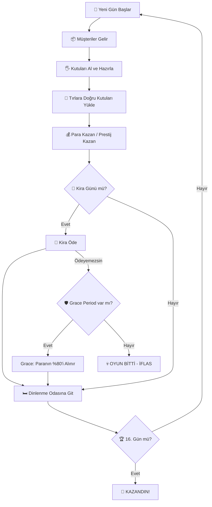

### 2.2 Mikro Döngü (Tek Gün İçi)

Bir günün dakika dakika akışı:

Gerçek süreler **gün uzunluğuna göre esner** (gün 1-3 = 200s, gün 16 = 330s; bkz. §3.2).
Oyun saati ↔ gerçek saniye dönüşümü lineerdir: `saniye = (saat − 7) / 11 × GünSüresi`.

| Oyun Saati | Gün 1-3 (200s) | Gün 16 (330s) | Olay |
|------------|----------------|---------------|------|
| 07:00 | 0s | 0s | Gün başlar, etkinlik aktif olur |
| 08:00 | ~18s | ~30s | Tırlar gelmeye başlar, müşteriler spawn olur, telefon açılır |
| 10:00 | ~55s | ~90s | Upgrade paneli açılır (`PANEL_OPEN_HOUR = 10`) |
| 12:00-14:00 | ~91-127s | ~150-210s | **Öğle Rush**: Max 6 eşzamanlı müşteri, ×1.5 spawn hızı |
| 14:00-15:00 | ~127-145s | ~210-240s | Öğleden sonra durgunluk: Max 2 müşteri |
| 16:00-17:00 | ~164-182s | ~270-300s | **Akşam Rush**: Max 4 müşteri, ×1.3 spawn hızı |
| 17:00 | ~182s | ~300s | Tırlar son çıkışlarını yapar |
| **17:30** | **~191s** | **~315s** | **Müşteri çıkış saati** (`CUSTOMER_EXIT_HOUR`): kuyruktaki servis edilmemiş müşteriler zorla çıkarılır (−0.4 prestij/müşteri) + hiç spawn olmamış kota müşterileri cezalanır (−0.2/müşteri) |
| 18:00 | ~200s | ~330s | Gün biter, kira kontrolü yapılır |

> [!NOTE]
> **Erken gün bitişi**: günün kotası tükenip kuyruk da boşaldığında gün 18:00'i beklemez —
> `dayEndGraceSeconds = 30s` kapanış payından sonra `FastForwardToEndOfDay()` günü sarar
> (`CustomerManager.CheckEarlyDayCompletion`). Pay, yarım yüklü tırı tamamlama fırsatı içindir.

### 2.3 Oyuncu Eylemleri (Tek Seferde)

1. **Yürü / Koş** → Mağazada hareket et
2. **Al** → Raftan veya yerden kutu al
3. **Koy** → Masaya veya yere kutu bırak
4. **Fırlat** → Kutuyu fırlat (riskli — düşerse ceza)
5. **Teslim Et** → Tıra doğru renk kutuyu ver
6. **Telefonla Çağır** → E'yi **basılı tut** (1sn), sıradaki müşteriyi öne çek: +20 TL, +0.4 prestij, karşılığında gün saati ileri sarılır (bkz. §14)
7. **Upgrade Satın Al** → Ofis terminaline git, 3 karttan birini seç (saat 10:00 sonrası, §13)
8. **Stok Kontrolü Yap** → **X** ile haritaya çık, diğer odalardaki eşyaları gör (§34.3)
9. **Telsizle Konuş** → **V** basılı tut, takımla konuş (§35)

---

## 3. ⏰ Gün Döngüsü Sistemi

> **Kaynak**: [DayCycleManager.cs](file:///c:/Users/cicek/Documents/GitHub/Cargor/Assets/NewCss/UIScripts/DayCycleManager.cs)
> (dosya `Assets/NewCss/UIScripts/` altında — `GameState/` altında DEĞİL)

### 3.1 Temel Parametreler

| Parametre | Değer | Açıklama |
|-----------|-------|----------|
| Toplam gün sayısı | **16** (`MAX_DAYS`) | Oyunun toplam uzunluğu |
| Gün başlangıç saati | **07:00** (`startHour`) | Oyun içi sabah |
| Gün bitiş saati | **18:00** (`endHour`) | Oyun içi akşam |
| Baz gün süresi | **200 saniye** (`realDurationInSeconds`) | İlk 3 günün gerçek süresi (sahne override'ı da 200) |
| Günlük süre artışı | **+10 saniye/gün** (`dailyDurationIncrease`) | 4. günden itibaren her gün uzar (`DYNAMIC_DURATION_START_DAY = 3`) |
| UI güncelleme hızı | **10 FPS** | Performans için throttle |

> [!WARNING]
> **`realDurationInSeconds`'a DOĞRUDAN yazmayın.** Tek yazıcı `RecomputeDayDuration()`:
> `taban × overtime-perk-çarpanı + buff-toplamı`. Taban (`_baseRealDuration`) `Awake`'te,
> perk/buff uygulanmadan ÖNCE bir kez cache'lenir.

### 3.2 Gün Süresi Formülü

$$\text{GünSüresi}(g) = \begin{cases} 200\text{s} & g \leq 3 \\ 200 + (g - 3) \times 10\text{s} & g > 3 \end{cases}$$

| Gün | Süre (saniye) | Süre (dk:sn) |
|-----|--------------|---------------|
| 1-3 | 200s | 3:20 |
| 4 | 210s | 3:30 |
| 5 | 220s | 3:40 |
| 8 | 250s | 4:10 |
| 12 | 290s | 4:50 |
| 16 | 330s | 5:30 |

> [!IMPORTANT]
> **Telefonun zaman maliyeti bu tabloyu KULLANMAZ.** `SkipTime` / `PredictTimeAfterSkip`
> (cs:425, cs:446) saniye ↔ oyun-dakikası dönüşümünü **TABAN** `realDurationInSeconds` (200s) ile
> yapar, `CurrentDayDuration` ile değil. Sonuç: bir telefon çağrısının **gerçek-saniye** bedeli
> her gün aynıdır, ama gün uzadıkça o saniyelerin karşılığı olan **oyun-dakikası azalır**
> (bkz. §14.4). Bu bilinçli davranıştır, düzeltmeyin.

### 3.3 Gün Sonu Akışı

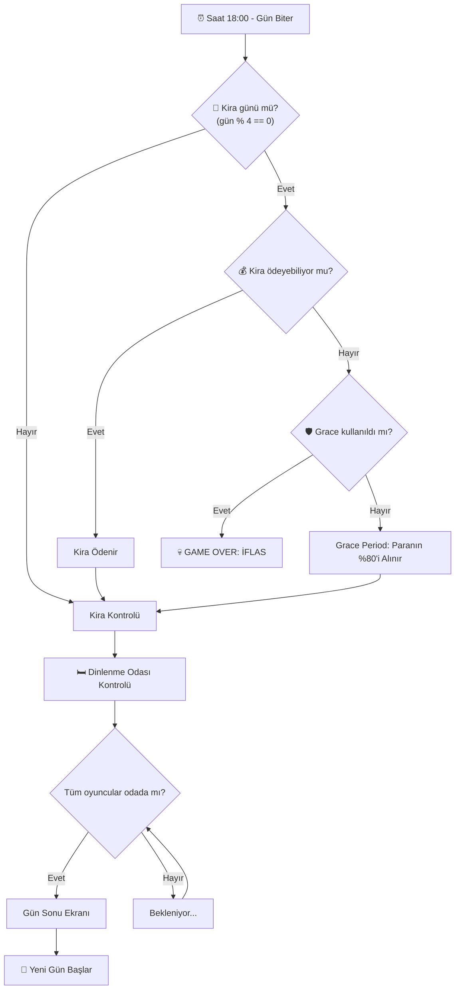

### 3.4 `OnNewDay` Event Hub

Yeni gün başladığında tetiklenen merkezi event. Aşağıdaki sistemler bu event'e abone olur:

- **TruckSpawner** → Tüm tırları despawn et, yenilerini spawn et
- **CustomerManager** → Günün kotasını (`GetDailyCustomerCount(gün, P)`) yeniden hesapla, spawn zamanlamasını sıfırla
- **QuestManager** → Yeni görevler ata, tamamlanmamışlara ceza ver
- **EventEffectManager** → Günün etkinliğini uygula (+ FESTIVAL DAY para bonusu)
- **UpgradePanel** → Bekleyen yükseltmeleri aktifleştir
- **DayLightController** → Aydınlatmayı sıfırla
- **PhoneCallManager** → Telefon cooldown'unu sıfırla (`HandleNewDay`, cs:313)

> [!WARNING]
> `EventEffectManager.OnNewDayHandler` ve `CustomerManager.HandleNewDay` **aynı statik `OnNewDay`
> event'ine** abone; çağrı sırası deterministik değil. Kota event çarpanı (`eventCustomerMultiplier`)
> teoride 1 gün geriden gelebilir — playtest'te `Quota calc: ... eventMult=` log'uyla doğrulanmalı
> (ekonomist Round 5 §7).

---

## 4. 💰 Ekonomi Sistemi

> **Kaynak**: [GameEconomySettings.cs](file:///c:/Users/cicek/Documents/GitHub/Cargor/Assets/NewCss/GameEconomySettings.cs) (ScriptableObject)

### 4.1 Para Sistemi

> **Kaynak**: [MoneySystem.cs](file:///c:/Users/cicek/Documents/GitHub/Cargor/Assets/NewCss/UIScripts/MoneySystem.cs)
> (dosya `Assets/NewCss/UIScripts/` altında)

| Parametre | Değer |
|-----------|-------|
| Başlangıç parası | **500 TL × 1.2^(P−1)** → 1P **500** · 2P **600** · 3P **720** · 4P **864** (kaynak: `DifficultyManager.baseStartingMoney=500`, `moneyMultiplierPerPlayer=1.2`; `DifficultyManager.cs:455` `moneySystem.startingMoney`'e yazıyor — bu zincir CANLI) |
| Minimum para | **0 TL** (negatife düşmez) |
| Senkronizasyon | `NetworkVariable` (server-write, everyone-read) |

> [!IMPORTANT]
> **Para YALNIZ tırdan gelir.** Müşteriye servis SIFIR para verir (yalnız +0.4 prestij);
> müşterinin ekonomik işlevi, tıra yüklenecek **ürünü üretmesidir** (`CustomerAI.cs:1442-1444`).
> Gelir kaldıracı ararken tıra bakın, müşteriye değil.

**Gelir Kaynakları**:
| Kaynak | Miktar | Koşul |
|--------|--------|-------|
| Doğru kutu teslimi | **Oyuncu sayısına bağlı** — 1P **50** · 2P **55** · 3P **70** · 4P **88** TL/kutu (`rewardPerBoxByPlayerCount`) | Tıra doğru renk kutu |
| Prestij bonusu | +5 TL/kutu × tier | Her **8** prestij = 1 tier (`prestigePerBonus`) |
| Telefon araması | **+20 TL**/arama | Başarılı arama (`callMoneyReward`) |
| Görev ödülleri | Easy **28** / Medium **60** / Hard **150** TL | Gün sonunda otomatik, tier'a bağlı |
| FESTIVAL DAY | **o günkü kiranın %10-20'si** (rastgele) | Gün başında bir kez (`EventEffectManager.ApplyFestivalBonus`) |

> `rewardPerBox = 50` skaler alanı yalnız **legacy fallback**'tir (dizi boş/null ise).
> P3/P4'te ödülün yükseltilmesinin sebebi: tek servis masası yüzünden kota P2 ile aynı kalırken
> kira 3.6 katına çıkıyordu.

**Gider Kaynakları**:
| Kaynak | Miktar | Koşul |
|--------|--------|-------|
| Yanlış kutu teslimi | -40 TL/kutu (P-bağımsız SABİT) | Tıra yanlış renk kutu |
| Kutu düşürme | **-5 TL**/düşürme | Kutu **≥3 m/s** ile çarparsa (`boxDropMoneyPenalty`) |
| Görev cezaları | Easy **15** / Medium **27** / Hard **53** TL | Kabul edilip tamamlanmayan görev |
| Kira ödemesi | Değişken | Her 4 günde bir |
| Upgrade satın alma | Değişken | Oyuncu tercihiyle (P-bazlı çarpan, bkz. §13) |

### 4.2 Ekonomi Dengesi — Tam Parametre Tablosu

Tüm ekonomik değerler tek bir `GameEconomySettings` ScriptableObject'ten yönetilir:

> **Doğrulama**: bu tablonun tamamı `Assets/Editor/EconomyInvariantCheck.cs` tarafından
> (79 `Expect*` çağrı yeri, çalışma anında ~196 kontrol) koda karşı denetleniyor. Menü:
> `Cargor / Ekonomi Değerlerini Doğrula`. Değer değiştirirsen orayı da güncelle.

```
📊 GameEconomySettings (EkonomiAyarlari)
│
├── 💸 KİRA AYARLARI
│   ├── baseRentByPlayerCount: [290, 650, 1140, 1630]   ← Round 10 U1 (2026-08-30) ile düşürüldü
│   ├── rentGrowthMultiplier: 1.20 (%20 artış/dönem)
│   ├── rentScaledMultiplier: 1.0 (varsayılan; leveraged_rent perki 0.75 yapar)
│   ├── rentIntervalDays: 4 (her 4 günde bir kira)
│   └── gracePaymentPercent: 0.8 (%80 affedilme bedeli; leveraged_rent VE all_in perkleri 0 yapar = grace iptal)
│
├── 👥 MÜŞTERİ KOTASI (PlateUp — gün-numarası eğrisi, kapasite ETKİSİZ)
│   ├── dailyCustomerCountP1: [4,4,4,4,4,4,4,5,5,5,5,5,6,6,6,6]      (16 gün toplamı 77)
│   ├── dailyCustomerCountP2: [7,7,7,8,8,9,9,9,10,10,10,11,11,11,12,12]  (toplam 151)
│   ├── dailyCustomerCountP3: [8,8,8,8,9,9,9,10,10,10,11,11,12,12,12,13] (toplam 160)
│   ├── dailyCustomerCountP4: [8,8,8,8,9,9,9,10,10,10,11,11,12,12,12,13] (toplam 160 — P3 ile aynı, bilinçli)
│   ├── customerArrivalIntervalByPlayerCount: [44, 22, 21, 21] saniye
│   └── dayEndGraceSeconds: 30 (kota bitince gün sarılmadan önceki kapanış payı)
│
├── 🚚 TIR / TESLİMAT AYARLARI
│   ├── rewardPerBoxByPlayerCount: [50, 55, 70, 88] TL  ← CANLI ödül (P-bazlı)
│   ├── rewardPerBox: 50 TL (LEGACY skaler; yalnız dizi boş/null ise fallback)
│   ├── penaltyPerBox: 40 TL (yanlış teslimat — P-bağımsız)
│   ├── hangarStayDurationByPlayerCount: [120, 60, 40, 30] saniye
│   │     (1P uzun: yavaş üretimde tır dolsun; 4P kısa. Legacy skaler hangarStayDuration=30 yalnız dizi boşsa)
│   ├── truckCargoMinByPlayerCount: [1, 2, 2, 2]
│   ├── truckCargoMaxExclusiveByPlayerCount: [3, 4, 5, 6]   ← ÜST SINIR HARİÇ (Random.Range semantiği)
│   ├── prestigePerBonus: 8 (bonus tier başına prestij; 0-100 skala)
│   │     ← Round 10 §4-R4: 10'a çıkarma önerisi REDDEDİLDİ (Slow/strict P4'ü iflasa sürüklüyordu)
│   ├── bonusPerTier: 5 TL (tier başına ek ödül)
│   ├── rewardVolatility: 0 (high_volatility perki 0.35 yapar)
│   └── rewardVolatilityMean: 1.0 (high_volatility perki 1.15 yapar)
│
├── 📦 KUTU DÜŞME
│   └── boxDropMoneyPenalty: 5 TL
│
├── 📞 TELEFON AYARLARI  (V4 — DIŞARI ARAMA)
│   ├── timeSkipAmountByPlayerCount: [115, 49, 47, 47] oyun-dakikası   ← asıl bedel (Round 10 U2; P1 bilerek sabit)
│   ├── phoneTimeSkipPerkMultiplier: 1.0 (varsayılan; phone_line perki 0.80 yazar → çağrı zaman bedeli −%20)
│   ├── phoneCooldownSeconds: 3.0 (P-bağımsız düz cooldown)
│   ├── phoneCooldownPerkBonusSeconds: 0.0 (varsayılan; phone_line perki 1.0 yazar → 3−1 = 2 sn; ekonomik etkisi SIFIR, yalnız his)
│   ├── phoneDialHoldSeconds: 1.0 (E'yi basılı tutma süresi — UX, ekonomik değer DEĞİL)
│   ├── callMoneyReward: 20 TL   ← Round 10 §4-R1: 0/10/12/15 denendi, hepsi daha kötü → DEĞİŞMEDİ
│   └── callPrestigeReward: 0.4  ← Round 10 §4-R2: 0.2/0.3 denendi, 5 hücreyi negatife çeviriyor → DEĞİŞMEDİ
│
├── ⭐ PRESTİJ AYARLARI
│   ├── customerServedPrestigeBonus: +0.4
│   ├── customerLostPrestigePenalty: -0.4   (servis edilmeden kaçan/çıkarılan müşteri)
│   ├── customerMissedQuotaPrestigePenalty: -0.2   (17:30'da HİÇ SPAWN OLMAMIŞ kota müşterisi)
│   ├── wrongProductPrestigePenalty: -0.20   ← Round 10 U12 (2026-08-30), eski -0.08
│   ├── wrongDeliveryPrestigePenalty: -0.16
│   └── boxDropPrestigePenalty: -0.04
│
└── 🎪 ETKİNLİK
    ├── festivalBonusMin: 100 TL   ← yalnız FALLBACK (DayCycleManager erişilemezse)
    └── festivalBonusMax: 300 TL   ← yalnız FALLBACK; canlı yol kira×%10-20
```

> [!WARNING]
> **`Assets/Resources/EkonomiAyarlari.asset` bu alanların ÇOĞUNU İÇERMİYOR — bu bir hata değil.**
> Unity, YAML'da anahtarı olmayan alanları C# field initializer değeriyle kurar. Asset'te YALNIZ
> şu anahtarlar var: kira 5'lisi, `dayEndGraceSeconds`, `rewardPerBox`, `penaltyPerBox`,
> `hangarStayDuration(+dizi)`, `prestigePerBonus`, `bonusPerTier`, `rewardVolatility(+Mean)`,
> tır kargo dizileri, `boxDropMoneyPenalty`, `callMoneyReward`, `callPrestigeReward`, prestij
> cezaları (missed-quota HARİÇ), festival min/max. **Kota dizileri, `rewardPerBoxByPlayerCount`,
> `customerArrivalIntervalByPlayerCount`, tüm V4 telefon alanları ve
> `customerMissedQuotaPrestigePenalty` asset'te YOK → `.cs` default'ları canlıdır.**
> Asset'teki 3 **ölü V3 anahtarı** (`phoneRingChancePerHour`, `phoneRingEventMultiplier`,
> `phoneRingPerkBonus`) 2026-08-30'da SİLİNDİ.
> `float[]`'a elle hex yazmayın: sessizce BOŞ dizi üretir (bkz. `EconomyInvariantCheck` uyarısı).
> `int[]` hex YAZILABİLİR ve yazılmıştır: `baseRentByPlayerCount` asset'te
> `220100008a020000740400005e060000` = `{290, 650, 1140, 1630}` (little-endian int32 ×4) — bu
> anahtarı değiştirirken **hem `.cs` initializer'ı hem asset hex'i** güncellenmeli.
>
> ✅ `DayCycleManager.CalculateRent` fallback dalı (`cs:675`, `economySettings == null` yolu)
> 2026-08-30'da (`93acda3`) senkronlandı — artık o da `{290,650,1140,1630}` taşıyor.
> Kira değeri değişirse **dört yer birden** güncellenmeli: `GameEconomySettings.cs:21`
> initializer · `EkonomiAyarlari.asset:15` hex'i · `DayCycleManager.cs:675` fallback'i ·
> `GameEconomySettings.FallbackBaseRent` (dizi boş/null kalırsa). Beşinci yer
> `EconomyInvariantCheck.cs:276` ama o sessiz değil — unutulursa denetçi kırmızı yanar.

> [!WARNING]
> **`PerkEffect` bu ScriptableObject'in alanlarına RUNTIME'DA doğrudan yazıyor ve hiçbir yerde geri almıyor.**
> Etkilenen **8 alan** (`PerkEffect.cs`): `gracePaymentPercent` (:326, :344), `rentScaledMultiplier` (:325),
> `rentGrowthMultiplier` (:198), `customerServedPrestigeBonus` (:213),
> **`phoneTimeSkipPerkMultiplier` (:308 — Round 10 U4 ile eklendi)**,
> `phoneCooldownPerkBonusSeconds` (:309), `rewardVolatility` (:334), `rewardVolatilityMean` (:335).
> `UpgradePanel`'in snapshot/restore listesi (cs:614-730) 8. alanı da kapsayacak şekilde tazelendi —
> yeni bir `Apply*` yazarı eklenirse snapshot da tazelenmeli, yoksa asset kalıcı bozulur.
> Editor'de Play mode'dan çıkınca değerler geri gelmiyor, diske yazılıp commit'lenebiliyor.
> Play-test sonrası `Cargor / Ekonomi Değerlerini Doğrula` çalıştır. **Açık mimari sorun** — bkz. `plans/devam.md` 2026-08-07.
>
> Yazımlar **mutlak atama** (`=`), toplama/çarpma DEĞİL — aynı alana yazan bir kart, perki
> sessizce siler (biriktirmez).

> [!NOTE]
> **`wealthTaxRate` KALDIRILDI** (`9d2c3b0`, FAZ 2 C5 Seçenek A) — kira formülünde artık upgrade-vergisi yok.
> **V3'ün çalma alanları** (`phoneRingChanceByPlayerCount`, `phoneRingChancePerHour`,
> `phoneRingEventMultiplier`, `phoneRingPerkBonus`) sınıftan **silindi**: V4'te telefon çalmıyor,
> oyuncu arıyor (bkz. §14). `timeSkipAmount` V2'den farklı bir alan olarak **geri geldi**
> (`timeSkipAmountByPlayerCount`, P-bazlı).

### 4.3 Prestij-Bazlı Gelir Çarpanı

$$\text{KutuBaşıGelir} = \text{rewardPerBox}[P] + \left\lfloor \frac{\text{prestige}}{\text{prestigePerBonus}} \right\rfloor \times \text{bonusPerTier}$$

Tier bonusu **P-bağımsız** (+5 TL/tier), taban ödül **P-bazlı**:

| Prestij | Tier | 1P | 2P | 3P | 4P |
|---------|------|-----|-----|-----|-----|
| 0-7 | 0 | 50 | 55 | 70 | 88 |
| 8-15 | 1 | 55 | 60 | 75 | 93 |
| 16-23 | 2 | 60 | 65 | 80 | 98 |
| 24-31 | 3 | 65 | 70 | 85 | 103 |
| 32-39 | 4 | 70 | 75 | 90 | 108 |
| 96-100 | **12** (tavan) | **110** | **115** | **130** | **148** |

> Başlangıç prestiji **12** (`PrestigeManager.startingPrestige`, sahnede), yani oyuncu tier 1'de başlar.

> [!IMPORTANT]
> **Prestij bir fail-state değil, gizli bir GELİR ÇARPANI.** Ekonomist Round 6 ölçümü: tier bonusu
> 16 günde kutu ödülünü **+%20…+%91** şişiriyor ve toplam tır gelirinin **%13-35'ini** oluşturuyor.
> 1 prestij puanının marjinal değeri gün 1'de **34.7-91.7 TL**, gün 16'da 2.8-7.8 TL (kalan gün
> sayısıyla lineer sönüyor). Dolayısıyla her prestij CEZASI aslında gizli bir para cezasıdır.
>
> Eski quest prestij ödülleriyle (Easy +1.4 / Med +3 / Hard +7.5) tavan 16 hücrenin 6'sında
> **çarpılıyordu** — tavana çarpan hücrede prestij perklerinin marjinal değeri sıfırdır.
> Round 10 U7'nin ×0.4 kalibrasyonundan sonra tavana çarpan hücre **0/16** (gözlenen en yüksek
> final prestij 94; tam paket koşumlarında 22-82 bandında). `maxPrestige=100` artık gerçek bir
> baş boşluğu bırakıyor.

---

## 5. 🏠 Kira Sistemi

### 5.1 Kira Formülü

$$\text{Kira} = \text{BaseRent}[P] \times 1.20^{\text{cycle}} \times \text{rentScaledMultiplier}$$

Burada:
- \(P\) = Oyuncu sayısı (1-4)
- \(\text{cycle}\) = Kaçıncı kira dönemi (0'dan başlar)
- \(\text{rentScaledMultiplier}\) = Varsayılan 1.0; yalnız "Kaldıraçlı Kira" (`leveraged_rent`) perki **0.75** yapar (−%25)
- **NOT (2026-07-13):** Eski formüldeki `wealthTax` terimi (`+ TotalUpgradeValue × 0.10`) **tamamen kaldırıldı** (commit `9d2c3b0`, FAZ 2 C5 → Seçenek A). Kırık kablolamayla zaten hep 0'dı; kod'dan tümüyle çıkarıldı, artık kira formülünde upgrade-vergisi yok.

### 5.2 Oyuncu Sayısına Göre Baz Kira

| Oyuncu Sayısı | Baz Kira | Eski (2026-08-30 öncesi) | Kesinti |
|--------------|----------|--------------------------|---------|
| 1 Oyuncu | **290 TL** | 500 TL | −%42.0 |
| 2 Oyuncu | **650 TL** | 1.000 TL | −%35.0 |
| 3 Oyuncu | **1.140 TL** | 1.450 TL | −%21.4 |
| 4 Oyuncu | **1.630 TL** | 1.800 TL | −%9.4 |

> Ölçek 1 : 2.24 : 3.93 : 5.62. Ölçülen gelir ölçeğinden (1 : 1.73 : 2.40 : 2.95) bilinçli olarak
> DİK — çok oyunculu takım koordinasyon avantajını kirayla geri ödüyor. Eski ölçek
> (1 : 2.00 : 2.90 : 3.60) daha yatıktı; kesinti **asimetrik** uygulandı çünkü açık P azaldıkça
> büyüyordu (1P'de en derin).

> [!IMPORTANT]
> **Bu eğri Round 3'te önerilip Round 10 U1 ile UYGULANDI** (2026-08-30, commit `bb98ad1`).
> Çözdüğü sorun: eski tabanla **Slow + strict** bandında 4/4 hücre iflas ediyordu (P1 gün 16,
> P2/P3/P4 gün 12); kök neden eğim değil **SEVİYE** idi (o bantta kira / 4-günlük-gelir oranı
> 1.52-1.71, sağlıklı Normal/strict'te 0.88-1.27). Yeni tabanla aynı 4 hücre **304-612 TL final
> kasa** ile hayatta kalıyor (grace VARKEN de YOKKEN de).
>
> **Bilinçli kabul edilen yan etki**: Normal bantlar da şişti — Normal/strict P1 final kasa
> 979 → **2106 TL (+%115)**, P2 +%73, P3 +%41, P4 +%16. Şişme P1'de en büyük çünkü Slow/strict
> P1'i kurtarmak için 1P tabanının en çok inmesi gerekiyordu ve aynı taban Normal bandı da
> besliyor. Final kasa bir skor değil **upgrade bütçesi** → Round 4'ün perk/upgrade fiyat
> analizini de yukarı kaydırır.
>
> Playtest'te Normal bant fazla kolay gelirse ikinci tur ayarı hazır: `{350, 730, 1190, 1650}`
> (Slow/strict'i 162-197 TL marjla, cliff kenarında kurtarır; Normal/strict P1 şişmesi +%82'ye iner).
>
> **Yan kazanç**: bu kesinti FESTIVAL DAY outlier'ını da söndürdü — kira-bağlı event bonusu artık
> geç-gün net gelirinin %25-32'si ve P1→P4 boyunca düz (Round 10 §4-R7; FESTIVAL'e ayrıca
> dokunulmadı).

### 5.3 Kira Dönemleri ve Büyüme (tüm oyuncu sayıları)

| Gün | Dönem | 1P | 2P | 3P | 4P |
|-----|-------|-----|-----|-----|-----|
| 4 | Dönem 0 | 290 | 650 | 1.140 | 1.630 |
| 8 | Dönem 1 | 348 | 780 | 1.368 | 1.956 |
| 12 | Dönem 2 | 418 | 936 | 1.642 | 2.347 |
| 16 | Dönem 3 | 501 | 1.123 | 1.970 | 2.817 |
| — | **16 gün toplamı** | **1.557** | **3.489** | **6.120** | **8.750** |

> Değerler `Mathf.RoundToInt` sonrasıdır (`DayCycleManager.CalculateRent`). 16 günlük toplam
> yükün eski tabana göre kesintisi taban kesintisiyle aynıdır (−%42.0 / −%35.0 / −%21.4 / −%9.4),
> çünkü `rentGrowthMultiplier` değişmedi.

> Eğim `rentGrowthMultiplier = 1.20` (2026-08-20'de 1.35'ten düşürüldü — sim.js FAZ4-sonrası
> resync'i STRICT bantta 4P'nin ve Slow-optimistic bantta 2P/3P/4P'nin gün 16'da (son kira)
> iflas ettiğini gösterdi; economist analizi 1.35'in FAZ3/4 sonrası gerçek gelir eğrisine göre
> fazla dik olduğunu doğruladı, parametrik tarama 1.20'yi önerdi — bkz.
> `.claude/agent-memory/economist/rent_growth_1_35_deficit_2026-08-20.md`).

### 5.4 Grace Period (Affedilme Mekanizması)

- **Tetiklenme**: Kira günü ve para yeterli değilse
- **Tek seferlik**: Oyun boyunca yalnızca 1 kez kullanılabilir
- **Maliyet**: Mevcut paranın %80'i alınır (`gracePaymentPercent`)
- **İkinci kez ödeyemezse**: **GAME OVER — İFLAS**
- ⚠️ **`leveraged_rent` ve `all_in` perkleri `gracePaymentPercent`'i 0 yapar** — yani grace period
  tamamen iptal olur. İkisi aynı dışlama grubunda (`EXCLUSIVE_EFFECT_GROUPS`), birlikte teklif edilmezler.

> [!WARNING]
> **Grace, AÇIĞA değil ELDEKİ NAKDE oranlı** (`DayCycleManager.cs:616-624`) ve ödeme sayılır
> (`_rentPaymentCount++`). İki sonucu var:
> 1. **Tampon sınırsız**: açık ne kadar büyük olursa olsun, tek bir kira günü tamamen emiliyor.
>    Bu yüzden "ince marj" görünen bantlar gerçekte göründüğünden dayanıklı (ekonomist Round 2 §2).
> 2. **"Fakir kal" exploiti**: kira gününden hemen önce parayı upgrade'e harcayıp kiranın altına
>    düşmek ≈ **+0.20 × o günkü kira** kazandırıyor (1P +173 … 4P +622 TL, gün 16).
>    Yan etkisi monotonluk kırılmaları: "daha kötü girdi → daha iyi sonuç". Ekonomi ölçümlerinde
>    böyle bir anomali görülürse önce grace zamanlamasına bakılmalı.

> [!IMPORTANT]
> **Gün sonu sırası:** kira kontrolü (`TryProcessMoneyCheck`) görev ödüllerinden **ÖNCE** çalışıyor.
> Yani tamamlanan görevin parası kiraya yetişmiyor. Collect butonu kaldırıldığında (2026-07-28)
> ortaya çıkan bilinçli bir yan etki — kira günlerinde iflas riski bir miktar sert.

### 5.5 Kira + Upgrade Vergisi Etkileşimi ~~(KALDIRILDI)~~

> [!NOTE]
> **Upgrade Vergisi (wealthTax) mekaniği KALDIRILDI** (2026-07-13, commit `9d2c3b0`). Eskiden "her upgrade sonraki kiraları artırır" olarak tasarlanmıştı ama kablolaması kırıktı (hep 0 katkı) → tamamen çıkarıldı. Upgrade satın almak artık kirayı ETKİLEMEZ. Bu bölüm tarihsel kayıt olarak tutuluyor.

**Örnek (güncel formülle)**:
- 1 oyuncu, dönem 2 (upgrade sayısından bağımsız):
  - Kira = 500 × 1.20² × 1.0 = **720 TL**

---

## 6. ⭐ Prestij Sistemi

> **Kaynak**: [PrestigeManager.cs](file:///c:/Users/cicek/Documents/GitHub/Cargor/Assets/NewCss/CustomerSripts/PrestigeManager.cs)

### 6.1 Temel Parametreler

| Parametre | Değer |
|-----------|-------|
| Başlangıç prestiji | **12.0** (sahne: `PrestigeManager.startingPrestige`) |
| Minimum prestij | **0** (ham değer ≤0 olursa GAME OVER — clamp ÖNCESİ kontrol) |
| Maksimum prestij | **100** (pratikte hiç ulaşılmıyor; ölçüm 1P ~47 / 4P ~37) |
| Bonus tier eşiği | her **8** prestij = +5 TL/kutu (`prestigePerBonus`) |

### 6.2 Prestij Değişim Kaynakları

| Eylem | Prestij Değişimi | Sıklık |
|-------|-----------------|--------|
| Müşteriye başarılı servis | **+0.4** | Her başarılı servis (para vermez!) |
| Telefonla müşteri çağırma | **+0.4** | Her başarılı arama (`callPrestigeReward`) — bir müşteri servisiyle AYNI değerde |
| Müşteri kaçtı / servis edilmeden çıkarıldı | **-0.4** | Sabır bitti **veya** 17:30'da kuyrukta servis edilmemiş (`customerLostPrestigePenalty`) |
| **Kota müşterisi hiç gelmedi** | **-0.2** | 17:30'da hâlâ spawn olmamış her kota müşterisi (`customerMissedQuotaPrestigePenalty`) — yukarıdakiyle KARIŞTIRILMAZ |
| Tıra yanlış renk kutu | **-0.16** | Her yanlış teslimat (ayrıca -40 TL) |
| Yanlış ürün gösterildi | **-0.20** | Her yanlış ürün (para cezası YOK) — Round 10 U12, eski −0.08 |
| Kutu yere düştü | **-0.04** | Her düşürme (≥3 m/s) |
| Görev ödülü | Easy **+0.6** / Medium **+1.2** / Hard **+3.0** | Gün sonunda (Round 10 U7 ile ×0.4) |
| Görev cezası | Easy **-0.32** / Medium **-0.4** / Hard **-0.6** | Tamamlanmayan kabul edilmiş görev |

> SURPRISE AUDIT etkinliği günü tüm cezalar **×2** (`EventEffectManager.GetPenaltyMultiplier`).
> Ölçülen etkisi **dekoratif**: en kötü tek gün ek maliyeti −0.07…−1.40 prestij = final prestijin
> **%0.1-4.6'sı** (Round 6 §7).

> [!NOTE]
> **"Müşteriyi bilerek boz" baskın stratejisi — kısmen kapatıldı (Round 10 U12).**
> İade/BoxRequest modundaki müşteriye (gün 5+, ~%25 oranında) **yanlış renk kutu vermek** müşteriyi
> ANINDA çıkarıyor (`CustomerAI.cs:1228-1259`, `HandleFailedInteraction` → `TransitionToExit`;
> `_hasTimedOut=false` kaldığı için 17:30'da tekrar cezalanmıyor). Sabrın dolmasını beklemek ise
> −0.4 **VE** istasyonu sabır süresince bloke ediyor. Ceza −0.08 iken "bozmak" **5 kat ucuzdu**;
> **−0.20**'ye çıkarılınca fark 2 kata indi ve nakit etkisi ölçülen 16 hücrede **%0…−1** çıktı
> (yani düzeltme bedelsizdi).
>
> Kalan (kabul edilen) asimetri: `wrongDelivery`'nin (−0.16) yanında 40 TL nakit cezası var,
> `wrongProduct`'ın (−0.20) yanında hiç yok. Tercih edilen nihai çözüm hâlâ yanlış ürünü de
> `OnCustomerLost` yolundan geçirmek — o zaman ayrı sabit gereksiz kalır.

### 6.3 Prestijin Oyuna Etkisi

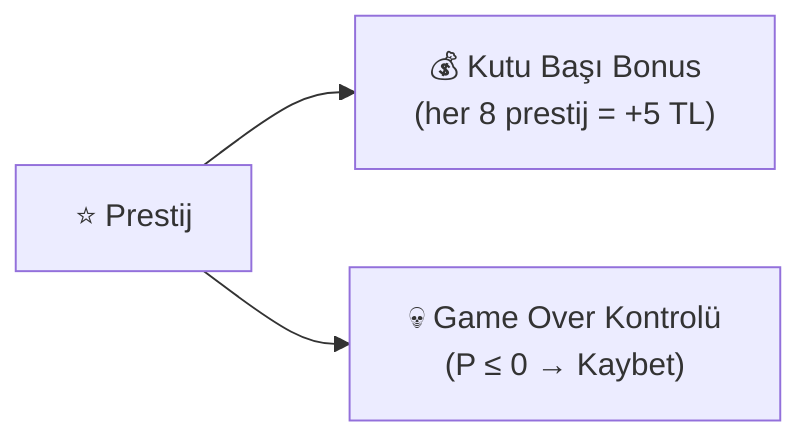

> [!WARNING]
> **Prestijin ekonomide TEK işlevi kutu başı ödül tier'ı** (+ sıfırda ölüm).
> `PrestigeManager.GetCustomerCapacity()` ve `OnCustomerCapacityChanged` **ölü kod** — sıfır tüketici,
> sıfır abone. `CheckWinCondition` de prestije bakmıyor (yalnız gün 16'ya ulaşmak yeterli).
> Eski GDD'deki "müşteri kapasitesi = 1 + floor(P/4)" formülü **hiçbir yerde uygulanmıyor.**

### 6.4 Prestij Dengesi Analizi

Aritmetik: başlangıç prestiji 12.0; **30 müşteri kaçırma** (30 × -0.4) oyunu bitirir.
Ceza ×2 olan SURPRISE AUDIT gününde bu 15'e düşer.

Dengeyi tutturmak için:
- Her 1 kaçırılan müşteriye karşı **1 başarılı servis** yeterli (-0.4 / +0.4 = 1:1)
- Her 1 yanlış teslimata karşı **0.4 servis** (-0.16 / +0.4)
- Bir Hard görevi kaçırmak **1.5 müşteri kaçırmaya** eşdeğer (-0.6 / -0.4) — Round 10 U7'nin
  quest prestij ×0.4 kalibrasyonundan önce bu oran ~7 idi (görev cezası prestij bütçesinde
  orantısız yer kaplıyordu)

> [!CAUTION]
> **Prestij kaybı pratikte ÖLÜ bir kaybetme koşulu.** Ekonomist Round 6 ölçümü: 16 senaryonun
> **16'sında da** prestij hiç 0'a inmiyor; kaybeden 4 hücre (Slow/strict) **NAKİT'ten** iflas
> ediyor ve o anda bile prestijleri 18.9-43.4. En düşük gözlenen marj **18.87** — uçurum kenarı YOK.
> Sebep yapısal: `served=+0.4` ile `lost=−0.4` **birebir simetrik**, yani başabaş servis oranı
> tam **%50** → müşterilerinin yarısını kaçıran oyuncu sonsuza kadar hayatta kalıyor.
>
> **P-asimetrisi**: ceza müşteri BAŞINA ama `startingPrestige=12` ve eşik P'den bağımsız →
> aynı beceriksizlik oranında (kaçırma %75) 4P gün 7'de, 1P gün 13'te ölüyor.
>
> `customerMissedQuotaPrestigePenalty` de yapısal bir tehdit DEĞİL: Normal bandın 8 hücresinde
> **16/16 gün tam sıfır** (varış tavanı kotayı zaten bağlıyor), Slow'da toplam −0.04…−2.06.

> [!IMPORTANT]
> **Kazanılmış oyun kaybedilemez** (`f013f5d`): gün 16 settlement'i zafer ilan edildikten SONRA
> çalıştığı için, tamamlanmayan görevin prestij cezası prestiji sıfırlasa bile sonuç değişmez.
> `TriggerLose`/`TriggerWin` artık `gameEnded` guard'lı.

---

## 7. 📊 Müşteri Kotası (PlateUp modeli)

> **Kaynaklar**: `GameEconomySettings.GetDailyCustomerCount(day, P)`,
> [CustomerManager.cs](file:///c:/Users/cicek/Documents/GitHub/Cargor/Assets/NewCss/CustomerSripts/CustomerManager.cs)
> `CalculateTodaysCustomerCount` (cs:403-419)

> [!IMPORTANT]
> **İki farklı "kota" karıştırılmamalı.**
> - ~~**Eski kutu kotası**~~ (`QuotaManager`, `toplam müşteri × 0.8`, tutturulamazsa GAME OVER):
>   commit `0c026ef` ile **tamamen silindi**, kodda tek referansı yok. Kira ile birlikte çift
>   başarısızlık kapısı oluşturduğu için kaldırılmıştı.
> - **Yeni müşteri kotası** (2026-08-29, PlateUp geçişi): o günün **kaç müşteri göndereceğini**
>   belirleyen tablo. **Kaybetme koşulu DEĞİL** — tutturulamayan kısım yalnız hafif bir prestij
>   cezası doğurur (−0.2/müşteri).

### 7.1 Günlük Müşteri Tablosu

Kota artık **gün numarasının** fonksiyonu; raf/masa **kapasitesinin etkisi tamamen kaldırıldı**.

| Gün | 1P | 2P | 3P | 4P |
|-----|----|----|----|----|
| 1-3 | 4 | 7 | 8 | 8 |
| 4 | 4 | 8 | 8 | 8 |
| 8 | 5 | 9 | 10 | 10 |
| 12 | 5 | 11 | 11 | 11 |
| 16 | 6 | 12 | 13 | 13 |
| **16 gün toplamı** | **77** | **151** | **160** | **160** |

> **P3 ≈ P4 bilinçli**, yuvarlama hatası değil: tek servis istasyonuyla mekanik doygunluk oluşuyor,
> 4. oyuncu ek müşteri işleyemiyor. Kira 3.6 katına çıktığı için telafi **kutu ödülünden**
> geliyor (`rewardPerBoxByPlayerCount` P3=70, P4=88).

### 7.2 Kotanın Ekonomik Anlamı

$$\text{GünlükMüşteri} = \text{Clamp}\big(\text{round}(\text{tablo}[gün][P] \times \text{eventCustomerMultiplier}),\ \text{min},\ \text{max}\big)$$

Müşteri = tek ürün kaynağı, ürün = tıra yüklenecek kutu, kutu = tek para kaynağı.
Yani kota teoride günlük gelirin tavanıdır.

> [!WARNING]
> **Pratikte kota çoğu bantta bağlayıcı DEĞİL.** Ekonomist ölçümü (Round 2 §4):
> STRICT bantta 16/16 gün **mekanik-bağlı** (insan işleme hızı), kota hiç tavan olmuyor —
> kutu/kota oranı Normal/strict'te 0.31-0.47, Slow/strict'te 0.20-0.31. Teslim edilemeyen ürün
> gün başına 2.8-8.0 birikiyor. OPTIMISTIC bantta oran 1.21-1.23 (orada kota gerçekten tavan).
>
> Sonucu: **kota çarpanını YUKARI çeken event'ler (BUSY DAY +%35, MARKETING DAY +%20) ölü kol** —
> varış aralığı değişmediği için ekstra müşteri zaten spawn olamıyor, yalnız
> `ApplyMissedQuotaPenalty` yakıtına dönüşüyor (Round 5 §3). Doğru kol
> `customerArrivalIntervalByPlayerCount`'u BÖLMEK olurdu.

### 7.3 Kotanın Gün Sonu Muhasebesi

17:30'da (`CUSTOMER_EXIT_HOUR`) iki ayrı ceza kanalı çalışır:

| Durum | Ceza | Kod |
|-------|------|-----|
| Kuyruktaki müşteri servis edilmeden çıkarıldı | **−0.4** prestij (`OnCustomerLost`) | `ForceAllCustomersToExit` |
| Kota müşterisi hiç spawn olmadı | **−0.2** prestij (`OnCustomerQuotaMissed`) | `ApplyMissedQuotaPenalty` |

Kota erken tükenirse gün 18:00'i beklemez: `dayEndGraceSeconds = 30s` sonrası
`FastForwardToEndOfDay()` günü sarar (bkz. §2.2 notu). Bu yolda missed-quota cezası
**hiç tetiklenmez** (`HasUnspawnedCustomers = false` şartı arandığı için).

**Oyunu kaybetmenin hâlâ tek iki yolu var** (bkz. §21):
1. Kira gününde ödeyememek (grace period bir kez affeder)
2. Prestijin sıfıra düşmesi

---

## 8. 🚚 Tır / Teslimat Sistemi

> **Kaynaklar**: [Truck.cs](file:///c:/Users/cicek/Documents/GitHub/Cargor/Assets/NewCss/TruckScripts/Truck.cs), [TruckSpawner.cs](file:///c:/Users/cicek/Documents/GitHub/Cargor/Assets/NewCss/TruckScripts/TruckSpawner.cs)

### 8.1 TruckSpawner — Tır Yöneticisi

| Parametre | Değer |
|-----------|-------|
| Çalışma saatleri | **08:00 – 17:00** |
| Respawn gecikmesi | **3–5 saniye** (rastgele) |
| Tır başına kargo miktarı | **Oyuncu sayısına bağlı** — 1P **1–2** · 2P **2–3** · 3P **2–4** · 4P **2–5** kutu |
| Hangar bekleme süresi | **Oyuncu sayısına bağlı** — 1P **120s** · 2P **60s** · 3P **40s** · 4P **30s** |
| Kutu renk tipleri | **3**: Kırmızı, Sarı, Mavi |
| Renk belirleme | 5'li deterministik kuyruk sistemi |
| Hangar spawn noktaları | `requiredUpgradeLevel` ile kilitleme |

**Kargo aralığı** `GameEconomySettings.GetTruckCargoRange(P)` ile okunur;
diziler `truckCargoMinByPlayerCount = [1,2,2,2]` ve `truckCargoMaxExclusiveByPlayerCount = [3,4,5,6]`.
Üst sınır **HARİÇ** (`Random.Range(int,int)` semantiği) — yani 4P'de 2,3,4 veya 5 kutu.
Gelir-nötr doğrulandı (kümülatif fark ≤ %1.5); asıl amaç 1P'de yarı-boş kalkan tırı önlemek.

**Hangar süresi** `GetHangarStayDuration(P)`. 1P'nin 120s olmasının sebebi: 90s'de en küçük kargo
bile dolmuyordu (`fillTime(2) = 100s > 90s`), dolayısıyla "1 tır tamamla" görevi imkânsızdı.

> [!NOTE]
> **Tır penceresi darboğaz DEĞİL.** Ölçüm: tavan günde 10.9–18 tır, fiilen kullanılan **%10–42**.
> Gerçek darboğaz insan üretim hızı. Sonucu: 2. ve 3. hangar OPTIMISTIC bantta sıfır gelir katıyor —
> `Ek Hangar` upgrade'i bu yüzden maxLevel 1'e çekildi (§13).

### 8.2 Tır Davranış Akışı

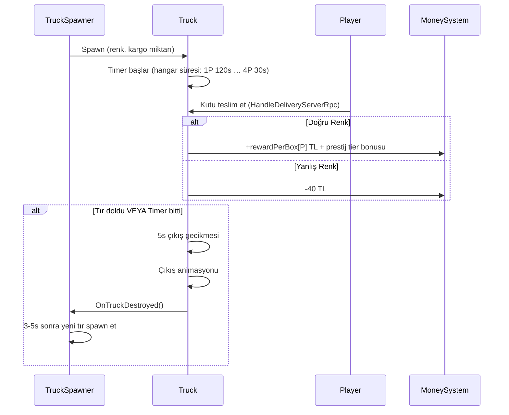

### 8.3 Teslimat Ekonomisi

**Doğru teslimat geliri** (1 oyuncu, prestij = 24 varsayımıyla; `prestigePerBonus = 8`):
$$\text{Gelir} = 50 + \left\lfloor \frac{24}{8} \right\rfloor \times 5 = 50 + 15 = 65\ \text{TL/kutu}$$

Aynı prestijde 4 oyuncu: `88 + 15 = 103 TL/kutu`.

**Yanlış teslimat cezası**: -40 TL/kutu — **sabit ve P-bağımsız**.

> [!IMPORTANT]
> Ceza/ödül oranı P ile eriyor: 1P'de yanlış teslimat ~0.62 doğru teslimatı siler (40/65),
> 4P'de yalnız ~0.39'unu (40/103). Yani caydırıcılık yüksek oyuncu sayısında **zayıflıyor** —
> `penaltyPerBox` P-bazlı yapılmadığı için. Bugün denge riski oluşturmuyor (yanlış teslimat
> nadir), ama ödül dizisi büyütülürse birlikte gözden geçirilmeli.

### 8.4 Tır Renk ve Görsel Sistemi

- Tır gövdesi ve kapıları, istenen kutu rengine boyanır (Kırmızı/Sarı/Mavi)
- Oyuncu, tırın renginden hangi kutuyu yüklemesi gerektiğini görsel olarak anlar
- 3D spatial audio: Giriş sesi, bekleme sesi (loop), çıkış animasyon sesi

### 8.5 Hangar ve Upgrade Entegrasyonu

- Başlangıçta **1 hangar** aktif
- **Truck upgrade** ile ek hangarlar açılır
- Her hangarın bir `requiredUpgradeLevel` değeri var
- Garaj kapıları (`GarageDoorController`) upgrade seviyesine göre açılır/kapanır

---

## 9. 👥 Müşteri Sistemi

> **Kaynaklar**: [CustomerAI.cs](file:///c:/Users/cicek/Documents/GitHub/Cargor/Assets/NewCss/CustomerSripts/CustomerAI.cs), [CustomerManager.cs](file:///c:/Users/cicek/Documents/GitHub/Cargor/Assets/NewCss/CustomerSripts/CustomerManager.cs)

### 9.1 CustomerManager — Müşteri Yöneticisi

**Server-authoritative** singleton. Günlük müşteri sayısını hesaplar ve dalga bazlı spawn yapar.

### 9.2 Dalga Bazlı Müşteri Yoğunluğu

> **Kaynak**: `WaveSettings` ScriptableObject

| Dalga | Saat Aralığı | Max Eşzamanlı | Spawn Hız Çarpanı | Atmosfer |
|-------|-------------|---------------|-------------------|----------|
| 🌅 Sabah | 08:00-12:00 | 4 | ×1.0 | Normal tempo |
| 🍽️ Öğle Rush | 12:00-14:00 | **6** | **×1.5** | Yoğun, kaotik |
| 😴 Öğleden Sonra Durgunluk | 14:00-15:00 | 2 | ×0.5 | Nefes alma |
| 🌤️ Öğleden Sonra | 15:00-16:00 | 3 | ×0.8 | Hafif tempo |
| 🌆 Akşam Rush | 16:00-17:00 | 4 | **×1.3** | Son dakika baskısı |
| 🌙 Kapanış | 17:00-18:00 | 2 | ×0.6 | Sessiz kapanış |

### 9.3 Müşteri AI Durumları

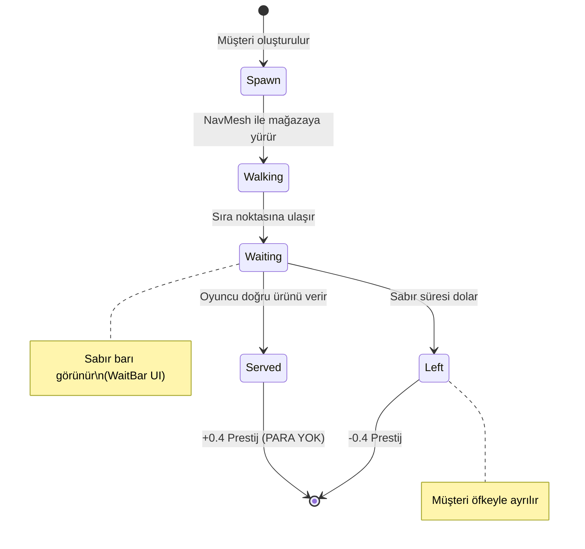

> Servis edilen müşteri **para vermez** — ürün üretir, para tırdan gelir (bkz. §4.1).

### 9.4 Müşteri Sabır Sistemi

- **Baz sabır**: **15-20 saniye** (rastgele) — `CustomerAI.minWaitTime/maxWaitTime`,
  gerçek değerler `Customer.prefab`'ta (`minWaitTime: 15`, `maxWaitTime: 20`)
- **Perk çarpanı**: `CustomerManager.patienceMultiplier` (varsayılan 1.0)
- **Etkinlik çarpanları**: ANGRY CUSTOMERS ×0.6 · BUSY DAY ×0.85 · RELAXED DAY ×1.3
- **Sayaç başlangıcı**: müşteri **kuyruğa vardığında** başlar (`CustomerAI.cs:897-900`), spawn'da değil
- **Görsel gösterge**: Müşterinin üzerinde azalan sabır barı (`WaitBar.cs`)
- **Billboard**: Sabır barı her zaman kameraya dönük (`Billboard.cs`)

> [!WARNING]
> **`DifficultyManager`'ın sabır ölçeklemesi ÖLÜ.** `baseMinPatience=35`, `baseMaxPatience=55`,
> `patienceReductionPerPlayer=5` ve `ScaledMinPatience`/`ScaledMaxPatience` property'lerinin
> `DifficultyManager.cs` DIŞINDA **tek bir tüketicisi yok** (grep ile doğrulandı). Eski GDD'deki
> "35-55 saniye, oyuncu başına −2s" tablosu hiçbir zaman canlı olmadı. Sabır **P'ye göre
> ölçeklenmiyor**.
>
> Sonucu: **sabır kolu Normal bantta hiç çalışmıyor** — varış aralığı (21-44s) servis süresinden
> büyük olduğu için kuyruk birikmiyor, kimse sabırsızlıktan kaçmıyor. RELAXED DAY'in Normal
> bandın 8 hücresinde ölçülen etkisi **tam sıfır** (Round 5 §5).

### 9.5 Kuyruk Sistemi

> **Kaynaklar**: [QueueController.cs](file:///c:/Users/cicek/Documents/GitHub/Cargor/Assets/NewCss/CustomerSripts/QueueController.cs), [QueueWaypoint.cs](file:///c:/Users/cicek/Documents/GitHub/Cargor/Assets/NewCss/CustomerSripts/QueueWaypoint.cs)

- **Başlangıç kuyruk boyutu**: **2** (`CustomerManager.DEFAULT_QUEUE_SIZE`, sahne override'ı da 2)
- **Uzun Kuyruk perki**: `maxQueueSize = DEFAULT_QUEUE_SIZE + 2` = **4** (perk şu an `disabledInDraft`)
- **Kuyruk pozisyonları**: `QueueWaypoint` noktaları ile tanımlı; gerçek tavan `min(WaypointCount, maxQueueSize)`
- **Doluluk kontrolü**: Kuyruk doluysa yeni müşteri spawn olmaz — telefonla çağırma da reddedilir (`IsQueueFull`)
- **Event çarpanı**: `eventCustomerMultiplier` kota tabanına uygulanır (bkz. §7.2)

### 9.6 Müşteri Spawn — Kota Tablosu + Varış Aralığı (PlateUp, 2026-08-29)

> [!CAUTION]
> **Eski "kapasite bazlı" formül SİLİNDİ.** `(AktifRaflar × 3) + (MağazaSeviyesi × 2) + Random(-2,+3)`
> artık kodda YOK — raf/masa kapasitesinin müşteri sayısına etkisi tamamen kaldırıldı
> (`CustomerManager.CalculateTodaysCustomerCount`, cs:403-419). Kaynak olarak gösterilen
> `implementation_plan.md` da bayat.

Bugün spawn iki bağımsız koldan yürür:

| Kol | Ne belirler | Kaynak |
|-----|-------------|--------|
| **Kota** | O gün KAÇ müşteri geleceği | `GetDailyCustomerCount(gün, P)` — bkz. §7.1 |
| **Varış aralığı** | Müşterilerin NE SIKLIKTA geleceği | `customerArrivalIntervalByPlayerCount = [44, 22, 21, 21]` sn |

$$\text{sonrakiSpawn} = \text{şimdi} + \frac{\max(1,\ \text{aralık}[P] + \text{jitter})}{\text{dalgaÇarpanı}(\text{saat})}$$

- **Jitter**: `±aralık × spawnTimeRandomness` (sahne: 0.2 → ±%20)
- **Dalga çarpanı**: `WaveSettings.GetSpawnRateMultiplier` (Öğle Rush ×1.5 → aralık kısalır)
- **Eşzamanlı tavan**: `WaveSettings.maxCustomers` (dönem bazlı 2-6) + kuyruk boyutu

> [!IMPORTANT]
> Bu ikilik, ekonominin en sık yanlış anlaşılan yeri: **kotayı çarpmak müşteri sayısını gerçekten
> artırmaz** çünkü varış aralığı sabit kalır ve gün bitmeden ekstra müşteriler spawn olamaz.
> Ölçüm: BUSY DAY (+%35 kota, 10→14 müşteri) servis edilen müşteriyi yalnız **+0.00…+0.26**
> artırıyor, Slow bantta NEGATİF (Round 5 §3).

---

## 10. 📦 Kutu ve Eşya Sistemi

### 10.1 Kutu Tipleri

> **Kaynak**: [BoxInfo.cs](file:///c:/Users/cicek/Documents/GitHub/Cargor/Assets/NewCss/BoxScripts/BoxInfo.cs)

| Renk | Enum Değeri | Görsel |
|------|------------|--------|
| 🟡 Sarı | `Yellow` | Sarı kutu modeli |
| 🔵 Mavi | `Blue` | Mavi kutu modeli |
| 🔴 Kırmızı | `Red` | Kırmızı kutu modeli |

Her kutunun `isFull` (dolu/boş) bayrağı vardır.

### 10.2 Kutu Düşürme Cezası

> **Kaynak**: [BoxFallPenalty.cs](file:///c:/Users/cicek/Documents/GitHub/Cargor/Assets/NewCss/BoxScripts/BoxFallPenalty.cs)

| Parametre | Değer | Kaynak |
|-----------|-------|--------|
| Para cezası | **-5 TL/düşürme** | `boxDropMoneyPenalty` |
| Prestij cezası | **-0.04/düşürme** | `boxDropPrestigePenalty` |
| Tetikleme eşiği | Çarpma hızı **≥ 3 m/s** | `impactSpeedThreshold = 3f` (`BoxFallPenalty.cs:41`) |
| Ses efekti | 3D spatial audio (hız ≥ 1 m/s'de çalar) | |

> Eşik, kutu kırılma eşiğiyle (`BoxDestroyOnCollisionNetcode.impactSpeedThreshold = 3`)
> **bilerek hizalı**. Ceza yüzeyden bağımsızdır (yer/duvar/raf aynı) ve kutu/ürün ayrımı yoktur.

> [!TIP]
> Fırlatma mekaniği riskli ama hızlıdır. Kutuyu fırlattığında yere düşerse ceza alırsın, ama başka bir oyuncuya atıp yakalamasını sağlarsan co-op avantajı elde edersin.

### 10.3 Network Dünya Eşyası

> **Kaynak**: [NetworkWorldItem.cs](file:///c:/Users/cicek/Documents/GitHub/Cargor/Assets/NewCss/NewPickup/NetworkWorldItem.cs)

- Ağ senkronize pickupable eşyalar
- Durumlar: `canBePickedUp`, `isOnTable`
- Fizik kontrolü: Masadayken `FreezePhysics()`, alınabilirken `UnfreezePhysics()`
- Darbe bazlı yıkım: **3 m/s** üstü hızla çarparsa hasar görebilir
- `ItemData` ScriptableObject ile `itemID`, `itemName` ve kategori

---

## 11. 🖐️ Pickup / Envanter Sistemi

> **Kaynak**: [PlayerInventory.cs](file:///c:/Users/cicek/Documents/GitHub/Cargor/Assets/NewCss/NewPickup/PlayerInventory.cs) (6 parçalı partial class)

### 11.1 Dosya Yapısı

| Dosya | Sorumluluk |
|-------|-----------|
| `PlayerInventory.cs` | Çekirdek: algılama ayarları, network değişkenleri, sabitler |
| `PlayerInventory.Detection.cs` | Koni tabanlı eşya algılama ve önceliklendirme |
| `PlayerInventory.Interaction.cs` | Alma / bırakma / fırlatma mekanikleri |
| `PlayerInventory.Shelf.cs` | Raf eşyası etkileşimi (scroll ile seçim) |
| `PlayerInventory.Visual.cs` | Tutma pozisyonu, outline sistemi |
| `PlayerInventory.Audio.cs` | Etkileşim ses efektleri |

### 11.2 Algılama Sistemi

```
         45° Koni
        ╱       ╲
       ╱    ●    ╲     ← Algılanan eşyalar
      ╱   Hedef   ╲
     ╱             ╲
    ╱───────────────╲
    ▲ Oyuncu (3m menzil)
```

| Parametre | Değer |
|-----------|-------|
| Algılama açısı | **45°** |
| Algılama menzili | **3 metre** |
| Etkileşim bekleme süresi (cooldown) | **0.1 saniye** |
| Input spam koruması | **0.15 saniye** |
| Pickup animasyon timeout | **2 saniye** |

### 11.3 Katman Önceliklendirmesi

Birden fazla eşya algılanırsa şu öncelik sırası uygulanır:

1. 🥇 **GroundItem** — Yerdeki eşyalar (en yüksek öncelik)
2. 🥈 **TableItem** — Masadaki eşyalar
3. 🥉 **ShelfItem** — Raftaki eşyalar (en düşük öncelik)

### 11.4 Outline Sistemi

- Hedeflenen eşyanın etrafında **sarı outline** gösterilir
- QuickOutline paketi kullanılır
- Sadece en yakın ve en yüksek öncelikli eşya outline alır

### 11.5 Çoklu Oyuncu Eşya Kilidi

- **Thread-safe statik dictionary** ile aynı eşyayı iki oyuncunun aynı anda alması engellenir
- Bir oyuncu eşyayı hedefleyince kilitlenir, bırakınca açılır

### 11.6 Tutma ve Bırakma Pozisyonları

- **HoldPosition**: Oyuncu modelinde adlandırılmış Transform — kutu burada tutulur
- **DropPosition**: Oyuncu modelinde adlandırılmış Transform — kutu bırakıldığında buraya düşer

---

## 12. 🗄️ Raf ve Masa Sistemi

### 12.1 Display Table (Sergi Masası)

> **Kaynak**: [DisplayTable.cs](file:///c:/Users/cicek/Documents/GitHub/Cargor/Assets/NewCss/TableScripts/DisplayTable.cs)

- Slot bazlı eşya yerleştirme sistemi
- Önceden tanımlanmış slot Transform pozisyonları
- Özellikleri: `IsFull`, `HasItems`, `AvailableSlotCount`
- Yerleştirilen eşyalar takip edilir, obje silindiğinde temizlenir

### 12.2 Networked Shelf (Ağ Senkronize Raf)

> **Kaynak**: [NetworkedShelf.cs](file:///c:/Users/cicek/Documents/GitHub/Cargor/Assets/NewCss/TableScripts/Shelf.cs)

| Parametre | Değer |
|-----------|-------|
| Slot sayısı | **3** (Kırmızı, Mavi, Sarı) |
| Otomatik yenileme | **Evet** |
| Yenileme gecikmesi | **1 saniye** |
| Senkronizasyon | NetworkVariable (network object ID) |

**Mekanizma**: Oyuncu raftan kutu aldığında, 1 saniye sonra otomatik olarak aynı slotta yeni kutu spawn olur. Bu sayede raf hiçbir zaman kalıcı olarak boşalmaz.

---

## 13. ⬆️ Yükseltme (Upgrade) Sistemi

> **Kaynaklar**: [UpgradePanel.cs](file:///c:/Users/cicek/Documents/GitHub/Cargor/Assets/NewCss/UpgradeScripts/UpgradePanel.cs), [UpgradeManager.cs](file:///c:/Users/cicek/Documents/GitHub/Cargor/Assets/NewCss/UpgradeScripts/UpgradeManager.cs), [UpgradeAssets.cs](file:///c:/Users/cicek/Documents/GitHub/Cargor/Assets/NewCss/UpgradeScripts/UpgradeAssets.cs)

### 13.1 Draft (Roguelite Teklif) Sistemi

Upgrade'ler doğrudan bir listeden satın alınmaz — her gün **3 kartlık rastgele bir teklif** sunulur
(`DraftPool.OFFER_COUNT = 3`). Kartlar iki türe ayrılır (`PerkKind`):

| Tür | Açıklama |
|-----|----------|
| **LeveledBackbone** | Fiziksel/omurga upgrade'ler (raf, masa, hangar). Tier'sız, hep havuzda. |
| **Perk** | Tek seferlik kaldıraçlar. Tier'lı, güne göre açılır. |

**Tier kapıları** (`DraftPool.MaxUnlockedTier`): T1 gün 1'den · **T2 gün 5'ten** · **T3 gün 9'dan** itibaren.

**Dışlama grupları** (`EXCLUSIVE_EFFECT_GROUPS`): birbirini götüren perkler aynı teklifte çıkamaz —
`{gambler_case, all_in}` ve `{leveraged_rent, all_in}` (ikisi de grace period'u siliyor).
Bir kart birden fazla gruba üye olabilir (`all_in` gibi).

**Reroll**: teklifi yenilemek para eder, gün içinde kümülatif artar —
**50 / 90 / 160 / 290 / 525 TL** (5+ tavan; `RerollCurve`). Bu tabloya ayrıca P-çarpanı uygulanır.

### 13.2 Upgrade Maliyetleri

**Formül**: `(baseCost + level × costStep) × oyuncuÇarpanı × etkinlikÇarpanı`

**Oyuncu çarpanı** (`DifficultyManager.upgradeCostMultiplierByPlayerCount`):

| 1P | 2P | 3P | 4P |
|----|----|----|----|
| **1.00** | **2.00** | **2.95** | **3.70** |

> Neden dizi, neden geometrik tek skaler değil: gelir ölçeği 1→2'de dik, sonra düz.
> `m^(P-1)` bu şekli üretemiyor — en iyi tek skaler (1.543) bile 2P'de %24.5 sapıyordu.
> **Dizi YAML'a yazılmaz**, C# field initializer'da durur (float[] hex formatı Unity'de çalışmıyor).

**Etkinlik çarpanı**: OPPORTUNITY DAY = ×0.8.

> [!IMPORTANT]
> **"Görev Kademesi" (Quest Tier) oyuncu çarpanından MUAF** (`UpgradePanel.GetCostMultiplier`,
> cs:1632-1644 — Round 10 U9, 2026-08-30). Gerekçe: quest ödülleri **P-DÜZ** (aynı 28/60/150 TL
> tüm oyuncu sayılarında), fiyatı P-ölçekli kalırsa P3/P4'te net değeri negatife düşüyordu.
> Muafiyetle L1 net değeri P2/P3/P4'te **+80/+156/+216 TL** iyileşti; net-pozitif hücre L1'de
> 5/16 → **7/16**, L2'de 5/16 → **8/16**. Etkinlik çarpanı (OPPORTUNITY DAY) bu upgrade'e hâlâ
> uygulanır; muafiyet yalnız `DifficultyManager.UpgradeCostMultiplier`'ı atlar.
> Fiyat CANLI: `baseCost=80`, `costStep=20`, `maxLevel=2` → **L1 = 80 TL, L2 = 100 TL
> (kümülatif 180 TL)**, artık P-bağımsız. (Round 11 §5-X6: fiyatı 60/15 … 30/10 aralığına
> indirmek net-pozitif hücreyi 10/16 → 11/16 yapıyor ama max ROI'yi 5.0x → **12.9x**'e
> çıkarıyor = "underpriced no-brainer" tuzağı → **80/20 KALSIN**.)

**Omurga upgrade maxLevel'leri** (FAZ 4'te kısıldı):

| Upgrade | maxLevel | baseCost / costStep | Gerekçe |
|---------|----------|---------------------|---------|
| Geniş Ambar | **2** | 60 / 30 (toplam 150) | Ekonomi kartı değil, fiziksel stok tamponu |
| Paketleme İstasyonu | **1** | 150 | Sahnede `Table` taşıyan tam 2 obje var; seviye 2-3 hiçbir şey açmıyor |
| Ek Hangar | **1** | 200 | 3. hangar her iki bantta 0 TL katıyor (tır penceresi darboğaz değil) |

> [!NOTE]
> **Ekonomist Round 4 ölçümleri (fiyat değişikliği ÖNERİLMEDİ, tespit):**
> - 26 upgrade'in **19'u draft'ta aktif; 6'sı `disabledInDraft=1`** ile hiç satın alınamıyor
>   (Geniş Kuyruk, Sağlam Kasa, Dinç Ekip, Su Sebili, Güler Yüz, Uzun Kuyruk) — bunlar için
>   fiyat/güç tartışması anlamsız.
> - **Ek Hangar en aşırı kalem**: değer/maliyet oranı STRICT bantta **9.21×**, OPTIMISTIC bantta
>   **0×**. Aşırılık fiyatta değil, STRICT'in mekanik hangar-tavanı kapasite tasarımında.
> - **Görev Kademesi L2** strict bantta ölçülebilir değeri sıfırdan da kötüydü; Round 10 U9
>   (fiyat muafiyeti) + Round 11 R11-1 (best-of-K teklif seçimi) ile **düzeltildi** — brüt katkı
>   artık 16/16 hücrede ≥0. Bkz. §16.1 ve §16.2.
> - **`cheap_rent` STALE-BASELINE bug'ı DÜZELTİLDİ** (Round 10 U11, 2026-08-30):
>   `PerkEffect.cs:198` formülü artık `1.20f − 0.03f × level` (eski `1.15f` canlı tabanla senkron
>   değildi, perk L1'de niyet edilenden **2.55-2.61 kat** güçlüydü). **Kira büyüme tabanı
>   (`rentGrowthMultiplier`) değişirse bu formülün sabiti de elle güncellenmeli** — kod bunu
>   dinamik okumuyor.
> - **`long_queue`'da benzer bir "stale baseline" olduğu iddiası ÇÜRÜDÜ** (Round 10 §4-R11):
>   `CustomerManager.DEFAULT_QUEUE_SIZE + 2` sabiti tabanı dinamik okuyor, yalnız yorum bayattı.
> - **`leveraged_rent` (grace'i SİLEN perk) Slow/strict'te P1/P2'yi KAZANDIRIYOR** — kalıcı
>   %25 kira indirimi, grace'in tek seferlik faydasını aşıyor (uçurum kenarı, 18-32 TL marj).

### 13.3 Ertelenmiş Aktivasyon

> [!IMPORTANT]
> Satın alınan yükseltmeler **aynı gün aktif olmaz**! Yükseltme beklemededir (`pending`) ve **ertesi gün** aktifleşir. Bu tasarım kararı, oyuncunun stratejik planlama yapmasını zorunlu kılar.

### 13.4 Upgrade Panel Erişim Saati

Panel ancak oyun içi saat **10:00**'dan sonra açılabilir (`PANEL_OPEN_HOUR = 10`). Bu, oyuncuyu önce birkaç saat çalışıp para kazanmaya, ardından upgrade yapmaya teşvik eder.

### 13.5 Upgrade Görselleri

Her upgrade seviyesine karşılık gelen 3D objeler sahnede aktifleşir. Örneğin:
- Tır upgrade → Yeni garaj kapısı açılır
- Kapasite upgrade → Yeni raf/masa sahnede görünür

---

## 14. 📞 Telefon Sistemi

> **Kaynak**: [PhoneCallManager.cs](file:///c:/Users/cicek/Documents/GitHub/Cargor/Assets/NewCss/Phone/PhoneCallManager.cs)

> [!IMPORTANT]
> **Sistem V4 — DIŞARI ARAMA (PlateUp geçişi, 2026-08-29).**
> **Telefon artık ÇALMIYOR.** V3'ün "sunucu zar atar, telefon çalar, oyuncu açar" reaktif modeli
> ve tüm çalma alanları (`phoneRingChanceByPlayerCount`, `phoneRingChancePerHour`,
> `phoneRingEventMultiplier`, `phoneRingPerkBonus`, `ringDuration`) **koddan silindi**.
> Bugün oyuncu telefona gidip **E'yi basılı tutarak** sıradaki kota müşterisini öne çeker.

### 14.1 Parametreler

| Parametre | Değer | Kaynak |
|-----------|-------|--------|
| Kullanım şekli | Telefon alanında **E'yi 1 sn basılı tut** (bar boştan dolar; erken bırakınca iptal) | `phoneDialHoldSeconds = 1f` |
| Çalışma saatleri | **08:00 – 18:00** | `phoneStartHour` / `phoneEndHour` |
| Etki | Sıradaki kota müşterisini **hemen** spawn eder (`ForceSpawnNextCustomer`) | — |
| **Bedel** | Gün saati ileri sarılır: 1P **115** · 2P **49** · 3P **47** · 4P **47** oyun-dakikası | `timeSkipAmountByPlayerCount` |
| Para ödülü | **+20 TL** | `callMoneyReward` |
| Prestij ödülü | **+0.4** — bir müşteri servisiyle AYNI | `callPrestigeReward` |
| Cooldown | **3 sn**, P-bağımsız (2026-08-30 kullanıcı isteğiyle 20 → 3) | `phoneCooldownSeconds` |
| Quest tetikleyicisi | `QuestTracker.NotifyPhoneAnswered()` (cs:481) | `AnswerPhone` görevleri |

**Çarpanlar** — her iki asıl kaldıraç da 2026-08-30'da **cooldown'dan ZAMAN MALİYETİNE taşındı**:

| Kaynak | Etki | Kod |
|--------|------|-----|
| **CUSTOMER SUPPORT** etkinliği | `TimeSkipAmountMinutes` **×0.5** — bir çağrının zaman bedeli yarıya iner | `GetEffectiveTimeSkipMinutes` (cs:311-323); hem 17:30 guard'ı hem `ExecuteCall` bu metodu kullanır |
| **`phone_line` perki** (160 TL, relic) | `phoneTimeSkipPerkMultiplier = 0.80f` → zaman bedeli **−%20** | `PerkEffect.ApplyPhoneLine` (cs:308) |
| `phone_line` perki (ikincil) | `phoneCooldownPerkBonusSeconds = 1f` → cooldown 3 → 2 sn | `PerkEffect.cs:309` |

> [!IMPORTANT]
> **Neden cooldown DEĞİL zaman maliyeti (Round 10 U3/U4/U5).** Gerçek kapı cooldown değil,
> `HasUnspawnedCustomers` (günlük kota) ve `IsQueueFull`. Ard arda arama tavanı = kuyruğun
> boşalma süresi (18-62.5 sn) ≫ 3 sn cooldown → cooldown 16/16 hücrede **bağlayıcı değil**
> (Round 5 §2). Eski hâlinde:
> - CUSTOMER SUPPORT mekanik olarak **NO-OP** ama takvimde "POZİTİF" etiketiyle telefon spam'ine
>   çağırıyordu → net etki **−16…−463 TL/gün**. Yeni hâlinde **+%12-43/gün** (FESTIVAL'in çok
>   altında, sağlıklı). Takvim metni de güncellendi ("RECEPTION PHONE CALLS SKIP HALF AS MUCH TIME").
> - `phone_line`'ın eski etkisi (`phoneCooldownPerkBonusSeconds = 10f` → `Mathf.Max(1, 3−10) = 1sn`)
>   ekonomik olarak **sıfır** değerdeydi. Yeni çarpanla değer/maliyet oranı **0 – 0.62 – 1.51x**
>   (min/medyan/max, 16 hücre). `0.75` denendi: optimistic bandı %45-85 kullanıma fırlatıp
>   "dikkatli kullan" dersini çözüyor; `0.85`: 4 hücrede sıfır değer. **0.80 doğru nokta** —
>   perk zayıf bulunursa kol FİYAT (160→120), çarpan DEĞİL.
> - `phoneCooldownPerkBonusSeconds` yeni değeri **1f**; ekonomik etkisi hâlâ sıfır, yalnız his
>   amaçlı — öyle etiketlenmeli.
>
> Sahnedeki `phone_line` `contentText`'i de V3 metninden ("çalma şansı +%15") güncellendi:
> "Dışarı arama zaman maliyetini %20 azaltır."

### 14.2 Akış

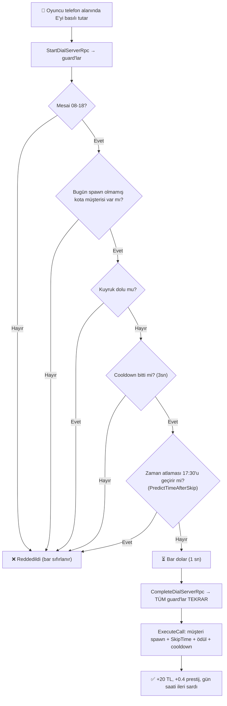

> [!NOTE]
> **17:30 guard'ı** (`CUSTOMER_EXIT_HOUR`) kritik: olmasaydı, çağrılan müşteri aynı karede
> gün-sonu kesimine yakalanır ve oyuncu hem +0.4 arama prestijini hem −0.4 kayıp cezasını görürdü
> (QA bulgusu 2026-08-29). `phoneEndHour = 18` bu iş için yetmiyor.
>
> **Server-authoritative**: client'ın "yeterince bekledim" beyanına güvenilmez, sunucu kendi
> zaman damgasından hesaplar (`f9a3f1b` "bedava para" exploit dersi).

### 14.3 Görsel ve Ses Geri Bildirimi

- **PhoneWaitBar** iki iş yapıyor: (a) basılı tutarken 0→1 dolan çevirme barı,
  (b) çağrıdan sonra 1→0 inen cooldown barı
- **Başarı sesi**: çağrı gerçekleştiğinde (`successCallSound`)
- **Zil sesi YOK** — telefon çalmıyor
- Telefon **fiziksel olarak mağazada bir yerde**; oyuncunun oraya yürümesi gerekir
- "Biri şu an çeviriyor" göstergesi **bilinçli olarak kapsam dışı** (yalnız yerel oyuncu görür)

> [!CAUTION]
> **Bağlanmamış inspector alanları sessizce sistemi öldürüyor.** `successCallSound`,
> `phoneWaitBar`, `phoneCollider` hepsi null-guard'lı: atanmadıklarında hata VERMEZ, sadece
> susarlar. "Telefon hiç çalmadı" sanılmasının sebebi tam olarak buydu (2026-08-13).
> `WarnOnMissingReferences()` artık bir kez uyarı basıyor.

### 14.4 Telefonun Gerçek Ekonomik Bedeli

`SkipTime`, `timeSkipAmountByPlayerCount`'u **TABAN** gün süresiyle (200s) gerçek saniyeye
çevirir (bkz. §3.2 uyarısı):

$$\text{gerçekSaniye} = T[P] \times \frac{200}{11 \times 60} = T[P] \times 0{,}30303$$

| Oyuncu | `T[P]` (oyun-dk) | Gerçek maliyet | Doğal varış aralığı | Maliyet / aralık |
|--------|------------------|----------------|---------------------|------------------|
| 1P | 115 | **34.8 sn** | 44 sn | %79 |
| 2P | **49** | **14.8 sn** | 22 sn | **%67** |
| 3P | **47** | **14.2 sn** | 21 sn | **%68** |
| 4P | **47** | **14.2 sn** | 21 sn | **%68** |

Yani bir çağrı, "sıradaki müşteriyi beklemek" yerine geçen sürenin **%67-79'unu** yakar —
kazanç, kalan **%21-33'lük** zaman tasarrufu + 0.4 prestij (2026-09-18: doğrudan para ödülü
KALDIRILDI, bkz. aşağıdaki kutu — para artık yalnız çağrılan müşteri servis edilirse tırdan
gelir). 1P kasıtlı olarak en pahalı bant (tek oyuncunun eğrisi zaten sağlıklıydı, dokunulmadı).

**Gün uzadıkça çağrı ucuzlar** (bedel gerçek-saniye cinsinden sabit, gün ise uzuyor):

| | Gün 1 (200s) | Gün 16 (330s) |
|--|--------------|---------------|
| 1P: 34.8 sn = | **115** oyun-dk | **70** oyun-dk |
| 2P: 14.8 sn = | **49** oyun-dk | **30** oyun-dk |
| 3P/4P: 14.2 sn = | **47** oyun-dk | **28** oyun-dk |

**Perk / etkinlik indirimleri** (çarpanlar `T[P]` üzerine, çarpımsal):

| Durum | 1P | 2P | 3P/4P |
|-------|----|----|-------|
| Taban | 34.8 sn | 14.8 sn | 14.2 sn |
| `phone_line` perki (×0.80) | 27.9 sn | 11.9 sn | 11.4 sn |
| CUSTOMER SUPPORT günü (×0.50) | 17.4 sn | 7.4 sn | 7.1 sn |

> [!IMPORTANT]
> `timeSkipAmountByPlayerCount`'un etiketi ("atlanan oyun-dakikası") **yalnız gün 1-3'te
> doğrudur**. Gün 16'da 115 dakikalık ayar fiilen ~70 oyun-dakikası ilerletir. Bu bir bug DEĞİL
> ve **bilinçli olarak KORUNDU** (Round 10 §4-R5): `SkipTime`'ı `CurrentDayDuration`'a çevirmek
> geç-oyun telefon maliyetini **+%65** artırır (gün 16'da 34.85 → 57.5 sn) ve telefonu
> beceri-ters bir tuzağa çevirir. Alanın tooltip'i bu davranışı açıklayacak şekilde güncellendi
> (`GameEconomySettings.cs:116`). **`SkipTime`'ın taban-200s dönüşümüne DOKUNMAYIN.**

**Kullanım rehberi (16 hücre × geniş oran taraması, `runFullSim` v5.1 — 2026-09-18 sonrası):**
- Sağlıklı bant (Normal): optimum telefon oranı **%10-15** (önceki %15-25'ten hafif düştü —
  beklenen: koşulsuz para ödülü kalkınca marjinal fayda küçüldü, ama karar hâlâ gerçek).
- **Slow/strict P1/P2'nin eski %100 "spam" optimumu KIRILDI** → P1: %0, P2: %20. Bu iki hücrenin
  düşük kasa değeri (176-240 TL, gün 16) telefon fix'inin YAN ETKİSİ değil, önceden telefonun
  gizlediği zayıf-bant sorunudur ([[economy_full_balance_round2]]) — ayrı bir iş.
- Optimistic bantların çoğunda optimum hâlâ **%0** (arz-sınırlı, telefon zaten kâr etmiyordu).
- Öğretilebilir tek kural: **"boşta beklerken çevir, kuyruk doluyken çevirme"**

> [!NOTE]
> **2026-09-18 düzeltme — "ikinci koşulsuz para musluğu" kapatıldı.** `PhoneCallManager.ExecuteCall`
> eskiden müşteri servis edilsin edilmesin `AddMoney(20)` yapıyordu (bkz. denetim
> `docs/playtest/tasarim-denetimi-2026-09-18.md` #2). **Karar: seçenek (a)** — doğrudan para
> ödülü **20 → 0** (`GameEconomySettings.cs` `callMoneyReward`, asset + sim.js `SRC4` ile
> birlikte), prestij ödülü (+0.4) ve zorunlu müşteri spawn'ı DOKUNULMADAN kaldı. Para artık
> yalnız çağrılan müşteri gerçekten servis edilirse tırdan gelir → "para yalnız tırdan gelir"
> invariantı geri geldi. Seçenek (b) (parayı yalnız servis edilirse ver) yeni bir gameplay hook'u
> gerektirdiği için ertelendi; seçenek (c) (küçük sabit para) Round 10'da 3 farklı değerle
> (10/12/15) denenmiş ve Slow/strict P1/P2'yi %100'den kurtaramamıştı → (a) tek net çözümdü.

---

## 15. 🎪 Etkinlik (Event) Sistemi

> **Kaynaklar**: [EventCalendarUI.cs](file:///c:/Users/cicek/Documents/GitHub/Cargor/Assets/NewCss/Events/EventCalendarUI.cs), [EventEffectManager.cs](file:///c:/Users/cicek/Documents/GitHub/Cargor/Assets/NewCss/Events/EventEffectManager.cs)

### 15.1 Takvim Sistemi

- **16 hücreli ızgara** (16 gün)
- **İlk 3 gün**: Etkinlik yok (oyuncunun adapte olması için)
- **3. günden sonra**: Her 1-2 günde bir etkinlik
- **Garanti kuralları**:
  - İlk 2 etkinlik **mutlaka pozitif**
  - 3. etkinlik **mutlaka negatif**
  - Sonrası rastgele

### 15.2 Etkinlik Kataloğu (16 Etkinlik — kodla birebir)

> Değerler `EventEffectManager.InitializeEventMultipliers()` (cs:130-360) ile birebir eşleşir.
> Boş hücre = ×1.0 (etkisiz).

#### Pozitif Etkinlikler 🟢 (8 adet)

| Etkinlik | Kutu ödülü | Müşteri kotası | Sabır | Tır çıkışı | Diğer |
|----------|-----------|----------------|-------|-----------|-------|
| **DELIVERY BONUS** | **×1.20** | | | | |
| **EXPRESS CARGO** | ×1.08 | | | **×0.70** | |
| **GOLDEN BOX DAY** | ×1.15 | ×1.15 | | ×0.80 | hareket ×1.08, sprint ×1.20, stamina regen **×0.80** |
| **VIP SERVICE** | ×1.12 | | | | |
| **RELAXED DAY** | | | **×1.30** | | |
| **OPPORTUNITY DAY** | | | | | upgrade maliyeti **×0.80** |
| **FESTIVAL DAY** | | | | | gün başında **kira × %10-20** rastgele para |
| **CUSTOMER SUPPORT** | | | | | telefon **zaman maliyeti ×0.5** (Round 10 U3; eski "cooldown ×0.5" NO-OP idi — bkz. §14.1) |

#### Negatif Etkinlikler 🔴 (8 adet)

| Etkinlik | Kutu ödülü | Müşteri kotası | Sabır | Tır çıkışı | Diğer |
|----------|-----------|----------------|-------|-----------|-------|
| **BUSY DAY** | | **×1.35** | ×0.85 | | |
| **ANGRY CUSTOMERS** | | ×1.10 | **×0.60** | | |
| **MARKETING DAY** | **×0.70** | ×1.20 | | | |
| **RAINY DAY** | | ×0.80 | | | |
| **SLOW LOGISTICS** | ×0.92 | | | **×1.50** | |
| **HEAVY BOXES** | | | | | hareket ×0.85, sprint ×0.80 |
| **FATIGUE PROBLEM** | | ×0.85 | | | hareket ×0.90, sprint ×0.70, stamina regen ×0.60 |
| **SURPRISE AUDIT** | | | | | tüm prestij cezaları **×2** |

> [!NOTE]
> Eski GDD'nin **"Quota Day"** etkinliği kodda **yok**. `EventCalendarUI._allEvents` tam olarak
> yukarıdaki 16 kaydı içerir (8 pozitif + 8 negatif; CUSTOMER SUPPORT `EventType.Positive`).
>
> **Zamanlama**: ilk **3 gün etkinliksiz** (`INITIAL_EVENT_FREE_DAYS`), sonrasında **1–2 gün**
> aralıklarla düşer (`EVENT_INTERVAL_MIN/MAX`, 2026-08-25: 1-3 → 1-2). Kira günlerine (4/8/12/16)
> etkinlik **hiç atanmaz** (`IsRentDay` dışlaması).

> [!IMPORTANT]
> **Ekonomist ölçümleri (Round 5) — 4 yapısal bulgu:**
> 1. ~~**FESTIVAL DAY ~6 kat outlier**~~ — **ÇÖZÜLDÜ, event'e dokunmadan.** Round 5'te tek-gün
>    etkisi +%28…+109 idi (16 hücre ort. +%61) çünkü tek kira-bağlı event olarak eski yüksek
>    kirayı takip ediyordu. Round 10 U1'in kira kesintisi bunu bedavaya söndürdü: bonus artık
>    75-423 TL = geç-gün net gelirinin **%25-32'si** ve P1→P4 boyunca **düz**. FESTIVAL tabanına
>    ayrıca dokunulMADI (Round 10 §4-R7).
> 2. **Kota çarpanı YUKARI yönde ölü** (BUSY DAY, MARKETING DAY, ANGRY CUSTOMERS, GOLDEN BOX DAY).
>    Bkz. §7.2 / §9.6 — doğru kol varış aralığını bölmek olurdu. BUSY DAY'in lokalizasyon metni
>    zaten "SPAWN RATE +35%" vaat ediyor ama kod kotayı çarpıyor.
> 3. **Pozitif/negatif asimetrik, oyuncu lehine.** 40k Monte Carlo: 16 günde ort. **5.86 event**
>    (3.43 pozitif / 2.43 negatif) → pozitifler **%43 daha sık**
>    (`INITIAL_POSITIVE_EVENT_COUNT=2` vs tek `GUARANTEED_NEGATIVE_EVENT_INDEX=2`).
>    Net para katkısı +%0.6…+2.7 — ama bunun **%80-100'ü tek başına FESTIVAL DAY'den**.
>    FESTIVAL sönümlendiği için asimetri de söndü → **düzeltme yapılmadı**, playtest hissine
>    bırakıldı (Round 10 §4-R8). Enflasyon riski yok.
> 4. **RELAXED DAY Normal bantta tam sıfır** (16 hücrenin 8'i) — sabır kolu orada hiç çalışmıyor
>    (bkz. §9.4).
>
> **Yerleşim riski**: takvim kira günlerini dışlıyor ama **kira gününden ÖNCEKİ günü (15)**
> korumuyor — tek-event en kötü hasar hep orada çıkıyor (−255 TL, BUSY DAY, 4P).

> [!NOTE]
> **Ölü kod**: `EventEffectManager.IsGoldenBoxDay()` (cs:702) ve `IsVIPServiceDay()` (cs:709)
> tüm `Assets/` içinde **okuyucusuz**. İşlevsel boşluk yok — açıklamalardaki %15/%12 zaten
> `rewardPerBoxMultiplier`'dan geliyor.
>
> **FAZ 4 düzeltmeleri (tarihsel)**: RELAXED DAY'in açıklamada olmayan gizli müşteri cezası
> (×0.7) kaldırıldı · RAINY DAY yanlış sınıflandırılmıştı (Pozitif → **Negatif**) ·
> VIP SERVICE'in "tır başına %10 şans" RNG'si silinip sabit ×1.12 yapıldı.

### 15.3 Etkinlik Uygulama Mekanizması

`EventEffectManager`, etkinliğin gerektirdiği çarpanları ilgili sistemlere uygular:

```
EventEffectManager
├── Truck.rewardPerBox               → rewardPerBoxMultiplier
├── Truck çıkış gecikmesi            → exitDelayMultiplier
├── CustomerAI.waitTime              → customerWaitTimeMultiplier
├── CustomerManager.eventCustomerMultiplier → dailyCustomerMultiplier (kota tabanına)
├── PlayerMovement.moveSpeed         → playerMoveSpeedMultiplier
├── PlayerMovement.sprintSpeed       → playerSprintSpeedMultiplier
├── PlayerMovement.staminaRegenRate  → staminaRegenRateMultiplier
├── UpgradePanel.costMultiplier      → upgradeCostMultiplier (UpgradePanel.cs:1618 okuyor)
├── PhoneCallManager                 → IsEventActive("CUSTOMER SUPPORT") ile zaman maliyeti ×0.5
│                                       (GetEffectiveTimeSkipMinutes; çarpan sözlüğü nötr)
└── PrestigeManager cezaları         → GetPenaltyMultiplier() (SURPRISE AUDIT ×2)
```

**Geri yükleme**: Orijinal değerler saklanır ve etkinlik sona erdiğinde (yeni gün başladığında) geri yüklenir.

> [!WARNING]
> Perk sistemi de aynı alanların bir kısmına yazıyor ve etkinlik geri-yüklemesi
> **snapshot tabanlı** — snapshot'a yeni bir yazar eklenirse snapshot da tazelenmeli
> (bkz. `.claude/agent-memory/economist/perk_card_absolute_assignment_conflict.md`).

---

## 16. 🏆 Görev (Quest) Sistemi

> [!NOTE]
> **Quest kodu `Assets/Scripts/Quest/` altında — `Assets/NewCss/` DIŞINDA** (legacy konum).
> Kaynaklar: `Assets/Scripts/Quest/Manager/QuestManager.cs`, `.../QuestTracker.cs`,
> `.../Data/QuestData.cs`. Asset'ler: `Assets/Resources/Quests/*.asset` (30 adet).

### 16.1 Görev Yapısı

| Parametre | Değer |
|-----------|-------|
| Günlük teklif sayısı | **3, SABİT** (`BASE_DAILY_QUEST_COUNT`; `DailyQuestTargetCount` property'si bunu döner) |
| Sahnedeki UI slotu | **3 `QuestSlotUI`** — `QuestUIController.cs:410` teklif listesini `Mathf.Min(questSlots.Count, DailyQuestCount)` ile kırpar |
| Havuz | **30 elle yazılmış asset** — Easy 11 · Medium 10 · Hard 9 |
| Seçim | **Katmanlı + best-of-K** (`SelectDailyQuestsStratified`): her açık tier'dan 1 garanti teklif, her teklif K aday arasından seçilir |
| Zorluk katmanları | Easy (tier 0), Medium (1), Hard (2) |
| Hard görev kilidi | `Görev Kademesi` upgrade'i ile açılır (yalnız-artar, geri alınamaz — `SetQuestTierInternal`) |
| Günlük kabul limiti | **1** — teklif 3 ama yalnız biri kabul edilebilir |

> **Ödül modeli elle yazım.** Eski rastgele havuz modeli (`rewardPool`/`penaltyPool` + Fisher-Yates)
> kaldırıldı; her asset kendi `moneyReward` / `prestigeReward` / `moneyPenalty` / `prestigePenalty`
> alanlarını taşıyor. **Ceza alanları POZİTİF girilir**, kod `-Mathf.Abs()` uygular
> (eksi yazılırsa çift-negatif olup ceza ödüle dönme tuzağı kapalı).

#### Günlük teklif seçimi — katmanlı + **best-of-K** (Round 11 R11-1, 2026-08-30)

`SelectDailyQuestsStratified` (`QuestManager.cs:583-649`) her açık tier için **K aday çeker ve
aralarından oyuncunun bugün en yapabileceğini teklif eder**. Slot SAYISI hiç değişmez (hep 3);
kademe slot **KALİTESİNİ** artırır.

**K tablosu** (birebir, `CalculateCandidateCount`, cs:662-667 — `K = maxTier==0 ? 1 : (t==0 ? 3 : max(1, maxTier−t+1))`):

| `CurrentQuestTier` | Easy slotu | Medium slotu | Hard slotu |
|---|---|---|---|
| 0 (başlangıç) | **K=1** (eski davranışla birebir aynı) | — | — |
| 1 | **K=3** | K=1 | — |
| 2 | **K=3** | **K=2** | K=1 |

**Fizibilite skoru** (`CalculateFeasibilityScore`, cs:675-700) — **adaptif**:

$$\text{skor} = \frac{\text{dünkü arz (quest tipine göre)}}{\text{effectiveTarget} \times (\text{renk-kilitli ? 3 : 1})}$$

Arz sayaçları (`_shelfToday` / `_trucksToday` / `_packedToday` / `_phoneToday`) gün içinde
`HandleBoxPlacedOnShelf` / `HandleTruckCompleted` / `HandleToyPacked` / `HandlePhoneAnswered`
ile artar; `AssignDailyQuests` **önce snapshot alır, sonra sıfırlar** (yani seçimde DÜNKÜ değerler
kullanılır). **Gün 1'de geçmiş yok → K=1'e düşülür**, seçim eski davranışla birebir aynıdır.

> [!IMPORTANT]
> **Neden bu tasarım — çözdüğü sorun.** Tier kilidi açıldıkça oyuncunun gördüğü 3 teklifin
> kompozisyonu `[E,E,E] → [E,M,dolgu] → [E,M,H]` oluyor. Strict bantta Medium/Hard slotları
> negatif-EV olduğu için fiilen ÖLÜ slot → **kaybedilen şey 3 Easy çekilişinin en iyisiydi**
> (kayıp her bantta ~3 TL/gün SABİT, kazanç bant-bağımlı: strict +0.3…1.4, optimistic +16).
> Sonuç: "Görev Kademesi" upgrade'i 4/16 hücrede **T2 < T0** = ödenmiş kötüleştirme idi.
> Easy'ye K=3 vermek kaybı birebir geri veriyor.
>
> **Ölçülen etki (5 farklı koşum senaryosu, 16 hücre):** `T2 < T0` **4/16 → 0/16**,
> `T1 < T0` **4/16 → 0/16**, min(T2−T0) = +2 TL. `questTier = 0` sonuçları **16/16 hücrede
> birebir değişmiyor** — upgrade'i hiç almayan oyuncu etkilenmiyor. Enflasyon yok: en yüksek
> T2 brüt kazancı 868 → 906 TL (**+%4**).
>
> **Çeşitlilik korunuyor**: best-of-3 altında en sık teklif edilen Easy quest %24.9, 11 asset'in
> 8'i hâlâ görünüyor (dejenerasyon riski ölçüldü, yok).
>
> **Adaptif skorun statik alternatife üstünlüğü**: statik `effectiveTarget × (renk ? 3 : 1)`
> skoru T2<T0'ı yalnız 1/16'ya indiriyor ve Slow/strict P2-P4'te tır arzı SIFIRken
> `Q_Easy_1_Truck`'ı (hedef 1) "en kolay" sayıp sık teklif ediyor. Adaptif skor onu son sıraya
> atıyor. **Statik skora düşülürse `CompleteTruck` ve `AnswerPhone` tipleri skorlamadan
> hariç tutulmalı.**

> [!CAUTION]
> **`DailyQuestTargetCount` UI slot sayısını AŞMAMALI.** Round 10'da denenen
> `DailyQuestTargetCount = 3 + CurrentQuestTier` oyunda **16/16 hücrede NO-OP** çıktı: garanti
> tier pick'leri listenin başında olduğu için ilk 3 teklif her tier'da aynı kalıyor, index ≥3'teki
> quest'ler hiçbir slota bağlanmıyor → `AcceptQuest` çağrılamıyor → `Available` kalıyorlar →
> `SettleAcceptedQuestsForDayEnd` `Available`'ı atladığı için ceza da vermiyorlar. Tam ölü ağırlık.
> Geri alındı. `EconomyInvariantCheck` artık **sahnedeki `QuestUIController.questSlots` sayısının
> `BASE_DAILY_QUEST_COUNT`'a eşit olduğunu** denetliyor (cs:193-195) — bu hata sınıfı bir daha
> sessizce geçmesin.

### 16.2 Görev Ödül / Ceza Tablosu

Tablo **tier-düz**: aynı tier'daki her asset aynı ödülü verir (2026-08-06, `975f011` —
eski base/premium/phone grup ayrımı kaldırıldı).

| Tier | Para ödülü | Para cezası | Prestij ödülü | Prestij cezası | Ödül/ceza oranı | Asset |
|------|-----------|-------------|---------------|----------------|-----------------|-------|
| **Easy** | 28 TL | 15 TL | +0.6 | −0.32 | 0.54 | 11 |
| **Medium** | 60 TL | **20 TL** | +1.2 | −0.4 | **0.33** | 10 |
| **Hard** | 150 TL | **30 TL** | +3.0 | −0.6 | **0.20** | 9 |

2026-08-30 kalibrasyonu (`bb98ad1`): **para ÖDÜLLERİ değişmedi**; prestij ödül+cezaları **×0.4**
(Round 10 U7), Medium/Hard **para cezaları** 27→20 ve 53→30 (Round 11 R11-2). Easy satırı hiç
değişmedi.

> [!NOTE]
> **Neden prestij ×0.4 (Round 10 U7).** §4.3'ün dönüşümüyle Hard'ın eski +7.5 prestiji gün 8'de
> **34-281 TL** ediyordu — optimistic bantta 150 TL'lik para ödülünün 1.7-1.9 katı, üstelik kart
> üzerinde görünmeyen bir değer. `maxPrestige=100` tavanına çarpan hücre sayısı quest yüzünden
> 3/16 → 6/16'ya çıkıyordu. ×0.4 sonrası tavana çarpan hücre **0/16** (gözlenen max 94) ve quest'in
> kasa katkısı 146-1189 → **135-675 TL**. Kesilen kısım tamamen görünmez prestij kanalı; para
> ödülü aynı kaldı.
>
> **Neden Medium/Hard para cezası düştü (Round 11 R11-2).** Ölçüm: **Hard tier, kabul kararını
> düşünmeden veren ("kartta en yüksek ödül" oyuncusu) için 16/16 hücrede NEGATİF EV** idi — en iyi
> bantta bile (Normal/optimistic P4) −1.1 TL/gün, en kötüsünde −49.2. Yani 150 TL'lik ödül hiçbir
> oyuncu için "körü körüne alınabilir" değildi, kartın vaadiyle çelişiyordu. Ceza 30'a inince tablo
> sağlıklı bir **beceri gradyanına** dönüyor: iyi giden bantlarda (6/16) körü körüne almak kârlı,
> zorlanan bantlarda değil. Rasyonel oyuncu üzerindeki enflasyon maliyeti +%10-13 ve üst bantta
> yoğunlaşıyor.

> [!NOTE]
> Quest PARASI doğru büyüklükte (tır gelirinin %2.1-2.5'i strict, %4.5-7.4'ü optimistic),
> ama kira brüt geliri süpürdüğü için **final kasaya +%19…+%61 biniyor**.

> [!IMPORTANT]
> **"Görev Kademesi" upgrade'inin ÖDENMİŞ KÖTÜLEŞTİRME sorunu ÇÖZÜLDÜ.** Tier kilidi
> `SetQuestTierInternal` (cs:903) ile **yalnız-artar/geri alınamaz**, dolayısıyla upgrade'in net
> değerinin negatif olması geri dönüşsüz bir tuzaktı. Ölçülen zarar (canlı ödül tablosuyla,
> `runFullSim` v5.1) `T2 − T0` = **−4…−78 TL**, 4/16 hücrede. İki müdahaleyle kapatıldı:
> 1. **Round 10 U9** — fiyatın `UpgradeCostMultiplier`'dan muaf tutulması (§13.2).
> 2. **Round 11 R11-1** — best-of-K teklif seçimi (§16.1) → `T2 < T0` **0/16**.
>
> Round 8'in "−118…−480 TL" ve Round 10'un "−30…−87 TL" büyüklükleri **bayat karar modellerinden**
> geliyordu; yön hep aynıydı, büyüklük 4-6 kat küçüktü.
>
> R11-1 sonrası kalan net-negatif hücreler (L2 için 6/16, hepsi strict) bir tuzak DEĞİL, normal
> **fırsat maliyeti**: brüt katkı 16/16 hücrede ≥0 (en düşük +2 TL), yalnız 180 TL'lik kümülatif
> fiyat o bantta çıkmıyor.

### 16.3 Görev Durumları

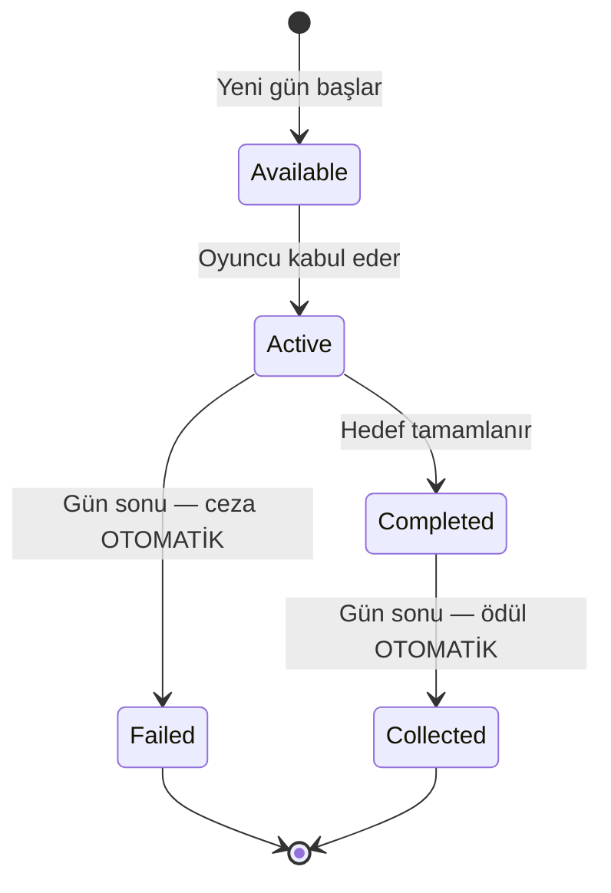

> [!IMPORTANT]
> **"Topla" adımı kaldırıldı** (2026-07-28). Ödül ve ceza gün sonunda
> `SettleAcceptedQuestsForDayEnd()` ile otomatik uygulanır; oyuncunun butona basması gerekmez.
> **Gün 16** ayrı bir yol: `NextDay()` win dalı `OnNewDay`'i hiç tetiklemediği için settlement de
> çalışmıyordu — son günün kabul edilmiş görevi cezasız/ödülsüz kalıyordu.
> `SettleAcceptedQuestsOnGameEnd()` bunu kapatıyor (idempotent, `IsServer` guard'lı).
>
> **Gün-16 settlement'ının "exploit" potansiyeli ölçüldü ve düzeltme önerilmiyor** (Round 10 §4-R9):
> son günün cezasız/serbest quest kabulünün kasaya katkısı **%0.1-8.2**. Denge riski yok.

### 16.4 Görev Tipleri

| enum | Görev Tipi | Durum | Katalogda |
|---|-----------|-------|-----------|
| 1 | **PlaceBoxOnShelf** | ✅ canlı | **13 asset** |
| 3 | **PackToy** | ✅ canlı | **12 asset** |
| 2 | **CompleteTruck** | ✅ canlı | **3 asset** |
| 4 | **AnswerPhone** | ✅ canlı — tetikleyici `PhoneCallManager.cs:481` (V4 dışarı arama) | **2 asset** (Easy hedef **1**, Medium hedef **2**) |
| 6 | **CompleteSpecificColorTruck** | ⚠️ tetikleyici CANLI (`Truck.cs:656`) ama asset yok | 0 |
| 0 | **CompleteMinigame** | 🔴 **ÖLÜ** — `QuestTracker.NotifyMinigameCompleted()` çağıranı yok | 0 |
| 5 | **MakePackagingMistake** | 🔴 **ÖLÜ** — `NotifyPackagingMistake()` çağıranı yok | 0 |

> Ölü tipler canlı bug değil (hiçbir asset kullanmıyor), ama yeni görev tipi eklemeden önce
> tetikleyicilerinin bağlanması gerekir.

> [!NOTE]
> **`AnswerPhone` görevlerinin "telefon spam'ini ödüllendirme" sorunu kapatıldı (Round 10 U8).**
> Eski hedeflerle (Easy 2, Medium 3) görev, §14.4'ün dersinin TERSİNİ ödüllendiriyordu: kasaya
> katkısı telefon kullanım oranı %0-20'de **−4…−166 TL**, %60-100'de **+148…+312 TL** idi — yani
> oyuncuyu ekonomik olarak zararlı olan spam'e itiyordu. Hedefler **Easy 2→1**, **Medium 3→2**
> yapıldı; u=%20'de katkı 11/16 hücrede sıfıra/pozitife döndü.
>
> **İkinci güvenlik ağı**: §16.1'in **adaptif** fizibilite skoru bu riski kendi kendine düzeltiyor —
> telefonu hiç kullanmayan oyuncuda dünkü telefon arzı 0 olduğu için telefon quest'i skorda son
> sıraya düşer ve teklif edilmez. (Statik skor alternatifinde bu güvenlik YOK.)

### 16.5 Hedef Ölçekleme (D2) — şu an etkisiz

`CalculateEffectiveTargetCount` (cs:727) görev hedefini oyuncu sayısıyla ölçeklemek için var,
**ama canlı fiillerin hepsi muaf** (`PlaceBoxOnShelf`, `PackToy`, `CompleteTruck`, `AnswerPhone`
ve Round 10 U10 ile eklenen `CompleteSpecificColorTruck`) → mevcut katalogda **tamamen no-op**.

Sebep: `targetCount` değerleri 2026-07-29 turunda **zaten tüm P bantlarında** ~%85 tamamlanma
hedeflenerek kalibre edilmişti. D2 onların üstüne bir kez daha çarpınca sim'de renksiz raf/paket
tamamlanma olasılığı **3P 0.76 → 0.13**, **4P 0.87 → 0.13**'e düşüyordu (çifte ölçekleme).

Mekanizma, arzı oyuncu sayısıyla ölçeklenMEYEN gelecekteki görev tipleri için duruyor.

> [!NOTE]
> **`CompleteSpecificColorTruck` (enum 6) muafiyet listesine eklendi** (Round 10 U10, 2026-08-30,
> `QuestManager.cs:735`). Tetikleyicisi canlı (`Truck.cs:656`) ama asset'i yok; o tipte bir asset
> eklenseydi 2026-08-06'nın çifte-ölçekleme bug'ı aynen geri gelecekti. Ucuz sigorta — muafiyet
> TİP-BAZLI olduğu için **yeni bir görev tipi eklerken bu liste tekrar gözden geçirilmeli.**

> Kart açıklamasında gösterilen sayı `QuestProgress.targetProgress`'ten gelir (tek doğruluk kaynağı),
> asset'teki ham `targetCount`'tan değil — aksi halde ölçekleme açılınca kart yanlış hedef gösterirdi.

### 16.6 Görev Ödül Tipleri (buff kanalı)

Mevcut 30 asset'in **hiçbirinde buff yok** — hepsi yalnız para + prestij veriyor. Buff'lı görev
eklenecekse aşağıdaki tuzaklara dikkat:

| Ödül | Etki | Not |
|------|------|-----|
| **Money** / **Prestige** | Para / prestij | ✅ kullanımda |
| **MaxStamina**, **MoveSpeed**, **WalkSpeed**, **StaminaRegenRate**, **DayDuration**, **MaxQueueSize**, **CustomerWaitTime** | İlgili değeri artırır | ⚠️ Hepsi **KALICI** — günlük tekrarlanan bir görevde verilirse **birikir** |
| **TempSpeedBoost**, **PenaltyReduction** | Geçici bonus | ✅ süreli |
| **TempMoneyBoost** | — | 🔴 **`buffType` VARSAYILANI bu** ama `TempMoneyPerBox`'ı okuyan sistem yok → **ölü buff**: kartta yazar, hiçbir şey yapmaz |

### 16.7 Görev Takip Sistemi (QuestTracker)

Statik event dispatcher — oyun sistemleri event ateşler, QuestManager ilerlemeyi takip eder:

```
Truck.OnDeliveryComplete → QuestTracker.NotifyTruckCompleted()
PhoneCallManager.OnCallSuccess → QuestTracker.NotifyPhoneAnswered()
PlayerInventory.OnBoxPlaced → QuestTracker.NotifyBoxPlaced()
```

> [!WARNING]
> **Raf görevi dedup'u**: `BoxInfo.countedForShelfQuest` bayrağı olmadan "rafa koy → geri al →
> tekrar koy" döngüsüyle tek kutuyla hedef 12 ~30 saniyede tamamlanabiliyordu (P0 exploit, kapatıldı).
> Bilinen kısıt: bayrak tek boolean, yani bir kutu bir kez sayıldıktan sonra **farklı** bir
> raf/renk görevine de sayılmıyor — aşırı kısıtlayıcı ama exploit değil, tasarım tercihi.

---

## 17. 🎮 Oyuncu Hareketi ve Fizik

> **Kaynaklar**: [PlayerMovement.cs](file:///c:/Users/cicek/Documents/GitHub/Cargor/Assets/NewCss/CharacterScript/PlayerMovement.cs), [PlayerSpawner.cs](file:///c:/Users/cicek/Documents/GitHub/Cargor/Assets/NewCss/PlayerSpawner.cs)

### 17.1 Hareket Parametreleri

| Parametre | Değer | Açıklama |
|-----------|-------|----------|
| Normal hız | **5 m/s** | Standart yürüme |
| Sprint hızı | **7 m/s** | Koşma |
| Bitkin hız | **3 m/s** | Stamina bittiğinde |
| Sprint süresi | **3 saniye** | Maksimum koşma |
| Sprint bekleme | **3 saniye** | Koşmadan sonra cooldown |
| Stamina yenilenme | **1.0/s** | Baz yenilenme hızı |

### 17.2 Oyuncu Durumları

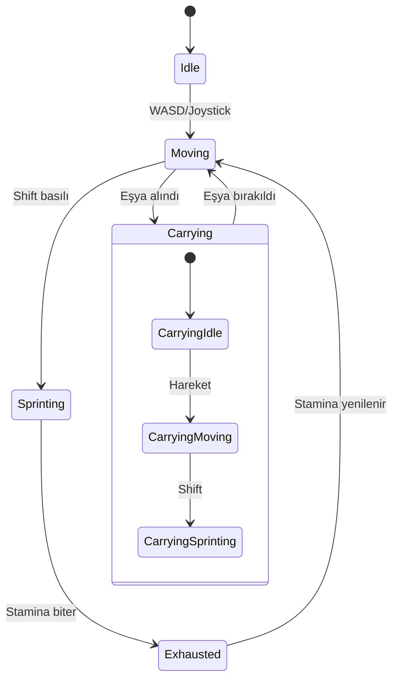

### 17.3 Ağ Senkronizasyonu

- **X/Z hareketi** ağ üzerinden senkronize
- **Koşma durumu** NetworkVariable
- **Taşıma durumu** NetworkVariable
- **Ses**: Yürüme ve koşma adım sesleri, volume kontrolü ile

### 17.4 Oyuncu Spawn Sistemi

- **Sahne**: Yalnızca "The Main Office" sahnesinde
- Önceden tanımlanmış spawn noktalarından rastgele seçilir
- Geç katılan oyuncular (late join) desteklenir
- Bağlantı koptuğunda oyuncu temizlenir

### 17.5 Karakter Özelleştirme

> **Kaynak**: [SkinToneManager.cs](file:///c:/Users/cicek/Documents/GitHub/Cargor/Assets/NewCss/SkinToneManager.cs)

- Ten rengi seçimi (`SkinToneManager`), oyuncular arası ağ senkronize
- Ana menüde özelleştirme UI'ı (`MainMenuCustomizationUI`) — oyuna girmeden seçilir
- Karakter tabanı: `Assets/ithappy/Creative_Characters_FREE/` modelleri + `M_Character_Toon` materyali
- Müşteriler 4 ayrı materyalle çeşitlenir (`M_NPC1`–`M_NPC4`)

> Kıyafet/aksesuar katmanı henüz yok — özelleştirme tek eksenlidir (ten rengi).

---

## 18. 🛏️ Dinlenme Odası Sistemi

> **Kaynak**: [BreakRoomManager.cs](file:///c:/Users/cicek/Documents/GitHub/Cargor/Assets/NewCss/BreakRoomScripts/BreakRoomManager.cs)

### 18.1 Amaç

Gün sonunda tüm oyuncuların dinlenme odasında toplanması gerekmektedir. Bu, oyuncuların birbirini beklemesini ve gün sonunu senkronize bitirmesini sağlar.

### 18.2 Mekanikler

| Özellik | Detay |
|---------|-------|
| Algılama | Trigger Collider ("Character" tag) |
| Hazır koşulu | **Tüm bağlı oyuncular** odanın içinde |
| Steam entegrasyonu | Lobby'den oyuncu sayısı alınır |
| Events | `OnBreakRoomReady`, `OnPlayerEntered`, `OnPlayerExited` |

### 18.3 Akış

1. Gün biter (saat 18:00)
2. Oyunculara "Dinlenme Odasına Git" mesajı gösterilir
3. Oyuncular odaya girer → `OnPlayerEntered` event'i
4. Tüm oyuncular girdiğinde → `isBreakRoomReady = true`
5. Gün sonu özet ekranı gösterilir
6. Yeni gün başlar

---

## 19. ⚖️ Zorluk Sistemi

> **Kaynak**: [DifficultyManager.cs](file:///c:/Users/cicek/Documents/GitHub/Cargor/Assets/NewCss/GameState/DifficultyManager.cs)

### 19.1 Oyuncu Sayısına Göre Ölçekleme

**CANLI (gerçekten okunan) P-ölçeklemeleri:**

| Parametre | Kaynak | 1P | 2P | 3P | 4P |
|-----------|--------|-----|-----|-----|-----|
| **Günlük müşteri kotası** (gün 16) | `GameEconomySettings.dailyCustomerCountP*` | 6 | 12 | 13 | 13 |
| **Müşteri varış aralığı** | `customerArrivalIntervalByPlayerCount` | 44s | 22s | 21s | 21s |
| Başlangıç parası | `DifficultyManager.moneyMultiplierPerPlayer=1.2` (üstel) | 500 | 600 | 720 | 864 |
| Stamina tüketimi | `staminaDrainMultiplierPerPlayer=1.1` | ×1.00 | ×1.10 | ×1.21 | ×1.33 |
| **Upgrade/perk/reroll maliyeti** | `upgradeCostMultiplierByPlayerCount` (**DİZİ**) | ×1.00 | ×2.00 | ×2.95 | ×3.70 |
| **Kira** | `baseRentByPlayerCount` | 290 | 650 | 1.140 | 1.630 |
| **Kutu ödülü** | `rewardPerBoxByPlayerCount` | 50 | 55 | 70 | 88 |
| **Tır kargosu** | `truckCargoMin/MaxExclusive` | 1–2 | 2–3 | 2–4 | 2–5 |
| **Hangar bekleme** | `hangarStayDurationByPlayerCount` | 120s | 60s | 40s | 30s |
| **Telefon zaman bedeli** | `timeSkipAmountByPlayerCount` | 115 dk | 49 dk | 47 dk | 47 dk |
| **Görev Kademesi fiyatı** | `UpgradePanel.GetCostMultiplier` **MUAF** | 80/100 | 80/100 | 80/100 | 80/100 |
| **Müşteri sabrı** (min–max) | `DifficultyManager.prefab` base 15/20, −2s/oyuncu, floor 5/10 | 15–20s | 13–18s | 11–16s | 9–14s |
| **Stamina yenilenme** | `DifficultyManager.ScaledStaminaRegenRate` (owner-side uygulanır) | ×1.00 | ÷1.10 | ÷1.21 | ÷1.33 |

> [!NOTE]
> **2026-09-18: sabır + stamina ölçeklemesi CANLIYA ALINDI** (dal `fix/difficulty-scaling-and-dead-code`).
> - Oyuncu sayısı artık tek seferlik snapshot değil: `DifficultyManager` server'da
>   `OnClientConnectedCallback/OnClientDisconnectCallback`'e abone, geç katılan/ayrılan oyuncuda
>   `ConnectedClientsList.Count` (host dahil) ile yeniden hesaplanır ve NetworkVariable ile yayılır.
> - `CustomerManager.SpawnCustomer` her müşteriye spawn anında (server, `Spawn()` öncesi)
>   `ScaledMinPatience/ScaledMaxPatience` yazar; `Customer.prefab`'ın 15/20'si artık yalnızca fallback.
> - `PlayerMovement.OnNetworkSpawn` (IsOwner) `ScaledStaminaRegenRate`'i kendi instance'ına yazar ve
>   `OnDifficultyChanged` ile günceller — `staminaRegenRate` düz alan olduğu için server-side atama
>   uzak client'a ulaşmaz, gerçek yol owner-side'dır.
> - Prefab'daki eski 8/14 tabanı 15/20'ye çekildi ki solo his değişmesin (economist kararı).
> - `ScaledCustomerCount` (`baseCustomerCount=10`, `customerCountPerPlayer=5`) HÂLÂ ÖLÜ: müşteri
>   sayısını `GameEconomySettings` kota tablosu belirliyor (§7.1).

> [!NOTE]
> **Telefon ve upgrade maliyeti artık `DifficultyManager`'da DEĞİL.**
> `basePhoneCallChance`, `phoneChancePerPlayer`, `ScaledPhoneCallChance` ve
> `upgradeCostMultiplierPerPlayer` (tek float) **silindi**. Telefon P-ölçeklemesi
> `GameEconomySettings.timeSkipAmountByPlayerCount`'ta, upgrade maliyeti dizide.

### 19.2 Ölçülen Gelir Ölçeği

Sim v3.1 ölçümü — **1 : 1.73 : 2.40 : 2.95**. Kira ölçeği (2026-08-30'dan beri
**1 : 2.24 : 3.93 : 5.62**, eskiden 1 : 2.00 : 2.90 : 3.60) bundan bilinçli olarak dik: kalabalık
takım koordinasyon avantajını kirayla geri ödüyor. Yeni eğri daha da dik, çünkü Round 10 U1'in
kira kesintisi asimetrikti (1P'de −%42, 4P'de −%9.4) — açık P azaldıkça büyüyordu.

### 19.3 Tasarım Felsefesi

> Daha fazla oyuncu = daha fazla iş gücü, ama aynı zamanda daha fazla müşteri, daha yüksek kira
> ve çok daha pahalı upgrade'ler. Co-op'un gücü koordinasyonda, ham güçte değil.

---

## 20. 🌅 Gece-Gündüz Aydınlatma

> **Kaynak**: [DayLightController.cs](file:///c:/Users/cicek/Documents/GitHub/Cargor/Assets/NewCss/DayLightController.cs)

### 20.1 Güneş Animasyonu

Directional Light, `DayCycleManager` ilerlemesine göre animasyon gösterir:

| Özellik | Gün Başı (07:00) | Öğlen (12:30) | Gün Sonu (18:00) |
|---------|-----------------|---------------|-------------------|
| X Rotasyonu | -180° | 0° | +180° |
| Renk | Sıcak beyaz | Beyaz | Turuncu |
| Yoğunluk | 0.5 | 1.0 (pik) | 0.05 |

### 20.2 Geçişler

- Pürüzsüz (smooth) geçişler
- Yapılandırılabilir hız parametreleri
- Her yeni günde sıfırlanır

---

## 21. 🏁 Oyun Durumu: Kazanma ve Kaybetme

> **Kaynak**: [GameStateManager.cs](file:///c:/Users/cicek/Documents/GitHub/Cargor/Assets/NewCss/GameState/GameStateManager.cs)

### 21.1 Kazanma Koşulu

$$\text{KAZANDIN} = (\text{Gün} \geq 16)$$

16. günü tamamlamak — yani prestij sıfırlanmadan ve iflas etmeden o güne ulaşmak.

> [!WARNING]
> **`CheckWinCondition` prestije BAKMIYOR.** Yalnız `currentDay >= MAX_DAYS` kontrol ediliyor
> (`GameStateManager.cs:699-715`). Prestij kapısı fiilen `PrestigeManager.ModifyPrestige`
> (cs:154-157) içinde. Kodun docstring'i eskiden "prestige > 0 and rent paid" diyerek kodla
> çelişiyordu; **2026-08-30'da yorum kodla senkronlandı** (davranış değişmedi).
>
> **Kazanma koşuluna prestij kapısı ekleme önerisi ÖLÇÜLDÜ ve REDDEDİLDİ** (Round 10 §4-R10):
> tam paket sonrası Slow/strict final prestijleri **22 / 40 / 56 / 55**. Bir "prestij ≥ 30"
> kapısı, kira düzeltmesiyle yeni kurtarılan Slow/strict P1'i (22) tekrar kaybettirirdi.
> Prestij fail-state'i ölü kalsın ya da eşik ≤15 olsun.
>
> İlgili sessiz kaçak: `PrestigeManager.SetPrestige` (cs:231) o kapıdan geçmiyor (clamp var,
> `TriggerLose` yok). Bugün dış çağıranı yok; ileride bağlanırsa prestij sessizce 0'a inebilir.

### 21.2 Kaybetme Koşulları (2 Yol)

| # | Koşul | Tetikleyen | Detay |
|---|-------|-----------|-------|
| 1 | **İflas** | Kira ödeyememe (2. kez) | Grace period kullanılmış + yine ödeyemiyor |
| 2 | **Prestij sıfırlanması** | Prestij ≤ 0 (**clamp öncesi ham değer**) | Çok fazla müşteri kaçırma/hata/görev cezası |

> ~~3. Kota başarısızlığı~~ — **kaldırıldı**, `QuotaManager` tamamen silindi. 2026-08-29'da gelen
> yeni müşteri kotası bir kaybetme koşulu DEĞİLDİR, yalnız hafif prestij cezası verir (bkz. §7).

> [!IMPORTANT]
> **Pratikte kaybetmenin tek yolu 1. madde.** Ekonomist Round 6 ölçümü: 16/16 senaryoda prestij
> hiç 0'a inmiyor, kaybeden hücreler NAKİT'ten iflas ediyor ve o anda bile prestijleri 18.9-43.4
> (bkz. §6.4). Prestij kaybı bugün ayırt edici bir fail-state değil.

> [!IMPORTANT]
> **Kazanılmış oyun kaybedilemez.** `TriggerWin` ve `TriggerLose` artık `gameEnded` guard'lı
> (`f013f5d`). Bu guard olmadan gün 16 zaferinden SONRA çalışan quest settlement'ı, tamamlanmayan
> bir görevin prestij cezasıyla prestiji sıfırlayıp zafer ekranının üstüne kayıp ekranı basıyordu.

### 21.3 Game Over Akışı

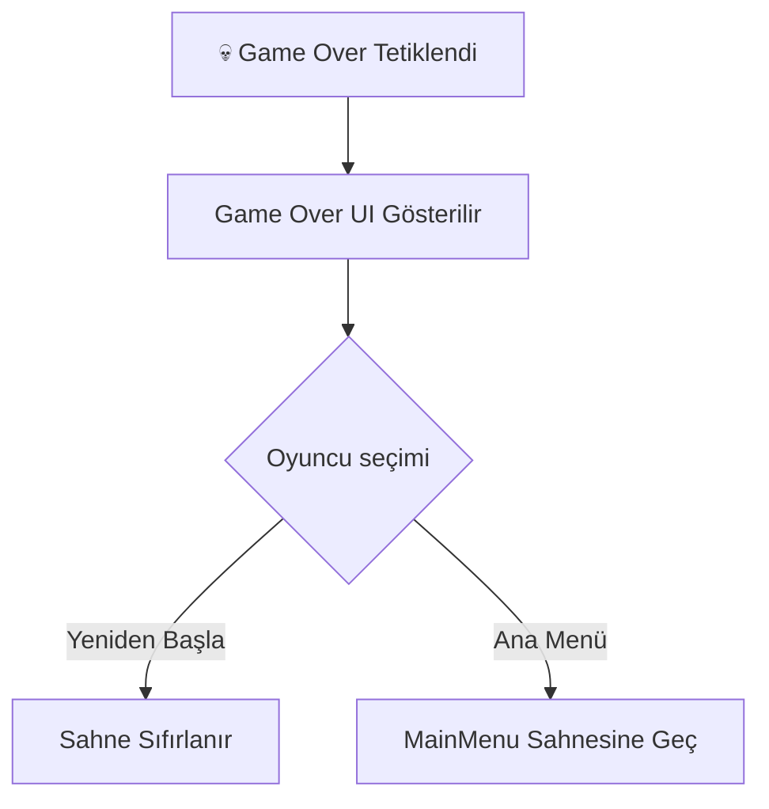

### 21.4 Önemli: DontDestroyOnLoad

`GameStateManager` singleton'dır ve `DontDestroyOnLoad` ile sahne geçişlerinde korunur.

---

## 22. 🎓 Tutorial Sistemi

> **Kaynak**: [TutorialManager.cs](file:///c:/Users/cicek/Documents/GitHub/Cargor/Assets/NewCss/Tutorial/TutorialManager.cs)

### 22.1 Özellikler

| Özellik | Detay |
|---------|-------|
| Yapı | Adım bazlı akış — **12 adım (0–11)** (`TutorialManager.cs:59`); PackItem'dan sonra **TakeTape** (5, `TutorialTapeStation`'dan bant al) + **SealBox** (6, `TutorialConditionType.SealBox`, `Table.PerformSealing` → `OnBoxSealed`) |
| Sahne | Ayrı, bağımsız `Assets/Scenes/Tutorial.unity` |
| Metin efekti | Daktilo (typewriter) — noktada ×8, virgülde ×4, boşlukta ×0.5 gecikme |
| Atlama | **Space** — hem daktilo efektini hem bekleme adımını atlar |
| Tekrar | `RestartTutorial()` ile baştan oynanabilir |
| Vurgulama | Hedef objeye outline (kalınlık 5) |
| Kapı yönetimi | `TutorialDoor` — ilerlemeye göre açılır/kapanır |
| Lokalizasyon | **17 dil** — `instructionLocalizationKey` ile StringTable; dil değişiminde canlı yenilenir |
| Ağ | `NetworkBehaviour` ile senkronize; raf durumu server-only (`TutorialShelfState`) |
| Karartma | Tutorial sahnesinde `RoomVolume` yok → oda karartma kapalı (§34.3) |

**Zamanlama sabitleri**: başlangıç gecikmesi **1.0 s** · adım koşulu kontrol aralığı **0.1 s** ·
daktilo taban hızı **0.05 s/karakter** · yazı boyutu otomatik **18–36**.

### 22.2 Tutorial Akışı (10 adım)

| # | Adım | Tamamlanma koşulu |
|---|------|-------------------|
| 0 | Hoş geldin ekranı | `PressKey` — Space |
| 1 | Müşteriyle etkileş, teslim masasından ürünü al | `TakeFromTable` |
| 2 | Ürünü paketleme masasına götür ve bırak | `PlaceOnTable` |
| 3 | Raftan **kırmızı** kutu al | `TakeFromShelf` (`requiredBoxType = Red`) |
| 4 | Kutuyu paketleme masasına koy → otomatik paketlenir | `PlaceOnTable` |
| 5 | Paketlenmiş kutuyu al | `TakeFromTable` |
| 6 | Kutuyu rafa yerleştir | `PlaceOnShelf` |
| 7 | Bekle — tır geliyor | `WaitForTime` (2–3 s, atlanabilir) |
| 8 | Paketi raftan tekrar al | `TakeFromShelf` (`requiredBoxType = Red`) |
| 9 | Tıra teslim et | `DeliverToTruck` (`requiredDeliveryCount = 1`) → **CompleteTutorial()** |

Akış, oyunun tam üretim hattını küçük ölçekte tekrar ettirir: **müşteri → paketleme → raf → tır**.

> [!WARNING]
> **Enum tuzağı**: adım 3 ve 8'deki `requiredBoxType` `NetworkedShelf.BoxType` (Red = 0),
> adım 9'daki `requiredTruckBoxType` ise `BoxInfo.BoxType` (Red = 2) enum'unu kullanır.
> Sıralar farklıdır — Inspector'da **isimden** seçilmelidir, indeksten değil.

> Tutorial sahnesinde `CustomerManager` yoktur; `TutorialManager` servis istasyonunu doğrudan
> atar (`AssignServiceStation`, cs:362). Adımlar ve highlight'lar
> `Tools/Cargor/Tutorial/Setup Tutorial Steps` editör aracıyla sahneye yazılır.

---

## 23. 🌐 Multiplayer ve Ağ Mimarisi

### 23.1 Ağ Altyapısı

| Bileşen | Teknoloji |
|---------|-----------|
| Framework | Unity Netcode for GameObjects |
| Transport | Facepunch Transport (Steam P2P) |
| Topoloji | Host-Client (dedicated server yok) |
| Maksimum oyuncu | **4** |
| Otorite | **Server-authoritative** |

### 23.2 Senkronizasyon Stratejisi

| Veri | Yöntem | Yön |
|------|--------|-----|
| Oyuncu pozisyonu | NetworkVariable | Server → Client |
| Para | NetworkVariable | Server → Client (read-only) |
| Prestij | NetworkVariable | Server → Client |
| Gün sayısı | NetworkVariable | Server → Client |
| Eşya durumu | NetworkVariable | Server → Client |
| Oyuncu eylemleri | ServerRpc | Client → Server |
| Geri bildirimler | ClientRpc | Server → Client |

### 23.3 Güvenlik

- Tüm ekonomik işlemler **sunucu tarafında** hesaplanır
- Client sadece **input gönderir** (ServerRpc)
- Eşya kilitleme: Statik dictionary ile çift alma engeli

---

## 24. 🎮 Steam Entegrasyonu

> **Kaynak**: [SteamManager.cs](file:///c:/Users/cicek/Documents/GitHub/Cargor/Assets/NewCss/Steam/SteamManager.cs)

### 24.1 Özellikler

| Özellik | Detay |
|---------|-------|
| SDK | Steamworks.NET |
| Transport | Facepunch Transport (Steam Relay) |
| Lobi yönetimi | Oluşturma / Katılma |
| Lobi kodu | **Base36** encoded benzersiz kodlar |
| Oyuncu slotları | 4 max (dolu/boş sprite'lar) |
| Kick sistemi | Host oyuncuları atabilir |
| Versiyon kontrolü | Lobby data'da oyun versiyonu |
| Yükleme ekranı | İlerleme barı + animasyonlu noktalar |

### 24.2 Lobi Akışı

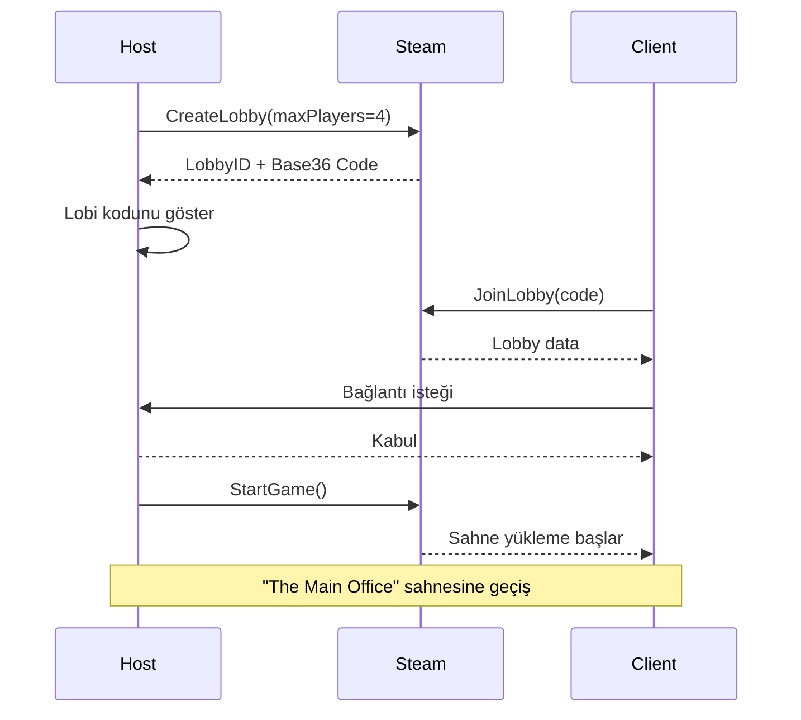

---

## 25. 🎮 Discord Entegrasyonu

> **Kaynak**: [DiscordController.cs](file:///c:/Users/cicek/Documents/GitHub/Cargor/Assets/Scripts/DiscordController.cs)

- Discord Rich Presence desteği
- Oyun durumu görüntüleme (hangi gün, kaç oyuncu vb.)
- Davet sistemi entegrasyonu

---

## 26. 🖥️ UI / UX Tasarımı

### 26.1 Sahneler ve UI Yapıları

| Klasör | İçerik |
|--------|--------|
| `Assets/MainMenu/` | Ana menü sahnesi |
| `Assets/Main Menu UI/` | Ana menü UI bileşenleri |
| `Assets/MENUUI/` | Menü UI elementleri |
| `Assets/Host Game/` | Oyun oluşturma UI'ı |
| `Assets/Join Room/` | Odaya katılma UI'ı |
| `Assets/WinLoseUI/` | Kazanma/Kaybetme ekranları |
| `Assets/SettingsUı/` | Ayarlar paneli |
| `Assets/LocalSettings/` | Yerel ayarlar |
| `Assets/Figma/` | Figma tasarım referansları |

### 26.2 Ekran ve Panel Envanteri

| Ekran / Panel | Yöneten script | Ne zaman açılır |
|---------------|----------------|-----------------|
| Intro | `IntroScene` | Oyun açılışı (build sırası 1) |
| Ana menü + karakter özelleştirme | `MainMenuCustomizationUI` | Intro sonrası |
| Lobi (oluştur / katıl) | `SteamManager` + lobi UI | Host/Join seçilince (§24.2) |
| Oyun içi HUD | `DayCycleManager`, `MoneySystem`, `PrestigeManager` | Oyun sahnesi boyunca |
| Telsiz HUD | `RadioHudController` | Runtime bootstrap (DontDestroyOnLoad canvas) |
| Upgrade paneli | `UpgradePanel` ← `OfficeTerminal` | Ofis terminaline yaklaşınca, **saat 10:00'dan sonra** |
| Görev kartları | `QuestUIController` | Günlük 3 teklif (§16.1) |
| Telefon çevirme barı | `PhoneCallManager` | Telefon alanında E basılı tutulurken |
| Not defteri | `PagedUIPanel` ← `UITriggerZone` | Tetikleme bölgesine girince (§36) |
| Gün sonu ekranı | `NextDayUIManager` | Dinlenme odasında herkes toplanınca (§18) |
| Kazanma / kaybetme | `GameStateManager` + `WinLoseUI` | Gün 16 / iflas / prestij ≤ 0 (§21) |
| Escape menüsü + ayarlar | `EscapeMenuManager`, `UnifiedSettingsManager` | Esc (§39) |

### 26.3 Oyun İçi HUD Elemanları

| Eleman | Konum | Güncelleme |
|--------|-------|-----------|
| Gün + saat ("Gün 5, 14:30") | Üst | 10 FPS throttle (`dayTimeText`) |
| Para | Üst-sağ | `OnMoneyChanged` event |
| Prestij | Üst-sağ | Anlık |
| Kota / kalan müşteri | Üst | Gün başında hesaplanır, servis başına düşer |
| Aktif görev takibi | Yan | `QuestTracker` bildirimleri (§16.7) |
| Müşteri sabır barı | Müşteri üzeri | Sürekli |
| Stamina barı | Oyuncu üzeri | Koşarken (`NetworkStaminaBarUI`) |
| Telefon bekleme barı | Telefon alanı | E basılıyken (1 sn hold) |
| Telsiz konuşmacı satırları | Ekran kenarı | Biri konuştuğu sürece (§35.3) |
| Dünya etiketleri (TMP) | Objeler üzeri | **C** basılı tutulunca fade-in |

### 26.4 Animasyonlar

| Animasyon | Dosya | Kullanım |
|-----------|-------|----------|
| Yürüme | `Walk_Forward.anim` | Karakter hareketi |
| Mağaza açılış | `ShopOpening.anim` | Mağaza açılış animasyonu |
| Mağaza kapanış | `ShopExit.anim` | Mağaza kapanış animasyonu |
| Takvim açılış | `DateOpening.anim` | Etkinlik takvimi açılış |
| Takvim kapanış | `DateExit.anim` | Etkinlik takvimi kapanış |
| Upgrade panel | `UpgradePanel.controller` | Panel açılış/kapanış |

### 26.5 Escape Menüsü

> **Kaynak**: [EscapeMenuManager.cs](file:///c:/Users/cicek/Documents/GitHub/Cargor/Assets/NewCss/EscapeMenuManager.cs)

- ESC tuşuyla açılır
- Ayarlar, devam et, çıkış seçenekleri
- Input binding yönetimi entegrasyonu (`InputBindingManager.cs`)

---

## 27. 🔊 Ses Tasarımı

### 27.1 Ses Kaynakları

| Ses | Dosya | Kullanım |
|-----|-------|----------|
| Tır motor sesi | `motor_sound_when_ope_#1.wav` | Tır gelişi |
| Tır çıkış sesi | `the_sound_of_a_car_m.wav` | Tır kalkışı |
| Tır bekleme sesi | `Clean_recording_of_a_#1.wav` | Tır hangarda beklerken (loop) |
| Kutu düşme sesi | BoxFallPenalty ses | 3D spatial audio |

### 27.2 Ses Kategorileri

| Kategori | Klasör / kaynak | Örnekler |
|----------|-----------------|---------|
| Müzik | `Assets/Music/` | **Midtempo caz seti** — trompet solo ağırlıklı 7 döngü; mağaza/ofis atmosferi |
| Ses efektleri | `Assets/Sounds/` | `alma.wav`, `bırakma.wav`, `drop.wav`, `Pick.wav` |
| Telefon | `Assets/Sounds/` | `telefon.wav`, `old-telephone-ringing`, `sound-effect-old-phone` |
| Tır sesleri | `TruckScripts` | Motor (geliş), bekleme döngüsü, çıkış |
| Etkileşim sesleri | `PlayerInventory.Audio` | Alma, bırakma, fırlatma, adım sesleri |
| UI sesleri | Menü scriptleri | Buton tıklaması (ana menü + oyun içi), bildirim |

> **Ses karışımı**: Master / Müzik / SFX / Telsiz dört ayrı seviye olarak ayarlardan kontrol
> edilir (§39.1). Telsiz zinciri ayrı bir audio graph üzerinden çalar (§35.1).

### 27.3 3D Spatial Audio

- Kutu düşme sesleri 3D spatial audio ile oynatılır (≥1 m/s çarpmada)
- Tır motor sesleri mesafeye göre zayıflar
- Müşteri ses efektleri pozisyona bağlı

> [!CAUTION]
> **Ses bu projede iki kez "sessizce" öldü.** (1) 2026-08-13: `AudioSource` inspector'da bağlı
> değildi — kod doğruydu, hata yoktu, ses yoktu. (2) 2026-08-31: Unity'nin otomatik yeniden
> serileştirme commit'i sahneden `successCallSound` referansını sildi.
> **Kural**: otomatik sahne diff'lerinde düşen her `fileID`'yi grep'le; ses eklerken "kod yazıldı"
> ile "sahnede bağlı" ayrı iki doğrulamadır.

---

## 28. 🌍 Lokalizasyon

> **Kaynak**: [LocalizationHelper.cs](file:///c:/Users/cicek/Documents/GitHub/Cargor/Assets/NewCss/Localization/LocalizationHelper.cs)

### 28.1 Desteklenen Diller — **17**

| Dil | Kod | Dil | Kod | Dil | Kod |
|-----|-----|-----|-----|-----|-----|
| 🇹🇷 Türkçe (birincil) | `tr` | 🇩🇪 Almanca | `de` | 🇱🇻 Letonca | `lv` |
| 🇬🇧 İngilizce (ikincil) | `en` | 🇮🇹 İtalyanca | `it` | 🇱🇹 Litvanca | `lt` |
| 🇫🇷 Fransızca | `fr` | 🇳🇱 Felemenkçe | `nl` | 🇪🇪 Estonca | `et` |
| 🇪🇸 İspanyolca | `es` | 🇵🇱 Lehçe | `pl` | 🇭🇺 Macarca | `hu` |
| 🇵🇹 Portekizce | `pt` | 🇨🇿 Çekçe | `cs` | 🇭🇷 Hırvatça | `hr` |
| | | 🇸🇰 Slovakça | `sk` | 🇸🇮 Slovence | `sl` |

Dil tabloları Addressables üzerinden dil başına ayrı grup olarak paketlenir
(`Assets/AddressableAssetsData/AssetGroups/Localization-String-Tables-*`).

### 28.2 Sistem

- Unity Localization 1.5.12 paketi kullanılır
- `LocalizationHelper.GetLocalizedString(key)` ile merkezi erişim
- Upgrade isimleri lokalize edilir (`Upgrade_{ItemType}` formatında)
- Tutorial metinleri 17 dilde (`TutorialLocalizationSetup` editör aracıyla kuruldu)
- Ana menü 17 dilde
- Dil değişimi **runtime'da canlı** uygulanır (tutorial talimatları dahil yenilenir)

### 28.3 Kapsam Sınırları

> [!WARNING]
> **Font kapsamı desteklenen dilleri aşmıyor.** Space Grotesk SDF atlas'ı **U+0000–U+017F**
> (Latin + Latin-A) ile sınırlı üretildi. Bu, mevcut 17 dilin tamamını karşılar; ancak
> **Kiril (rus/ukrayna), Yunanca, CJK ve Arapça eklenirse atlas yeniden üretilmelidir** —
> aksi halde metin tofu (□□□) olarak görünür.
>
> **Not defteri metinleri (§36) henüz StringTable'a bağlanmadı** — şu an sabit metindir.

---

## 29. 🏗️ Teknik Mimari

### 29.1 Proje Yapısı

```
Assets/
├── NewCss/                     # Ana oyun kodu namespace'i
│   ├── BoxScripts/             # Kutu mekanikleri
│   ├── BreakRoomScripts/       # Dinlenme odası
│   ├── CharacterScript/        # Oyuncu hareketi
│   ├── CustomerSripts/         # Müşteri AI, Prestij, Kuyruk
│   ├── Echonomy/               # Ekonomi scriptleri
│   ├── Events/                 # Etkinlik sistemi
│   ├── GameState/              # Oyun durumu, gün döngüsü, zorluk
│   ├── InfoScripts/            # Bilgi scriptleri
│   ├── Localization/           # Dil desteği
│   ├── Network/                # Ağ kodları
│   ├── NewPickup/              # Pickup sistemi (v2)
│   ├── Notes/                  # Not sistemi
│   ├── Phone/                  # Telefon sistemi
│   ├── PickUpScripts/          # Pickup sistemi (v1)
│   ├── Quest/                  # Görev sistemi (UI tarafı)
│   ├── Roguelite/              # Draft havuzu, reroll eğrisi
│   ├── Rooms/                  # Oda hacimleri, karartma, görünürlük (§34)
│   ├── Steam/                  # Steam entegrasyonu
│   ├── TableScripts/           # Raf ve masa
│   ├── TruckScripts/           # Tır sistemi + karışık renk mantığı
│   ├── Tutorial/               # Eğitim sistemi
│   ├── UIScripts/              # UI bileşenleri (DayCycleManager, MoneySystem, OfficeTerminal)
│   ├── UpgradeScripts/         # Yükseltme sistemi
│   ├── UpgradeUiFolder/        # Upgrade panel görselleri
│   ├── Voice/                  # Telsiz / sesli iletişim (§35)
│   ├── GameEconomySettings.cs  # Ekonomi ScriptableObject
│   ├── PostRentFeatureUnlocks.cs # Gün 5/9/13 kilit açma sabitleri (§37)
│   ├── PlayerSpawner.cs        # Oyuncu spawn
│   ├── DayLightController.cs   # Aydınlatma
│   ├── InputBindingManager.cs  # Tuş atamaları (§32)
│   ├── EscapeMenuManager.cs    # Pause menü
│   └── SkinToneManager.cs      # Karakter özelleştirme
├── Scripts/
│   ├── Discord/                # Discord entegrasyonu
│   └── Quest/                  # Ek görev scriptleri
├── Models/                     # 3D modeller ve materyaller
├── Scenes/                     # Unity sahneleri
├── Shaders/                    # Custom shader'lar
├── Font/                       # Yazı tipleri
├── Music/                      # Müzik dosyaları
├── Sounds/                     # Ses efektleri
└── UI/                         # UI asset'leri
```

### 29.2 Tasarım Kalıpları

| Kalıp | Kullanım | Örnekler |
|-------|----------|---------|
| **Singleton** | Tüm manager'lar | DayCycleManager, MoneySystem, PrestigeManager |
| **NetworkBehaviour** | Multiplayer senkronize objeler | Truck, CustomerAI, PlayerMovement |
| **ScriptableObject** | Yapılandırma verileri | GameEconomySettings, WaveSettings, ItemData |
| **Observer (Event)** | Sistem arası iletişim | OnNewDay, OnMoneyChanged, QuestTracker.Notify* |
| **Partial Class** | Büyük sınıf bölme | PlayerInventory (6 parça) |
| **Server-Auth** | Güvenli oyun durumu | Tüm ekonomik işlemler |

### 29.3 Sahne Yapısı

**Build sırası** (`EditorBuildSettings`):

| # | Sahne | Dosya | Amaç |
|---|-------|-------|------|
| 0 | Intro | `MainMenu/IntroScene.unity` | Açılış / stüdyo logosu |
| 1 | Main Menu | `MainMenu/MainMenu.unity` | Ana menü, lobi, ayarlar, karakter özelleştirme |
| 2 | The Main Office | `Scenes/The Main Office.unity` (6.4 MB) | **Ana oyun sahnesi** — 5 odalı mağaza (§33) |
| 3 | Tutorial | `Scenes/Tutorial.unity` (1.2 MB) | Eğitim sahnesi (§22) |

`MainMenu/Figma.unity` ve `MainMenu/OnlineRoom.unity` build dışıdır (tasarım/çalışma sahneleri).

### 29.4 Render Pipeline

- **URP** (Universal Render Pipeline) kullanılıyor
- Custom shader'lar (`Assets/Shaders/`)
- QuickOutline paketi (eşya vurgulama)
- Figma Bridge entegrasyonu (`UnityFigmaBridgeSettings.asset`)

---

## 30. 🔗 Sistem Bağlantı Haritası

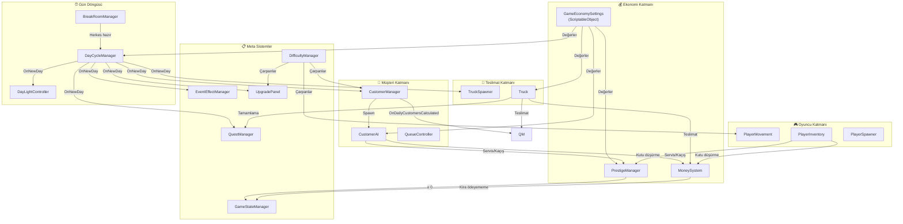

---

## 31. 📊 Ekonomi Simülasyon Verileri

> **Kaynak**: `tools/economy-sim/sim.js` (Node — `node tools/economy-sim/sim.js`).
> Analiz raporları: `plans/economy-full-balance-2026-08-30.md` (güncel tur) ve
> `plans/economy-rebuild-2026-07-30{,-faz2,-faz3,-faz4-final}.md` (tarihsel).

> [!CAUTION]
> **Yalnız `runFullSim(playerCount, opts)` (v5.1) kullanın.** Dosyadaki eski `runSim` /
> `runSimPlateUp` fonksiyonları **artık canlı kodu yansıtmıyor** (kapasite-bazlı kota, silinmiş
> V3 telefonu, sabit gün uzunluğu, "1 müşteri = 1 ürün" — dördü de kırık; sapma −%76…+%540,
> Slow/strict'te iflas GÜNÜ bile ayrışıyor). Silinmediler ama kullanılmamalılar.
>
> **C# içi `RunSimulation()` ContextMenu simülasyonu SİLİNDİ** — sim Unity'den bağımsız.

> [!NOTE]
> **v4.0 → v5.0 → v5.1 (2026-08-30) — 6 model hatası kapandı:** (1) telefonun `SkipTime`
> maliyeti artık TABAN 200s dönüşümüyle (günden bağımsız sabit gerçek-saniye) hesaplanıyor,
> (2) erken-gün-bitişindeki çift sayım, (3) `ForceSpawnNextCustomer`'ın varış kapasitesine
> kredilenmemesi, (4) **atlanan saniyelerin servis penceresini de kısaltması** (v4'te yalnız tır
> penceresini kısaltıyordu — bu yüzden optimistic bantta telefon "bedava para" görünüyordu),
> (5) quest karar modeli "en iyi 3'ün ORTALAMASI" yerine **N teklifin MAKSİMUMU** (sıralama
> istatistiği), (6) v5.1'de UI slot kırpması (`questUiSlots = 3`) ve K-aday teklif üretimi.
> `QUEST_ASSETS` tablosu ve `SRC4` sabitleri canlı koda resenkronlandı.
>
> ⚠️ **Round 8 ve Round 10'un quest rakamları bu resenkrondan ÖNCE üretildi, bayattır.**
>
> Hâlâ modellenmeyenler: oyuncu tepki gecikmesi, `HandleFailedInteraction` kaskadı, dolu
> DisplayTable'ın ek kayıp kanalı → `lost` / `missedQuota` sayıları **ALT SINIR**. `wrongProductRate`
> kanalı v5'te VAR ama varsayılan **0** (kapalı) — açılırsa taban koşum değişir, karşılaştırmalarda
> aynı değer kullanılmalı.

### 31.1 Simülasyon Bantları

Sim iki uçtan koşturulur; gerçek oyun bu ikisinin arasında bir yerde:

| Bant | Anlamı |
|------|--------|
| **OPTIMISTIC** | Oyuncular hiç hata yapmaz, boşta durmaz — üretim tavanı |
| **STRICT** | Gerçekçi hata/gecikme payı — hayatta kalma tabanı |

**En duyarlı girdiler** (duyarlılık sırasıyla):

| # | Girdi | Etkisi |
|---|-------|--------|
| 1 | `kutu/dk/oyuncu` | 1.2 ↔ 2.0 arası 1P kümülatif geliri **%117** değiştiriyor |
| 2 | `tableBusySeconds` (masa meşguliyeti) | 4s ↔ 8s, Paketleme İstasyonu'nun değerini **4×** değiştiriyor |
| 3 | `agile_crew`'in üretime yansıması | ölçülmedi |
| 4 | telefon çağrısının gerçek-saniye maliyeti | ✅ **ölçüldü** (Round 7, Round 10 U2 sonrası): doğal varış aralığının %67-79'u, bkz. §14.4 |

> [!CAUTION]
> **1. girdi hâlâ ÖLÇÜLMEDİ — tahmin.** Bir oyun günü yalnızca 200–330 gerçek saniye, bu yüzden
> mutlak TL değil **oranlarla** konuşulmalı. Play-test'te bu sayı ölçülünce tüm tablo tek katsayıyla
> kaydırılabilir.

### 31.2 Simülasyon Mantığı

Her simülasyon günü şu adımları takip eder:

1. **Gün süresi**: `200s + max(0, gün−3) × 10s` (sahne değeri; `.cs` default'u da 200'e hizalı)
2. **Beklenen müşteri**: `GetDailyCustomerCount(gün, P)` kota tablosu (§7.1) × event çarpanı —
   **eski `10 / 12 / 14 / 16` sabitleri artık geçersiz**
3. **Üretim kapasitesi**: `kutu/dk/oyuncu × süre × oyuncu` — **modelin en duyarlı girdisi**
4. **Masa çekişmesi**: sahnede `Table` taşıyan tam 2 obje var, ikisi de Paketleme İstasyonu
   `levelObjects`'i → **sv0'da TEK masa**. `tableBusySeconds` 2. en duyarlı girdi
5. **Tır penceresi**: P-bazlı kargo aralığı + hangar bekleme süresi (darboğaz DEĞİL, %10-42 kullanım)
6. **Gelir**: doğru teslimat × (rewardPerBox + prestij tier bonusu) + telefon + görev ödülü
7. **Ceza**: yanlış teslimat, kutu düşürme, kaçan müşteri, tamamlanmayan görev
8. **Kira kontrolü**: gün % 4 == 0 → hesapla ve öde / grace / iflas
9. **Upgrade**: Kira günü değilse ve kasa > 200 → fazlasının %50'si upgrade'e

### 31.3 Bant Sağlığı (2026-08-30, CANLI değerlerle)

> ~~Eski "10 Günlük Kapasite Karşılaştırması" tablosu kaldırıldı~~ — dayandığı kapasite-bazlı
> müşteri formülü koddan silindi (bkz. §9.6).

`runFullSim` **v5.1**, 16 senaryo (1-4P × Normal/Slow × strict/optimistic), CANLI ayarlarla
(kira `{290,650,1140,1630}` / g=1.20, telefon `{115,49,47,47}`, quest prestij ×0.4, telefon
kullanımı %20). **16/16 hücre hayatta**:

| Bant | 1P | 2P | 3P | 4P | Önceki kirayla |
|------|----|----|----|----|----------------|
| **Normal / strict** | 2.106 | 4.441 | 5.710 | 6.783 | 979 / 2.562 / 4.046 / 5.871 |
| **Normal / optimistic** | 4.580 | 9.812 | 9.975 | 10.296 | 3.453 / 7.933 / 8.311 / 9.384 |
| **Slow / strict** | **484** | **612** | **433** | **304** | ❌ **4/4 İFLAS** (1P g16, 2P-4P g12) |
| **Slow / optimistic** | 2.291 | 4.523 | 3.795 | 3.211 | 1.164 / 2.644 / 2.131 / 2.299 |

(TL final kasa. Grace VARKEN ve YOKKEN sonuçlar aynı — yani hayatta kalma tek-seferlik grace'e
bağlı değil. Final prestij: N/s 43-81, N/o 52-82, S/s 22-56, S/o 50-59.)

**Çözülen sorun — Slow/strict'in anatomisi (tarihsel):** ölüm gün 12'de görünüyordu ama gün 4'te
başlıyordu — ilk kira kasayı 87-201 TL'ye süpürür, gün 8'de grace yanar, gün 12'de ×1.44 kirası
karşılıksız kalırdı (açık −265 / −303 / −519 / −595 TL). Kira / 4-günlük-gelir oranı **1.52-1.71**
(Normal/strict'te 0.88-1.27) → **eğri değil SEVİYE sorunu, açık ≈ %25-30**;
`rentGrowthMultiplier`'ı 1.10'a indirmek bile kurtarmıyordu. Çözüm taban kirayı asimetrik
düşürmek oldu (§5.2).

**Kota → para dönüşümü** (Round 2 §4): strict bantta 16/16 gün mekanik-bağlı, kota hiç bağlayıcı
değil; kutu/kota oranı Normal/strict 0.31-0.47, Slow/strict 0.20-0.31, Normal/optimistic 1.21-1.23.

> [!NOTE]
> **KAPANDI (2026-09-18)**: Slow/strict P1/P2'nin eski %100 telefon-spam optimumu
> `callMoneyReward: 20 → 0` ile kırıldı (bkz. §14.4 notu). Kök nedeni telefon sabitleri
> değildi — o bantta tır veriminin mekanik-bağlı olması, günü kısaltmanın kutu kaybettirmemesiydi
> — ama koşulsuz para ödülünü kaldırmak spam'i finansal olarak anlamsızlaştırdı (P1 optimum
> %0, P2 %20). Bu bantların düşük kasa değeri (176-240 TL gün 16) hâlâ AYRI bir açık.

**Modelin bilinen açıkları** (sonuçların YÖNÜ güvenilir, BÜYÜKLÜĞÜ değil): oyuncu tepki gecikmesi
ve `HandleFailedInteraction` kaskadı modellenmiyor (`lost`/`missedQuota` sayıları ALT SINIR) ·
event'ler `runFullSim`'de modellenmiyor (Round 5 ayrı harness'la ölçtü) · `questCompletionProb`
doygunluk platosu ölçüme dayanmıyor · `wrongProductRate` kanalı varsayılan olarak KAPALI.

---

## 32. 🕹️ Kontroller ve Giriş Sistemi

> **Kaynaklar**: [InputBindingManager.cs](file:///c:/Users/cicek/Documents/GitHub/Cargor/Assets/NewCss/InputBindingManager.cs),
> [CameraFollow.cs](file:///c:/Users/cicek/Documents/GitHub/Cargor/Assets/NewCss/CharacterScript/CameraFollow.cs),
> `Assets/MENUUI/UnifiedSettingsManager.cs`

### 32.1 Giriş Mimarisi

| Özellik | Değer |
|---------|-------|
| Giriş sistemi | **Legacy Input Manager** (`KeyCode` + `Input.GetMouseButton`) |
| Merkezî yönetim | `InputBindingManager` — **static** sınıf, sahneden bağımsız |
| Kalıcılık | `PlayerPrefs`, anahtar deseni `KeyBind_{action}_{IsMouse/Key/Mouse}` |
| Yeniden atama | **13 eylemin tamamı** ayarlardan değiştirilebilir |
| Eylem ekleme | `GameAction` enum'a eklemek yeterli — kayıt/okuma döngüsü generic |

> [!WARNING]
> **`Assets/InputSystem_Actions.inputactions` OYUNUN kontrol şeması DEĞİLDİR.** O asset'e yalnız
> üçüncü parti demo kodu (`Assets/ithappy/Creative_Characters_FREE/...`) referans veriyor; oyun
> kodunda tek bir `PlayerInput` / `InputActionAsset` tüketicisi yok (grep ile doğrulandı).
> Dolayısıyla **oyun içinde gamepad desteği YOKTUR** — o dosyadaki gamepad binding'leri Unity'nin
> hazır şablonundan gelir ve hiçbir şey yapmaz. Gamepad açık bir üretim maddesidir (bkz. §41).

### 32.2 Tam Kontrol Şeması

| Eylem | Varsayılan | `GameAction` | Ne yapar |
|-------|-----------|--------------|----------|
| İleri / Geri / Sol / Sağ | **W / S / A / D** | `MoveUp/Down/Left/Right` | Karakter hareketi (X-Z düzlemi) |
| Koşma | **Sol Shift** | `Sprint` | 5 → 7 m/s, stamina tüketir (§17.1) |
| Eşya al | **Sol Tık** | `Pickup` | 45° koni / 3 m menzilde hedeflenen eşyayı alır (§11.2) |
| Eşya bırak | **Sağ Tık** | `Drop` | Elindekini bırakır / masaya-rafa koyar |
| Eşya fırlat | **Orta Tık** | `Throw` | Kutuyu fırlatır — ≥3 m/s çarpmada −5 TL / −0.04 prestij (§10.2) |
| Etkileşim | **E** | `Interact` | Müşteri servisi, telefon çevirme (1 sn basılı tut), terminal/panel etkileşimi |
| Yakınlaştır | **Z** | `Zoom` | Kamerayı yakınlaştırır (basılı tutuldukça) |
| Harita görünümü | **X** | `MapView` | Kamerayı top-down'a çıkarır **+ diğer odalardaki eşyaları görünür kılar** = "stok kontrolü" (§34.3) |
| Etiketleri göster | **C** | `Reveal` | Basılı tutuldukça dünyadaki TMP etiketlerini fade-in eder (`TMPRevealSystem`) |
| Telsiz bas-konuş | **V** | `PushToTalk` | Mikrofonu açar, bırakınca 200 ms kuyruk sesi gönderir (§35) |
| Raf slotu seçimi | **Fare tekerleği** | — (sabit) | Raftaki 3 renk slotu arasında gezinir (`PlayerInventory.Shelf.cs:121`) |
| Duraklat / menü | **Esc** | — (sabit) | Escape menüsü (§26.4) |
| Not sayfası ileri/geri | **Ok tuşları / A-D** | — (sabit) | Not paneli açıkken sayfa çevirme (§36) |
| Tutorial atlama | **Space** | — (sabit) | Daktilo efektini veya bekleme adımını atlar (§22) |

> **Zıplama yoktur** — `PlayerMovement` içinde zıplama kodu bulunmuyor; dikey hareket yalnız
> zemin/rampa kaynaklıdır.

### 32.3 Kamera

| Özellik | Davranış |
|---------|----------|
| Tip | Sabit rotasyonlu takip kamerası (omuz üstü / hafif izometrik) |
| Takip | `smoothSpeed` ile yumuşatılmış offset takibi |
| Zoom (Z) | Ayrı bir `zoomOffset` hedefine yumuşak geçiş |
| Harita (X) | Ayrı pozisyon + **X rotasyonu 90° (tam top-down)** |
| Sınırlama | İsteğe bağlı min/max dünya sınırı (`useBounds`) |

---

## 33. 🗺️ Mekân Tasarımı — Mağaza Planı ve Odalar

> **Kaynak**: `Assets/Scenes/The Main Office.unity` — sahnedeki `RoomVolume` bileşenleri
> ([RoomVolume.cs](file:///c:/Users/cicek/Documents/GitHub/Cargor/Assets/NewCss/Rooms/RoomVolume.cs))

### 33.1 Oda Listesi (sahneden birebir)

Odalar kodda sabit DEĞİL; `roomId` / `roomName` ve dünya sınırları tamamen sahneden gelir.
Aynı `roomId`'yi birden çok hacim paylaşabilir (L şeklindeki oda = 2+ kutu, tek kimlik).

| id | `roomName` | Merkez (x, z) | Ölçü (G × D) | İşlev |
|----|-----------|---------------|--------------|-------|
| 1 | `hangar` | −55.9, −2.3 | **≈25 × 20 m** | Tır/teslimat alanı, garaj kapıları, hangar spawn noktaları (§8) |
| 2 | `paket` | −40.8, −2.3 | **≈6 × 20 m** | Paketleme istasyonu — ürün → kutu dönüşümü (§12) |
| 3 | `resepsiyon` | −33.4, −2.3 | **≈9 × 20 m** | Müşteri kuyruğu, servis istasyonu, sergi masası (§9) |
| 4 | `breakroom` | −63.4, −14.8 | **≈10 × 5 m** | Gün sonu toplanma odası (§18) |
| 5 | `office` | −51.0, −14.7 | **≈15 × 5 m** | Ofis terminali → upgrade paneli (§13.4), takvim, not defteri |

**Toplam iç mekân ayak izi ≈ 40 × 25 m.**

### 33.2 Yerleşim ve Üretim Hattı

```
  Z ↑
    │   ┌──────────────┬──────────┬──────────────┐
 +8 ┤   │              │          │              │
    │   │  1 HANGAR    │ 2 PAKET  │ 3 RESEPSİYON │ ← müşteri girişi (doğu)
    │   │  🚚 tırlar    │  📦 → 🎁  │   👥 kuyruk   │
−12 ┤   └──────┬───────┴─────┬────┴──────────────┘
    │   ┌──────┴────┬────────┴─────┐
−17 ┤   │4 BREAKROOM│   5 OFFICE   │
    │   │  🛏️ gün    │ 🖥️ terminal   │
    │   │    sonu    │  📅 takvim    │
    └───┴───────────┴──────────────┴──────────────→ X
      −68          −58            −43            −29
```

**Malzeme akışı doğudan batıya:** müşteri **resepsiyonda** ürün ister → oyuncu ürünü sergi
masasından/raftan alır → **pakete** taşıyıp kutuya koyar → dolu kutuyu **hangara** götürüp doğru
renkli tıra yükler. Para yalnız bu son adımda üretilir (§4.1).

**Güney şeridi meta katmandır:** ofis terminali upgrade panelini açar (saat 10:00'dan sonra),
dinlenme odası günü kapatır. Bu ayrım kasıtlıdır — para kazandıran hat ile karar verdiren hat
fiziksel olarak ayrıdır, böylece "upgrade'e gitmek" gerçek bir zaman maliyetidir.

### 33.3 Tasarım Sonuçları

- **Tek servis istasyonu** resepsiyondadır ve P3/P4'te mekanik doygunluğun kök nedenidir —
  4. oyuncunun ek müşteri işleyememesinin sebebi budur (bkz. §7.1).
- **Sahnede `Table` taşıyan tam 2 obje var**, ikisi de Paketleme İstasyonu upgrade'inin
  `levelObjects`'i → **sv0'da fiilen tek masa**. `tableBusySeconds` ekonomi modelinin 2. en
  duyarlı girdisidir (§31.1).
- Hangar en büyük hacimdir ama kullanım oranı düşüktür (tır penceresinin %10–42'si, §8.1) —
  darboğaz mekân değil, insan üretim hızıdır.

---

## 34. 🌓 Oda Bazlı Görünürlük ve "Stok Kontrolü"

> **Kaynaklar**: `Assets/NewCss/Rooms/` — `RoomVolume.cs`, `RoomRegistry`, `RoomResolver`,
> `RoomViewController.cs`, `RoomViewSettings.cs`, `PlayerRoomVisibility.cs`, `RoomItemVisibility.cs`

### 34.1 Amaç

Oyuncu yalnız **içinde bulunduğu odayı** net görür; diğer odalar karartılır ve o odalardaki
oyuncular/eşyalar gizlenir. Bu, co-op'ta bilgiyi kıtlaştırır: takım arkadaşının ne yaptığını
öğrenmek için ya oraya yürümek, ya telsizle sormak (§35), ya da harita görünümüne geçmek gerekir.

### 34.2 Teknik Model

| Katman | Mekanizma |
|--------|-----------|
| Oda tanımı | Collider değil, **AABB `Bounds`** (`RoomVolume.worldBounds`) |
| Kayıt | `RoomRegistry` — `OnEnable`/`OnDisable` ile otomatik statik liste |
| Oda çözümü | `RoomResolver` + kapı toleransı (`doorwayMargin`) ile histerezis |
| Karartma | Global shader dizileri: `_CargoRoomMin[]`, `_CargoRoomMax[]`, `_CargoRoomMaskCount` (**maks 16 kutu**), `_CargoRoomFade`, `_CargoRoomBlend`, `_CargoRoomDesat`, `_CargoRoomDim` |
| Obje gizleme | `Renderer.enabled = false` — **kenar tetiklemeli** (oda değişince), her karede değil |
| Ağ | **Tamamen client-local, 0 bayt ağ yükü** — görünürlük bir render kararıdır, oyun durumu değil |

**Varsayılan ayarlar** (`RoomViewController`): oda geçiş fade **0.6 s** · harita fade **0.2 s** ·
desatürasyon **1.0** · harita desatürasyonu **0.6** · karartma şiddeti **0.35**.

### 34.3 Görünürlük Kuralları

| Durum | Oyuncular | Eşyalar |
|-------|-----------|---------|
| Aynı odada | Görünür | Görünür |
| Başka oda, **X kapalı** | **Gizli** | **Gizli** |
| Başka oda, **X açık** (harita) | **Gizli kalır** | **Görünür** ← "stok kontrolü" |
| Oda sistemi yok (ör. Tutorial, `RoomRegistry` boş) | Görünür | Görünür |
| Yerel oyuncunun kendisi | **Her zaman görünür** | — |

> **Tasarım niyeti:** X tuşu bir *envanter röntgeni*dir, bir *takım radarı* değil. Eşyaların
> nerede olduğunu görebilirsin — arkadaşlarının nerede olduğunu göremezsin. Koordinasyon yükü
> oyuncunun üstünde kalır.

### 34.4 Bilinen Tuzaklar

1. **Pickup/Drop'ta yeniden başlatma**: eşya `SetActive(false)` olup tekrar aktifleşirse
   `RoomItemVisibility._initialized` sıfırlanmalı, yoksa yanlış görünürlükte takılır.
2. **`GetComponentsInChildren` allokasyonu** kenar tetiklemelidir; her kareye taşınırsa GC baskısı
   yaratır.
3. **Oda dışı / çözümsüz konum** güvenli tarafa düşer: görünür bırakılır.
4. Tutorial sahnesinde oda yoktur → karartma tamamen kapalıdır.

**Durum**: kod + odalar + cila turu tamamlandı, 19/19 test geçiyor, `kontrol` iki turda da ONAY
verdi. **Kalan tek adım: çok oyunculu playtest.**

---

## 35. 📻 Telsiz (Sesli İletişim) Sistemi

> **Kaynak**: `Assets/NewCss/Voice/` — `RadioVoiceRuntime`, `RadioVoiceCapture`,
> `RadioVoiceTransport`, `RadioVoicePlayback`, `RadioVoiceSpeakerSlot`, `RadioVoicePrefs`,
> `UI/RadioHudController`

### 35.1 Mimari

| Bileşen | Sorumluluk |
|---------|-----------|
| `RadioVoiceRuntime` | Bootstrap, PTT durum makinesi, ağ yaşam döngüsü |
| `RadioVoiceCapture` | Mikrofon yakalama + Steam tarafı sıkıştırma |
| `RadioVoiceTransport` | **Server-authoritative relay** (Up mesajı → sunucu → Down yayını) |
| `RadioVoicePlayback` | 3 slotluk konuşmacı havuzu, clientId → slot eşlemesi, mute |
| `RadioVoiceSpeakerSlot` | Ring buffer + PCM decode + audio graph (konuşmacı başına) |
| `RadioVoicePrefs` | `PlayerPrefs`: etkin / ses seviyesi / self-monitor |

### 35.2 Parametreler

| Parametre | Değer |
|-----------|-------|
| Ses API | **Steam Voice** (`SteamUser.VoiceRecord` / `ReadVoiceData`) |
| Aktarım | `CustomMessagingManager`, `NetworkDelivery.Unreliable` |
| Örnekleme döngüsü | **30 Hz** |
| PTT kuyruk (tail) süresi | **200 ms** (son heceyi kesmemek için) |
| Paket tavanı | yakalama **4096 B** → ağda **800 B/mesaj** (parçalama) |
| Eşzamanlı konuşmacı | **3 slot** |
| Burst timeout | **400 ms** |
| Örnekleme hızı | Steam cihaz değeri, fallback **48 000 Hz** |
| Mesafe modeli | **YOK — global yayın** (proximity, v1 kapsamı dışında) |

### 35.3 Davranış

- Mikrofon **yalnız Transmitting + Tail** durumunda açıktır; boştayken tamamen kapalıdır
  (gizlilik + bant genişliği).
- Durum makinesi: `Disabled → Idle → Transmitting → Tail`, ayrıca geçici `Degraded`.
- Telsiz **yalnız oyun haritalarında** çalışır; ana menü / lobi / tutorial'da kapalıdır.
- HUD (`RadioHudController`) o an konuşanları satır havuzunda listeler, RMS seviye barı ve mute
  düğmesi gösterir. **Kendi ad/mikrofon satırı bilinçli olarak kaldırıldı** (`919f321`) — oyuncu
  kendi adını değil, kimin konuştuğunu görür.
- Oyuncu bağlantısı koparsa slot anında serbest bırakılır.

### 35.4 Editör Araçları

`Tools ▸ Cargor ▸ Voice` altında: **PTT Test** (yakalama durumu, paket/bayt sayaçları) ve
**Steam Raw Mic Test** (pipeline'ı atlayıp doğrudan Steam'den okuma).

### 35.5 Durum ve Açık Maddeler

- Mikrofon sorunu **kapandı** (kök neden Steam tarafındaydı).
- **AÇIK**: client'ta WASD'ın ölmesi — `PlayerMovement.cs` içindeki geçici `[TESHIS]` teşhis
  kodu hâlâ duruyor ve log geldiğinde silinecek.
- **AÇIK**: host → client yönünde ara ara kesiklik.
- Dissonance ($120) ticari çözümüne geçiş kararı **ertelendi**; şu an Steam Voice kullanılıyor.

---

## 36. 📓 Not Defteri ve Bilgi Panelleri

> **Kaynak**: `Assets/NewCss/Notes/` — `PagedUIPanel.cs`, `UITriggerZone.cs`

| Özellik | Davranış |
|---------|----------|
| Açılış | Oyuncu tetikleme bölgesine (trigger) girince **otomatik** açılır |
| Kapanış | Bölgeden çıkınca otomatik kapanır |
| İçerik | Sayfalanmış TMP metni; ileri/geri butonları + ok tuşları / A-D |
| Sayfa göstergesi | `"Sayfa {0} / {1}"` (biçim özelleştirilebilir) |
| Hareket kilidi | `lockPlayerMovement` ile panel açıkken hareket kilitlenebilir |
| Animasyon | Açılış **0.3 s**, kapanış **0.2 s** (Animator) |
| Ağ | `IsOwner` kontrollü — panel **yalnız yerel oyuncuda** açılır |

Kullanım amacı: kural/ipucu referansı (mağaza kuralları, renk eşleşmesi, gün akışı). Metin
taslakları `plans/notdefteri-metinleri.md` dosyasında tutulur.

> [!WARNING]
> **Not defteri metinleri henüz lokalize edilmedi** — `StringTable` anahtarlarına bağlanması açık
> bir iştir (bkz. §41). 17 dil desteklenen bir oyunda sabit Türkçe metin kalırsa diğer 16 dilde
> okunamaz kalır.

---

## 37. 🔓 Kira Sonrası Açılan Mekanikler (Gün 5 / 9 / 13)

> **Kaynak**: [PostRentFeatureUnlocks.cs](file:///c:/Users/cicek/Documents/GitHub/Cargor/Assets/NewCss/PostRentFeatureUnlocks.cs)
> — tek kaynak sabitler sınıfı; tüketiciler `CustomerManager`, `CustomerAI`, `TruckSpawner`,
> `TruckColorMixing`

### 37.1 Tasarım Kararı

Roguelite kart sistemi yerine **sabit, tahmin edilebilir 3 kilometre taşı** seçildi: her kira
ödemesinden sonraki gün oyuna yeni bir kural katmanı girer. Oyuncu ne zaman ne geleceğini bilir,
ama zorluk artışı yine de hissedilir. Bu, PlateUp'ın "her gün biraz daha karmaşık mutfak"
ritmini kira takvimiyle hizalar.

| Gün | Kira dönemi | Açılan mekanik |
|-----|-------------|----------------|
| **5** | 1. kiradan sonra | **İade modu** (BoxRequest) |
| **9** | 2. kiradan sonra | **2 kalemli sipariş** (Dual item) |
| **13** | 3. kiradan sonra | **Karışık renkli tır** (Mixed truck) |

### 37.2 Gün 5 — İade Modu

| Parametre | Değer | Kaynak |
|-----------|-------|--------|
| `RETURN_UNLOCK_DAY` | **5** | `PostRentFeatureUnlocks.cs:16` |
| `RETURN_MODE_CHANCE` | **0.25** (müşterilerin %25'i) | `PostRentFeatureUnlocks.cs:22` |
| Karar noktası | `ShouldEnterBoxRequestMode(day, Random.value)` | `CustomerManager.cs:1091` |

Müşteri ürün **almak** yerine elindeki kutuyu **iade etmek** ister: 3 renkten birini talep eder,
oyuncu o renkte kutuyu getirmek zorundadır.

> [!CAUTION]
> **Bu mod aynı zamanda bilinen bir istismar yüzeyidir.** İade modundaki müşteriye yanlış renk
> vermek onu ANINDA çıkarır (`CustomerAI.cs:1228-1259`) ve 17:30 cezasından muaf tutar; sabrın
> dolmasını beklemek ise hem −0.4 prestij hem istasyon işgali demektir.
> `wrongProductPrestigePenalty` −0.08'den **−0.20**'ye çıkarılarak fark 5 kattan 2 kata indirildi,
> ama asimetri tamamen kapanmadı (§6.2).

### 37.3 Gün 9 — 2 Kalemli Sipariş

| Parametre | Değer | Kaynak |
|-----------|-------|--------|
| `DUAL_ITEM_UNLOCK_DAY` | **9** | `PostRentFeatureUnlocks.cs:25` |
| Oran | **%100** (gün eşiği, olasılık yok) | `CustomerManager.cs:1114` |
| Etkileşim süresi çarpanı — ProductSupply | **×1.30** | `CustomerAI.cs:1174` |
| Etkileşim süresi çarpanı — BoxRequest | **×1.15** (bacak başına; tek seferde tek kutu taşınır) | `CustomerAI.cs:1173` |

Gün 9'dan itibaren müşteriler iki farklı ürün isteyebilir. Maliyet **süre** cinsindendir: servis
etkileşimi uzar, dolayısıyla tek servis istasyonundaki çekişme artar. Para/prestij değerleri
değişmez — zorluk ekonomiden değil **zamandan** alınır.

### 37.4 Gün 13 — Karışık Renkli Tır

| Parametre | Değer | Kaynak |
|-----------|-------|--------|
| `MIXED_TRUCK_UNLOCK_DAY` | **13** | `PostRentFeatureUnlocks.cs:28` |
| Oran | **%100** (gün eşiği) | `TruckSpawner.cs:526` |
| Üretim | Gün 13+ `GenerateMixedTruckData()`, öncesi tek renk (eski davranış korunur) | `TruckSpawner.cs:521-529` |

Tır tek renk yerine **2–3 renkli karışık yük** ister; renkler ağırlıklı dağıtımla belirlenir
(baskın renk + azınlık renkler, `TruckColorMixing.cs`). Bu, son 4 günde "tırın rengine bak, o
renkten taşı" refleksini kırar ve oyuncuyu tekrar okumaya zorlar.

> **QA sonucu**: dal (`feature/post-rent-mechanics`) 3 bug ile döndü, üçü de kapatıldı; `kontrol`
> **1. turda ONAY** verdi. Dal main'e merge edilmiş durumdadır. Kalan tek adım Unity playtest'i.

---

## 38. 🎨 Sanat Yönü ve Görsel Kimlik

### 38.1 Görsel Dil

| Öğe | Yaklaşım |
|-----|----------|
| Genel stil | **Düz gölgeli (flat-lit) stilize / toon** — gerçekçilik değil okunabilirlik hedefi |
| Karakterler | Stilize, düşük poligonlu; `M_Character_Toon` materyali, 4 ayrı NPC materyali (`M_NPC1-4`) |
| Custom shader'lar | `FlatLit`, `FlatLitEnvironment`, `FlatLitMetal`, `FlatLitProps` (`Assets/Shaders/`) |
| Global materyal varyantları | `GlobalShader`, `GlobalShaderDark`, `GlobalShaderSoft`, `GlobalShaderGarage` — mekâna göre ton |
| Vurgulama | QuickOutline (sarı outline) — hedeflenen eşya ve tutorial highlight'ı |
| Aydınlatma | Gün döngüsüne bağlı tek yönlü ışık (§20) + oda karartma shader'ı (§34.2) |

### 38.2 Renk Okunabilirliği (mekaniğin temeli)

Oyunun tüm ekonomisi **3 renkli bir eşleştirme oyununa** dayanır: 🔴 Kırmızı · 🟡 Sarı · 🔵 Mavi.
Aynı üç renk dört ayrı yerde tekrar eder — kutu modeli, tır gövdesi/kapıları, raf slotu, müşteri
talep balonu. Bu yüzden renk paleti bir estetik tercih değil, bir **okunabilirlik sözleşmesidir**:
tır gövdesinin rengi 20 metre uzaktan, hareket hâlindeyken ve karartılmış bir odadan bakıldığında
ayırt edilebilir olmalıdır.

> [!WARNING]
> **Renk körlüğü için alternatif işaret yok.** Üç renk yalnız renkle ayrışıyor; sembol/desen/
> yazı ikinci kanalı bulunmuyor. Protanopi/döteranopi oyuncular için kırmızı-sarı ayrımı riskli.
> Açık erişilebilirlik maddesi (bkz. §41).

### 38.3 Sahne ve Nesne Kütüphanesi

- `Assets/Models/` — kargo kutuları (`Cargo_Boxes.fbx`), mobilya, duvar/zemin materyalleri, takvim,
  duvar telefonu, duvar saati, kahve/kitap gibi set giydirme objeleri
- `Assets/ithappy/Creative_Characters_FREE/` — karakter taban modelleri
- `Assets/CharacterModel/PickUp_Animatte.fbx` — taşıma animasyonu
- Animasyonlar: `Walk_Forward.anim`, `ShopOpening.anim`, `ShopExit.anim`, `DateOpening/DateExit.anim`,
  `UpgradePanel.controller`

### 38.4 UI Stili

Ana menü ve panel tasarımları **Figma'da** üretilip `UnityFigmaBridge` ile içeri alınır
(`Assets/Figma/`, `UnityFigmaBridgeSettings.asset`). Yazı tipleri: Inter 800, Montserrat 600/800,
Poppins 600, Space Grotesk (SDF atlas'ları `Assets/Figma/Fonts/`).

---

## 39. ⚙️ Ayarlar, Erişilebilirlik ve Performans

> **Kaynak**: `Assets/MENUUI/UnifiedSettingsManager.cs` (Escape menüsü → Seçenekler)

### 39.1 Ses Sekmesi

| Ayar | Tip | Aralık / Değer | Varsayılan |
|------|-----|----------------|-----------|
| Ana ses (Master) | Slider | 0.0 – 1.0 | 0.5 |
| Müzik | Slider | 0.0 – 1.0 | 0.5 |
| Efektler (SFX) | Slider | 0.0 – 1.0 | 0.5 |
| Telsiz sesi | Slider | 0.0 – 1.0 | `RadioVoicePrefs` |
| Telsiz etkin | Toggle | Açık / Kapalı | Açık |
| Kendini dinle (loopback) | Toggle | Açık / Kapalı | Kapalı |

### 39.2 Görüntü Sekmesi

| Ayar | Tip | Seçenekler | Varsayılan |
|------|-----|-----------|-----------|
| Grafik kalitesi | Slider | VeryLow / Low / Medium / High / Ultra | Sistem otomatik |
| Ekran modu | Dropdown | Pencereli / Tam ekran pencereli / Tam ekran | Pencereli |
| VSync | Toggle | Açık / Kapalı | Açık |
| FPS sınırı (VSync kapalıyken) | Sabit | 144 | — |

URP kalite profilleri: `PC_RPAssetMEDIUM`, `PC_RPAssetHIGHT`, `PC_RPAssetULTRA` (+ iki mobil
profil, PC yapımında kullanılmıyor). Referans çözünürlük 1024×768, varsayılan mod tam ekran
pencereli (`ProjectSettings.asset`).

### 39.3 Kontroller Sekmesi

| Ayar | Tip | Aralık | Varsayılan |
|------|-----|--------|-----------|
| Fare hassasiyeti | Slider | 0.1 – 5.0 | 1.0 |
| Y eksenini ters çevir | Toggle | Açık / Kapalı | Kapalı |
| Tuş atamaları | 13 satır | Tüm `GameAction`'lar | §32.2 |
| Varsayılanlara dön | Buton | — | — |

### 39.4 Dil Sekmesi

Dropdown ile **17 dil** (§28). Varsayılan: sistem dili.

### 39.5 Erişilebilirlik Durumu

| Alan | Durum |
|------|-------|
| Tam tuş yeniden atama | ✅ Var (13 eylem) |
| Ses kategorisi bazlı seviye | ✅ Var (master/müzik/SFX/telsiz ayrı) |
| Dil desteği | ✅ 17 dil |
| Renk körlüğü modu | ❌ Yok — kritik (bkz. §38.2, §41) |
| Metin boyutu ölçekleme | ❌ Yok |
| Altyazı / görsel ses göstergesi | ⚠️ Kısmi — telsiz HUD'u kimin konuştuğunu gösterir, oyun sesleri için gösterge yok |
| Tek elle / gamepad oynanabilirlik | ❌ Gamepad bağlı değil (§32.1) |

---

## 40. 🚦 Üretim Durumu ve Sürüm Bilgisi

### 40.1 Teknik Künye

| Alan | Değer |
|------|-------|
| Ürün adı / şirket | **Cargor** / **Eclion Software** |
| Sürüm (`bundleVersion`) | **0.1.0** |
| Unity | **6000.5.6f1** (tek doğru kaynak: `ProjectSettings/ProjectVersion.txt`) |
| Render pipeline | URP 17.5.0 |
| Netcode | Unity Netcode for GameObjects 2.13.0 + Facepunch (Steam) transport |
| Localization | com.unity.localization 1.5.12 + Addressables |
| Diğer paketler | Input System 1.20.0 (oyunda kullanılmıyor, §32.1) · AI Navigation 2.0.14 · Animation Rigging 1.4.1 · Timeline · Post Processing · Adaptive Performance · **AI Inference 2.6.1 (Sentis — oyunda tüketicisi yok)** |
| Build sahneleri (sırayla) | `IntroScene` → `MainMenu` → `The Main Office` → `Tutorial` |

### 40.2 Sistem Olgunluk Tablosu

| Sistem | Durum | Kalan iş |
|--------|-------|----------|
| Gün döngüsü / ekonomi / kira / prestij | ✅ Kod tam, 11 round dengeleme uygulanmış, invariant denetçili | Playtest ölçümü (`kutu/dk/oyuncu`) |
| Müşteri · tır · kutu · pickup | ✅ Tam | — |
| Upgrade / perk draft (25 kart) | ✅ Tam | 6 kart `disabledInDraft` (ölü) — canlandırma kararı |
| Görev sistemi (30 asset) | ✅ Tam | — |
| Etkinlikler (16) | ✅ Tam | Kota-yukarı event'leri ölü kol (§7.2) |
| Kira sonrası mekanikler (gün 5/9/13) | ✅ Kod + QA + kontrol ONAY | Unity playtest |
| Oda karartma / stok kontrolü | ✅ Kod + 19/19 test + kontrol ONAY | Çok oyunculu playtest |
| Telsiz | ⚠️ Çalışıyor, iki açık bug | WASD ölmesi, host→client kesiklik, `[TESHIS]` kodunun temizliği |
| Tutorial (10 adım) | ✅ Yeniden yazıldı, 17 dil | — |
| Lokalizasyon | ⚠️ 17 dil altyapısı var | Not defteri metinleri bağlı değil; font kapsamı Latin-A ile sınırlı |
| Steam entegrasyonu | ⚠️ Lobi/transport çalışıyor | **`steam_appid.txt = 480`** (Spacewar test kimliği) — gerçek App ID gerekli |
| Discord Rich Presence | ✅ Var | — |
| Gamepad | ❌ Yok | Bağlanması gerek |
| Kayıt / ilerleme (save) | ❌ Yok | Oyun tek oturumda 16 gün; ara kayıt yok |

### 40.3 Doğrulama Araçları

| Araç | Ne yapar |
|------|----------|
| `Cargor / Ekonomi Değerlerini Doğrula` | `EconomyInvariantCheck.cs` — 79 `Expect*` çağrısı (çalışma anında ~196 kontrol) GDD ↔ kod uyumunu denetler |
| `node tools/economy-sim/sim.js` | `runFullSim` v5.1 — 16 senaryo ekonomi simülasyonu (§31) |
| Headless EditMode testleri | `-batchmode -runTests` (⚠️ `-quit` ile birlikte KULLANILMAZ; sonuç XML'den okunur) — güncel: **79/79 geçiyor** |
| `Tools ▸ Cargor ▸ Voice` | Telsiz yakalama/Steam mikrofon teşhisi |
| `Tools/Cargor/Tutorial/Setup Tutorial Steps` | Tutorial adımlarını ve highlight'larını sahneye yazar |

---

## 41. ⚠️ Bilinen Riskler ve Açık Sorular

### 41.1 Yayına Engel (blocker) Maddeler

| # | Risk | Etki | Not |
|---|------|------|-----|
| B1 | **`steam_appid.txt = 480`** (Spacewar test kimliği) | Mağaza yayını imkânsız, lobi/istatistik test kimliğine yazıyor | Gerçek App ID alınınca değiştirilmeli |
| B2 | **Kayıt sistemi yok** | 16 günlük oyun tek oturumda bitmeli; kopan co-op oturumu tamamen kaybolur | Tasarım kararı mı, eksik mi — netleştirilmeli |
| B3 | **Telsizde client WASD ölmesi** | Oynanamaz duruma düşme riski | `[TESHIS]` logu bekleniyor (§35.5) |

### 41.2 Tasarım Riskleri

| # | Risk | Kaynak |
|---|------|--------|
| D1 | **Prestij ölü bir fail-state** — 16/16 simülasyon senaryosunda hiç sıfıra inmiyor; kaybetmenin tek gerçek yolu nakit iflası | §6.4, §21.2 |
| D2 | **Kota çoğu bantta bağlayıcı değil** → kota-yukarı event'leri (BUSY DAY, MARKETING DAY) fiilen ölü kol | §7.2 |
| D3 | **Telefon spam'i Slow/strict P1-P2'de baskın strateji** (optimal kullanım %100) — bilinçli açık bırakıldı | §31.3 |
| D4 | **"Fakir kal" grace istismarı** — kira gününden hemen önce parayı harcamak ≈ +%20 kira kazandırıyor | §5.4 |
| D5 | **İade modunda müşteriyi bilerek bozmak** hâlâ sabrı beklemekten 2 kat ucuz | §37.2 |
| D6 | **6 upgrade `disabledInDraft`** — teklif havuzuna hiç girmiyor (ölü içerik) | §13.1 |
| D7 | **P3 ≈ P4 mekanik doygunluğu** — 4. oyuncu ek müşteri işleyemiyor (tek servis istasyonu) | §7.1, §33.3 |

### 41.3 Teknik Borç

| # | Borç | Kaynak |
|---|------|--------|
| T1 | **`PerkEffect` ScriptableObject'e runtime'da yazıyor** (8 alan) ve geri almıyor → Editor'de asset kalıcı bozulabilir; snapshot/restore listesi elle güncel tutulmak zorunda | §4.2 |
| T2 | **`EventEffectManager` ve `CustomerManager` aynı statik `OnNewDay`'e abone**, çağrı sırası deterministik değil → kota event çarpanı 1 gün geriden gelebilir | §3.4 |
| T3 | **Ölü kablolar**: `DifficultyManager`'ın müşteri/sabır ölçeklemeleri, `PrestigeManager.GetCustomerCapacity`, `PrestigeManager.SetPrestige`'in kayıp kapısı | §19.1, §6.3 |
| T4 | **Gamepad bağlı değil** — `.inputactions` asset'i yanıltıcı biçimde duruyor | §32.1 |
| T5 | **Renk körlüğü ikinci kanalı yok** | §38.2 |
| T6 | **Not defteri lokalize değil** | §36 |
| T7 | **Font kapsamı U+0000–017F** (Space Grotesk) → Kiril / Yunan / CJK dilleri desteklenen 17 dilin dışında kalır | §28 |
| T8 | **`com.unity.ai.inference` (Sentis) paketi** projede duruyor ama tüketicisi yok; batchmode'da define artefaktı üretiyor | §40.1 |

### 41.4 Ölçülmemiş Varsayımlar

1. **`kutu/dk/oyuncu`** — ekonomi modelinin en duyarlı girdisi hâlâ tahmin; 1.2 ↔ 2.0 aralığı 1P
   kümülatif gelirini **%117** değiştiriyor (§31.1). Playtest'te ölçülünce tüm denge tablosu tek
   katsayıyla kayabilir.
2. **`tableBusySeconds`** — 4s ↔ 8s aralığı Paketleme İstasyonu'nun değerini 4× değiştiriyor.
3. **`agile_crew` perkinin üretime yansıması** hiç ölçülmedi.
4. **Oyuncu tepki gecikmesi** simülasyonda modellenmiyor → `lost` / `missedQuota` sayıları
   **alt sınırdır**.

---

## 42. 📖 Sözlük

| Terim | Anlamı |
|-------|--------|
| **P** | Oyuncu sayısı (1–4). Neredeyse tüm ekonomik sabitler P-bazlı dizidir. |
| **Tier (prestij)** | Her 8 prestij = 1 kademe; kutu başına +5 TL ödül. |
| **Grace period** | Kirayı ödeyememe hâlinde tek seferlik af: eldeki nakdin %80'i alınır. |
| **Kota** | O günün göndereceği müşteri sayısı (PlateUp modeli). Kaybetme koşulu DEĞİL. |
| **Draft** | Upgrade panelinde gün başına sunulan 3 kartlık roguelite teklifi. |
| **Perk** | Draft'tan gelen, `effectId` taşıyan tek seviyeli kart (omurga yükseltmelerinden ayrı). |
| **Omurga (Backbone)** | Kalıcı mağaza yükseltmesi (raf, masa, hangar) — perk değil. |
| **Bant (band)** | Simülasyon senaryosu: Normal/Slow × strict/optimistic. |
| **Stok kontrolü** | X tuşuyla açılan harita görünümünde diğer odaların eşyalarının görünmesi. |
| **Telsiz** | Oyun içi bas-konuş sesli iletişim (Steam Voice). |
| **`kontrol`** | Her büyük işin sonunda çalışan zorunlu kalite kapısı (ONAY / DÜZELTME GEREKLİ). |

---


> **Bu belge, Cargor projesinin canlı bir tasarım referansıdır. Oyun geliştikçe güncellenmelidir.**
>
> **Bakım kuralı**: bir sistemi değiştirirken yalnız ilgili bölümü aç ve güncelle; ekonomik bir
> sabiti değiştirirsen `Assets/Editor/EconomyInvariantCheck.cs` de güncellenmeli, yoksa
> `Cargor / Ekonomi Değerlerini Doğrula` kırmızı yanar. Yeni bir sistem eklenirse bölüm numarası
> sonuna eklenir (mevcut numaralar değiştirilmez — belge içi `§` referansları buna dayanıyor).
>
> 📝 *Son güncelleme: 13 Eylül 2026 — Eclion Software. Kapsam tamamlama turu: §32–42 eklendi
> (kontroller, mekân planı, oda karartma, telsiz, not defteri, kira-sonrası mekanikler, sanat
> yönü, ayarlar/erişilebilirlik, üretim durumu, risk kaydı, sözlük); §1, §2.3, §17.5, §22, §26,
> §27, §28, §29 koda karşı tazelendi. Ekonomi bölümleri (§13/§16 dahil) yeniden doğrulandı —
> sapma bulunmadı.*
