# 📦 CARGOR — Game Design Document (GDD)

> **Stüdyo**: Eclion Software
> **Proje Adı**: Cargor
> **Motor**: Unity (Netcode for GameObjects)
> **Platform**: PC (Steam)
> **Tür**: Co-op Kargo / Mağaza Yönetimi Simülasyonu
> **Oyuncu Sayısı**: 1–4 (Online Co-op)
> **Motor Sürümü**: Unity 6000.5.6f1 (URP)
> **Durum**: Geliştirme Aşamasında
> **Son Güncelleme**: 7 Ağustos 2026 — FAZ 4 ekonomi senkronu

---

> [!IMPORTANT]
> **Ekonomi bölümleri (§4, §5, §6, §8, §13, §14, §16, §19) 7 Ağustos 2026'da koda karşı yeniden
> doğrulandı.** Referans: `plans/economy-rebuild-2026-07-30-faz4-final.md` §B.
>
> Bu bölümlerdeki sayılar `Assets/Editor/EconomyInvariantCheck.cs` tarafından **165 kontrol** ile
> denetleniyor — menü `Cargor / Ekonomi Değerlerini Doğrula`. **Bir değeri değiştirirsen orayı da
> güncelle**, yoksa denetçi kırmızı yanar.
>
> **§7 (Kota Sistemi) tamamen kaldırıldı** — sistem kodda yok.

---

## 📑 İçindekiler

1. [Oyun Vizyonu ve Konsepti](#1--oyun-vizyonu-ve-konsepti)
2. [Temel Oynanış Döngüsü](#2--temel-oynanış-döngüsü)
3. [Gün Döngüsü Sistemi](#3--gün-döngüsü-sistemi)
4. [Ekonomi Sistemi](#4--ekonomi-sistemi)
5. [Kira Sistemi](#5--kira-sistemi)
6. [Prestij Sistemi](#6--prestij-sistemi)
7. [~~Kota Sistemi~~ — KALDIRILDI](#7--kota-sistemi--kaldirildi)
8. [Tır / Teslimat Sistemi](#8--tır--teslimat-sistemi)
9. [Müşteri Sistemi](#9--müşteri-sistemi)
10. [Kutu ve Eşya Sistemi](#10--kutu-ve-eşya-sistemi)
11. [Pickup / Envanter Sistemi](#11--pickup--envanter-sistemi)
12. [Raf ve Masa Sistemi](#12--raf-ve-masa-sistemi)
13. [Yükseltme (Upgrade) Sistemi](#13--yükseltme-upgrade-sistemi)
14. [Telefon Sistemi](#14--telefon-sistemi)
15. [Etkinlik (Event) Sistemi](#15--etkinlik-event-sistemi)
16. [Görev (Quest) Sistemi](#16--görev-quest-sistemi)
17. [Oyuncu Hareketi ve Fizik](#17--oyuncu-hareketi-ve-fizik)
18. [Dinlenme Odası Sistemi](#18--dinlenme-odası-sistemi)
19. [Zorluk Sistemi](#19--zorluk-sistemi)
20. [Gece-Gündüz Aydınlatma](#20--gece-gündüz-aydınlatma)
21. [Oyun Durumu: Kazanma ve Kaybetme](#21--oyun-durumu-kazanma-ve-kaybetme)
22. [Tutorial Sistemi](#22--tutorial-sistemi)
23. [Multiplayer ve Ağ Mimarisi](#23--multiplayer-ve-ağ-mimarisi)
24. [Steam Entegrasyonu](#24--steam-entegrasyonu)
25. [Discord Entegrasyonu](#25--discord-entegrasyonu)
26. [UI / UX Tasarımı](#26--ui--ux-tasarımı)
27. [Ses Tasarımı](#27--ses-tasarımı)
28. [Lokalizasyon](#28--lokalizasyon)
29. [Teknik Mimari](#29--teknik-mimari)
30. [Sistem Bağlantı Haritası](#30--sistem-bağlantı-haritası)
31. [Ekonomi Simülasyon Verileri](#31--ekonomi-simülasyon-verileri)
32. [Bilinen Riskler ve Açık Sorular](#32--bilinen-riskler-ve-açık-sorular)

---

## 1. 🎯 Oyun Vizyonu ve Konsepti

### 1.1 Elevator Pitch

> *Cargor, 1-4 oyuncunun bir kargo mağazasını birlikte yönettiği, müşterilere doğru kutuları hazırlayıp tırlara yüklediği, kirasını ödeyip mağazasını büyütmeye çalıştığı kooperatif bir simülasyon oyunudur. "Overcooked meets Warehouse Simulator" ruhunda, basit ama derinlikli mekanikler, artan zorluk ve kaotik co-op eğlence sunar.*

### 1.2 Temel Fantezi

Oyuncu, küçük bir kargo mağazasının çalışanıdır. Her gün gelen müşterilere doğru renkte kutuları hazırlamalı, tırlara doğru kutuları yüklemeli ve gün sonunda kirasını ödeyebilecek kadar para kazanmalıdır. Mağaza büyüdükçe tırlara erişim artar, raf ve masa kapasitesi genişler, ama kira da artar. 16 gün boyunca iflas etmeden ve prestijini kaybetmeden ayakta kalmak temel hedeftir.

### 1.3 Hedef Kitle

- **Birincil**: Co-op oyun seven arkadaş grupları (Overcooked, Plate Up!, Moving Out hayranları)
- **İkincil**: Solo simülasyon severler
- **Yaş Aralığı**: 13+
- **Platform**: PC (Steam)

### 1.4 Benzersiz Satış Noktaları (USP)

1. **Kapasite-bazlı dinamik müşteri sistemi** — Müşteri sayısı oyuncunun mağaza kapasitesine bağlıdır, güne değil
2. **Çok katmanlı ekonomi** — Kira, prestij, görev ödülleri ve oyuncu-sayısına ölçekli upgrade maliyetleri iç içe geçmiş dengeli bir ekonomi
3. **17 farklı günlük etkinlik** — Her oyun farklı hissettiren rastgele olaylar
4. **Prestij-bazlı bonus sistemi** — İyi oynamak eksponansiyel ödüller getirir
5. **Kooperatif kaos** — 4 oyuncuya kadar eşzamanlı mağaza yönetimi

### 1.5 Referans Oyunlar

| Oyun | Alınan İlham |
|------|-------------|
| Overcooked | Kaotik co-op mekanikler, zaman baskısı |
| Plate Up! | Mağaza genişletme, upgrade sistemi |
| Supermarket Simulator | Müşteri servisi, raf yönetimi |
| Papers, Please | Günlük kira/kota baskısı, hikaye ilerleyişi |

---

## 2. 🔄 Temel Oynanış Döngüsü

### 2.1 Makro Döngü (16 Günlük Oyun)

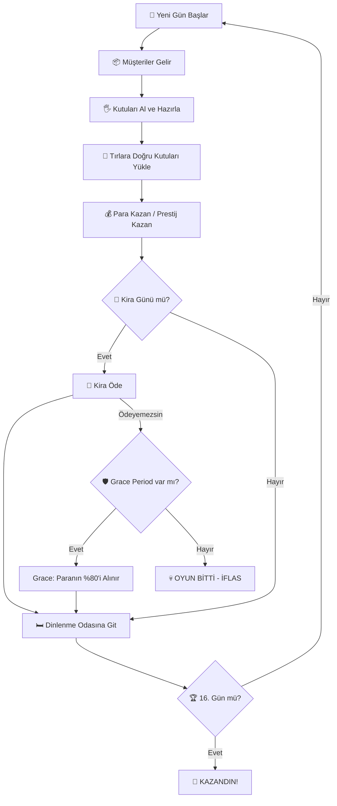

### 2.2 Mikro Döngü (Tek Gün İçi)

Bir günün dakika dakika akışı:

| Oyun Saati | Gerçek Süre (≈) | Olay |
|------------|----------------|------|
| 07:00 | 0s | Gün başlar, etkinlik aktif olur |
| 08:00 | ~14s | Tırlar gelmeye başlar, müşteriler spawn olur |
| 10:00 | ~42s | Upgrade paneli açılır |
| 12:00-14:00 | ~70-98s | **Öğle Rush**: Max 6 eşzamanlı müşteri, ×1.5 spawn hızı |
| 14:00-15:00 | ~98-112s | Öğleden sonra durgunluk: Max 2 müşteri |
| 16:00-17:00 | ~126-140s | **Akşam Rush**: Max 4 müşteri, ×1.3 spawn hızı |
| 17:00 | ~140s | Tırlar son çıkışlarını yapar |
| 18:00 | ~160s | Gün biter, kira kontrolü yapılır |

### 2.3 Oyuncu Eylemleri (Tek Seferde)

1. **Yürü / Koş** → Mağazada hareket et
2. **Al** → Raftan veya yerden kutu al
3. **Koy** → Masaya veya yere kutu bırak
4. **Fırlat** → Kutuyu fırlat (riskli — düşerse ceza)
5. **Teslim Et** → Tıra doğru renk kutuyu ver
6. **Telefon Aç** → Ekstra müşteri çağır + zaman atla
7. **Upgrade Satın Al** → Mağazayı geliştir

---

## 3. ⏰ Gün Döngüsü Sistemi

> **Kaynak**: [DayCycleManager.cs](file:///c:/Users/cicek/Documents/GitHub/Cargor/Assets/NewCss/GameState/DayCycleManager.cs)

### 3.1 Temel Parametreler

| Parametre | Değer | Açıklama |
|-----------|-------|----------|
| Toplam gün sayısı | **16** (`MAX_DAYS`) | Oyunun toplam uzunluğu |
| Gün başlangıç saati | **07:00** | Oyun içi sabah |
| Gün bitiş saati | **18:00** | Oyun içi akşam |
| Baz gün süresi | **160 saniye** | İlk 3 günün gerçek süresi |
| Günlük süre artışı | **+10 saniye/gün** | 4. günden itibaren her gün uzar |
| UI güncelleme hızı | **10 FPS** | Performans için throttle |

### 3.2 Gün Süresi Formülü

$$\text{GünSüresi}(g) = \begin{cases} 160\text{s} & g \leq 3 \\ 160 + (g - 3) \times 10\text{s} & g > 3 \end{cases}$$

| Gün | Süre (saniye) | Süre (dakika) |
|-----|--------------|---------------|
| 1-3 | 160s | 2:40 |
| 4 | 170s | 2:50 |
| 5 | 180s | 3:00 |
| 8 | 210s | 3:30 |
| 12 | 250s | 4:10 |
| 16 | 290s | 4:50 |

### 3.3 Gün Sonu Akışı

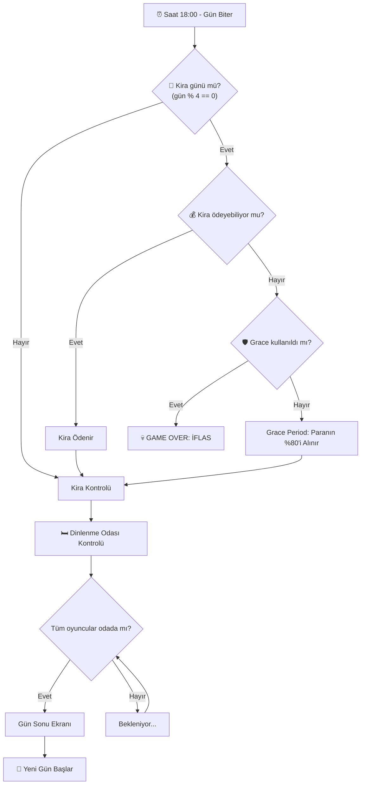

### 3.4 `OnNewDay` Event Hub

Yeni gün başladığında tetiklenen merkezi event. Aşağıdaki sistemler bu event'e abone olur:

- **TruckSpawner** → Tüm tırları despawn et, yenilerini spawn et
- **CustomerManager** → Günlük müşteri sayısını sıfırla ve yeniden hesapla
- **QuestManager** → Yeni görevler ata, tamamlanmamışlara ceza ver
- **EventEffectManager** → Günün etkinliğini uygula
- **UpgradePanel** → Bekleyen yükseltmeleri aktifleştir
- **DayLightController** → Aydınlatmayı sıfırla

---

## 4. 💰 Ekonomi Sistemi

> **Kaynak**: [GameEconomySettings.cs](file:///c:/Users/cicek/Documents/GitHub/Cargor/Assets/NewCss/GameEconomySettings.cs) (ScriptableObject)

### 4.1 Para Sistemi

> **Kaynak**: [MoneySystem.cs](file:///c:/Users/cicek/Documents/GitHub/Cargor/Assets/NewCss/GameState/MoneySystem.cs)

| Parametre | Değer |
|-----------|-------|
| Başlangıç parası | **500 TL × 1.2^(P−1)** → 1P **500** · 2P **600** · 3P **720** · 4P **864** (kaynak: `DifficultyManager.baseStartingMoney=500`, `moneyMultiplierPerPlayer=1.2`) |
| Minimum para | **0 TL** (negatife düşmez) |
| Senkronizasyon | `NetworkVariable` (server-write, everyone-read) |

**Gelir Kaynakları**:
| Kaynak | Miktar | Koşul |
|--------|--------|-------|
| Doğru kutu teslimi | +50 TL/kutu | Tıra doğru renk kutu |
| Prestij bonusu | +5 TL/kutu × tier | Her **8** prestij = 1 tier (`prestigePerBonus`) |
| Telefon araması | **+20 TL**/arama | Başarılı arama (`callMoneyReward`) |
| Görev ödülleri | Easy **28** / Medium **60** / Hard **150** TL | Gün sonunda otomatik, tier'a bağlı |

**Gider Kaynakları**:
| Kaynak | Miktar | Koşul |
|--------|--------|-------|
| Yanlış kutu teslimi | -40 TL/kutu | Tıra yanlış renk kutu |
| Kutu düşürme | **-5 TL**/düşürme | Kutu sert çarpmayla düşerse (`boxDropMoneyPenalty`) |
| Görev cezaları | Easy **15** / Medium **27** / Hard **53** TL | Kabul edilip tamamlanmayan görev |
| Kira ödemesi | Değişken | Her 4 günde bir |
| Upgrade satın alma | Değişken | Oyuncu tercihiyle (P-bazlı çarpan, bkz. §13) |

### 4.2 Ekonomi Dengesi — Tam Parametre Tablosu

Tüm ekonomik değerler tek bir `GameEconomySettings` ScriptableObject'ten yönetilir:

> **Doğrulama**: bu tablonun tamamı `Assets/Editor/EconomyInvariantCheck.cs` tarafından (165 kontrol)
> koda karşı denetleniyor. Menü: `Cargor / Ekonomi Değerlerini Doğrula`. Değer değiştirirsen orayı da güncelle.

```
📊 GameEconomySettings (EkonomiAyarlari)
│
├── 💸 KİRA AYARLARI
│   ├── baseRentByPlayerCount: [500, 1000, 1450, 1800]
│   ├── rentGrowthMultiplier: 1.35 (%35 artış/dönem)
│   ├── rentScaledMultiplier: 1.0 (varsayılan; leveraged_rent perki 0.75 yapar)
│   ├── rentIntervalDays: 4 (her 4 günde bir kira)
│   └── gracePaymentPercent: 0.8 (%80 affedilme bedeli; leveraged_rent VE all_in perkleri 0 yapar = grace iptal)
│
├── 🚚 TIR / TESLİMAT AYARLARI
│   ├── rewardPerBox: 50 TL (doğru teslimat)
│   ├── penaltyPerBox: 40 TL (yanlış teslimat)
│   ├── hangarStayDurationByPlayerCount: [120, 60, 40, 30] saniye
│   │     (1P uzun: yavaş üretimde tır dolsun; 4P kısa. Legacy skaler hangarStayDuration=30 yalnız dizi boşsa)
│   ├── truckCargoMinByPlayerCount: [1, 2, 2, 2]
│   ├── truckCargoMaxExclusiveByPlayerCount: [3, 4, 5, 6]   ← ÜST SINIR HARİÇ (Random.Range semantiği)
│   ├── prestigePerBonus: 8 (bonus tier başına prestij; 0-100 skala)
│   ├── bonusPerTier: 5 TL (tier başına ek ödül)
│   ├── rewardVolatility: 0 (high_volatility perki 0.35 yapar)
│   └── rewardVolatilityMean: 1.0 (high_volatility perki 1.15 yapar)
│
├── 📦 KUTU DÜŞME
│   └── boxDropMoneyPenalty: 5 TL
│
├── 📞 TELEFON AYARLARI  (REAKTİF V3)
│   ├── phoneRingChanceByPlayerCount: [0.20, 0.25, 0.30, 0.35]  ← saatlik çalma olasılığı
│   ├── phoneRingChancePerHour: 0.20 (LEGACY skaler; yalnız dizi boş/null ise)
│   ├── phoneRingEventMultiplier: 2.0 (CUSTOMER SUPPORT günü)
│   ├── phoneRingPerkBonus: 0 (phone_line perki 0.15 yapar)
│   ├── callMoneyReward: 20 TL
│   └── callPrestigeReward: 0.4
│
├── ⭐ PRESTİJ AYARLARI
│   ├── customerServedPrestigeBonus: +0.4
│   ├── customerLostPrestigePenalty: -0.4
│   ├── wrongProductPrestigePenalty: -0.08
│   ├── wrongDeliveryPrestigePenalty: -0.16
│   └── boxDropPrestigePenalty: -0.04
│
└── 🎪 ETKİNLİK
    ├── festivalBonusMin: 100 TL
    └── festivalBonusMax: 300 TL
```

> [!WARNING]
> **`PerkEffect` bu ScriptableObject'in alanlarına RUNTIME'DA doğrudan yazıyor ve hiçbir yerde geri almıyor.**
> Etkilenen 7 alan: `gracePaymentPercent`, `rentScaledMultiplier`, `rentGrowthMultiplier`,
> `customerServedPrestigeBonus`, `phoneRingPerkBonus`, `rewardVolatility`, `rewardVolatilityMean`.
> Editor'de Play mode'dan çıkınca değerler geri gelmiyor, diske yazılıp commit'lenebiliyor.
> Play-test sonrası `Cargor / Ekonomi Değerlerini Doğrula` çalıştır. **Açık mimari sorun** — bkz. `plans/devam.md` 2026-08-07.

> [!NOTE]
> **`wealthTaxRate` KALDIRILDI** (`9d2c3b0`, FAZ 2 C5 Seçenek A) — kira formülünde artık upgrade-vergisi yok.
> **Telefon V2 alanları** (`timeSkipAmount`, `postCallCooldown`, `maxCallsPerHour`) da kaldırıldı:
> reaktif V3'te müşteri spawn'ı ve zaman atlama tamamen çıkarıldı.

### 4.3 Prestij-Bazlı Gelir Çarpanı

$$\text{KutuBaşıGelir} = \text{rewardPerBox} + \left\lfloor \frac{\text{prestige}}{\text{prestigePerBonus}} \right\rfloor \times \text{bonusPerTier}$$

| Prestij | Tier | Kutu Başı Gelir |
|---------|------|----------------|
| 0-7 | 0 | 50 TL |
| 8-15 | 1 | 55 TL |
| 16-23 | 2 | 60 TL |
| 24-31 | 3 | 65 TL |
| 32-39 | 4 | 70 TL |
| 40+ | 5+ | 75+ TL (tavan 100 prestij → tier 12 → **110 TL**) |

> Başlangıç prestiji **12** (`PrestigeManager.startingPrestige`, sahnede), yani oyuncu tier 1'de başlar.
> Ölçümlerde son prestij 1P ~47 / 4P ~37 bandında kalıyor — **`maxPrestige=100` pratikte hiç ulaşılmıyor.**

---

## 5. 🏠 Kira Sistemi

### 5.1 Kira Formülü

$$\text{Kira} = \text{BaseRent}[P] \times 1.35^{\text{cycle}} \times \text{rentScaledMultiplier}$$

Burada:
- \(P\) = Oyuncu sayısı (1-4)
- \(\text{cycle}\) = Kaçıncı kira dönemi (0'dan başlar)
- \(\text{rentScaledMultiplier}\) = Varsayılan 1.0; yalnız "Kaldıraçlı Kira" (`leveraged_rent`) perki **0.75** yapar (−%25)
- **NOT (2026-07-13):** Eski formüldeki `wealthTax` terimi (`+ TotalUpgradeValue × 0.10`) **tamamen kaldırıldı** (commit `9d2c3b0`, FAZ 2 C5 → Seçenek A). Kırık kablolamayla zaten hep 0'dı; kod'dan tümüyle çıkarıldı, artık kira formülünde upgrade-vergisi yok.

### 5.2 Oyuncu Sayısına Göre Baz Kira

| Oyuncu Sayısı | Baz Kira |
|--------------|----------|
| 1 Oyuncu | 500 TL |
| 2 Oyuncu | 1.000 TL |
| 3 Oyuncu | 1.450 TL |
| 4 Oyuncu | 1.800 TL |

> Ölçek 1 : 2.00 : 2.90 : 3.60. Ölçülen gelir ölçeği (1 : 1.73 : 2.40 : 2.95) ile birebir aynı DEĞİL —
> bilinçli: çok oyunculu takım koordinasyon avantajını kirayla geri ödüyor.

### 5.3 Kira Dönemleri ve Büyüme (tüm oyuncu sayıları)

| Gün | Dönem | 1P | 2P | 3P | 4P |
|-----|-------|-----|-----|-----|-----|
| 4 | Dönem 0 | 500 | 1.000 | 1.450 | 1.800 |
| 8 | Dönem 1 | 675 | 1.350 | 1.958 | 2.430 |
| 12 | Dönem 2 | 911 | 1.823 | 2.643 | 3.281 |
| 16 | Dönem 3 | 1.230 | 2.460 | 3.568 | 4.429 |
| — | **16 gün toplamı** | **3.316** | **6.633** | **9.619** | **11.940** |

> Eğim `rentGrowthMultiplier = 1.35` — eski 1.15'ten çok daha dik. Amaç: geç oyunda birikmiş
> parayı eritip son kira dönemini gerçek bir tehdit yapmak.

### 5.4 Grace Period (Affedilme Mekanizması)

- **Tetiklenme**: Kira günü ve para yeterli değilse
- **Tek seferlik**: Oyun boyunca yalnızca 1 kez kullanılabilir
- **Maliyet**: Mevcut paranın %80'i alınır (`gracePaymentPercent`)
- **İkinci kez ödeyemezse**: **GAME OVER — İFLAS**
- ⚠️ **`leveraged_rent` ve `all_in` perkleri `gracePaymentPercent`'i 0 yapar** — yani grace period
  tamamen iptal olur. İkisi aynı dışlama grubunda (`EXCLUSIVE_EFFECT_GROUPS`), birlikte teklif edilmezler.

> [!IMPORTANT]
> **Gün sonu sırası:** kira kontrolü (`TryProcessMoneyCheck`) görev ödüllerinden **ÖNCE** çalışıyor.
> Yani tamamlanan görevin parası kiraya yetişmiyor. Collect butonu kaldırıldığında (2026-07-28)
> ortaya çıkan bilinçli bir yan etki — kira günlerinde iflas riski bir miktar sert.

### 5.5 Kira + Upgrade Vergisi Etkileşimi ~~(KALDIRILDI)~~

> [!NOTE]
> **Upgrade Vergisi (wealthTax) mekaniği KALDIRILDI** (2026-07-13, commit `9d2c3b0`). Eskiden "her upgrade sonraki kiraları artırır" olarak tasarlanmıştı ama kablolaması kırıktı (hep 0 katkı) → tamamen çıkarıldı. Upgrade satın almak artık kirayı ETKİLEMEZ. Bu bölüm tarihsel kayıt olarak tutuluyor.

**Örnek (güncel formülle)**:
- 1 oyuncu, dönem 2 (upgrade sayısından bağımsız):
  - Kira = 500 × 1.35² × 1.0 = **911 TL**

---

## 6. ⭐ Prestij Sistemi

> **Kaynak**: [PrestigeManager.cs](file:///c:/Users/cicek/Documents/GitHub/Cargor/Assets/NewCss/CustomerSripts/PrestigeManager.cs)

### 6.1 Temel Parametreler

| Parametre | Değer |
|-----------|-------|
| Başlangıç prestiji | **12.0** (sahne: `PrestigeManager.startingPrestige`) |
| Minimum prestij | **0** (ham değer ≤0 olursa GAME OVER — clamp ÖNCESİ kontrol) |
| Maksimum prestij | **100** (pratikte hiç ulaşılmıyor; ölçüm 1P ~47 / 4P ~37) |
| Bonus tier eşiği | her **8** prestij = +5 TL/kutu (`prestigePerBonus`) |

### 6.2 Prestij Değişim Kaynakları

| Eylem | Prestij Değişimi | Sıklık |
|-------|-----------------|--------|
| Müşteriye başarılı servis | **+0.4** | Her başarılı servis |
| Telefon açma | **+0.4** | Her başarılı arama (`callPrestigeReward`) |
| Müşteri kaçtı (sabır bitti) | **-0.4** | Her kaçan müşteri |
| Tıra yanlış renk kutu | **-0.16** | Her yanlış teslimat (ayrıca -40 TL) |
| Yanlış ürün gösterildi | **-0.08** | Her yanlış ürün |
| Kutu yere düştü | **-0.04** | Her düşürme |
| Görev ödülü | Easy **+1.4** / Medium **+3** / Hard **+7.5** | Gün sonunda |
| Görev cezası | Easy **-0.8** / Medium **-1.36** / Hard **-2.66** | Tamamlanmayan kabul edilmiş görev |

> SURPRISE AUDIT etkinliği günü tüm cezalar **×2** (`EventEffectManager.GetPenaltyMultiplier`).

### 6.3 Prestijin Oyuna Etkisi

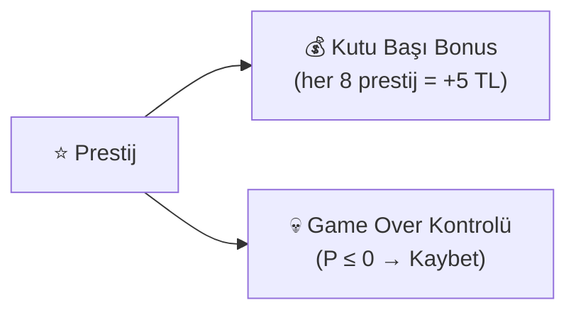

> [!WARNING]
> **Prestijin ekonomide TEK işlevi kutu başı ödül tier'ı** (+ sıfırda ölüm).
> `PrestigeManager.GetCustomerCapacity()` ve `OnCustomerCapacityChanged` **ölü kod** — sıfır tüketici,
> sıfır abone. `CheckWinCondition` de prestije bakmıyor (yalnız gün 16'ya ulaşmak yeterli).
> Eski GDD'deki "müşteri kapasitesi = 1 + floor(P/4)" formülü **hiçbir yerde uygulanmıyor.**

### 6.4 Prestij Dengesi Analizi

> [!CAUTION]
> Başlangıç prestiji 12.0; **30 müşteri kaçırma** (30 × -0.4) oyunu bitirir.
> Ceza ×2 olan SURPRISE AUDIT gününde bu 15'e düşer.

Dengeyi tutturmak için:
- Her 1 kaçırılan müşteriye karşı **1 başarılı servis** yeterli (-0.4 / +0.4 = 1:1)
- Her 1 yanlış teslimata karşı **0.4 servis** (-0.16 / +0.4)
- Bir Hard görevi kaçırmak **~7 müşteri kaçırmaya** eşdeğer (-2.66 / -0.4)

> [!IMPORTANT]
> **Kazanılmış oyun kaybedilemez** (`f013f5d`): gün 16 settlement'i zafer ilan edildikten SONRA
> çalıştığı için, tamamlanmayan görevin prestij cezası prestiji sıfırlasa bile sonuç değişmez.
> `TriggerLose`/`TriggerWin` artık `gameEnded` guard'lı.

---

## 7. 📊 ~~Kota Sistemi~~ — KALDIRILDI

> [!CAUTION]
> **Bu sistem tamamen silindi** (commit `0c026ef`). `Assets/NewCss/QuotaManager.cs` dosyası yok
> ve kodda tek bir referansı kalmadı — `DailyQuota`, `RegisterShippedBox`, `OnQuotaCompleted`,
> `OnQuotaFailed` sembollerinin hiçbiri mevcut değil.

Eskiden günlük bir kutu kotası vardı (`toplam müşteri × 0.8`) ve tutturulamazsa **GAME OVER**
oluyordu. Kaldırılma gerekçesi: kira sistemiyle **çift başarısızlık kapısı** oluşturuyordu —
oyuncu hem kirayı ödemek hem kotayı tutturmak zorundaydı, bu da erken oyunda ölüm oranını
tasarlanandan çok yükseltiyordu.

**Bugün oyunu kaybetmenin tek iki yolu var** (bkz. §21):
1. Kira gününde ödeyememek (grace period bir kez affeder)
2. Prestijin sıfıra düşmesi

Bölüm numaraları tarihsel referansları bozmamak için korunuyor.

---

## 8. 🚚 Tır / Teslimat Sistemi

> **Kaynaklar**: [Truck.cs](file:///c:/Users/cicek/Documents/GitHub/Cargor/Assets/NewCss/TruckScripts/Truck.cs), [TruckSpawner.cs](file:///c:/Users/cicek/Documents/GitHub/Cargor/Assets/NewCss/TruckScripts/TruckSpawner.cs)

### 8.1 TruckSpawner — Tır Yöneticisi

| Parametre | Değer |
|-----------|-------|
| Çalışma saatleri | **08:00 – 17:00** |
| Respawn gecikmesi | **3–5 saniye** (rastgele) |
| Tır başına kargo miktarı | **Oyuncu sayısına bağlı** — 1P **1–2** · 2P **2–3** · 3P **2–4** · 4P **2–5** kutu |
| Hangar bekleme süresi | **Oyuncu sayısına bağlı** — 1P **120s** · 2P **60s** · 3P **40s** · 4P **30s** |
| Kutu renk tipleri | **3**: Kırmızı, Sarı, Mavi |
| Renk belirleme | 5'li deterministik kuyruk sistemi |
| Hangar spawn noktaları | `requiredUpgradeLevel` ile kilitleme |

**Kargo aralığı** `GameEconomySettings.GetTruckCargoRange(P)` ile okunur;
diziler `truckCargoMinByPlayerCount = [1,2,2,2]` ve `truckCargoMaxExclusiveByPlayerCount = [3,4,5,6]`.
Üst sınır **HARİÇ** (`Random.Range(int,int)` semantiği) — yani 4P'de 2,3,4 veya 5 kutu.
Gelir-nötr doğrulandı (kümülatif fark ≤ %1.5); asıl amaç 1P'de yarı-boş kalkan tırı önlemek.

**Hangar süresi** `GetHangarStayDuration(P)`. 1P'nin 120s olmasının sebebi: 90s'de en küçük kargo
bile dolmuyordu (`fillTime(2) = 100s > 90s`), dolayısıyla "1 tır tamamla" görevi imkânsızdı.

> [!NOTE]
> **Tır penceresi darboğaz DEĞİL.** Ölçüm: tavan günde 10.9–18 tır, fiilen kullanılan **%10–42**.
> Gerçek darboğaz insan üretim hızı. Sonucu: 2. ve 3. hangar OPTIMISTIC bantta sıfır gelir katıyor —
> `Ek Hangar` upgrade'i bu yüzden maxLevel 1'e çekildi (§13).

### 8.2 Tır Davranış Akışı

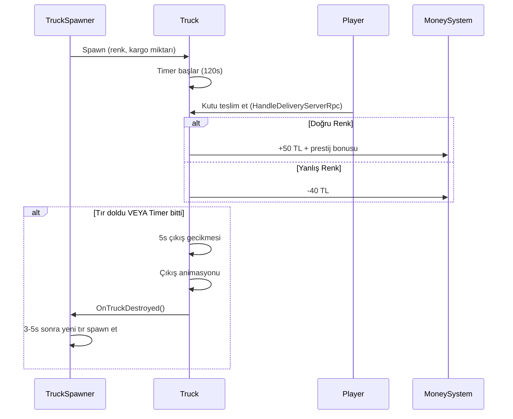

### 8.3 Teslimat Ekonomisi

**Doğru teslimat geliri** (prestij = 24 varsayımıyla):
$$\text{Gelir} = 50 + \left\lfloor \frac{24}{4} \right\rfloor \times 5 = 50 + 30 = 80\ \text{TL/kutu}$$

**Yanlış teslimat cezası**: -40 TL/kutu (sabit)

> [!IMPORTANT]
> Yanlış teslimat cezası (40 TL), doğru teslimat baz ödülüne (50 TL) yakındır ama altındadır. Yine de her yanlış teslimat ~0.8 doğru teslimatı siler; oyuncuyu dikkatli olmaya teşvik eder.

### 8.4 Tır Renk ve Görsel Sistemi

- Tır gövdesi ve kapıları, istenen kutu rengine boyanır (Kırmızı/Sarı/Mavi)
- Oyuncu, tırın renginden hangi kutuyu yüklemesi gerektiğini görsel olarak anlar
- 3D spatial audio: Giriş sesi, bekleme sesi (loop), çıkış animasyon sesi

### 8.5 Hangar ve Upgrade Entegrasyonu

- Başlangıçta **1 hangar** aktif
- **Truck upgrade** ile ek hangarlar açılır
- Her hangarın bir `requiredUpgradeLevel` değeri var
- Garaj kapıları (`GarageDoorController`) upgrade seviyesine göre açılır/kapanır

---

## 9. 👥 Müşteri Sistemi

> **Kaynaklar**: [CustomerAI.cs](file:///c:/Users/cicek/Documents/GitHub/Cargor/Assets/NewCss/CustomerSripts/CustomerAI.cs), [CustomerManager.cs](file:///c:/Users/cicek/Documents/GitHub/Cargor/Assets/NewCss/CustomerSripts/CustomerManager.cs)

### 9.1 CustomerManager — Müşteri Yöneticisi

**Server-authoritative** singleton. Günlük müşteri sayısını hesaplar ve dalga bazlı spawn yapar.

### 9.2 Dalga Bazlı Müşteri Yoğunluğu

> **Kaynak**: `WaveSettings` ScriptableObject

| Dalga | Saat Aralığı | Max Eşzamanlı | Spawn Hız Çarpanı | Atmosfer |
|-------|-------------|---------------|-------------------|----------|
| 🌅 Sabah | 08:00-12:00 | 4 | ×1.0 | Normal tempo |
| 🍽️ Öğle Rush | 12:00-14:00 | **6** | **×1.5** | Yoğun, kaotik |
| 😴 Öğleden Sonra Durgunluk | 14:00-15:00 | 2 | ×0.5 | Nefes alma |
| 🌤️ Öğleden Sonra | 15:00-16:00 | 3 | ×0.8 | Hafif tempo |
| 🌆 Akşam Rush | 16:00-17:00 | 4 | **×1.3** | Son dakika baskısı |
| 🌙 Kapanış | 17:00-18:00 | 2 | ×0.6 | Sessiz kapanış |

### 9.3 Müşteri AI Durumları

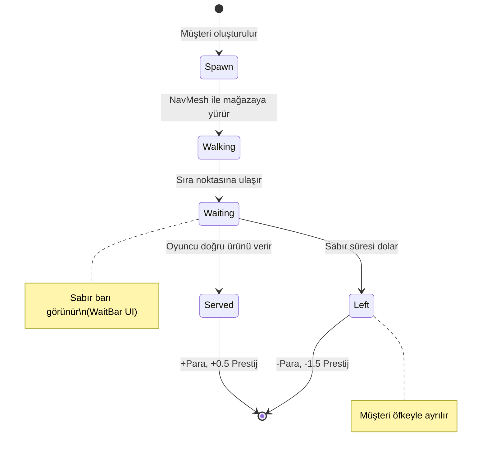

### 9.4 Müşteri Sabır Sistemi

- **Baz sabır**: 35-55 saniye (rastgele, DifficultyManager'dan)
- **Etkinlik çarpanları**: Angry Customers (-30%), Relaxed Day (+30%)
- **Görsel gösterge**: Müşterinin üzerinde azalan sabır barı (`WaitBar.cs`)
- **Billboard**: Sabır barı her zaman kameraya dönük (`Billboard.cs`)

### 9.5 Kuyruk Sistemi

> **Kaynaklar**: [QueueController.cs](file:///c:/Users/cicek/Documents/GitHub/Cargor/Assets/NewCss/CustomerSripts/QueueController.cs), [QueueWaypoint.cs](file:///c:/Users/cicek/Documents/GitHub/Cargor/Assets/NewCss/CustomerSripts/QueueWaypoint.cs)

- **Başlangıç kuyruk boyutu**: Sabit (upgrade ile artırılabilir)
- **Kuyruk pozisyonları**: `QueueWaypoint` noktaları ile tanımlı
- **Doluluk kontrolü**: Kuyruk doluysa yeni müşteri spawn olmaz
- **Event çarpanı**: `eventCustomerMultiplier` ile etkinliklerde müşteri sayısı değişir

### 9.6 Müşteri Spawn — Kapasite Bazlı Sistem (Yeni)

> **Kaynak**: [implementation_plan.md](file:///c:/Users/cicek/Documents/GitHub/Cargor/implementation_plan.md)

Eski lineer sistem (`base + (gün-1) × artış`) yerine kapasite-bazlı dinamik sistem:

$$\text{GünlükMüşteri} = \text{Clamp}\Big((\text{AktifRaflar} \times 3) + (\text{MağazaSeviyesi} \times 2) + \text{Random}(-2, +3),\ 1,\ 50\Big)$$

Bu sayede:
- Oyuncu gelişmezse müşteri sayısı artmaz (adil)
- Oyuncu hızlı gelişirse müşteri sayısı hızla artar (ödüllendirici)
- Soft cap 50 ile performans korunur

---

## 10. 📦 Kutu ve Eşya Sistemi

### 10.1 Kutu Tipleri

> **Kaynak**: [BoxInfo.cs](file:///c:/Users/cicek/Documents/GitHub/Cargor/Assets/NewCss/BoxScripts/BoxInfo.cs)

| Renk | Enum Değeri | Görsel |
|------|------------|--------|
| 🟡 Sarı | `Yellow` | Sarı kutu modeli |
| 🔵 Mavi | `Blue` | Mavi kutu modeli |
| 🔴 Kırmızı | `Red` | Kırmızı kutu modeli |

Her kutunun `isFull` (dolu/boş) bayrağı vardır.

### 10.2 Kutu Düşürme Cezası

> **Kaynak**: [BoxFallPenalty.cs](file:///c:/Users/cicek/Documents/GitHub/Cargor/Assets/NewCss/BoxScripts/BoxFallPenalty.cs)

| Parametre | Değer |
|-----------|-------|
| Para cezası | **-10 TL/düşürme** |
| Prestij cezası | **-0.05/düşürme** |
| Tetikleme eşiği | Hız > **1 m/s** ile yere çarpma |
| Ses efekti | 3D spatial audio |

> [!TIP]
> Fırlatma mekaniği riskli ama hızlıdır. Kutuyu fırlattığında yere düşerse ceza alırsın, ama başka bir oyuncuya atıp yakalamasını sağlarsan co-op avantajı elde edersin.

### 10.3 Network Dünya Eşyası

> **Kaynak**: [NetworkWorldItem.cs](file:///c:/Users/cicek/Documents/GitHub/Cargor/Assets/NewCss/NewPickup/NetworkWorldItem.cs)

- Ağ senkronize pickupable eşyalar
- Durumlar: `canBePickedUp`, `isOnTable`
- Fizik kontrolü: Masadayken `FreezePhysics()`, alınabilirken `UnfreezePhysics()`
- Darbe bazlı yıkım: **3 m/s** üstü hızla çarparsa hasar görebilir
- `ItemData` ScriptableObject ile `itemID`, `itemName` ve kategori

---

## 11. 🖐️ Pickup / Envanter Sistemi

> **Kaynak**: [PlayerInventory.cs](file:///c:/Users/cicek/Documents/GitHub/Cargor/Assets/NewCss/NewPickup/PlayerInventory.cs) (6 parçalı partial class)

### 11.1 Dosya Yapısı

| Dosya | Sorumluluk |
|-------|-----------|
| `PlayerInventory.cs` | Çekirdek: algılama ayarları, network değişkenleri, sabitler |
| `PlayerInventory.Detection.cs` | Koni tabanlı eşya algılama ve önceliklendirme |
| `PlayerInventory.Interaction.cs` | Alma / bırakma / fırlatma mekanikleri |
| `PlayerInventory.Shelf.cs` | Raf eşyası etkileşimi (scroll ile seçim) |
| `PlayerInventory.Visual.cs` | Tutma pozisyonu, outline sistemi |
| `PlayerInventory.Audio.cs` | Etkileşim ses efektleri |

### 11.2 Algılama Sistemi

```
         45° Koni
        ╱       ╲
       ╱    ●    ╲     ← Algılanan eşyalar
      ╱   Hedef   ╲
     ╱             ╲
    ╱───────────────╲
    ▲ Oyuncu (3m menzil)
```

| Parametre | Değer |
|-----------|-------|
| Algılama açısı | **45°** |
| Algılama menzili | **3 metre** |
| Etkileşim bekleme süresi (cooldown) | **0.1 saniye** |
| Input spam koruması | **0.15 saniye** |
| Pickup animasyon timeout | **2 saniye** |

### 11.3 Katman Önceliklendirmesi

Birden fazla eşya algılanırsa şu öncelik sırası uygulanır:

1. 🥇 **GroundItem** — Yerdeki eşyalar (en yüksek öncelik)
2. 🥈 **TableItem** — Masadaki eşyalar
3. 🥉 **ShelfItem** — Raftaki eşyalar (en düşük öncelik)

### 11.4 Outline Sistemi

- Hedeflenen eşyanın etrafında **sarı outline** gösterilir
- QuickOutline paketi kullanılır
- Sadece en yakın ve en yüksek öncelikli eşya outline alır

### 11.5 Çoklu Oyuncu Eşya Kilidi

- **Thread-safe statik dictionary** ile aynı eşyayı iki oyuncunun aynı anda alması engellenir
- Bir oyuncu eşyayı hedefleyince kilitlenir, bırakınca açılır

### 11.6 Tutma ve Bırakma Pozisyonları

- **HoldPosition**: Oyuncu modelinde adlandırılmış Transform — kutu burada tutulur
- **DropPosition**: Oyuncu modelinde adlandırılmış Transform — kutu bırakıldığında buraya düşer

---

## 12. 🗄️ Raf ve Masa Sistemi

### 12.1 Display Table (Sergi Masası)

> **Kaynak**: [DisplayTable.cs](file:///c:/Users/cicek/Documents/GitHub/Cargor/Assets/NewCss/TableScripts/DisplayTable.cs)

- Slot bazlı eşya yerleştirme sistemi
- Önceden tanımlanmış slot Transform pozisyonları
- Özellikleri: `IsFull`, `HasItems`, `AvailableSlotCount`
- Yerleştirilen eşyalar takip edilir, obje silindiğinde temizlenir

### 12.2 Networked Shelf (Ağ Senkronize Raf)

> **Kaynak**: [NetworkedShelf.cs](file:///c:/Users/cicek/Documents/GitHub/Cargor/Assets/NewCss/TableScripts/Shelf.cs)

| Parametre | Değer |
|-----------|-------|
| Slot sayısı | **3** (Kırmızı, Mavi, Sarı) |
| Otomatik yenileme | **Evet** |
| Yenileme gecikmesi | **1 saniye** |
| Senkronizasyon | NetworkVariable (network object ID) |

**Mekanizma**: Oyuncu raftan kutu aldığında, 1 saniye sonra otomatik olarak aynı slotta yeni kutu spawn olur. Bu sayede raf hiçbir zaman kalıcı olarak boşalmaz.

---

## 13. ⬆️ Yükseltme (Upgrade) Sistemi

> **Kaynaklar**: [UpgradePanel.cs](file:///c:/Users/cicek/Documents/GitHub/Cargor/Assets/NewCss/UpgradeScripts/UpgradePanel.cs), [UpgradeManager.cs](file:///c:/Users/cicek/Documents/GitHub/Cargor/Assets/NewCss/UpgradeScripts/UpgradeManager.cs), [UpgradeAssets.cs](file:///c:/Users/cicek/Documents/GitHub/Cargor/Assets/NewCss/UpgradeScripts/UpgradeAssets.cs)

### 13.1 Draft (Roguelite Teklif) Sistemi

Upgrade'ler doğrudan bir listeden satın alınmaz — her gün **3 kartlık rastgele bir teklif** sunulur
(`DraftPool.OFFER_COUNT = 3`). Kartlar iki türe ayrılır (`PerkKind`):

| Tür | Açıklama |
|-----|----------|
| **LeveledBackbone** | Fiziksel/omurga upgrade'ler (raf, masa, hangar). Tier'sız, hep havuzda. |
| **Perk** | Tek seferlik kaldıraçlar. Tier'lı, güne göre açılır. |

**Tier kapıları** (`DraftPool.MaxUnlockedTier`): T1 gün 1'den · **T2 gün 5'ten** · **T3 gün 9'dan** itibaren.

**Dışlama grupları** (`EXCLUSIVE_EFFECT_GROUPS`): birbirini götüren perkler aynı teklifte çıkamaz —
`{gambler_case, all_in}` ve `{leveraged_rent, all_in}` (ikisi de grace period'u siliyor).
Bir kart birden fazla gruba üye olabilir (`all_in` gibi).

**Reroll**: teklifi yenilemek para eder, gün içinde kümülatif artar —
**50 / 90 / 160 / 290 / 525 TL** (5+ tavan; `RerollCurve`). Bu tabloya ayrıca P-çarpanı uygulanır.

### 13.2 Upgrade Maliyetleri

**Formül**: `(baseCost + level × costStep) × oyuncuÇarpanı × etkinlikÇarpanı`

**Oyuncu çarpanı** (`DifficultyManager.upgradeCostMultiplierByPlayerCount`):

| 1P | 2P | 3P | 4P |
|----|----|----|----|
| **1.00** | **2.00** | **2.95** | **3.70** |

> Neden dizi, neden geometrik tek skaler değil: gelir ölçeği 1→2'de dik, sonra düz.
> `m^(P-1)` bu şekli üretemiyor — en iyi tek skaler (1.543) bile 2P'de %24.5 sapıyordu.
> **Dizi YAML'a yazılmaz**, C# field initializer'da durur (float[] hex formatı Unity'de çalışmıyor).

**Etkinlik çarpanı**: OPPORTUNITY DAY = ×0.8.

**Omurga upgrade maxLevel'leri** (FAZ 4'te kısıldı):

| Upgrade | maxLevel | baseCost / costStep | Gerekçe |
|---------|----------|---------------------|---------|
| Geniş Ambar | **2** | 60 / 30 (toplam 150) | Ekonomi kartı değil, fiziksel stok tamponu |
| Paketleme İstasyonu | **1** | 150 | Sahnede `Table` taşıyan tam 2 obje var; seviye 2-3 hiçbir şey açmıyor |
| Ek Hangar | **1** | 200 | 3. hangar her iki bantta 0 TL katıyor (tır penceresi darboğaz değil) |

### 13.3 Ertelenmiş Aktivasyon

> [!IMPORTANT]
> Satın alınan yükseltmeler **aynı gün aktif olmaz**! Yükseltme beklemededir (`pending`) ve **ertesi gün** aktifleşir. Bu tasarım kararı, oyuncunun stratejik planlama yapmasını zorunlu kılar.

### 13.4 Upgrade Panel Erişim Saati

Panel ancak oyun içi saat **10:00**'dan sonra açılabilir (`PANEL_OPEN_HOUR = 10`). Bu, oyuncuyu önce birkaç saat çalışıp para kazanmaya, ardından upgrade yapmaya teşvik eder.

### 13.5 Upgrade Görselleri

Her upgrade seviyesine karşılık gelen 3D objeler sahnede aktifleşir. Örneğin:
- Tır upgrade → Yeni garaj kapısı açılır
- Kapasite upgrade → Yeni raf/masa sahnede görünür

---

## 14. 📞 Telefon Sistemi

> **Kaynak**: [PhoneCallManager.cs](file:///c:/Users/cicek/Documents/GitHub/Cargor/Assets/NewCss/Phone/PhoneCallManager.cs)

> [!IMPORTANT]
> **Sistem V3 (REAKTİF).** Eski V2 tasarımı (oyuncu E'ye basıp arama yapar, müşteri spawn olur,
> zaman atlar) **tamamen kaldırıldı**. Artık telefonu **sunucu çaldırır**, oyuncu yalnızca açar.
> `timeSkipAmount`, `postCallCooldown`, `maxCallsPerHour` alanları da yok.

### 14.1 Çalma Mekanikleri

| Parametre | Değer |
|-----------|-------|
| Tetikleme | Sunucu, mesai içinde **her oyun-saati değiştiğinde** zar atar |
| Çalışma saatleri | **08:00 – 18:00** (`phoneStartHour` / `phoneEndHour`) |
| Saatlik çalma olasılığı | **Oyuncu sayısına bağlı** — 1P **%20** · 2P **%25** · 3P **%30** · 4P **%35** |
| Çalma süresi | **15 saniye** (`ringDuration`); açılmazsa kendiliğinden susar |
| Açılmama cezası | **YOK** |
| Para ödülü | **+20 TL** (`callMoneyReward`) |
| Prestij ödülü | **+0.4** (`callPrestigeReward`) |

**Çarpanlar**: CUSTOMER SUPPORT etkinliği günü olasılık **×2.0** (`phoneRingEventMultiplier`);
`phone_line` perki olasılığa **+0.15** toplamsal bonus ekler.

> P-ölçeklemesinin yönü bilinçli: telefonun toplam gelirdeki payı 1P'de **%9.2**, 4P'de **%4.9**.
> Yani solo oyuncuya yardım eder, kalabalık takımda gürültü olmaz.

### 14.2 Akış

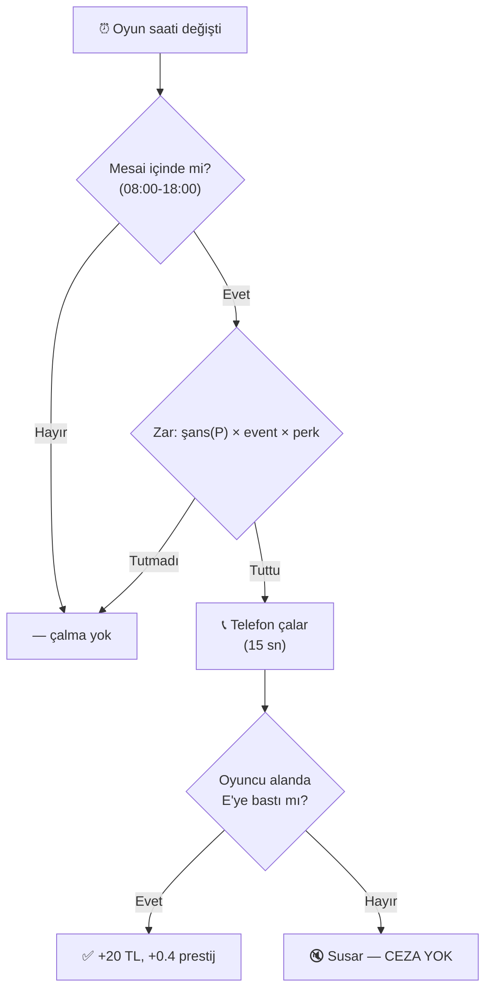

### 14.3 Görsel ve Ses Geri Bildirimi

- **PhoneWaitBar**: çalma süresince geri sayım (salt görsel, her client yerel çalışır)
- **Başarı sesi**: arama açıldığında
- **Zil sesi**: çalma süresince

> [!NOTE]
> `SetCallChance(float)` ve `ApplyPhoneSettings()` **silindi** (2026-08-06): boş gövdeli bir stub'dı ve
> `DifficultyManager` onu çağırıp "Phone call chance set to %X" diye **sahte-yeşil log** basıyordu.
> P-ölçeklemesi artık `GameEconomySettings.phoneRingChanceByPlayerCount`'ta ve gerçekten okunuyor.
- Telefon **fiziksel olarak mağazada bir yerde** konumlandırılmıştır; oyuncunun oraya yürümesi gerekir

---

## 15. 🎪 Etkinlik (Event) Sistemi

> **Kaynaklar**: [EventCalendarUI.cs](file:///c:/Users/cicek/Documents/GitHub/Cargor/Assets/NewCss/Events/EventCalendarUI.cs), [EventEffectManager.cs](file:///c:/Users/cicek/Documents/GitHub/Cargor/Assets/NewCss/Events/EventEffectManager.cs)

### 15.1 Takvim Sistemi

- **16 hücreli ızgara** (16 gün)
- **İlk 3 gün**: Etkinlik yok (oyuncunun adapte olması için)
- **3. günden sonra**: Her 1-3 günde bir etkinlik
- **Garanti kuralları**:
  - İlk 2 etkinlik **mutlaka pozitif**
  - 3. etkinlik **mutlaka negatif**
  - Sonrası rastgele

### 15.2 Etkinlik Kataloğu (17 Etkinlik)

#### Pozitif Etkinlikler 🟢

| Etkinlik | Etki | Detay |
|----------|------|-------|
| **Delivery Bonus** | +%20 kutu ödülü | `rewardPerBox × 1.2` |
| **Relaxed Day** | +%30 sabır, -%30 müşteri | Rahat gün |
| **Express Cargo** | -%30 tır çıkış gecikmesi | Tırlar daha hızlı döner |
| **Golden Box Day** | +%30 ödül, +%20 hız, +%20 müşteri | En iyi etkinlik |
| **Opportunity Day** | -%20 upgrade maliyeti | Stratejik upgrade fırsatı |
| **VIP Service** | %10 mükemmel kutu şansı | Özel kutular |
| **Rainy Day** | -%20 müşteri | Yağmurlu gün, sakin tempo |
| **Festival Day** | Gün başında rastgele bonus | Sürpriz ödül |

#### Negatif Etkinlikler 🔴

| Etkinlik | Etki | Detay |
|----------|------|-------|
| **Busy Day** | +%50 müşteri | Kaotik yoğunluk |
| **Angry Customers** | -%30 sabır | Müşteriler çabuk gider |
| **Slow Logistics** | +%50 tır çıkış gecikmesi | Tırlar çok yavaş |
| **Heavy Boxes** | -%20 hareket/sprint hızı | Kutular ağır |
| **Fatigue Problem** | -%30 sprint, -%40 stamina regen | Yorgunluk |
| **Surprise Audit** | Çift ceza | Tüm cezalar ×2 |
| **Marketing Day** | +%20 müşteri, -%30 kazanç | Pazarlama günü |
| **Customer Support** | +%30 telefon çalması | Telefon kaçınılmaz |

> [!NOTE]
> **Kodda tanımlı 16 etkinlik** (`EventCalendarUI._allEvents`): BUSY DAY · DELIVERY BONUS ·
> ANGRY CUSTOMERS · RELAXED DAY · SLOW LOGISTICS · EXPRESS CARGO · HEAVY BOXES · GOLDEN BOX DAY ·
> OPPORTUNITY DAY · FATIGUE PROBLEM · VIP SERVICE · SURPRISE AUDIT · RAINY DAY · MARKETING DAY ·
> CUSTOMER SUPPORT · FESTIVAL DAY.
> Eski GDD'deki **"Quota Day"** etkinliği kodda **yok** (kota sistemiyle birlikte gitti, bkz. §7).
>
> **Zamanlama**: ilk **3 gün etkinliksiz** (`INITIAL_EVENT_FREE_DAYS`), sonrasında **1–3 gün**
> aralıklarla düşer (`EVENT_INTERVAL_MIN/MAX`).
>
> **FAZ 4 düzeltmeleri**: RELAXED DAY'in açıklamada olmayan gizli müşteri cezası (×0.7) kaldırıldı ·
> RAINY DAY yanlış sınıflandırılmıştı (Pozitif → **Negatif**) · VIP SERVICE'in "tır başına %10 şans"
> RNG'si silinip sabit ×1.12 yapıldı (ölçülen etkisi yalnız +%1.3'tü).

### 15.3 Etkinlik Uygulama Mekanizması

`EventEffectManager`, etkinliğin gerektirdiği çarpanları ilgili sistemlere uygular:

```
EventEffectManager
├── Truck.rewardPerBox → Çarpan uygula
├── CustomerAI.waitTime → Çarpan uygula
├── PlayerMovement.moveSpeed → Çarpan uygula
├── PlayerMovement.staminaRegenRate → Çarpan uygula
└── UpgradePanel.costMultiplier → Çarpan uygula
```

**Geri yükleme**: Orijinal değerler saklanır ve etkinlik sona erdiğinde (yeni gün başladığında) geri yüklenir.

---

## 16. 🏆 Görev (Quest) Sistemi

> [!NOTE]
> **Quest kodu `Assets/Scripts/Quest/` altında — `Assets/NewCss/` DIŞINDA** (legacy konum).
> Kaynaklar: `Assets/Scripts/Quest/Manager/QuestManager.cs`, `.../QuestTracker.cs`,
> `.../Data/QuestData.cs`. Asset'ler: `Assets/Resources/Quests/*.asset` (30 adet).

### 16.1 Görev Yapısı

| Parametre | Değer |
|-----------|-------|
| Günlük teklif sayısı | **3** (`DAILY_QUEST_COUNT`) |
| Havuz | **30 elle yazılmış asset** — Easy 11 · Medium 10 · Hard 9 |
| Seçim | **Katmanlı** (`SelectDailyQuestsStratified`): her tier'dan en az bir teklif garantili |
| Zorluk katmanları | Easy (tier 0), Medium (1), Hard (2) |
| Hard görev kilidi | `Görev Kademesi` upgrade'i ile açılır |
| Günlük kabul limiti | **1** — teklif 3 ama yalnız biri kabul edilebilir |

> **Ödül modeli elle yazım.** Eski rastgele havuz modeli (`rewardPool`/`penaltyPool` + Fisher-Yates)
> kaldırıldı; her asset kendi `moneyReward` / `prestigeReward` / `moneyPenalty` / `prestigePenalty`
> alanlarını taşıyor. **Ceza alanları POZİTİF girilir**, kod `-Mathf.Abs()` uygular
> (eksi yazılırsa çift-negatif olup ceza ödüle dönme tuzağı kapalı).

### 16.2 Görev Ödül / Ceza Tablosu

| Tier | Para ödülü | Para cezası | Prestij ödülü | Prestij cezası |
|------|-----------|-------------|---------------|----------------|
| **Easy** | 28 TL | 15 TL | +1.4 | −0.8 |
| **Medium** | 60 TL | 27 TL | +3.0 | −1.36 |
| **Hard** | 150 TL | 53 TL | +7.5 | −2.66 |

### 16.3 Görev Durumları

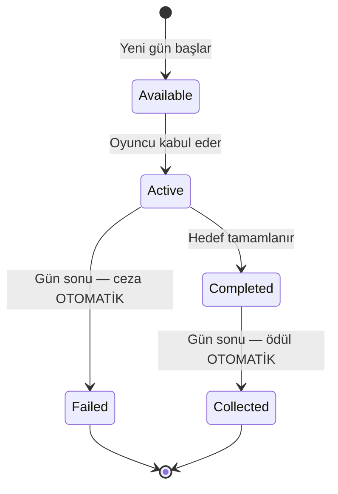

> [!IMPORTANT]
> **"Topla" adımı kaldırıldı** (2026-07-28). Ödül ve ceza gün sonunda
> `SettleAcceptedQuestsForDayEnd()` ile otomatik uygulanır; oyuncunun butona basması gerekmez.
> **Gün 16** ayrı bir yol: `NextDay()` win dalı `OnNewDay`'i hiç tetiklemediği için settlement de
> çalışmıyordu — son günün kabul edilmiş görevi cezasız/ödülsüz kalıyordu.
> `SettleAcceptedQuestsOnGameEnd()` bunu kapatıyor (idempotent, `IsServer` guard'lı).

### 16.4 Görev Tipleri

| enum | Görev Tipi | Durum | Katalogda |
|---|-----------|-------|-----------|
| 1 | **PlaceBoxOnShelf** | ✅ canlı | **13 asset** |
| 3 | **PackToy** | ✅ canlı | **12 asset** |
| 2 | **CompleteTruck** | ✅ canlı | **3 asset** |
| 4 | **AnswerPhone** | ✅ canlı | **2 asset** |
| 6 | **CompleteSpecificColorTruck** | ⚠️ bağlı ama kullanılmıyor | 0 |
| 0 | **CompleteMinigame** | 🔴 **ÖLÜ** — `QuestTracker.NotifyMinigameCompleted()` çağıranı yok | 0 |
| 5 | **MakePackagingMistake** | 🔴 **ÖLÜ** — `NotifyPackagingMistake()` çağıranı yok | 0 |

> Ölü tipler canlı bug değil (hiçbir asset kullanmıyor), ama yeni görev tipi eklemeden önce
> tetikleyicilerinin bağlanması gerekir.

### 16.5 Hedef Ölçekleme (D2) — şu an etkisiz

`CalculateEffectiveTargetCount` görev hedefini oyuncu sayısıyla ölçeklemek için var, **ama dört
canlı fiilin dördü de muaf** (`PlaceBoxOnShelf`, `PackToy`, `CompleteTruck`, `AnswerPhone`) →
mevcut katalogda **tamamen no-op**.

Sebep: `targetCount` değerleri 2026-07-29 turunda **zaten tüm P bantlarında** ~%85 tamamlanma
hedeflenerek kalibre edilmişti. D2 onların üstüne bir kez daha çarpınca sim'de renksiz raf/paket
tamamlanma olasılığı **3P 0.76 → 0.13**, **4P 0.87 → 0.13**'e düşüyordu (çifte ölçekleme).

Mekanizma, arzı oyuncu sayısıyla ölçeklenMEYEN gelecekteki görev tipleri için duruyor.

> Kart açıklamasında gösterilen sayı `QuestProgress.targetProgress`'ten gelir (tek doğruluk kaynağı),
> asset'teki ham `targetCount`'tan değil — aksi halde ölçekleme açılınca kart yanlış hedef gösterirdi.

### 16.6 Görev Ödül Tipleri (buff kanalı)

Mevcut 30 asset'in **hiçbirinde buff yok** — hepsi yalnız para + prestij veriyor. Buff'lı görev
eklenecekse aşağıdaki tuzaklara dikkat:

| Ödül | Etki | Not |
|------|------|-----|
| **Money** / **Prestige** | Para / prestij | ✅ kullanımda |
| **MaxStamina**, **MoveSpeed**, **WalkSpeed**, **StaminaRegenRate**, **DayDuration**, **MaxQueueSize**, **CustomerWaitTime** | İlgili değeri artırır | ⚠️ Hepsi **KALICI** — günlük tekrarlanan bir görevde verilirse **birikir** |
| **TempSpeedBoost**, **PenaltyReduction** | Geçici bonus | ✅ süreli |
| **TempMoneyBoost** | — | 🔴 **`buffType` VARSAYILANI bu** ama `TempMoneyPerBox`'ı okuyan sistem yok → **ölü buff**: kartta yazar, hiçbir şey yapmaz |

### 16.7 Görev Takip Sistemi (QuestTracker)

Statik event dispatcher — oyun sistemleri event ateşler, QuestManager ilerlemeyi takip eder:

```
Truck.OnDeliveryComplete → QuestTracker.NotifyTruckCompleted()
PhoneCallManager.OnCallSuccess → QuestTracker.NotifyPhoneAnswered()
PlayerInventory.OnBoxPlaced → QuestTracker.NotifyBoxPlaced()
```

> [!WARNING]
> **Raf görevi dedup'u**: `BoxInfo.countedForShelfQuest` bayrağı olmadan "rafa koy → geri al →
> tekrar koy" döngüsüyle tek kutuyla hedef 12 ~30 saniyede tamamlanabiliyordu (P0 exploit, kapatıldı).
> Bilinen kısıt: bayrak tek boolean, yani bir kutu bir kez sayıldıktan sonra **farklı** bir
> raf/renk görevine de sayılmıyor — aşırı kısıtlayıcı ama exploit değil, tasarım tercihi.

---

## 17. 🎮 Oyuncu Hareketi ve Fizik

> **Kaynaklar**: [PlayerMovement.cs](file:///c:/Users/cicek/Documents/GitHub/Cargor/Assets/NewCss/CharacterScript/PlayerMovement.cs), [PlayerSpawner.cs](file:///c:/Users/cicek/Documents/GitHub/Cargor/Assets/NewCss/PlayerSpawner.cs)

### 17.1 Hareket Parametreleri

| Parametre | Değer | Açıklama |
|-----------|-------|----------|
| Normal hız | **5 m/s** | Standart yürüme |
| Sprint hızı | **7 m/s** | Koşma |
| Bitkin hız | **3 m/s** | Stamina bittiğinde |
| Sprint süresi | **3 saniye** | Maksimum koşma |
| Sprint bekleme | **3 saniye** | Koşmadan sonra cooldown |
| Stamina yenilenme | **1.0/s** | Baz yenilenme hızı |

### 17.2 Oyuncu Durumları

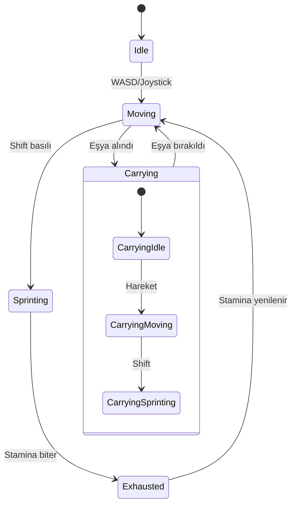

### 17.3 Ağ Senkronizasyonu

- **X/Z hareketi** ağ üzerinden senkronize
- **Koşma durumu** NetworkVariable
- **Taşıma durumu** NetworkVariable
- **Ses**: Yürüme ve koşma adım sesleri, volume kontrolü ile

### 17.4 Oyuncu Spawn Sistemi

- **Sahne**: Yalnızca "The Main Office" sahnesinde
- Önceden tanımlanmış spawn noktalarından rastgele seçilir
- Geç katılan oyuncular (late join) desteklenir
- Bağlantı koptuğunda oyuncu temizlenir

### 17.5 Karakter Özelleştirme

> **Kaynak**: [SkinToneManager.cs](file:///c:/Users/cicek/Documents/GitHub/Cargor/Assets/NewCss/SkinToneManager.cs)

- Ten rengi seçimi
- Ana menüde özelleştirme UI'ı (`MainMenuCustomizationUI`)

---

## 18. 🛏️ Dinlenme Odası Sistemi

> **Kaynak**: [BreakRoomManager.cs](file:///c:/Users/cicek/Documents/GitHub/Cargor/Assets/NewCss/BreakRoomScripts/BreakRoomManager.cs)

### 18.1 Amaç

Gün sonunda tüm oyuncuların dinlenme odasında toplanması gerekmektedir. Bu, oyuncuların birbirini beklemesini ve gün sonunu senkronize bitirmesini sağlar.

### 18.2 Mekanikler

| Özellik | Detay |
|---------|-------|
| Algılama | Trigger Collider ("Character" tag) |
| Hazır koşulu | **Tüm bağlı oyuncular** odanın içinde |
| Steam entegrasyonu | Lobby'den oyuncu sayısı alınır |
| Events | `OnBreakRoomReady`, `OnPlayerEntered`, `OnPlayerExited` |

### 18.3 Akış

1. Gün biter (saat 18:00)
2. Oyunculara "Dinlenme Odasına Git" mesajı gösterilir
3. Oyuncular odaya girer → `OnPlayerEntered` event'i
4. Tüm oyuncular girdiğinde → `isBreakRoomReady = true`
5. Gün sonu özet ekranı gösterilir
6. Yeni gün başlar

---

## 19. ⚖️ Zorluk Sistemi

> **Kaynak**: [DifficultyManager.cs](file:///c:/Users/cicek/Documents/GitHub/Cargor/Assets/NewCss/GameState/DifficultyManager.cs)

### 19.1 Oyuncu Sayısına Göre Ölçekleme

Her ek oyuncu için uygulanan değişiklikler:

| Parametre | Kaynak | 1P | 2P | 3P | 4P |
|-----------|--------|-----|-----|-----|-----|
| Müşteri sayısı | `customerCountPerPlayer=2` | 10 | 12 | 14 | 16 |
| Başlangıç parası | `moneyMultiplierPerPlayer=1.2` (üstel) | 500 | 600 | 720 | 864 |
| Müşteri sabrı | `patienceReductionPerPlayer=2` | 8-14s | 6-12s | 4-10s | 2-8s |
| Stamina tüketimi | `staminaDrainMultiplierPerPlayer=1.1` | ×1.0 | ×1.1 | ×1.21 | ×1.33 |
| **Upgrade maliyeti** | `upgradeCostMultiplierByPlayerCount` (**DİZİ**) | ×1.00 | ×2.00 | ×2.95 | ×3.70 |
| **Kira** | `baseRentByPlayerCount` | 500 | 1.000 | 1.450 | 1.800 |
| **Tır kargosu** | `truckCargoMin/MaxExclusive` | 1–2 | 2–3 | 2–4 | 2–5 |
| **Hangar bekleme** | `hangarStayDurationByPlayerCount` | 120s | 60s | 40s | 30s |
| **Telefon şansı** | `phoneRingChanceByPlayerCount` | %20 | %25 | %30 | %35 |

> [!NOTE]
> **Telefon şansı ve upgrade maliyeti artık `DifficultyManager`'da DEĞİL.**
> `basePhoneCallChance`, `phoneChancePerPlayer`, `ScaledPhoneCallChance` ve
> `upgradeCostMultiplierPerPlayer` (tek float) **silindi** — ilk üçü hiçbir sisteme bağlı değildi.
> Telefon `GameEconomySettings`'e, upgrade maliyeti diziye taşındı.

### 19.2 Ölçülen Gelir Ölçeği

Sim v3.1 ölçümü — **1 : 1.73 : 2.40 : 2.95**. Kira ölçeği (1 : 2.00 : 2.90 : 3.60) bundan
bilinçli olarak dik: kalabalık takım koordinasyon avantajını kirayla geri ödüyor.

### 19.3 Tasarım Felsefesi

> Daha fazla oyuncu = daha fazla iş gücü, ama aynı zamanda daha fazla müşteri, daha yüksek kira
> ve çok daha pahalı upgrade'ler. Co-op'un gücü koordinasyonda, ham güçte değil.

---

## 20. 🌅 Gece-Gündüz Aydınlatma

> **Kaynak**: [DayLightController.cs](file:///c:/Users/cicek/Documents/GitHub/Cargor/Assets/NewCss/DayLightController.cs)

### 20.1 Güneş Animasyonu

Directional Light, `DayCycleManager` ilerlemesine göre animasyon gösterir:

| Özellik | Gün Başı (07:00) | Öğlen (12:30) | Gün Sonu (18:00) |
|---------|-----------------|---------------|-------------------|
| X Rotasyonu | -180° | 0° | +180° |
| Renk | Sıcak beyaz | Beyaz | Turuncu |
| Yoğunluk | 0.5 | 1.0 (pik) | 0.05 |

### 20.2 Geçişler

- Pürüzsüz (smooth) geçişler
- Yapılandırılabilir hız parametreleri
- Her yeni günde sıfırlanır

---

## 21. 🏁 Oyun Durumu: Kazanma ve Kaybetme

> **Kaynak**: [GameStateManager.cs](file:///c:/Users/cicek/Documents/GitHub/Cargor/Assets/NewCss/GameState/GameStateManager.cs)

### 21.1 Kazanma Koşulu

$$\text{KAZANDIN} = (\text{Gün} \geq 16)$$

16. günü tamamlamak — yani prestij sıfırlanmadan ve iflas etmeden o güne ulaşmak.

> [!WARNING]
> **`CheckWinCondition` prestije BAKMIYOR.** Yalnız `currentDay >= MAX_DAYS` kontrol ediliyor.
> Prestij zaten sıfıra düşünce oyun anında bittiği için pratikte fark yaratmıyor, ama
> dokümandaki eski "∧ Prestij > 0" ifadesi kodda karşılığı olmayan bir koşuldu.

### 21.2 Kaybetme Koşulları (2 Yol)

| # | Koşul | Tetikleyen | Detay |
|---|-------|-----------|-------|
| 1 | **İflas** | Kira ödeyememe (2. kez) | Grace period kullanılmış + yine ödeyemiyor |
| 2 | **Prestij sıfırlanması** | Prestij ≤ 0 (**clamp öncesi ham değer**) | Çok fazla müşteri kaçırma/hata/görev cezası |

> ~~3. Kota başarısızlığı~~ — **kaldırıldı**, `QuotaManager` tamamen silindi (bkz. §7).

> [!IMPORTANT]
> **Kazanılmış oyun kaybedilemez.** `TriggerWin` ve `TriggerLose` artık `gameEnded` guard'lı
> (`f013f5d`). Bu guard olmadan gün 16 zaferinden SONRA çalışan quest settlement'ı, tamamlanmayan
> bir görevin prestij cezasıyla prestiji sıfırlayıp zafer ekranının üstüne kayıp ekranı basıyordu.

### 21.3 Game Over Akışı

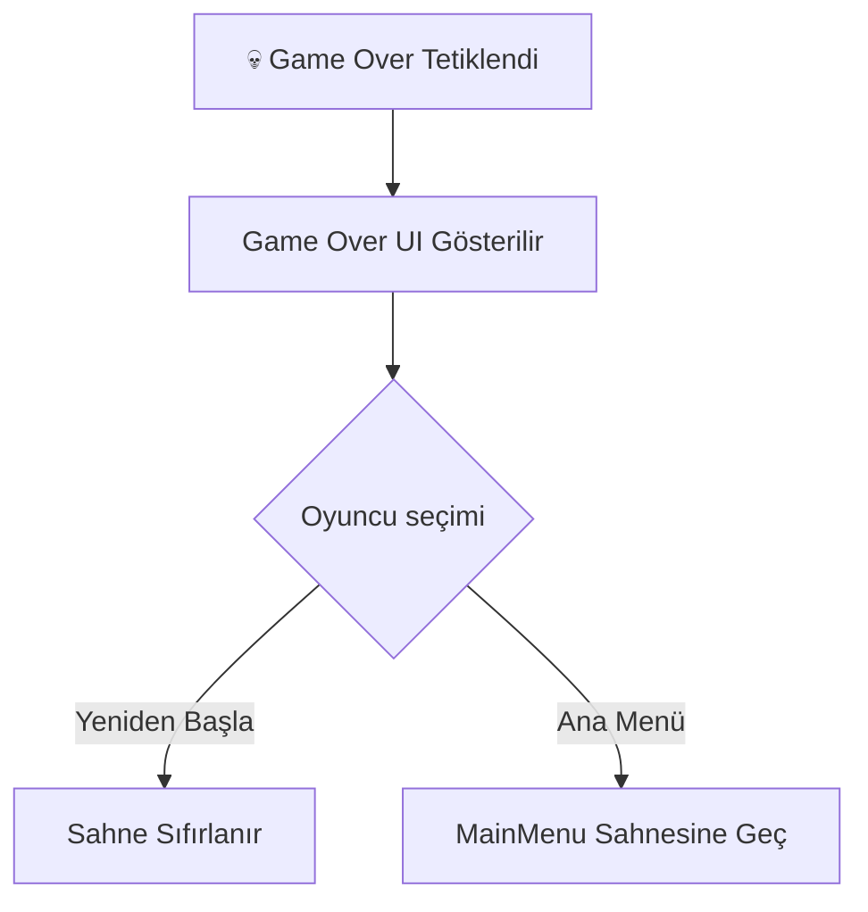

### 21.4 Önemli: DontDestroyOnLoad

`GameStateManager` singleton'dır ve `DontDestroyOnLoad` ile sahne geçişlerinde korunur.

---

## 22. 🎓 Tutorial Sistemi

> **Kaynak**: [TutorialManager.cs](file:///c:/Users/cicek/Documents/GitHub/Cargor/Assets/NewCss/Tutorial/TutorialManager.cs)

### 22.1 Özellikler

| Özellik | Detay |
|---------|-------|
| Yapı | Adım bazlı (step-based) akış |
| Metin efekti | Daktiloğraf (typewriter) efekti |
| Vurgulama | Hedef objelere outline |
| Kapı yönetimi | Tutorial kapıları ilerlemeye göre açılır/kapanır |
| Lokalizasyon | Türkçe + İngilizce |
| Ağ | NetworkBehaviour ile multiplayer senkronize |
| Sahne | Ayrı "Tutorial" sahnesi |

### 22.2 Tutorial Akışı

1. Oyuncu Tutorial sahnesine girer
2. Adım adım yönergeler gösterilir (typewriter efektiyle)
3. Her adımda hedef obje vurgulanır (outline)
4. Oyuncu eylemi tamamladığında sonraki adıma geçilir
5. Tüm adımlar tamamlanınca ana oyun sahnesine geçilir

---

## 23. 🌐 Multiplayer ve Ağ Mimarisi

### 23.1 Ağ Altyapısı

| Bileşen | Teknoloji |
|---------|-----------|
| Framework | Unity Netcode for GameObjects |
| Transport | Facepunch Transport (Steam P2P) |
| Topoloji | Host-Client (dedicated server yok) |
| Maksimum oyuncu | **4** |
| Otorite | **Server-authoritative** |

### 23.2 Senkronizasyon Stratejisi

| Veri | Yöntem | Yön |
|------|--------|-----|
| Oyuncu pozisyonu | NetworkVariable | Server → Client |
| Para | NetworkVariable | Server → Client (read-only) |
| Prestij | NetworkVariable | Server → Client |
| Gün sayısı | NetworkVariable | Server → Client |
| Eşya durumu | NetworkVariable | Server → Client |
| Oyuncu eylemleri | ServerRpc | Client → Server |
| Geri bildirimler | ClientRpc | Server → Client |

### 23.3 Güvenlik

- Tüm ekonomik işlemler **sunucu tarafında** hesaplanır
- Client sadece **input gönderir** (ServerRpc)
- Eşya kilitleme: Statik dictionary ile çift alma engeli

---

## 24. 🎮 Steam Entegrasyonu

> **Kaynak**: [SteamManager.cs](file:///c:/Users/cicek/Documents/GitHub/Cargor/Assets/NewCss/Steam/SteamManager.cs)

### 24.1 Özellikler

| Özellik | Detay |
|---------|-------|
| SDK | Steamworks.NET |
| Transport | Facepunch Transport (Steam Relay) |
| Lobi yönetimi | Oluşturma / Katılma |
| Lobi kodu | **Base36** encoded benzersiz kodlar |
| Oyuncu slotları | 4 max (dolu/boş sprite'lar) |
| Kick sistemi | Host oyuncuları atabilir |
| Versiyon kontrolü | Lobby data'da oyun versiyonu |
| Yükleme ekranı | İlerleme barı + animasyonlu noktalar |

### 24.2 Lobi Akışı

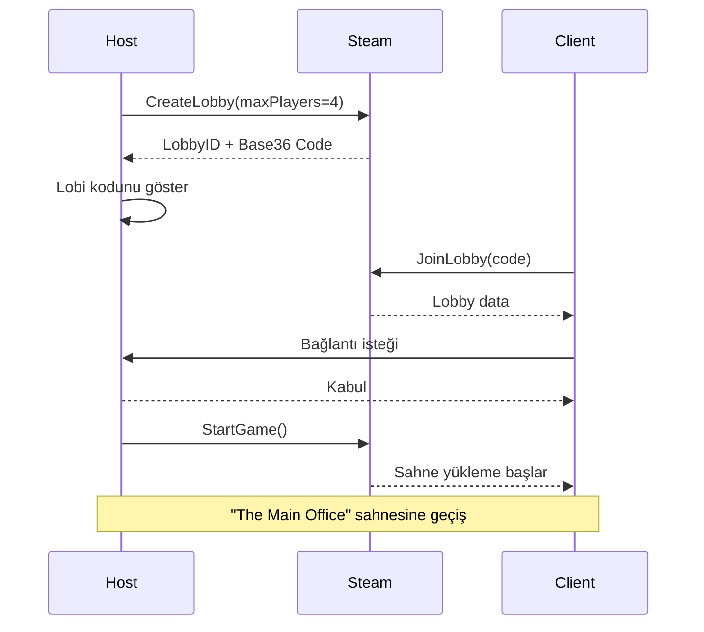

---

## 25. 🎮 Discord Entegrasyonu

> **Kaynak**: [DiscordController.cs](file:///c:/Users/cicek/Documents/GitHub/Cargor/Assets/Scripts/DiscordController.cs)

- Discord Rich Presence desteği
- Oyun durumu görüntüleme (hangi gün, kaç oyuncu vb.)
- Davet sistemi entegrasyonu

---

## 26. 🖥️ UI / UX Tasarımı

### 26.1 Sahneler ve UI Yapıları

| Klasör | İçerik |
|--------|--------|
| `Assets/MainMenu/` | Ana menü sahnesi |
| `Assets/Main Menu UI/` | Ana menü UI bileşenleri |
| `Assets/MENUUI/` | Menü UI elementleri |
| `Assets/Host Game/` | Oyun oluşturma UI'ı |
| `Assets/Join Room/` | Odaya katılma UI'ı |
| `Assets/WinLoseUI/` | Kazanma/Kaybetme ekranları |
| `Assets/SettingsUı/` | Ayarlar paneli |
| `Assets/LocalSettings/` | Yerel ayarlar |
| `Assets/Figma/` | Figma tasarım referansları |

### 26.2 Oyun İçi HUD Elemanları

| Eleman | Konum | Güncelleme |
|--------|-------|-----------|
| Gün sayısı ("Day N") | Üst | Her gün |
| Saat | Üst | 10 FPS throttle |
| Para | Üst-sağ | `OnMoneyChanged` event |
| Prestij | Üst-sağ | Anlık |
| Müşteri sabır barı | Müşteri üzeri | Sürekli |
| Telefon bekleme barı | Telefon alanı | E basılıyken |

### 26.3 Animasyonlar

| Animasyon | Dosya | Kullanım |
|-----------|-------|----------|
| Yürüme | `Walk_Forward.anim` | Karakter hareketi |
| Mağaza açılış | `ShopOpening.anim` | Mağaza açılış animasyonu |
| Mağaza kapanış | `ShopExit.anim` | Mağaza kapanış animasyonu |
| Takvim açılış | `DateOpening.anim` | Etkinlik takvimi açılış |
| Takvim kapanış | `DateExit.anim` | Etkinlik takvimi kapanış |
| Upgrade panel | `UpgradePanel.controller` | Panel açılış/kapanış |

### 26.4 Escape Menüsü

> **Kaynak**: [EscapeMenuManager.cs](file:///c:/Users/cicek/Documents/GitHub/Cargor/Assets/NewCss/EscapeMenuManager.cs)

- ESC tuşuyla açılır
- Ayarlar, devam et, çıkış seçenekleri
- Input binding yönetimi entegrasyonu (`InputBindingManager.cs`)

---

## 27. 🔊 Ses Tasarımı

### 27.1 Ses Kaynakları

| Ses | Dosya | Kullanım |
|-----|-------|----------|
| Tır motor sesi | `motor_sound_when_ope_#1.wav` | Tır gelişi |
| Tır çıkış sesi | `the_sound_of_a_car_m.wav` | Tır kalkışı |
| Tır bekleme sesi | `Clean_recording_of_a_#1.wav` | Tır hangarda beklerken (loop) |
| Kutu düşme sesi | BoxFallPenalty ses | 3D spatial audio |

### 27.2 Ses Kategorileri

| Kategori | Klasör | Örnekler |
|----------|--------|---------|
| Müzik | `Assets/Music/` | Arka plan müziği |
| Ses efektleri | `Assets/Sounds/` | Genel ses efektleri |
| Tır sesleri | TruckScripts içinde | Motor, çıkış, bekleme |
| Etkileşim sesleri | PlayerInventory.Audio | Alma, bırakma, fırlatma |
| UI sesleri | Çeşitli | Buton, bildirim |

### 27.3 3D Spatial Audio

- Kutu düşme sesleri 3D spatial audio ile oynatılır
- Tır motor sesleri mesafeye göre zayıflar
- Müşteri ses efektleri pozisyona bağlı

---

## 28. 🌍 Lokalizasyon

> **Kaynak**: [LocalizationHelper.cs](file:///c:/Users/cicek/Documents/GitHub/Cargor/Assets/NewCss/Localization/LocalizationHelper.cs)

### 28.1 Desteklenen Diller

| Dil | Kod | Durum |
|-----|-----|-------|
| 🇹🇷 Türkçe | `tr` | Birincil |
| 🇬🇧 İngilizce | `en` | İkincil |

### 28.2 Sistem

- Unity Localization paketi kullanılır
- `LocalizationHelper.GetLocalizedString(key)` ile merkezi erişim
- Upgrade isimleri lokalize edilir (`Upgrade_{ItemType}` formatında)
- Tutorial metinleri her iki dilde

---

## 29. 🏗️ Teknik Mimari

### 29.1 Proje Yapısı

```
Assets/
├── NewCss/                     # Ana oyun kodu namespace'i
│   ├── BoxScripts/             # Kutu mekanikleri
│   ├── BreakRoomScripts/       # Dinlenme odası
│   ├── CharacterScript/        # Oyuncu hareketi
│   ├── CustomerSripts/         # Müşteri AI, Prestij, Kuyruk
│   ├── Echonomy/               # Ekonomi scriptleri
│   ├── Events/                 # Etkinlik sistemi
│   ├── GameState/              # Oyun durumu, gün döngüsü, zorluk
│   ├── InfoScripts/            # Bilgi scriptleri
│   ├── Localization/           # Dil desteği
│   ├── Network/                # Ağ kodları
│   ├── NewPickup/              # Pickup sistemi (v2)
│   ├── Notes/                  # Not sistemi
│   ├── Phone/                  # Telefon sistemi
│   ├── PickUpScripts/          # Pickup sistemi (v1)
│   ├── Quest/                  # Görev sistemi
│   ├── Steam/                  # Steam entegrasyonu
│   ├── TableScripts/           # Raf ve masa
│   ├── TruckScripts/           # Tır sistemi
│   ├── Tutorial/               # Eğitim sistemi
│   ├── UIScripts/              # UI bileşenleri
│   ├── UpgradeScripts/         # Yükseltme sistemi
│   ├── GameEconomySettings.cs  # Ekonomi ScriptableObject
│   ├── PlayerSpawner.cs        # Oyuncu spawn
│   ├── DayLightController.cs   # Aydınlatma
│   ├── EscapeMenuManager.cs    # Pause menü
│   └── SkinToneManager.cs      # Karakter özelleştirme
├── Scripts/
│   ├── Discord/                # Discord entegrasyonu
│   └── Quest/                  # Ek görev scriptleri
├── Models/                     # 3D modeller ve materyaller
├── Scenes/                     # Unity sahneleri
├── Shaders/                    # Custom shader'lar
├── Font/                       # Yazı tipleri
├── Music/                      # Müzik dosyaları
├── Sounds/                     # Ses efektleri
└── UI/                         # UI asset'leri
```

### 29.2 Tasarım Kalıpları

| Kalıp | Kullanım | Örnekler |
|-------|----------|---------|
| **Singleton** | Tüm manager'lar | DayCycleManager, MoneySystem, PrestigeManager |
| **NetworkBehaviour** | Multiplayer senkronize objeler | Truck, CustomerAI, PlayerMovement |
| **ScriptableObject** | Yapılandırma verileri | GameEconomySettings, WaveSettings, ItemData |
| **Observer (Event)** | Sistem arası iletişim | OnNewDay, OnMoneyChanged, QuestTracker.Notify* |
| **Partial Class** | Büyük sınıf bölme | PlayerInventory (6 parça) |
| **Server-Auth** | Güvenli oyun durumu | Tüm ekonomik işlemler |

### 29.3 Sahne Yapısı

| Sahne | Dosya | Amaç |
|-------|-------|------|
| Main Menu | `MainMenu` (klasör) | Ana menü, lobi, ayarlar |
| Tutorial | `Tutorial.unity` (1.2 MB) | Eğitim sahnesi |
| The Main Office | `The Main Office.unity` (6.4 MB) | Ana oyun sahnesi |

### 29.4 Render Pipeline

- **URP** (Universal Render Pipeline) kullanılıyor
- Custom shader'lar (`Assets/Shaders/`)
- QuickOutline paketi (eşya vurgulama)
- Figma Bridge entegrasyonu (`UnityFigmaBridgeSettings.asset`)

---

## 30. 🔗 Sistem Bağlantı Haritası

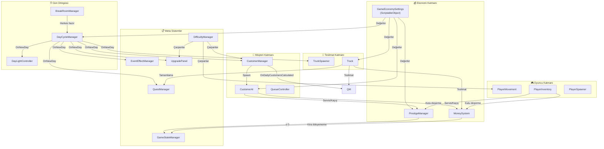

---

## 31. 📊 Ekonomi Simülasyon Verileri

> **Kaynak**: `tools/economy-sim/sim.js` (Node — `node tools/economy-sim/sim.js`).
> Analiz raporları: `plans/economy-rebuild-2026-07-30{,-faz2,-faz3,-faz4-final}.md`.

> [!NOTE]
> **C# içi `RunSimulation()` ContextMenu simülasyonu SİLİNDİ.** Sim artık Unity'den bağımsız,
> Node tarafında yaşıyor ve **v3.1** sürümünde. Başlığındaki her değer `dosya:satır` ile belgeli —
> denetimden önce gerçek koda karşı doğrula.

### 31.1 Simülasyon Bantları

Sim iki uçtan koşturulur; gerçek oyun bu ikisinin arasında bir yerde:

| Bant | Anlamı |
|------|--------|
| **OPTIMISTIC** | Oyuncular hiç hata yapmaz, boşta durmaz — üretim tavanı |
| **STRICT** | Gerçekçi hata/gecikme payı — hayatta kalma tabanı |

**En duyarlı girdiler** (duyarlılık sırasıyla):

| # | Girdi | Etkisi |
|---|-------|--------|
| 1 | `kutu/dk/oyuncu` | 1.2 ↔ 2.0 arası 1P kümülatif geliri **%117** değiştiriyor |
| 2 | `tableBusySeconds` (masa meşguliyeti) | 4s ↔ 8s, Paketleme İstasyonu'nun değerini **4×** değiştiriyor |
| 3 | `agile_crew`'in üretime yansıması | ölçülmedi |
| 4 | telefon yanıtlamanın oyuncu-saniyesi maliyeti | ölçülmedi |

> [!CAUTION]
> **1. girdi hâlâ ÖLÇÜLMEDİ — tahmin.** Bir oyun günü yalnızca 200–330 gerçek saniye, bu yüzden
> mutlak TL değil **oranlarla** konuşulmalı. Play-test'te bu sayı ölçülünce tüm tablo tek katsayıyla
> kaydırılabilir.

### 31.2 Simülasyon Mantığı

Her simülasyon günü şu adımları takip eder:

1. **Gün süresi**: `realDurationInSeconds = 200s` (sahne değeri; `.cs` default'u da 200'e hizalandı)
2. **Beklenen müşteri**: oyuncu sayısına göre `10 / 12 / 14 / 16`
3. **Üretim kapasitesi**: `kutu/dk/oyuncu × süre × oyuncu` — **modelin en duyarlı girdisi**
4. **Masa çekişmesi**: sahnede `Table` taşıyan tam 2 obje var, ikisi de Paketleme İstasyonu
   `levelObjects`'i → **sv0'da TEK masa**. `tableBusySeconds` 2. en duyarlı girdi
5. **Tır penceresi**: P-bazlı kargo aralığı + hangar bekleme süresi (darboğaz DEĞİL, %10-42 kullanım)
6. **Gelir**: doğru teslimat × (rewardPerBox + prestij tier bonusu) + telefon + görev ödülü
7. **Ceza**: yanlış teslimat, kutu düşürme, kaçan müşteri, tamamlanmayan görev
8. **Kira kontrolü**: gün % 4 == 0 → hesapla ve öde / grace / iflas
9. **Upgrade**: Kira günü değilse ve kasa > 200 → fazlasının %50'si upgrade'e

### 31.3 10 Günlük Karşılaştırma (Yeni Kapasite Sistemi)

Senaryo: Oyuncu her 2 günde 1 raf ekler, mağaza seviyesi her 3 günde 1 artar.

| Gün | Raf+Masa | Seviye | Eski Sistem | Yeni (Solo) | Yeni (2 Oyuncu, ×1.3) |
|-----|----------|--------|------------|-------------|----------------------|
| 1 | 3 | 1 | 10 | 9-14 | 12-18 |
| 2 | 3 | 1 | 12 | 9-14 | 12-18 |
| 3 | 4 | 2 | 14 | 16-21 | 21-27 |
| 4 | 4 | 2 | 16 | 16-21 | 21-27 |
| 5 | 5 | 2 | 18 | 19-24 | 25-31 |
| 6 | 5 | 3 | 20 | 21-26 | 27-34 |
| 7 | 6 | 3 | 22 | 24-29 | 31-38 |
| 8 | 6 | 3 | 24 | 24-29 | 31-38 |
| 9 | 7 | 4 | 26 | 29-34 | 38-44 |
| 10 | 7 | 4 | 28 | 29-34 | 38-44 |

---


> **Bu belge, Cargor projesinin canlı bir tasarım referansıdır. Oyun geliştikçe güncellenmelidir.**
>
> 📝 *Son güncelleme: 6 Temmuz 2026 — Eclion Software*
