# 📦 CARGOR — Game Design Document (GDD)

> **Stüdyo**: Eclion Software
> **Proje Adı**: Cargor
> **Motor**: Unity (Netcode for GameObjects)
> **Platform**: PC (Steam)
> **Tür**: Co-op Kargo / Mağaza Yönetimi Simülasyonu
> **Oyuncu Sayısı**: 1–4 (Online Co-op)
> **Motor Sürümü**: Unity 6000.5.6f1 (URP)
> **Durum**: Geliştirme Aşamasında
> **Son Güncelleme**: 30 Ağustos 2026 — PlateUp kota + Telefon V4 senkronu (ekonomi Round 9)

---

> [!IMPORTANT]
> **Ekonomi bölümleri (§2.2, §3, §4, §5, §6, §7, §8, §9, §10, §13, §14, §15, §16, §19, §31)
> 30 Ağustos 2026'da koda karşı satır satır yeniden doğrulandı** ("Tam Kapsamlı Ekonomi Dengeleme"
> turu, Round 9). Referans: `plans/economy-full-balance-2026-08-30.md` ve
> `.claude/agent-memory/economist/economy_full_balance_round*.md`.
>
> Bu bölümlerdeki sayılar `Assets/Editor/EconomyInvariantCheck.cs` tarafından **77 `Expect*`
> iddiasıyla** (dizi kontrolleri tek iddiada birden çok değeri kapsar) denetleniyor — menü
> `Cargor / Ekonomi Değerlerini Doğrula`. **Bir değeri değiştirirsen orayı da güncelle**, yoksa
> denetçi kırmızı yanar.
>
> **§7 (eski kutu kotası) kaldırıldı, yerine PlateUp müşteri kotası geldi** — artık bir
> kaybetme koşulu DEĞİL, günlük müşteri arzı tablosu (bkz. §7).

> [!CAUTION]
> **Bu belge şu anki CANLI kodu anlatır.** 2026-08-30 dengeleme turunda önerilen ama **henüz
> uygulanmamış** değerler (kira `{290,650,1140,1630}`, `timeSkipAmountByPlayerCount={115,49,47,47}`,
> quest prestij ×0.4, `DAILY_QUEST_COUNT=3+tier`) bilinçli olarak **buraya yazılmadı** —
> uygulama turu (Round 10) sonrası bu belge tekrar senkronlanmalı. Öneri listesi:
> `plans/economy-full-balance-2026-08-30.md` → "Biriken, henüz KOD'A UYGULANMAMIŞ öneriler".

---

## 📑 İçindekiler

1. [Oyun Vizyonu ve Konsepti](#1--oyun-vizyonu-ve-konsepti)
2. [Temel Oynanış Döngüsü](#2--temel-oynanış-döngüsü)
3. [Gün Döngüsü Sistemi](#3--gün-döngüsü-sistemi)
4. [Ekonomi Sistemi](#4--ekonomi-sistemi)
5. [Kira Sistemi](#5--kira-sistemi)
6. [Prestij Sistemi](#6--prestij-sistemi)
7. [Müşteri Kotası (PlateUp modeli)](#7--müşteri-kotası-plateup-modeli)
8. [Tır / Teslimat Sistemi](#8--tır--teslimat-sistemi)
9. [Müşteri Sistemi](#9--müşteri-sistemi)
10. [Kutu ve Eşya Sistemi](#10--kutu-ve-eşya-sistemi)
11. [Pickup / Envanter Sistemi](#11--pickup--envanter-sistemi)
12. [Raf ve Masa Sistemi](#12--raf-ve-masa-sistemi)
13. [Yükseltme (Upgrade) Sistemi](#13--yükseltme-upgrade-sistemi)
14. [Telefon Sistemi](#14--telefon-sistemi)
15. [Etkinlik (Event) Sistemi](#15--etkinlik-event-sistemi)
16. [Görev (Quest) Sistemi](#16--görev-quest-sistemi)
17. [Oyuncu Hareketi ve Fizik](#17--oyuncu-hareketi-ve-fizik)
18. [Dinlenme Odası Sistemi](#18--dinlenme-odası-sistemi)
19. [Zorluk Sistemi](#19--zorluk-sistemi)
20. [Gece-Gündüz Aydınlatma](#20--gece-gündüz-aydınlatma)
21. [Oyun Durumu: Kazanma ve Kaybetme](#21--oyun-durumu-kazanma-ve-kaybetme)
22. [Tutorial Sistemi](#22--tutorial-sistemi)
23. [Multiplayer ve Ağ Mimarisi](#23--multiplayer-ve-ağ-mimarisi)
24. [Steam Entegrasyonu](#24--steam-entegrasyonu)
25. [Discord Entegrasyonu](#25--discord-entegrasyonu)
26. [UI / UX Tasarımı](#26--ui--ux-tasarımı)
27. [Ses Tasarımı](#27--ses-tasarımı)
28. [Lokalizasyon](#28--lokalizasyon)
29. [Teknik Mimari](#29--teknik-mimari)
30. [Sistem Bağlantı Haritası](#30--sistem-bağlantı-haritası)
31. [Ekonomi Simülasyon Verileri](#31--ekonomi-simülasyon-verileri)
32. [Bilinen Riskler ve Açık Sorular](#32--bilinen-riskler-ve-açık-sorular)

---

## 1. 🎯 Oyun Vizyonu ve Konsepti

### 1.1 Elevator Pitch

> *Cargor, 1-4 oyuncunun bir kargo mağazasını birlikte yönettiği, müşterilere doğru kutuları hazırlayıp tırlara yüklediği, kirasını ödeyip mağazasını büyütmeye çalıştığı kooperatif bir simülasyon oyunudur. "Overcooked meets Warehouse Simulator" ruhunda, basit ama derinlikli mekanikler, artan zorluk ve kaotik co-op eğlence sunar.*

### 1.2 Temel Fantezi

Oyuncu, küçük bir kargo mağazasının çalışanıdır. Her gün gelen müşterilere doğru renkte kutuları hazırlamalı, tırlara doğru kutuları yüklemeli ve gün sonunda kirasını ödeyebilecek kadar para kazanmalıdır. Mağaza büyüdükçe tırlara erişim artar, raf ve masa kapasitesi genişler, ama kira da artar. 16 gün boyunca iflas etmeden ve prestijini kaybetmeden ayakta kalmak temel hedeftir.

### 1.3 Hedef Kitle

- **Birincil**: Co-op oyun seven arkadaş grupları (Overcooked, Plate Up!, Moving Out hayranları)
- **İkincil**: Solo simülasyon severler
- **Yaş Aralığı**: 13+
- **Platform**: PC (Steam)

### 1.4 Benzersiz Satış Noktaları (USP)

1. **PlateUp tarzı günlük müşteri kotası** — Her günün müşteri sayısı önceden belli ve gün numarasına bağlı; oyuncu kotayı bitirince gün erken kapanır (bkz. §7)
2. **Çok katmanlı ekonomi** — Kira, prestij, görev ödülleri ve oyuncu-sayısına ölçekli upgrade maliyetleri iç içe geçmiş dengeli bir ekonomi
3. **17 farklı günlük etkinlik** — Her oyun farklı hissettiren rastgele olaylar
4. **Prestij-bazlı bonus sistemi** — İyi oynamak eksponansiyel ödüller getirir
5. **Kooperatif kaos** — 4 oyuncuya kadar eşzamanlı mağaza yönetimi

### 1.5 Referans Oyunlar

| Oyun | Alınan İlham |
|------|-------------|
| Overcooked | Kaotik co-op mekanikler, zaman baskısı |
| Plate Up! | Mağaza genişletme, upgrade sistemi |
| Supermarket Simulator | Müşteri servisi, raf yönetimi |
| Papers, Please | Günlük kira/kota baskısı, hikaye ilerleyişi |

---

## 2. 🔄 Temel Oynanış Döngüsü

### 2.1 Makro Döngü (16 Günlük Oyun)

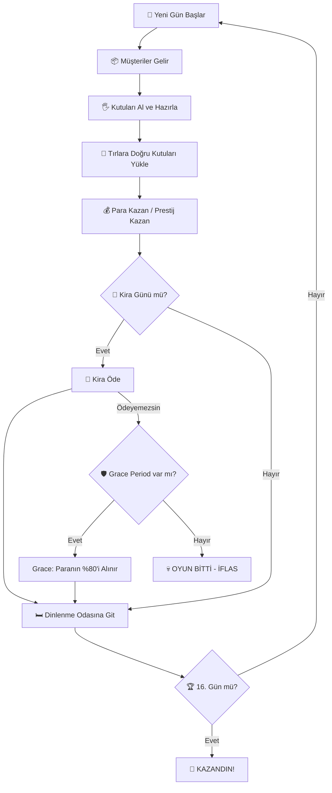

### 2.2 Mikro Döngü (Tek Gün İçi)

Bir günün dakika dakika akışı:

Gerçek süreler **gün uzunluğuna göre esner** (gün 1-3 = 200s, gün 16 = 330s; bkz. §3.2).
Oyun saati ↔ gerçek saniye dönüşümü lineerdir: `saniye = (saat − 7) / 11 × GünSüresi`.

| Oyun Saati | Gün 1-3 (200s) | Gün 16 (330s) | Olay |
|------------|----------------|---------------|------|
| 07:00 | 0s | 0s | Gün başlar, etkinlik aktif olur |
| 08:00 | ~18s | ~30s | Tırlar gelmeye başlar, müşteriler spawn olur, telefon açılır |
| 10:00 | ~55s | ~90s | Upgrade paneli açılır (`PANEL_OPEN_HOUR = 10`) |
| 12:00-14:00 | ~91-127s | ~150-210s | **Öğle Rush**: Max 6 eşzamanlı müşteri, ×1.5 spawn hızı |
| 14:00-15:00 | ~127-145s | ~210-240s | Öğleden sonra durgunluk: Max 2 müşteri |
| 16:00-17:00 | ~164-182s | ~270-300s | **Akşam Rush**: Max 4 müşteri, ×1.3 spawn hızı |
| 17:00 | ~182s | ~300s | Tırlar son çıkışlarını yapar |
| **17:30** | **~191s** | **~315s** | **Müşteri çıkış saati** (`CUSTOMER_EXIT_HOUR`): kuyruktaki servis edilmemiş müşteriler zorla çıkarılır (−0.4 prestij/müşteri) + hiç spawn olmamış kota müşterileri cezalanır (−0.2/müşteri) |
| 18:00 | ~200s | ~330s | Gün biter, kira kontrolü yapılır |

> [!NOTE]
> **Erken gün bitişi**: günün kotası tükenip kuyruk da boşaldığında gün 18:00'i beklemez —
> `dayEndGraceSeconds = 30s` kapanış payından sonra `FastForwardToEndOfDay()` günü sarar
> (`CustomerManager.CheckEarlyDayCompletion`). Pay, yarım yüklü tırı tamamlama fırsatı içindir.

### 2.3 Oyuncu Eylemleri (Tek Seferde)

1. **Yürü / Koş** → Mağazada hareket et
2. **Al** → Raftan veya yerden kutu al
3. **Koy** → Masaya veya yere kutu bırak
4. **Fırlat** → Kutuyu fırlat (riskli — düşerse ceza)
5. **Teslim Et** → Tıra doğru renk kutuyu ver
6. **Telefonla Çağır** → E'yi **basılı tut** (1sn), sıradaki müşteriyi öne çek: +20 TL, +0.4 prestij, karşılığında gün saati ileri sarılır (bkz. §14)
7. **Upgrade Satın Al** → Mağazayı geliştir

---

## 3. ⏰ Gün Döngüsü Sistemi

> **Kaynak**: [DayCycleManager.cs](file:///c:/Users/cicek/Documents/GitHub/Cargor/Assets/NewCss/UIScripts/DayCycleManager.cs)
> (dosya `Assets/NewCss/UIScripts/` altında — `GameState/` altında DEĞİL)

### 3.1 Temel Parametreler

| Parametre | Değer | Açıklama |
|-----------|-------|----------|
| Toplam gün sayısı | **16** (`MAX_DAYS`) | Oyunun toplam uzunluğu |
| Gün başlangıç saati | **07:00** (`startHour`) | Oyun içi sabah |
| Gün bitiş saati | **18:00** (`endHour`) | Oyun içi akşam |
| Baz gün süresi | **200 saniye** (`realDurationInSeconds`) | İlk 3 günün gerçek süresi (sahne override'ı da 200) |
| Günlük süre artışı | **+10 saniye/gün** (`dailyDurationIncrease`) | 4. günden itibaren her gün uzar (`DYNAMIC_DURATION_START_DAY = 3`) |
| UI güncelleme hızı | **10 FPS** | Performans için throttle |

> [!WARNING]
> **`realDurationInSeconds`'a DOĞRUDAN yazmayın.** Tek yazıcı `RecomputeDayDuration()`:
> `taban × overtime-perk-çarpanı + buff-toplamı`. Taban (`_baseRealDuration`) `Awake`'te,
> perk/buff uygulanmadan ÖNCE bir kez cache'lenir.

### 3.2 Gün Süresi Formülü

$$\text{GünSüresi}(g) = \begin{cases} 200\text{s} & g \leq 3 \\ 200 + (g - 3) \times 10\text{s} & g > 3 \end{cases}$$

| Gün | Süre (saniye) | Süre (dk:sn) |
|-----|--------------|---------------|
| 1-3 | 200s | 3:20 |
| 4 | 210s | 3:30 |
| 5 | 220s | 3:40 |
| 8 | 250s | 4:10 |
| 12 | 290s | 4:50 |
| 16 | 330s | 5:30 |

> [!IMPORTANT]
> **Telefonun zaman maliyeti bu tabloyu KULLANMAZ.** `SkipTime` / `PredictTimeAfterSkip`
> (cs:425, cs:446) saniye ↔ oyun-dakikası dönüşümünü **TABAN** `realDurationInSeconds` (200s) ile
> yapar, `CurrentDayDuration` ile değil. Sonuç: bir telefon çağrısının **gerçek-saniye** bedeli
> her gün aynıdır, ama gün uzadıkça o saniyelerin karşılığı olan **oyun-dakikası azalır**
> (bkz. §14.4). Bu bilinçli davranıştır, düzeltmeyin.

### 3.3 Gün Sonu Akışı

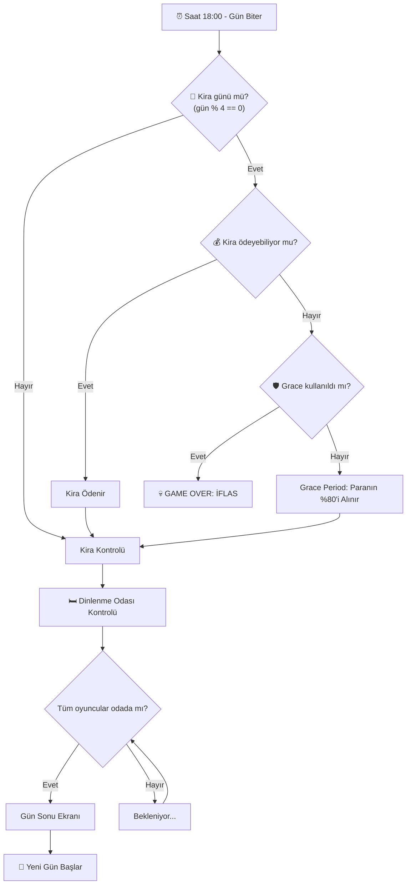

### 3.4 `OnNewDay` Event Hub

Yeni gün başladığında tetiklenen merkezi event. Aşağıdaki sistemler bu event'e abone olur:

- **TruckSpawner** → Tüm tırları despawn et, yenilerini spawn et
- **CustomerManager** → Günün kotasını (`GetDailyCustomerCount(gün, P)`) yeniden hesapla, spawn zamanlamasını sıfırla
- **QuestManager** → Yeni görevler ata, tamamlanmamışlara ceza ver
- **EventEffectManager** → Günün etkinliğini uygula (+ FESTIVAL DAY para bonusu)
- **UpgradePanel** → Bekleyen yükseltmeleri aktifleştir
- **DayLightController** → Aydınlatmayı sıfırla
- **PhoneCallManager** → Telefon cooldown'unu sıfırla (`HandleNewDay`, cs:313)

> [!WARNING]
> `EventEffectManager.OnNewDayHandler` ve `CustomerManager.HandleNewDay` **aynı statik `OnNewDay`
> event'ine** abone; çağrı sırası deterministik değil. Kota event çarpanı (`eventCustomerMultiplier`)
> teoride 1 gün geriden gelebilir — playtest'te `Quota calc: ... eventMult=` log'uyla doğrulanmalı
> (ekonomist Round 5 §7).

---

## 4. 💰 Ekonomi Sistemi

> **Kaynak**: [GameEconomySettings.cs](file:///c:/Users/cicek/Documents/GitHub/Cargor/Assets/NewCss/GameEconomySettings.cs) (ScriptableObject)

### 4.1 Para Sistemi

> **Kaynak**: [MoneySystem.cs](file:///c:/Users/cicek/Documents/GitHub/Cargor/Assets/NewCss/UIScripts/MoneySystem.cs)
> (dosya `Assets/NewCss/UIScripts/` altında)

| Parametre | Değer |
|-----------|-------|
| Başlangıç parası | **500 TL × 1.2^(P−1)** → 1P **500** · 2P **600** · 3P **720** · 4P **864** (kaynak: `DifficultyManager.baseStartingMoney=500`, `moneyMultiplierPerPlayer=1.2`; `DifficultyManager.cs:455` `moneySystem.startingMoney`'e yazıyor — bu zincir CANLI) |
| Minimum para | **0 TL** (negatife düşmez) |
| Senkronizasyon | `NetworkVariable` (server-write, everyone-read) |

> [!IMPORTANT]
> **Para YALNIZ tırdan gelir.** Müşteriye servis SIFIR para verir (yalnız +0.4 prestij);
> müşterinin ekonomik işlevi, tıra yüklenecek **ürünü üretmesidir** (`CustomerAI.cs:1442-1444`).
> Gelir kaldıracı ararken tıra bakın, müşteriye değil.

**Gelir Kaynakları**:
| Kaynak | Miktar | Koşul |
|--------|--------|-------|
| Doğru kutu teslimi | **Oyuncu sayısına bağlı** — 1P **50** · 2P **55** · 3P **70** · 4P **88** TL/kutu (`rewardPerBoxByPlayerCount`) | Tıra doğru renk kutu |
| Prestij bonusu | +5 TL/kutu × tier | Her **8** prestij = 1 tier (`prestigePerBonus`) |
| Telefon araması | **+20 TL**/arama | Başarılı arama (`callMoneyReward`) |
| Görev ödülleri | Easy **28** / Medium **60** / Hard **150** TL | Gün sonunda otomatik, tier'a bağlı |
| FESTIVAL DAY | **o günkü kiranın %10-20'si** (rastgele) | Gün başında bir kez (`EventEffectManager.ApplyFestivalBonus`) |

> `rewardPerBox = 50` skaler alanı yalnız **legacy fallback**'tir (dizi boş/null ise).
> P3/P4'te ödülün yükseltilmesinin sebebi: tek servis masası yüzünden kota P2 ile aynı kalırken
> kira 3.6 katına çıkıyordu.

**Gider Kaynakları**:
| Kaynak | Miktar | Koşul |
|--------|--------|-------|
| Yanlış kutu teslimi | -40 TL/kutu (P-bağımsız SABİT) | Tıra yanlış renk kutu |
| Kutu düşürme | **-5 TL**/düşürme | Kutu **≥3 m/s** ile çarparsa (`boxDropMoneyPenalty`) |
| Görev cezaları | Easy **15** / Medium **27** / Hard **53** TL | Kabul edilip tamamlanmayan görev |
| Kira ödemesi | Değişken | Her 4 günde bir |
| Upgrade satın alma | Değişken | Oyuncu tercihiyle (P-bazlı çarpan, bkz. §13) |

### 4.2 Ekonomi Dengesi — Tam Parametre Tablosu

Tüm ekonomik değerler tek bir `GameEconomySettings` ScriptableObject'ten yönetilir:

> **Doğrulama**: bu tablonun tamamı `Assets/Editor/EconomyInvariantCheck.cs` tarafından (165 kontrol)
> koda karşı denetleniyor. Menü: `Cargor / Ekonomi Değerlerini Doğrula`. Değer değiştirirsen orayı da güncelle.

```
📊 GameEconomySettings (EkonomiAyarlari)
│
├── 💸 KİRA AYARLARI
│   ├── baseRentByPlayerCount: [500, 1000, 1450, 1800]
│   ├── rentGrowthMultiplier: 1.20 (%20 artış/dönem)
│   ├── rentScaledMultiplier: 1.0 (varsayılan; leveraged_rent perki 0.75 yapar)
│   ├── rentIntervalDays: 4 (her 4 günde bir kira)
│   └── gracePaymentPercent: 0.8 (%80 affedilme bedeli; leveraged_rent VE all_in perkleri 0 yapar = grace iptal)
│
├── 👥 MÜŞTERİ KOTASI (PlateUp — gün-numarası eğrisi, kapasite ETKİSİZ)
│   ├── dailyCustomerCountP1: [4,4,4,4,4,4,4,5,5,5,5,5,6,6,6,6]      (16 gün toplamı 77)
│   ├── dailyCustomerCountP2: [7,7,7,8,8,9,9,9,10,10,10,11,11,11,12,12]  (toplam 151)
│   ├── dailyCustomerCountP3: [8,8,8,8,9,9,9,10,10,10,11,11,12,12,12,13] (toplam 160)
│   ├── dailyCustomerCountP4: [8,8,8,8,9,9,9,10,10,10,11,11,12,12,12,13] (toplam 160 — P3 ile aynı, bilinçli)
│   ├── customerArrivalIntervalByPlayerCount: [44, 22, 21, 21] saniye
│   └── dayEndGraceSeconds: 30 (kota bitince gün sarılmadan önceki kapanış payı)
│
├── 🚚 TIR / TESLİMAT AYARLARI
│   ├── rewardPerBoxByPlayerCount: [50, 55, 70, 88] TL  ← CANLI ödül (P-bazlı)
│   ├── rewardPerBox: 50 TL (LEGACY skaler; yalnız dizi boş/null ise fallback)
│   ├── penaltyPerBox: 40 TL (yanlış teslimat — P-bağımsız)
│   ├── hangarStayDurationByPlayerCount: [120, 60, 40, 30] saniye
│   │     (1P uzun: yavaş üretimde tır dolsun; 4P kısa. Legacy skaler hangarStayDuration=30 yalnız dizi boşsa)
│   ├── truckCargoMinByPlayerCount: [1, 2, 2, 2]
│   ├── truckCargoMaxExclusiveByPlayerCount: [3, 4, 5, 6]   ← ÜST SINIR HARİÇ (Random.Range semantiği)
│   ├── prestigePerBonus: 8 (bonus tier başına prestij; 0-100 skala)
│   ├── bonusPerTier: 5 TL (tier başına ek ödül)
│   ├── rewardVolatility: 0 (high_volatility perki 0.35 yapar)
│   └── rewardVolatilityMean: 1.0 (high_volatility perki 1.15 yapar)
│
├── 📦 KUTU DÜŞME
│   └── boxDropMoneyPenalty: 5 TL
│
├── 📞 TELEFON AYARLARI  (V4 — DIŞARI ARAMA)
│   ├── timeSkipAmountByPlayerCount: [115, 59, 55, 55] oyun-dakikası   ← asıl bedel
│   ├── phoneCooldownSeconds: 3.0 (P-bağımsız düz cooldown)
│   ├── phoneCooldownPerkBonusSeconds: 0.0 (varsayılan; phone_line perki 10.0 yazar → Mathf.Max(1, 3−10)=1sn)
│   ├── phoneDialHoldSeconds: 1.0 (E'yi basılı tutma süresi — UX, ekonomik değer DEĞİL)
│   ├── callMoneyReward: 20 TL
│   └── callPrestigeReward: 0.4
│
├── ⭐ PRESTİJ AYARLARI
│   ├── customerServedPrestigeBonus: +0.4
│   ├── customerLostPrestigePenalty: -0.4   (servis edilmeden kaçan/çıkarılan müşteri)
│   ├── customerMissedQuotaPrestigePenalty: -0.2   (17:30'da HİÇ SPAWN OLMAMIŞ kota müşterisi)
│   ├── wrongProductPrestigePenalty: -0.08
│   ├── wrongDeliveryPrestigePenalty: -0.16
│   └── boxDropPrestigePenalty: -0.04
│
└── 🎪 ETKİNLİK
    ├── festivalBonusMin: 100 TL   ← yalnız FALLBACK (DayCycleManager erişilemezse)
    └── festivalBonusMax: 300 TL   ← yalnız FALLBACK; canlı yol kira×%10-20
```

> [!WARNING]
> **`Assets/Resources/EkonomiAyarlari.asset` bu alanların ÇOĞUNU İÇERMİYOR — bu bir hata değil.**
> Unity, YAML'da anahtarı olmayan alanları C# field initializer değeriyle kurar. Asset'te YALNIZ
> şu anahtarlar var: kira 5'lisi, `dayEndGraceSeconds`, `rewardPerBox`, `penaltyPerBox`,
> `hangarStayDuration(+dizi)`, `prestigePerBonus`, `bonusPerTier`, `rewardVolatility(+Mean)`,
> tır kargo dizileri, `boxDropMoneyPenalty`, `callMoneyReward`, `callPrestigeReward`, prestij
> cezaları (missed-quota HARİÇ), festival min/max. **Kota dizileri, `rewardPerBoxByPlayerCount`,
> `customerArrivalIntervalByPlayerCount`, tüm V4 telefon alanları ve
> `customerMissedQuotaPrestigePenalty` asset'te YOK → `.cs` default'ları canlıdır.**
> Ayrıca asset'te **ölü V3 anahtarları** duruyor (`phoneRingChancePerHour`,
> `phoneRingEventMultiplier`, `phoneRingPerkBonus`) — sınıfta karşılığı olmadığı için okunmuyor.
> `float[]`'a elle hex yazmayın: sessizce BOŞ dizi üretir (bkz. `EconomyInvariantCheck` uyarısı).

> [!WARNING]
> **`PerkEffect` bu ScriptableObject'in alanlarına RUNTIME'DA doğrudan yazıyor ve hiçbir yerde geri almıyor.**
> Etkilenen 7 alan (`PerkEffect.cs`): `gracePaymentPercent` (:318, :336), `rentScaledMultiplier` (:317),
> `rentGrowthMultiplier` (:194), `customerServedPrestigeBonus` (:209),
> **`phoneCooldownPerkBonusSeconds` (:301)**, `rewardVolatility` (:326), `rewardVolatilityMean` (:327).
> Editor'de Play mode'dan çıkınca değerler geri gelmiyor, diske yazılıp commit'lenebiliyor.
> Play-test sonrası `Cargor / Ekonomi Değerlerini Doğrula` çalıştır. **Açık mimari sorun** — bkz. `plans/devam.md` 2026-08-07.
>
> Yazımlar **mutlak atama** (`=`), toplama/çarpma DEĞİL — aynı alana yazan bir kart, perki
> sessizce siler (biriktirmez).

> [!NOTE]
> **`wealthTaxRate` KALDIRILDI** (`9d2c3b0`, FAZ 2 C5 Seçenek A) — kira formülünde artık upgrade-vergisi yok.
> **V3'ün çalma alanları** (`phoneRingChanceByPlayerCount`, `phoneRingChancePerHour`,
> `phoneRingEventMultiplier`, `phoneRingPerkBonus`) sınıftan **silindi**: V4'te telefon çalmıyor,
> oyuncu arıyor (bkz. §14). `timeSkipAmount` V2'den farklı bir alan olarak **geri geldi**
> (`timeSkipAmountByPlayerCount`, P-bazlı).

### 4.3 Prestij-Bazlı Gelir Çarpanı

$$\text{KutuBaşıGelir} = \text{rewardPerBox}[P] + \left\lfloor \frac{\text{prestige}}{\text{prestigePerBonus}} \right\rfloor \times \text{bonusPerTier}$$

Tier bonusu **P-bağımsız** (+5 TL/tier), taban ödül **P-bazlı**:

| Prestij | Tier | 1P | 2P | 3P | 4P |
|---------|------|-----|-----|-----|-----|
| 0-7 | 0 | 50 | 55 | 70 | 88 |
| 8-15 | 1 | 55 | 60 | 75 | 93 |
| 16-23 | 2 | 60 | 65 | 80 | 98 |
| 24-31 | 3 | 65 | 70 | 85 | 103 |
| 32-39 | 4 | 70 | 75 | 90 | 108 |
| 96-100 | **12** (tavan) | **110** | **115** | **130** | **148** |

> Başlangıç prestiji **12** (`PrestigeManager.startingPrestige`, sahnede), yani oyuncu tier 1'de başlar.

> [!IMPORTANT]
> **Prestij bir fail-state değil, gizli bir GELİR ÇARPANI.** Ekonomist Round 6 ölçümü: tier bonusu
> 16 günde kutu ödülünü **+%20…+%91** şişiriyor ve toplam tır gelirinin **%13-35'ini** oluşturuyor.
> 1 prestij puanının marjinal değeri gün 1'de **34.7-91.7 TL**, gün 16'da 2.8-7.8 TL (kalan gün
> sayısıyla lineer sönüyor). Dolayısıyla her prestij CEZASI aslında gizli bir para cezasıdır.
>
> Taban koşumlarda prestij tavanın **%75-92'sine** (tier 9-11) ulaşıyor — `maxPrestige=100` yakın
> ama nadiren dolu; quest prestij ödülleriyle birlikte 12 hücrenin 6'sında tavan **çarpılıyor**
> (Round 8 §3). Tavana çarpan hücrede prestij perklerinin marjinal değeri sıfırdır.

---

## 5. 🏠 Kira Sistemi

### 5.1 Kira Formülü

$$\text{Kira} = \text{BaseRent}[P] \times 1.20^{\text{cycle}} \times \text{rentScaledMultiplier}$$

Burada:
- \(P\) = Oyuncu sayısı (1-4)
- \(\text{cycle}\) = Kaçıncı kira dönemi (0'dan başlar)
- \(\text{rentScaledMultiplier}\) = Varsayılan 1.0; yalnız "Kaldıraçlı Kira" (`leveraged_rent`) perki **0.75** yapar (−%25)
- **NOT (2026-07-13):** Eski formüldeki `wealthTax` terimi (`+ TotalUpgradeValue × 0.10`) **tamamen kaldırıldı** (commit `9d2c3b0`, FAZ 2 C5 → Seçenek A). Kırık kablolamayla zaten hep 0'dı; kod'dan tümüyle çıkarıldı, artık kira formülünde upgrade-vergisi yok.

### 5.2 Oyuncu Sayısına Göre Baz Kira

| Oyuncu Sayısı | Baz Kira |
|--------------|----------|
| 1 Oyuncu | 500 TL |
| 2 Oyuncu | 1.000 TL |
| 3 Oyuncu | 1.450 TL |
| 4 Oyuncu | 1.800 TL |

> Ölçek 1 : 2.00 : 2.90 : 3.60. Ölçülen gelir ölçeği (1 : 1.73 : 2.40 : 2.95) ile birebir aynı DEĞİL —
> bilinçli: çok oyunculu takım koordinasyon avantajını kirayla geri ödüyor.

> [!CAUTION]
> **AÇIK DENGE SORUNU (kod DEĞİŞMEDİ, karar Round 10'da).** Ekonomist Round 2/3 ölçümü:
> **Slow + strict** bandında bu taban kira 16/16 hücrede iflasa yol açıyor (P1 gün 16, P2/P3/P4
> gün 12). Kök neden **eğim değil SEVİYE**: o bantta kira / 4-günlük-gelir oranı 1.52-1.71
> (sağlıklı Normal/strict bandında 0.88-1.27 ve düşerek gidiyor). Açık ≈ **%25-30**.
> Önerilen (henüz uygulanmamış) asimetrik taban: `{290, 650, 1140, 1630}`.
> Bu belge CANLI değerleri gösterir — öneri uygulanırsa §5.2/§5.3 tabloları güncellenmelidir.

### 5.3 Kira Dönemleri ve Büyüme (tüm oyuncu sayıları)

| Gün | Dönem | 1P | 2P | 3P | 4P |
|-----|-------|-----|-----|-----|-----|
| 4 | Dönem 0 | 500 | 1.000 | 1.450 | 1.800 |
| 8 | Dönem 1 | 600 | 1.200 | 1.740 | 2.160 |
| 12 | Dönem 2 | 720 | 1.440 | 2.088 | 2.592 |
| 16 | Dönem 3 | 864 | 1.728 | 2.506 | 3.110 |
| — | **16 gün toplamı** | **2.684** | **5.368** | **7.784** | **9.662** |

> Eğim `rentGrowthMultiplier = 1.20` (2026-08-20'de 1.35'ten düşürüldü — sim.js FAZ4-sonrası
> resync'i STRICT bantta 4P'nin ve Slow-optimistic bantta 2P/3P/4P'nin gün 16'da (son kira)
> iflas ettiğini gösterdi; economist analizi 1.35'in FAZ3/4 sonrası gerçek gelir eğrisine göre
> fazla dik olduğunu doğruladı, parametrik tarama 1.20'yi önerdi — bkz.
> `.claude/agent-memory/economist/rent_growth_1_35_deficit_2026-08-20.md`).

### 5.4 Grace Period (Affedilme Mekanizması)

- **Tetiklenme**: Kira günü ve para yeterli değilse
- **Tek seferlik**: Oyun boyunca yalnızca 1 kez kullanılabilir
- **Maliyet**: Mevcut paranın %80'i alınır (`gracePaymentPercent`)
- **İkinci kez ödeyemezse**: **GAME OVER — İFLAS**
- ⚠️ **`leveraged_rent` ve `all_in` perkleri `gracePaymentPercent`'i 0 yapar** — yani grace period
  tamamen iptal olur. İkisi aynı dışlama grubunda (`EXCLUSIVE_EFFECT_GROUPS`), birlikte teklif edilmezler.

> [!WARNING]
> **Grace, AÇIĞA değil ELDEKİ NAKDE oranlı** (`DayCycleManager.cs:616-624`) ve ödeme sayılır
> (`_rentPaymentCount++`). İki sonucu var:
> 1. **Tampon sınırsız**: açık ne kadar büyük olursa olsun, tek bir kira günü tamamen emiliyor.
>    Bu yüzden "ince marj" görünen bantlar gerçekte göründüğünden dayanıklı (ekonomist Round 2 §2).
> 2. **"Fakir kal" exploiti**: kira gününden hemen önce parayı upgrade'e harcayıp kiranın altına
>    düşmek ≈ **+0.20 × o günkü kira** kazandırıyor (1P +173 … 4P +622 TL, gün 16).
>    Yan etkisi monotonluk kırılmaları: "daha kötü girdi → daha iyi sonuç". Ekonomi ölçümlerinde
>    böyle bir anomali görülürse önce grace zamanlamasına bakılmalı.

> [!IMPORTANT]
> **Gün sonu sırası:** kira kontrolü (`TryProcessMoneyCheck`) görev ödüllerinden **ÖNCE** çalışıyor.
> Yani tamamlanan görevin parası kiraya yetişmiyor. Collect butonu kaldırıldığında (2026-07-28)
> ortaya çıkan bilinçli bir yan etki — kira günlerinde iflas riski bir miktar sert.

### 5.5 Kira + Upgrade Vergisi Etkileşimi ~~(KALDIRILDI)~~

> [!NOTE]
> **Upgrade Vergisi (wealthTax) mekaniği KALDIRILDI** (2026-07-13, commit `9d2c3b0`). Eskiden "her upgrade sonraki kiraları artırır" olarak tasarlanmıştı ama kablolaması kırıktı (hep 0 katkı) → tamamen çıkarıldı. Upgrade satın almak artık kirayı ETKİLEMEZ. Bu bölüm tarihsel kayıt olarak tutuluyor.

**Örnek (güncel formülle)**:
- 1 oyuncu, dönem 2 (upgrade sayısından bağımsız):
  - Kira = 500 × 1.20² × 1.0 = **720 TL**

---

## 6. ⭐ Prestij Sistemi

> **Kaynak**: [PrestigeManager.cs](file:///c:/Users/cicek/Documents/GitHub/Cargor/Assets/NewCss/CustomerSripts/PrestigeManager.cs)

### 6.1 Temel Parametreler

| Parametre | Değer |
|-----------|-------|
| Başlangıç prestiji | **12.0** (sahne: `PrestigeManager.startingPrestige`) |
| Minimum prestij | **0** (ham değer ≤0 olursa GAME OVER — clamp ÖNCESİ kontrol) |
| Maksimum prestij | **100** (pratikte hiç ulaşılmıyor; ölçüm 1P ~47 / 4P ~37) |
| Bonus tier eşiği | her **8** prestij = +5 TL/kutu (`prestigePerBonus`) |

### 6.2 Prestij Değişim Kaynakları

| Eylem | Prestij Değişimi | Sıklık |
|-------|-----------------|--------|
| Müşteriye başarılı servis | **+0.4** | Her başarılı servis (para vermez!) |
| Telefonla müşteri çağırma | **+0.4** | Her başarılı arama (`callPrestigeReward`) — bir müşteri servisiyle AYNI değerde |
| Müşteri kaçtı / servis edilmeden çıkarıldı | **-0.4** | Sabır bitti **veya** 17:30'da kuyrukta servis edilmemiş (`customerLostPrestigePenalty`) |
| **Kota müşterisi hiç gelmedi** | **-0.2** | 17:30'da hâlâ spawn olmamış her kota müşterisi (`customerMissedQuotaPrestigePenalty`) — yukarıdakiyle KARIŞTIRILMAZ |
| Tıra yanlış renk kutu | **-0.16** | Her yanlış teslimat (ayrıca -40 TL) |
| Yanlış ürün gösterildi | **-0.08** | Her yanlış ürün (para cezası YOK) |
| Kutu yere düştü | **-0.04** | Her düşürme (≥3 m/s) |
| Görev ödülü | Easy **+1.4** / Medium **+3** / Hard **+7.5** | Gün sonunda |
| Görev cezası | Easy **-0.8** / Medium **-1.36** / Hard **-2.66** | Tamamlanmayan kabul edilmiş görev |

> SURPRISE AUDIT etkinliği günü tüm cezalar **×2** (`EventEffectManager.GetPenaltyMultiplier`).
> Ölçülen etkisi **dekoratif**: en kötü tek gün ek maliyeti −0.07…−1.40 prestij = final prestijin
> **%0.1-4.6'sı** (Round 6 §7).

> [!CAUTION]
> **Ceza oranı tersliği — "müşteriyi bilerek boz" baskın stratejisi.** İade/BoxRequest modundaki
> müşteriye (gün 5+, ~%25 oranında) **yanlış renk kutu vermek** yalnız −0.08 prestije mal oluyor
> ve müşteri ANINDA çıkıyor (`CustomerAI.cs:1228-1259`, `HandleFailedInteraction` →
> `TransitionToExit`; `_hasTimedOut=false` kaldığı için 17:30'da tekrar cezalanmıyor).
> Sabrın dolmasını beklemek ise −0.4 **VE** istasyonu sabır süresince bloke ediyor → yanlış kutu
> vermek **5 kat ucuz**. Ayrıca `wrongDelivery`'nin (−0.16) yanında 40 TL nakit cezası var,
> `wrongProduct`'ın (−0.08) yanında hiç yok → aynı sınıf hatanın maliyeti 8 kat farklı.
> Düzeltme önerildi, **henüz uygulanmadı** (Round 6 §4).

### 6.3 Prestijin Oyuna Etkisi

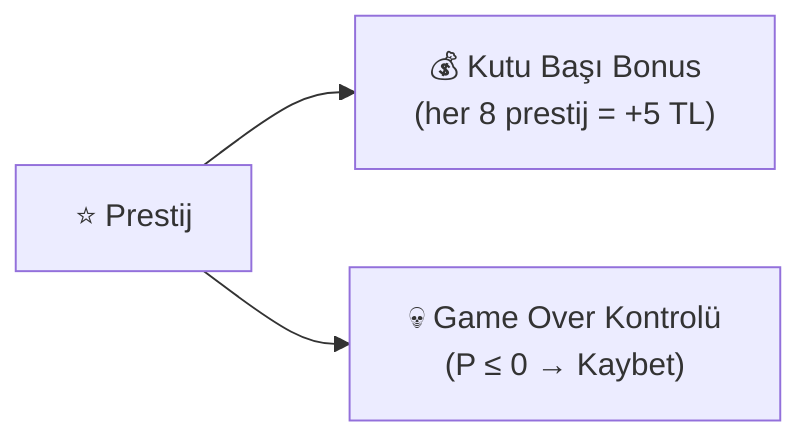

> [!WARNING]
> **Prestijin ekonomide TEK işlevi kutu başı ödül tier'ı** (+ sıfırda ölüm).
> `PrestigeManager.GetCustomerCapacity()` ve `OnCustomerCapacityChanged` **ölü kod** — sıfır tüketici,
> sıfır abone. `CheckWinCondition` de prestije bakmıyor (yalnız gün 16'ya ulaşmak yeterli).
> Eski GDD'deki "müşteri kapasitesi = 1 + floor(P/4)" formülü **hiçbir yerde uygulanmıyor.**

### 6.4 Prestij Dengesi Analizi

Aritmetik: başlangıç prestiji 12.0; **30 müşteri kaçırma** (30 × -0.4) oyunu bitirir.
Ceza ×2 olan SURPRISE AUDIT gününde bu 15'e düşer.

Dengeyi tutturmak için:
- Her 1 kaçırılan müşteriye karşı **1 başarılı servis** yeterli (-0.4 / +0.4 = 1:1)
- Her 1 yanlış teslimata karşı **0.4 servis** (-0.16 / +0.4)
- Bir Hard görevi kaçırmak **~7 müşteri kaçırmaya** eşdeğer (-2.66 / -0.4)

> [!CAUTION]
> **Prestij kaybı pratikte ÖLÜ bir kaybetme koşulu.** Ekonomist Round 6 ölçümü: 16 senaryonun
> **16'sında da** prestij hiç 0'a inmiyor; kaybeden 4 hücre (Slow/strict) **NAKİT'ten** iflas
> ediyor ve o anda bile prestijleri 18.9-43.4. En düşük gözlenen marj **18.87** — uçurum kenarı YOK.
> Sebep yapısal: `served=+0.4` ile `lost=−0.4` **birebir simetrik**, yani başabaş servis oranı
> tam **%50** → müşterilerinin yarısını kaçıran oyuncu sonsuza kadar hayatta kalıyor.
>
> **P-asimetrisi**: ceza müşteri BAŞINA ama `startingPrestige=12` ve eşik P'den bağımsız →
> aynı beceriksizlik oranında (kaçırma %75) 4P gün 7'de, 1P gün 13'te ölüyor.
>
> `customerMissedQuotaPrestigePenalty` de yapısal bir tehdit DEĞİL: Normal bandın 8 hücresinde
> **16/16 gün tam sıfır** (varış tavanı kotayı zaten bağlıyor), Slow'da toplam −0.04…−2.06.

> [!IMPORTANT]
> **Kazanılmış oyun kaybedilemez** (`f013f5d`): gün 16 settlement'i zafer ilan edildikten SONRA
> çalıştığı için, tamamlanmayan görevin prestij cezası prestiji sıfırlasa bile sonuç değişmez.
> `TriggerLose`/`TriggerWin` artık `gameEnded` guard'lı.

---

## 7. 📊 Müşteri Kotası (PlateUp modeli)

> **Kaynaklar**: `GameEconomySettings.GetDailyCustomerCount(day, P)`,
> [CustomerManager.cs](file:///c:/Users/cicek/Documents/GitHub/Cargor/Assets/NewCss/CustomerSripts/CustomerManager.cs)
> `CalculateTodaysCustomerCount` (cs:403-419)

> [!IMPORTANT]
> **İki farklı "kota" karıştırılmamalı.**
> - ~~**Eski kutu kotası**~~ (`QuotaManager`, `toplam müşteri × 0.8`, tutturulamazsa GAME OVER):
>   commit `0c026ef` ile **tamamen silindi**, kodda tek referansı yok. Kira ile birlikte çift
>   başarısızlık kapısı oluşturduğu için kaldırılmıştı.
> - **Yeni müşteri kotası** (2026-08-29, PlateUp geçişi): o günün **kaç müşteri göndereceğini**
>   belirleyen tablo. **Kaybetme koşulu DEĞİL** — tutturulamayan kısım yalnız hafif bir prestij
>   cezası doğurur (−0.2/müşteri).

### 7.1 Günlük Müşteri Tablosu

Kota artık **gün numarasının** fonksiyonu; raf/masa **kapasitesinin etkisi tamamen kaldırıldı**.

| Gün | 1P | 2P | 3P | 4P |
|-----|----|----|----|----|
| 1-3 | 4 | 7 | 8 | 8 |
| 4 | 4 | 8 | 8 | 8 |
| 8 | 5 | 9 | 10 | 10 |
| 12 | 5 | 11 | 11 | 11 |
| 16 | 6 | 12 | 13 | 13 |
| **16 gün toplamı** | **77** | **151** | **160** | **160** |

> **P3 ≈ P4 bilinçli**, yuvarlama hatası değil: tek servis istasyonuyla mekanik doygunluk oluşuyor,
> 4. oyuncu ek müşteri işleyemiyor. Kira 3.6 katına çıktığı için telafi **kutu ödülünden**
> geliyor (`rewardPerBoxByPlayerCount` P3=70, P4=88).

### 7.2 Kotanın Ekonomik Anlamı

$$\text{GünlükMüşteri} = \text{Clamp}\big(\text{round}(\text{tablo}[gün][P] \times \text{eventCustomerMultiplier}),\ \text{min},\ \text{max}\big)$$

Müşteri = tek ürün kaynağı, ürün = tıra yüklenecek kutu, kutu = tek para kaynağı.
Yani kota teoride günlük gelirin tavanıdır.

> [!WARNING]
> **Pratikte kota çoğu bantta bağlayıcı DEĞİL.** Ekonomist ölçümü (Round 2 §4):
> STRICT bantta 16/16 gün **mekanik-bağlı** (insan işleme hızı), kota hiç tavan olmuyor —
> kutu/kota oranı Normal/strict'te 0.31-0.47, Slow/strict'te 0.20-0.31. Teslim edilemeyen ürün
> gün başına 2.8-8.0 birikiyor. OPTIMISTIC bantta oran 1.21-1.23 (orada kota gerçekten tavan).
>
> Sonucu: **kota çarpanını YUKARI çeken event'ler (BUSY DAY +%35, MARKETING DAY +%20) ölü kol** —
> varış aralığı değişmediği için ekstra müşteri zaten spawn olamıyor, yalnız
> `ApplyMissedQuotaPenalty` yakıtına dönüşüyor (Round 5 §3). Doğru kol
> `customerArrivalIntervalByPlayerCount`'u BÖLMEK olurdu.

### 7.3 Kotanın Gün Sonu Muhasebesi

17:30'da (`CUSTOMER_EXIT_HOUR`) iki ayrı ceza kanalı çalışır:

| Durum | Ceza | Kod |
|-------|------|-----|
| Kuyruktaki müşteri servis edilmeden çıkarıldı | **−0.4** prestij (`OnCustomerLost`) | `ForceAllCustomersToExit` |
| Kota müşterisi hiç spawn olmadı | **−0.2** prestij (`OnCustomerQuotaMissed`) | `ApplyMissedQuotaPenalty` |

Kota erken tükenirse gün 18:00'i beklemez: `dayEndGraceSeconds = 30s` sonrası
`FastForwardToEndOfDay()` günü sarar (bkz. §2.2 notu). Bu yolda missed-quota cezası
**hiç tetiklenmez** (`HasUnspawnedCustomers = false` şartı arandığı için).

**Oyunu kaybetmenin hâlâ tek iki yolu var** (bkz. §21):
1. Kira gününde ödeyememek (grace period bir kez affeder)
2. Prestijin sıfıra düşmesi

---

## 8. 🚚 Tır / Teslimat Sistemi

> **Kaynaklar**: [Truck.cs](file:///c:/Users/cicek/Documents/GitHub/Cargor/Assets/NewCss/TruckScripts/Truck.cs), [TruckSpawner.cs](file:///c:/Users/cicek/Documents/GitHub/Cargor/Assets/NewCss/TruckScripts/TruckSpawner.cs)

### 8.1 TruckSpawner — Tır Yöneticisi

| Parametre | Değer |
|-----------|-------|
| Çalışma saatleri | **08:00 – 17:00** |
| Respawn gecikmesi | **3–5 saniye** (rastgele) |
| Tır başına kargo miktarı | **Oyuncu sayısına bağlı** — 1P **1–2** · 2P **2–3** · 3P **2–4** · 4P **2–5** kutu |
| Hangar bekleme süresi | **Oyuncu sayısına bağlı** — 1P **120s** · 2P **60s** · 3P **40s** · 4P **30s** |
| Kutu renk tipleri | **3**: Kırmızı, Sarı, Mavi |
| Renk belirleme | 5'li deterministik kuyruk sistemi |
| Hangar spawn noktaları | `requiredUpgradeLevel` ile kilitleme |

**Kargo aralığı** `GameEconomySettings.GetTruckCargoRange(P)` ile okunur;
diziler `truckCargoMinByPlayerCount = [1,2,2,2]` ve `truckCargoMaxExclusiveByPlayerCount = [3,4,5,6]`.
Üst sınır **HARİÇ** (`Random.Range(int,int)` semantiği) — yani 4P'de 2,3,4 veya 5 kutu.
Gelir-nötr doğrulandı (kümülatif fark ≤ %1.5); asıl amaç 1P'de yarı-boş kalkan tırı önlemek.

**Hangar süresi** `GetHangarStayDuration(P)`. 1P'nin 120s olmasının sebebi: 90s'de en küçük kargo
bile dolmuyordu (`fillTime(2) = 100s > 90s`), dolayısıyla "1 tır tamamla" görevi imkânsızdı.

> [!NOTE]
> **Tır penceresi darboğaz DEĞİL.** Ölçüm: tavan günde 10.9–18 tır, fiilen kullanılan **%10–42**.
> Gerçek darboğaz insan üretim hızı. Sonucu: 2. ve 3. hangar OPTIMISTIC bantta sıfır gelir katıyor —
> `Ek Hangar` upgrade'i bu yüzden maxLevel 1'e çekildi (§13).

### 8.2 Tır Davranış Akışı

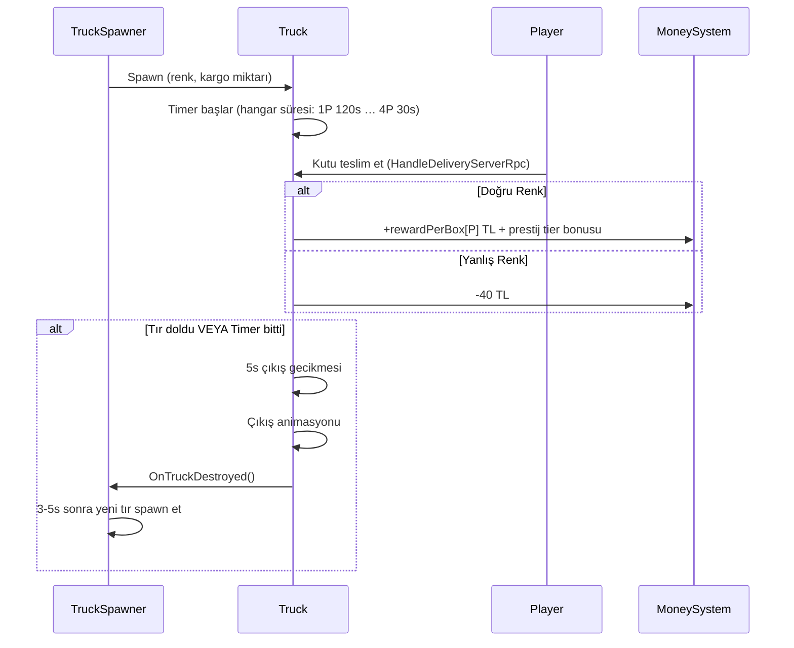

### 8.3 Teslimat Ekonomisi

**Doğru teslimat geliri** (1 oyuncu, prestij = 24 varsayımıyla; `prestigePerBonus = 8`):
$$\text{Gelir} = 50 + \left\lfloor \frac{24}{8} \right\rfloor \times 5 = 50 + 15 = 65\ \text{TL/kutu}$$

Aynı prestijde 4 oyuncu: `88 + 15 = 103 TL/kutu`.

**Yanlış teslimat cezası**: -40 TL/kutu — **sabit ve P-bağımsız**.

> [!IMPORTANT]
> Ceza/ödül oranı P ile eriyor: 1P'de yanlış teslimat ~0.62 doğru teslimatı siler (40/65),
> 4P'de yalnız ~0.39'unu (40/103). Yani caydırıcılık yüksek oyuncu sayısında **zayıflıyor** —
> `penaltyPerBox` P-bazlı yapılmadığı için. Bugün denge riski oluşturmuyor (yanlış teslimat
> nadir), ama ödül dizisi büyütülürse birlikte gözden geçirilmeli.

### 8.4 Tır Renk ve Görsel Sistemi

- Tır gövdesi ve kapıları, istenen kutu rengine boyanır (Kırmızı/Sarı/Mavi)
- Oyuncu, tırın renginden hangi kutuyu yüklemesi gerektiğini görsel olarak anlar
- 3D spatial audio: Giriş sesi, bekleme sesi (loop), çıkış animasyon sesi

### 8.5 Hangar ve Upgrade Entegrasyonu

- Başlangıçta **1 hangar** aktif
- **Truck upgrade** ile ek hangarlar açılır
- Her hangarın bir `requiredUpgradeLevel` değeri var
- Garaj kapıları (`GarageDoorController`) upgrade seviyesine göre açılır/kapanır

---

## 9. 👥 Müşteri Sistemi

> **Kaynaklar**: [CustomerAI.cs](file:///c:/Users/cicek/Documents/GitHub/Cargor/Assets/NewCss/CustomerSripts/CustomerAI.cs), [CustomerManager.cs](file:///c:/Users/cicek/Documents/GitHub/Cargor/Assets/NewCss/CustomerSripts/CustomerManager.cs)

### 9.1 CustomerManager — Müşteri Yöneticisi

**Server-authoritative** singleton. Günlük müşteri sayısını hesaplar ve dalga bazlı spawn yapar.

### 9.2 Dalga Bazlı Müşteri Yoğunluğu

> **Kaynak**: `WaveSettings` ScriptableObject

| Dalga | Saat Aralığı | Max Eşzamanlı | Spawn Hız Çarpanı | Atmosfer |
|-------|-------------|---------------|-------------------|----------|
| 🌅 Sabah | 08:00-12:00 | 4 | ×1.0 | Normal tempo |
| 🍽️ Öğle Rush | 12:00-14:00 | **6** | **×1.5** | Yoğun, kaotik |
| 😴 Öğleden Sonra Durgunluk | 14:00-15:00 | 2 | ×0.5 | Nefes alma |
| 🌤️ Öğleden Sonra | 15:00-16:00 | 3 | ×0.8 | Hafif tempo |
| 🌆 Akşam Rush | 16:00-17:00 | 4 | **×1.3** | Son dakika baskısı |
| 🌙 Kapanış | 17:00-18:00 | 2 | ×0.6 | Sessiz kapanış |

### 9.3 Müşteri AI Durumları

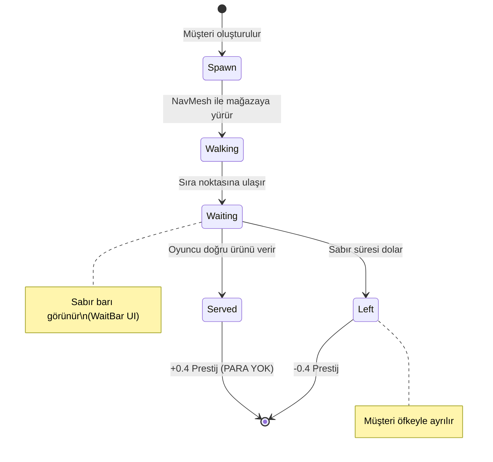

> Servis edilen müşteri **para vermez** — ürün üretir, para tırdan gelir (bkz. §4.1).

### 9.4 Müşteri Sabır Sistemi

- **Baz sabır**: **15-20 saniye** (rastgele) — `CustomerAI.minWaitTime/maxWaitTime`,
  gerçek değerler `Customer.prefab`'ta (`minWaitTime: 15`, `maxWaitTime: 20`)
- **Perk çarpanı**: `CustomerManager.patienceMultiplier` (varsayılan 1.0)
- **Etkinlik çarpanları**: ANGRY CUSTOMERS ×0.6 · BUSY DAY ×0.85 · RELAXED DAY ×1.3
- **Sayaç başlangıcı**: müşteri **kuyruğa vardığında** başlar (`CustomerAI.cs:897-900`), spawn'da değil
- **Görsel gösterge**: Müşterinin üzerinde azalan sabır barı (`WaitBar.cs`)
- **Billboard**: Sabır barı her zaman kameraya dönük (`Billboard.cs`)

> [!WARNING]
> **`DifficultyManager`'ın sabır ölçeklemesi ÖLÜ.** `baseMinPatience=35`, `baseMaxPatience=55`,
> `patienceReductionPerPlayer=5` ve `ScaledMinPatience`/`ScaledMaxPatience` property'lerinin
> `DifficultyManager.cs` DIŞINDA **tek bir tüketicisi yok** (grep ile doğrulandı). Eski GDD'deki
> "35-55 saniye, oyuncu başına −2s" tablosu hiçbir zaman canlı olmadı. Sabır **P'ye göre
> ölçeklenmiyor**.
>
> Sonucu: **sabır kolu Normal bantta hiç çalışmıyor** — varış aralığı (21-44s) servis süresinden
> büyük olduğu için kuyruk birikmiyor, kimse sabırsızlıktan kaçmıyor. RELAXED DAY'in Normal
> bandın 8 hücresinde ölçülen etkisi **tam sıfır** (Round 5 §5).

### 9.5 Kuyruk Sistemi

> **Kaynaklar**: [QueueController.cs](file:///c:/Users/cicek/Documents/GitHub/Cargor/Assets/NewCss/CustomerSripts/QueueController.cs), [QueueWaypoint.cs](file:///c:/Users/cicek/Documents/GitHub/Cargor/Assets/NewCss/CustomerSripts/QueueWaypoint.cs)

- **Başlangıç kuyruk boyutu**: **2** (`CustomerManager.DEFAULT_QUEUE_SIZE`, sahne override'ı da 2)
- **Uzun Kuyruk perki**: `maxQueueSize = DEFAULT_QUEUE_SIZE + 2` = **4** (perk şu an `disabledInDraft`)
- **Kuyruk pozisyonları**: `QueueWaypoint` noktaları ile tanımlı; gerçek tavan `min(WaypointCount, maxQueueSize)`
- **Doluluk kontrolü**: Kuyruk doluysa yeni müşteri spawn olmaz — telefonla çağırma da reddedilir (`IsQueueFull`)
- **Event çarpanı**: `eventCustomerMultiplier` kota tabanına uygulanır (bkz. §7.2)

### 9.6 Müşteri Spawn — Kota Tablosu + Varış Aralığı (PlateUp, 2026-08-29)

> [!CAUTION]
> **Eski "kapasite bazlı" formül SİLİNDİ.** `(AktifRaflar × 3) + (MağazaSeviyesi × 2) + Random(-2,+3)`
> artık kodda YOK — raf/masa kapasitesinin müşteri sayısına etkisi tamamen kaldırıldı
> (`CustomerManager.CalculateTodaysCustomerCount`, cs:403-419). Kaynak olarak gösterilen
> `implementation_plan.md` da bayat.

Bugün spawn iki bağımsız koldan yürür:

| Kol | Ne belirler | Kaynak |
|-----|-------------|--------|
| **Kota** | O gün KAÇ müşteri geleceği | `GetDailyCustomerCount(gün, P)` — bkz. §7.1 |
| **Varış aralığı** | Müşterilerin NE SIKLIKTA geleceği | `customerArrivalIntervalByPlayerCount = [44, 22, 21, 21]` sn |

$$\text{sonrakiSpawn} = \text{şimdi} + \frac{\max(1,\ \text{aralık}[P] + \text{jitter})}{\text{dalgaÇarpanı}(\text{saat})}$$

- **Jitter**: `±aralık × spawnTimeRandomness` (sahne: 0.2 → ±%20)
- **Dalga çarpanı**: `WaveSettings.GetSpawnRateMultiplier` (Öğle Rush ×1.5 → aralık kısalır)
- **Eşzamanlı tavan**: `WaveSettings.maxCustomers` (dönem bazlı 2-6) + kuyruk boyutu

> [!IMPORTANT]
> Bu ikilik, ekonominin en sık yanlış anlaşılan yeri: **kotayı çarpmak müşteri sayısını gerçekten
> artırmaz** çünkü varış aralığı sabit kalır ve gün bitmeden ekstra müşteriler spawn olamaz.
> Ölçüm: BUSY DAY (+%35 kota, 10→14 müşteri) servis edilen müşteriyi yalnız **+0.00…+0.26**
> artırıyor, Slow bantta NEGATİF (Round 5 §3).

---

## 10. 📦 Kutu ve Eşya Sistemi

### 10.1 Kutu Tipleri

> **Kaynak**: [BoxInfo.cs](file:///c:/Users/cicek/Documents/GitHub/Cargor/Assets/NewCss/BoxScripts/BoxInfo.cs)

| Renk | Enum Değeri | Görsel |
|------|------------|--------|
| 🟡 Sarı | `Yellow` | Sarı kutu modeli |
| 🔵 Mavi | `Blue` | Mavi kutu modeli |
| 🔴 Kırmızı | `Red` | Kırmızı kutu modeli |

Her kutunun `isFull` (dolu/boş) bayrağı vardır.

### 10.2 Kutu Düşürme Cezası

> **Kaynak**: [BoxFallPenalty.cs](file:///c:/Users/cicek/Documents/GitHub/Cargor/Assets/NewCss/BoxScripts/BoxFallPenalty.cs)

| Parametre | Değer | Kaynak |
|-----------|-------|--------|
| Para cezası | **-5 TL/düşürme** | `boxDropMoneyPenalty` |
| Prestij cezası | **-0.04/düşürme** | `boxDropPrestigePenalty` |
| Tetikleme eşiği | Çarpma hızı **≥ 3 m/s** | `impactSpeedThreshold = 3f` (`BoxFallPenalty.cs:41`) |
| Ses efekti | 3D spatial audio (hız ≥ 1 m/s'de çalar) | |

> Eşik, kutu kırılma eşiğiyle (`BoxDestroyOnCollisionNetcode.impactSpeedThreshold = 3`)
> **bilerek hizalı**. Ceza yüzeyden bağımsızdır (yer/duvar/raf aynı) ve kutu/ürün ayrımı yoktur.

> [!TIP]
> Fırlatma mekaniği riskli ama hızlıdır. Kutuyu fırlattığında yere düşerse ceza alırsın, ama başka bir oyuncuya atıp yakalamasını sağlarsan co-op avantajı elde edersin.

### 10.3 Network Dünya Eşyası

> **Kaynak**: [NetworkWorldItem.cs](file:///c:/Users/cicek/Documents/GitHub/Cargor/Assets/NewCss/NewPickup/NetworkWorldItem.cs)

- Ağ senkronize pickupable eşyalar
- Durumlar: `canBePickedUp`, `isOnTable`
- Fizik kontrolü: Masadayken `FreezePhysics()`, alınabilirken `UnfreezePhysics()`
- Darbe bazlı yıkım: **3 m/s** üstü hızla çarparsa hasar görebilir
- `ItemData` ScriptableObject ile `itemID`, `itemName` ve kategori

---

## 11. 🖐️ Pickup / Envanter Sistemi

> **Kaynak**: [PlayerInventory.cs](file:///c:/Users/cicek/Documents/GitHub/Cargor/Assets/NewCss/NewPickup/PlayerInventory.cs) (6 parçalı partial class)

### 11.1 Dosya Yapısı

| Dosya | Sorumluluk |
|-------|-----------|
| `PlayerInventory.cs` | Çekirdek: algılama ayarları, network değişkenleri, sabitler |
| `PlayerInventory.Detection.cs` | Koni tabanlı eşya algılama ve önceliklendirme |
| `PlayerInventory.Interaction.cs` | Alma / bırakma / fırlatma mekanikleri |
| `PlayerInventory.Shelf.cs` | Raf eşyası etkileşimi (scroll ile seçim) |
| `PlayerInventory.Visual.cs` | Tutma pozisyonu, outline sistemi |
| `PlayerInventory.Audio.cs` | Etkileşim ses efektleri |

### 11.2 Algılama Sistemi

```
         45° Koni
        ╱       ╲
       ╱    ●    ╲     ← Algılanan eşyalar
      ╱   Hedef   ╲
     ╱             ╲
    ╱───────────────╲
    ▲ Oyuncu (3m menzil)
```

| Parametre | Değer |
|-----------|-------|
| Algılama açısı | **45°** |
| Algılama menzili | **3 metre** |
| Etkileşim bekleme süresi (cooldown) | **0.1 saniye** |
| Input spam koruması | **0.15 saniye** |
| Pickup animasyon timeout | **2 saniye** |

### 11.3 Katman Önceliklendirmesi

Birden fazla eşya algılanırsa şu öncelik sırası uygulanır:

1. 🥇 **GroundItem** — Yerdeki eşyalar (en yüksek öncelik)
2. 🥈 **TableItem** — Masadaki eşyalar
3. 🥉 **ShelfItem** — Raftaki eşyalar (en düşük öncelik)

### 11.4 Outline Sistemi

- Hedeflenen eşyanın etrafında **sarı outline** gösterilir
- QuickOutline paketi kullanılır
- Sadece en yakın ve en yüksek öncelikli eşya outline alır

### 11.5 Çoklu Oyuncu Eşya Kilidi

- **Thread-safe statik dictionary** ile aynı eşyayı iki oyuncunun aynı anda alması engellenir
- Bir oyuncu eşyayı hedefleyince kilitlenir, bırakınca açılır

### 11.6 Tutma ve Bırakma Pozisyonları

- **HoldPosition**: Oyuncu modelinde adlandırılmış Transform — kutu burada tutulur
- **DropPosition**: Oyuncu modelinde adlandırılmış Transform — kutu bırakıldığında buraya düşer

---

## 12. 🗄️ Raf ve Masa Sistemi

### 12.1 Display Table (Sergi Masası)

> **Kaynak**: [DisplayTable.cs](file:///c:/Users/cicek/Documents/GitHub/Cargor/Assets/NewCss/TableScripts/DisplayTable.cs)

- Slot bazlı eşya yerleştirme sistemi
- Önceden tanımlanmış slot Transform pozisyonları
- Özellikleri: `IsFull`, `HasItems`, `AvailableSlotCount`
- Yerleştirilen eşyalar takip edilir, obje silindiğinde temizlenir

### 12.2 Networked Shelf (Ağ Senkronize Raf)

> **Kaynak**: [NetworkedShelf.cs](file:///c:/Users/cicek/Documents/GitHub/Cargor/Assets/NewCss/TableScripts/Shelf.cs)

| Parametre | Değer |
|-----------|-------|
| Slot sayısı | **3** (Kırmızı, Mavi, Sarı) |
| Otomatik yenileme | **Evet** |
| Yenileme gecikmesi | **1 saniye** |
| Senkronizasyon | NetworkVariable (network object ID) |

**Mekanizma**: Oyuncu raftan kutu aldığında, 1 saniye sonra otomatik olarak aynı slotta yeni kutu spawn olur. Bu sayede raf hiçbir zaman kalıcı olarak boşalmaz.

---

## 13. ⬆️ Yükseltme (Upgrade) Sistemi

> **Kaynaklar**: [UpgradePanel.cs](file:///c:/Users/cicek/Documents/GitHub/Cargor/Assets/NewCss/UpgradeScripts/UpgradePanel.cs), [UpgradeManager.cs](file:///c:/Users/cicek/Documents/GitHub/Cargor/Assets/NewCss/UpgradeScripts/UpgradeManager.cs), [UpgradeAssets.cs](file:///c:/Users/cicek/Documents/GitHub/Cargor/Assets/NewCss/UpgradeScripts/UpgradeAssets.cs)

### 13.1 Draft (Roguelite Teklif) Sistemi

Upgrade'ler doğrudan bir listeden satın alınmaz — her gün **3 kartlık rastgele bir teklif** sunulur
(`DraftPool.OFFER_COUNT = 3`). Kartlar iki türe ayrılır (`PerkKind`):

| Tür | Açıklama |
|-----|----------|
| **LeveledBackbone** | Fiziksel/omurga upgrade'ler (raf, masa, hangar). Tier'sız, hep havuzda. |
| **Perk** | Tek seferlik kaldıraçlar. Tier'lı, güne göre açılır. |

**Tier kapıları** (`DraftPool.MaxUnlockedTier`): T1 gün 1'den · **T2 gün 5'ten** · **T3 gün 9'dan** itibaren.

**Dışlama grupları** (`EXCLUSIVE_EFFECT_GROUPS`): birbirini götüren perkler aynı teklifte çıkamaz —
`{gambler_case, all_in}` ve `{leveraged_rent, all_in}` (ikisi de grace period'u siliyor).
Bir kart birden fazla gruba üye olabilir (`all_in` gibi).

**Reroll**: teklifi yenilemek para eder, gün içinde kümülatif artar —
**50 / 90 / 160 / 290 / 525 TL** (5+ tavan; `RerollCurve`). Bu tabloya ayrıca P-çarpanı uygulanır.

### 13.2 Upgrade Maliyetleri

**Formül**: `(baseCost + level × costStep) × oyuncuÇarpanı × etkinlikÇarpanı`

**Oyuncu çarpanı** (`DifficultyManager.upgradeCostMultiplierByPlayerCount`):

| 1P | 2P | 3P | 4P |
|----|----|----|----|
| **1.00** | **2.00** | **2.95** | **3.70** |

> Neden dizi, neden geometrik tek skaler değil: gelir ölçeği 1→2'de dik, sonra düz.
> `m^(P-1)` bu şekli üretemiyor — en iyi tek skaler (1.543) bile 2P'de %24.5 sapıyordu.
> **Dizi YAML'a yazılmaz**, C# field initializer'da durur (float[] hex formatı Unity'de çalışmıyor).

**Etkinlik çarpanı**: OPPORTUNITY DAY = ×0.8.

**Omurga upgrade maxLevel'leri** (FAZ 4'te kısıldı):

| Upgrade | maxLevel | baseCost / costStep | Gerekçe |
|---------|----------|---------------------|---------|
| Geniş Ambar | **2** | 60 / 30 (toplam 150) | Ekonomi kartı değil, fiziksel stok tamponu |
| Paketleme İstasyonu | **1** | 150 | Sahnede `Table` taşıyan tam 2 obje var; seviye 2-3 hiçbir şey açmıyor |
| Ek Hangar | **1** | 200 | 3. hangar her iki bantta 0 TL katıyor (tır penceresi darboğaz değil) |

> [!NOTE]
> **Ekonomist Round 4 ölçümleri (fiyat değişikliği ÖNERİLMEDİ, tespit):**
> - 26 upgrade'in **19'u draft'ta aktif; 6'sı `disabledInDraft=1`** ile hiç satın alınamıyor
>   (Geniş Kuyruk, Sağlam Kasa, Dinç Ekip, Su Sebili, Güler Yüz, Uzun Kuyruk) — bunlar için
>   fiyat/güç tartışması anlamsız.
> - **Ek Hangar en aşırı kalem**: değer/maliyet oranı STRICT bantta **9.21×**, OPTIMISTIC bantta
>   **0×**. Aşırılık fiyatta değil, STRICT'in mekanik hangar-tavanı kapasite tasarımında.
> - **Görev Kademesi L2 (100 TL dilimi)** strict bantta ölçülebilir değeri sıfırdan da kötü —
>   bkz. §16.2 uyarısı.
> - **`cheap_rent` perkinde STALE-BASELINE bug'ı**: `PerkEffect.cs:194` formülü
>   `1.15f − 0.03f × level` ile eski taban 1.15'i **hardcode** ediyor; canlı taban 2026-08-20'den
>   beri **1.20** → perk niyet edilenden ~2.7× güçlü. Kira tabanı değişirse bu formül de
>   güncellenmeli.
> - **`leveraged_rent` (grace'i SİLEN perk) Slow/strict'te P1/P2'yi KAZANDIRIYOR** — kalıcı
>   %25 kira indirimi, grace'in tek seferlik faydasını aşıyor (uçurum kenarı, 18-32 TL marj).

### 13.3 Ertelenmiş Aktivasyon

> [!IMPORTANT]
> Satın alınan yükseltmeler **aynı gün aktif olmaz**! Yükseltme beklemededir (`pending`) ve **ertesi gün** aktifleşir. Bu tasarım kararı, oyuncunun stratejik planlama yapmasını zorunlu kılar.

### 13.4 Upgrade Panel Erişim Saati

Panel ancak oyun içi saat **10:00**'dan sonra açılabilir (`PANEL_OPEN_HOUR = 10`). Bu, oyuncuyu önce birkaç saat çalışıp para kazanmaya, ardından upgrade yapmaya teşvik eder.

### 13.5 Upgrade Görselleri

Her upgrade seviyesine karşılık gelen 3D objeler sahnede aktifleşir. Örneğin:
- Tır upgrade → Yeni garaj kapısı açılır
- Kapasite upgrade → Yeni raf/masa sahnede görünür

---

## 14. 📞 Telefon Sistemi

> **Kaynak**: [PhoneCallManager.cs](file:///c:/Users/cicek/Documents/GitHub/Cargor/Assets/NewCss/Phone/PhoneCallManager.cs)

> [!IMPORTANT]
> **Sistem V4 — DIŞARI ARAMA (PlateUp geçişi, 2026-08-29).**
> **Telefon artık ÇALMIYOR.** V3'ün "sunucu zar atar, telefon çalar, oyuncu açar" reaktif modeli
> ve tüm çalma alanları (`phoneRingChanceByPlayerCount`, `phoneRingChancePerHour`,
> `phoneRingEventMultiplier`, `phoneRingPerkBonus`, `ringDuration`) **koddan silindi**.
> Bugün oyuncu telefona gidip **E'yi basılı tutarak** sıradaki kota müşterisini öne çeker.

### 14.1 Parametreler

| Parametre | Değer | Kaynak |
|-----------|-------|--------|
| Kullanım şekli | Telefon alanında **E'yi 1 sn basılı tut** (bar boştan dolar; erken bırakınca iptal) | `phoneDialHoldSeconds = 1f` |
| Çalışma saatleri | **08:00 – 18:00** | `phoneStartHour` / `phoneEndHour` |
| Etki | Sıradaki kota müşterisini **hemen** spawn eder (`ForceSpawnNextCustomer`) | — |
| **Bedel** | Gün saati ileri sarılır: 1P **115** · 2P **59** · 3P **55** · 4P **55** oyun-dakikası | `timeSkipAmountByPlayerCount` |
| Para ödülü | **+20 TL** | `callMoneyReward` |
| Prestij ödülü | **+0.4** — bir müşteri servisiyle AYNI | `callPrestigeReward` |
| Cooldown | **3 sn**, P-bağımsız (2026-08-30 kullanıcı isteğiyle 20 → 3) | `phoneCooldownSeconds` |
| Quest tetikleyicisi | `QuestTracker.NotifyPhoneAnswered()` (cs:469) | `AnswerPhone` görevleri |

**Çarpanlar**:
- **CUSTOMER SUPPORT** etkinliği: cooldown **×0.5** (`GetEffectiveCooldownSeconds`, cs:303-309)
- **`phone_line` perki**: `phoneCooldownPerkBonusSeconds = 10f` mutlak atar →
  `Mathf.Max(1, 3 − 10) = 1 sn`

> [!WARNING]
> **Her iki çarpan da bugün fiilen ETKİSİZ.** Gerçek kapı cooldown değil,
> `HasUnspawnedCustomers` (günlük kota) ve `IsQueueFull`. Ard arda arama tavanı = kuyruğun
> boşalma süresi (18-62.5 sn) ≫ 3 sn cooldown → cooldown 16/16 hücrede **bağlayıcı değil**
> (Round 5 §2). `phone_line` perkinin (160 TL, relic, draft'ta AKTİF) ölçülen ekonomik değeri
> **sıfır**; sahnedeki `contentText`'i de hâlâ V3'ün "çalma şansı +%15" metnini anlatıyor (bayat).
>
> CUSTOMER SUPPORT ayrıca **zararlı**: takvimde "POZİTİF" etiketli ve açıkça bol telefon
> kullanmayı öneriyor, ama oyuncu o gün oranı yükseltirse net etki **−45…−777 TL/gün**.

### 14.2 Akış

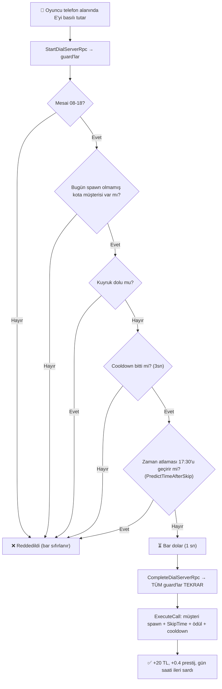

> [!NOTE]
> **17:30 guard'ı** (`CUSTOMER_EXIT_HOUR`) kritik: olmasaydı, çağrılan müşteri aynı karede
> gün-sonu kesimine yakalanır ve oyuncu hem +0.4 arama prestijini hem −0.4 kayıp cezasını görürdü
> (QA bulgusu 2026-08-29). `phoneEndHour = 18` bu iş için yetmiyor.
>
> **Server-authoritative**: client'ın "yeterince bekledim" beyanına güvenilmez, sunucu kendi
> zaman damgasından hesaplar (`f9a3f1b` "bedava para" exploit dersi).

### 14.3 Görsel ve Ses Geri Bildirimi

- **PhoneWaitBar** iki iş yapıyor: (a) basılı tutarken 0→1 dolan çevirme barı,
  (b) çağrıdan sonra 1→0 inen cooldown barı
- **Başarı sesi**: çağrı gerçekleştiğinde (`successCallSound`)
- **Zil sesi YOK** — telefon çalmıyor
- Telefon **fiziksel olarak mağazada bir yerde**; oyuncunun oraya yürümesi gerekir
- "Biri şu an çeviriyor" göstergesi **bilinçli olarak kapsam dışı** (yalnız yerel oyuncu görür)

> [!CAUTION]
> **Bağlanmamış inspector alanları sessizce sistemi öldürüyor.** `successCallSound`,
> `phoneWaitBar`, `phoneCollider` hepsi null-guard'lı: atanmadıklarında hata VERMEZ, sadece
> susarlar. "Telefon hiç çalmadı" sanılmasının sebebi tam olarak buydu (2026-08-13).
> `WarnOnMissingReferences()` artık bir kez uyarı basıyor.

### 14.4 Telefonun Gerçek Ekonomik Bedeli

`SkipTime`, `timeSkipAmountByPlayerCount`'u **TABAN** gün süresiyle (200s) gerçek saniyeye
çevirir (bkz. §3.2 uyarısı):

$$\text{gerçekSaniye} = T[P] \times \frac{200}{11 \times 60} = T[P] \times 0{,}30303$$

| Oyuncu | `T[P]` (oyun-dk) | Gerçek maliyet | Doğal varış aralığı | Maliyet / aralık |
|--------|------------------|----------------|---------------------|------------------|
| 1P | 115 | **34.8 sn** | 44 sn | %79 |
| 2P | 59 | **17.9 sn** | 22 sn | %81 |
| 3P | 55 | **16.7 sn** | 21 sn | %79 |
| 4P | 55 | **16.7 sn** | 21 sn | %79 |

Yani bir çağrı, "sıradaki müşteriyi beklemek" yerine geçen sürenin yaklaşık **%80'ini** yakar —
kazanç, kalan **%20'lik** zaman tasarrufu + 20 TL + 0.4 prestij.

**Gün uzadıkça çağrı ucuzlar** (bedel gerçek-saniye cinsinden sabit, gün ise uzuyor):

| | Gün 1 (200s) | Gün 16 (330s) |
|--|--------------|---------------|
| 1P: 34.8 sn = | **115** oyun-dk | **70** oyun-dk |
| 2P: 17.9 sn = | **59** oyun-dk | **36** oyun-dk |
| 3P/4P: 16.7 sn = | **55** oyun-dk | **33** oyun-dk |

> [!IMPORTANT]
> `timeSkipAmountByPlayerCount`'un tooltip'i ("atlanan oyun-dakikası") **yalnız gün 1-3'te
> doğrudur**. Gün 16'da 115 dakikalık ayar fiilen ~70 oyun-dakikası ilerletir. Bu bir bug DEĞİL:
> `SkipTime`'ı `CurrentDayDuration`'a çevirmek geç-oyun telefon maliyetini **+%65** artırır ve
> telefonu beceri-ters bir tuzağa çevirir (ekonomist Round 7 §1). **Davranış korunacak,
> yalnız tooltip düzeltilecek.**

**Kullanım rehberi (16 hücre × 5 oran taraması, Round 7 §4):**
- Sağlıklı bant: müşterilerin **%10-25'ini** telefonla çağırmak (1P günde ~1, 2P-4P günde ~2.5)
- **"Her fırsatta çevir" (%100) tepe noktanın −%33…−62 altında** — spam edilmemeli
- Tepe nokta bandın 10/12 hücresinde **%25**
- Öğretilebilir tek kural: **"her ~4 müşteriden birini telefonla çağır"**

> [!NOTE]
> `timeSkipAmountByPlayerCount = {115, 49, 47, 47}` **önerildi ama HENÜZ UYGULANMADI**
> (Round 7 §2; P1 bilerek değişmiyor). Yukarıdaki tablo CANLI `{115, 59, 55, 55}` değerleriyle
> hesaplanmıştır.

---

## 15. 🎪 Etkinlik (Event) Sistemi

> **Kaynaklar**: [EventCalendarUI.cs](file:///c:/Users/cicek/Documents/GitHub/Cargor/Assets/NewCss/Events/EventCalendarUI.cs), [EventEffectManager.cs](file:///c:/Users/cicek/Documents/GitHub/Cargor/Assets/NewCss/Events/EventEffectManager.cs)

### 15.1 Takvim Sistemi

- **16 hücreli ızgara** (16 gün)
- **İlk 3 gün**: Etkinlik yok (oyuncunun adapte olması için)
- **3. günden sonra**: Her 1-2 günde bir etkinlik
- **Garanti kuralları**:
  - İlk 2 etkinlik **mutlaka pozitif**
  - 3. etkinlik **mutlaka negatif**
  - Sonrası rastgele

### 15.2 Etkinlik Kataloğu (16 Etkinlik — kodla birebir)

> Değerler `EventEffectManager.InitializeEventMultipliers()` (cs:130-360) ile birebir eşleşir.
> Boş hücre = ×1.0 (etkisiz).

#### Pozitif Etkinlikler 🟢 (8 adet)

| Etkinlik | Kutu ödülü | Müşteri kotası | Sabır | Tır çıkışı | Diğer |
|----------|-----------|----------------|-------|-----------|-------|
| **DELIVERY BONUS** | **×1.20** | | | | |
| **EXPRESS CARGO** | ×1.08 | | | **×0.70** | |
| **GOLDEN BOX DAY** | ×1.15 | ×1.15 | | ×0.80 | hareket ×1.08, sprint ×1.20, stamina regen **×0.80** |
| **VIP SERVICE** | ×1.12 | | | | |
| **RELAXED DAY** | | | **×1.30** | | |
| **OPPORTUNITY DAY** | | | | | upgrade maliyeti **×0.80** |
| **FESTIVAL DAY** | | | | | gün başında **kira × %10-20** rastgele para |
| **CUSTOMER SUPPORT** | | | | | telefon cooldown ×0.5 (bkz. §14.1 uyarısı) |

#### Negatif Etkinlikler 🔴 (8 adet)

| Etkinlik | Kutu ödülü | Müşteri kotası | Sabır | Tır çıkışı | Diğer |
|----------|-----------|----------------|-------|-----------|-------|
| **BUSY DAY** | | **×1.35** | ×0.85 | | |
| **ANGRY CUSTOMERS** | | ×1.10 | **×0.60** | | |
| **MARKETING DAY** | **×0.70** | ×1.20 | | | |
| **RAINY DAY** | | ×0.80 | | | |
| **SLOW LOGISTICS** | ×0.92 | | | **×1.50** | |
| **HEAVY BOXES** | | | | | hareket ×0.85, sprint ×0.80 |
| **FATIGUE PROBLEM** | | ×0.85 | | | hareket ×0.90, sprint ×0.70, stamina regen ×0.60 |
| **SURPRISE AUDIT** | | | | | tüm prestij cezaları **×2** |

> [!NOTE]
> Eski GDD'nin **"Quota Day"** etkinliği kodda **yok**. `EventCalendarUI._allEvents` tam olarak
> yukarıdaki 16 kaydı içerir (8 pozitif + 8 negatif; CUSTOMER SUPPORT `EventType.Positive`).
>
> **Zamanlama**: ilk **3 gün etkinliksiz** (`INITIAL_EVENT_FREE_DAYS`), sonrasında **1–2 gün**
> aralıklarla düşer (`EVENT_INTERVAL_MIN/MAX`, 2026-08-25: 1-3 → 1-2). Kira günlerine (4/8/12/16)
> etkinlik **hiç atanmaz** (`IsRentDay` dışlaması).

> [!IMPORTANT]
> **Ekonomist ölçümleri (Round 5) — 4 yapısal bulgu:**
> 1. **FESTIVAL DAY ~6 kat outlier.** Tek-gün etkisi **+28…+%109** (16 hücre ort. +%61);
>    ikinci sıradaki MARKETING DAY'in (−%19) 3 katı. Sebep: **tek kira-bağlı event**, kira hem
>    P ile hem `1.20^dönem` ile büyürken strict bantta günlük gelir büyümüyor.
> 2. **Kota çarpanı YUKARI yönde ölü** (BUSY DAY, MARKETING DAY, ANGRY CUSTOMERS, GOLDEN BOX DAY).
>    Bkz. §7.2 / §9.6 — doğru kol varış aralığını bölmek olurdu. BUSY DAY'in lokalizasyon metni
>    zaten "SPAWN RATE +35%" vaat ediyor ama kod kotayı çarpıyor.
> 3. **Pozitif/negatif asimetrik, oyuncu lehine.** 40k Monte Carlo: 16 günde ort. **5.86 event**
>    (3.43 pozitif / 2.43 negatif) → pozitifler **%43 daha sık**
>    (`INITIAL_POSITIVE_EVENT_COUNT=2` vs tek `GUARANTEED_NEGATIVE_EVENT_INDEX=2`).
>    Net para katkısı +%0.6…+2.7 — ama bunun **%80-100'ü tek başına FESTIVAL DAY'den**.
> 4. **RELAXED DAY Normal bantta tam sıfır** (16 hücrenin 8'i) — sabır kolu orada hiç çalışmıyor
>    (bkz. §9.4).
>
> **Yerleşim riski**: takvim kira günlerini dışlıyor ama **kira gününden ÖNCEKİ günü (15)**
> korumuyor — tek-event en kötü hasar hep orada çıkıyor (−255 TL, BUSY DAY, 4P).

> [!NOTE]
> **Ölü kod**: `EventEffectManager.IsGoldenBoxDay()` (cs:702) ve `IsVIPServiceDay()` (cs:709)
> tüm `Assets/` içinde **okuyucusuz**. İşlevsel boşluk yok — açıklamalardaki %15/%12 zaten
> `rewardPerBoxMultiplier`'dan geliyor.
>
> **FAZ 4 düzeltmeleri (tarihsel)**: RELAXED DAY'in açıklamada olmayan gizli müşteri cezası
> (×0.7) kaldırıldı · RAINY DAY yanlış sınıflandırılmıştı (Pozitif → **Negatif**) ·
> VIP SERVICE'in "tır başına %10 şans" RNG'si silinip sabit ×1.12 yapıldı.

### 15.3 Etkinlik Uygulama Mekanizması

`EventEffectManager`, etkinliğin gerektirdiği çarpanları ilgili sistemlere uygular:

```
EventEffectManager
├── Truck.rewardPerBox               → rewardPerBoxMultiplier
├── Truck çıkış gecikmesi            → exitDelayMultiplier
├── CustomerAI.waitTime              → customerWaitTimeMultiplier
├── CustomerManager.eventCustomerMultiplier → dailyCustomerMultiplier (kota tabanına)
├── PlayerMovement.moveSpeed         → playerMoveSpeedMultiplier
├── PlayerMovement.sprintSpeed       → playerSprintSpeedMultiplier
├── PlayerMovement.staminaRegenRate  → staminaRegenRateMultiplier
├── UpgradePanel.costMultiplier      → upgradeCostMultiplier (UpgradePanel.cs:1618 okuyor)
├── PhoneCallManager                 → IsEventActive("CUSTOMER SUPPORT") ile cooldown ×0.5
└── PrestigeManager cezaları         → GetPenaltyMultiplier() (SURPRISE AUDIT ×2)
```

**Geri yükleme**: Orijinal değerler saklanır ve etkinlik sona erdiğinde (yeni gün başladığında) geri yüklenir.

> [!WARNING]
> Perk sistemi de aynı alanların bir kısmına yazıyor ve etkinlik geri-yüklemesi
> **snapshot tabanlı** — snapshot'a yeni bir yazar eklenirse snapshot da tazelenmeli
> (bkz. `.claude/agent-memory/economist/perk_card_absolute_assignment_conflict.md`).

---

## 16. 🏆 Görev (Quest) Sistemi

> [!NOTE]
> **Quest kodu `Assets/Scripts/Quest/` altında — `Assets/NewCss/` DIŞINDA** (legacy konum).
> Kaynaklar: `Assets/Scripts/Quest/Manager/QuestManager.cs`, `.../QuestTracker.cs`,
> `.../Data/QuestData.cs`. Asset'ler: `Assets/Resources/Quests/*.asset` (30 adet).

### 16.1 Görev Yapısı

| Parametre | Değer |
|-----------|-------|
| Günlük teklif sayısı | **3** (`DAILY_QUEST_COUNT`) |
| Havuz | **30 elle yazılmış asset** — Easy 11 · Medium 10 · Hard 9 |
| Seçim | **Katmanlı** (`SelectDailyQuestsStratified`): her tier'dan en az bir teklif garantili |
| Zorluk katmanları | Easy (tier 0), Medium (1), Hard (2) |
| Hard görev kilidi | `Görev Kademesi` upgrade'i ile açılır |
| Günlük kabul limiti | **1** — teklif 3 ama yalnız biri kabul edilebilir |

> **Ödül modeli elle yazım.** Eski rastgele havuz modeli (`rewardPool`/`penaltyPool` + Fisher-Yates)
> kaldırıldı; her asset kendi `moneyReward` / `prestigeReward` / `moneyPenalty` / `prestigePenalty`
> alanlarını taşıyor. **Ceza alanları POZİTİF girilir**, kod `-Mathf.Abs()` uygular
> (eksi yazılırsa çift-negatif olup ceza ödüle dönme tuzağı kapalı).

### 16.2 Görev Ödül / Ceza Tablosu

Tablo **tier-düz**: aynı tier'daki her asset aynı ödülü verir (2026-08-06, `975f011` —
eski base/premium/phone grup ayrımı kaldırıldı).

| Tier | Para ödülü | Para cezası | Prestij ödülü | Prestij cezası | Asset |
|------|-----------|-------------|---------------|----------------|-------|
| **Easy** | 28 TL | 15 TL | +1.4 | −0.8 | 11 |
| **Medium** | 60 TL | 27 TL | +3.0 | −1.36 | 10 |
| **Hard** | 150 TL | 53 TL | +7.5 | −2.66 | 9 |

> [!IMPORTANT]
> **Görev PRESTİJİ, para ödülünden büyük olabiliyor.** §4.3'ün dönüşümüyle Hard'ın +7.5 prestiji
> gün 8'de **34-281 TL** ediyor — optimistic bantta 150 TL'lik para ödülünün **1.7-1.9 katı**.
> 16 günlük quest prestiji 1.6-**48.1** puan; `maxPrestige=100` tavanına çarpan hücre sayısı
> quest'siz 3/12 iken quest'li **6/12** (Round 8 §3). Bu terim kart üzerinde görünmediği için
> oyuncuya **görünmez** bir değer.
>
> Quest PARASI ise doğru büyüklükte (tır gelirinin %2.1-2.5'i strict, %4.5-7.4'ü optimistic),
> ama kira brüt geliri süpürdüğü için **final kasaya +%19…+%61 biniyor**.

> [!CAUTION]
> **"Görev Kademesi" upgrade'i strict bantta ÖDENMİŞ KÖTÜLEŞTİRME.** `DAILY_QUEST_COUNT = 3`
> **sabit** ve tier kilidi `SetQuestTierInternal` (cs:748) ile **yalnız-artar/geri alınamaz**.
> Tier açmak havuzu 11'den 30'a çıkarıyor ama strict bantta 19'u negatif-EV → oyuncunun gördüğü
> "iyi teklif" 3'ten 1'e düşüyor. Ölçüm: 4/4 Normal/strict hücrede **T2 < T0**, üstelik
> 180 × P-çarpanı TL ödenmişken (L2 net −118…−480). Öneri (henüz uygulanmadı):
> `DAILY_QUEST_COUNT = 3 + CurrentQuestTier` + upgrade'i `UpgradeCostMultiplier`'dan muaf tutmak
> (Round 8 §2).

### 16.3 Görev Durumları

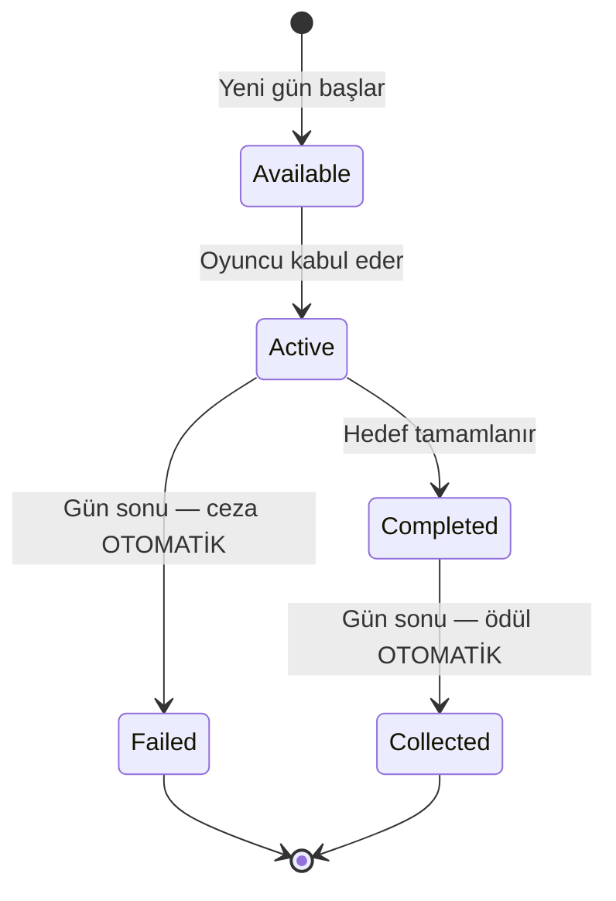

> [!IMPORTANT]
> **"Topla" adımı kaldırıldı** (2026-07-28). Ödül ve ceza gün sonunda
> `SettleAcceptedQuestsForDayEnd()` ile otomatik uygulanır; oyuncunun butona basması gerekmez.
> **Gün 16** ayrı bir yol: `NextDay()` win dalı `OnNewDay`'i hiç tetiklemediği için settlement de
> çalışmıyordu — son günün kabul edilmiş görevi cezasız/ödülsüz kalıyordu.
> `SettleAcceptedQuestsOnGameEnd()` bunu kapatıyor (idempotent, `IsServer` guard'lı).

### 16.4 Görev Tipleri

| enum | Görev Tipi | Durum | Katalogda |
|---|-----------|-------|-----------|
| 1 | **PlaceBoxOnShelf** | ✅ canlı | **13 asset** |
| 3 | **PackToy** | ✅ canlı | **12 asset** |
| 2 | **CompleteTruck** | ✅ canlı | **3 asset** |
| 4 | **AnswerPhone** | ✅ canlı — tetikleyici `PhoneCallManager.cs:469` (V4 dışarı arama) | **2 asset** (Easy hedef 2, Medium hedef 3) |
| 6 | **CompleteSpecificColorTruck** | ⚠️ tetikleyici CANLI (`Truck.cs:656`) ama asset yok | 0 |
| 0 | **CompleteMinigame** | 🔴 **ÖLÜ** — `QuestTracker.NotifyMinigameCompleted()` çağıranı yok | 0 |
| 5 | **MakePackagingMistake** | 🔴 **ÖLÜ** — `NotifyPackagingMistake()` çağıranı yok | 0 |

> Ölü tipler canlı bug değil (hiçbir asset kullanmıyor), ama yeni görev tipi eklemeden önce
> tetikleyicilerinin bağlanması gerekir.

> [!CAUTION]
> **`AnswerPhone` görevleri §14.4'ün dersinin TERSİNİ ödüllendiriyor.** Ölçüm: telefon quest'inin
> kasaya katkısı telefon kullanım oranı %0-25'te **−3…−117 TL**, %60-100'de **+20…+148 TL**
> (Round 8 §5). Yani görev, oyuncuyu ekonomik olarak zararlı olan telefon spam'ine itiyor.
> Üstelik strict/%60'ta `med_phone_3` havuzdaki **tek pozitif-EV Medium görev**.
> Öneri (Round 7 uygulandıktan SONRA): Easy hedef **2→1**, Medium hedef **3→2**.

### 16.5 Hedef Ölçekleme (D2) — şu an etkisiz

`CalculateEffectiveTargetCount` görev hedefini oyuncu sayısıyla ölçeklemek için var, **ama dört
canlı fiilin dördü de muaf** (`PlaceBoxOnShelf`, `PackToy`, `CompleteTruck`, `AnswerPhone`) →
mevcut katalogda **tamamen no-op**.

Sebep: `targetCount` değerleri 2026-07-29 turunda **zaten tüm P bantlarında** ~%85 tamamlanma
hedeflenerek kalibre edilmişti. D2 onların üstüne bir kez daha çarpınca sim'de renksiz raf/paket
tamamlanma olasılığı **3P 0.76 → 0.13**, **4P 0.87 → 0.13**'e düşüyordu (çifte ölçekleme).

Mekanizma, arzı oyuncu sayısıyla ölçeklenMEYEN gelecekteki görev tipleri için duruyor.

> [!WARNING]
> **Muafiyet TİP-BAZLI, kalıcı değil.** `CompleteSpecificColorTruck` (enum 6) muafiyet listesinde
> **YOK** ve tetikleyicisi canlı — o tipte bir asset eklenirse çifte-ölçekleme bug'ı aynen geri
> gelir. Öneri: tip 6 da listeye eklensin (`CalculateEffectiveTargetCount`, cs:569-583).

> Kart açıklamasında gösterilen sayı `QuestProgress.targetProgress`'ten gelir (tek doğruluk kaynağı),
> asset'teki ham `targetCount`'tan değil — aksi halde ölçekleme açılınca kart yanlış hedef gösterirdi.

### 16.6 Görev Ödül Tipleri (buff kanalı)

Mevcut 30 asset'in **hiçbirinde buff yok** — hepsi yalnız para + prestij veriyor. Buff'lı görev
eklenecekse aşağıdaki tuzaklara dikkat:

| Ödül | Etki | Not |
|------|------|-----|
| **Money** / **Prestige** | Para / prestij | ✅ kullanımda |
| **MaxStamina**, **MoveSpeed**, **WalkSpeed**, **StaminaRegenRate**, **DayDuration**, **MaxQueueSize**, **CustomerWaitTime** | İlgili değeri artırır | ⚠️ Hepsi **KALICI** — günlük tekrarlanan bir görevde verilirse **birikir** |
| **TempSpeedBoost**, **PenaltyReduction** | Geçici bonus | ✅ süreli |
| **TempMoneyBoost** | — | 🔴 **`buffType` VARSAYILANI bu** ama `TempMoneyPerBox`'ı okuyan sistem yok → **ölü buff**: kartta yazar, hiçbir şey yapmaz |

### 16.7 Görev Takip Sistemi (QuestTracker)

Statik event dispatcher — oyun sistemleri event ateşler, QuestManager ilerlemeyi takip eder:

```
Truck.OnDeliveryComplete → QuestTracker.NotifyTruckCompleted()
PhoneCallManager.OnCallSuccess → QuestTracker.NotifyPhoneAnswered()
PlayerInventory.OnBoxPlaced → QuestTracker.NotifyBoxPlaced()
```

> [!WARNING]
> **Raf görevi dedup'u**: `BoxInfo.countedForShelfQuest` bayrağı olmadan "rafa koy → geri al →
> tekrar koy" döngüsüyle tek kutuyla hedef 12 ~30 saniyede tamamlanabiliyordu (P0 exploit, kapatıldı).
> Bilinen kısıt: bayrak tek boolean, yani bir kutu bir kez sayıldıktan sonra **farklı** bir
> raf/renk görevine de sayılmıyor — aşırı kısıtlayıcı ama exploit değil, tasarım tercihi.

---

## 17. 🎮 Oyuncu Hareketi ve Fizik

> **Kaynaklar**: [PlayerMovement.cs](file:///c:/Users/cicek/Documents/GitHub/Cargor/Assets/NewCss/CharacterScript/PlayerMovement.cs), [PlayerSpawner.cs](file:///c:/Users/cicek/Documents/GitHub/Cargor/Assets/NewCss/PlayerSpawner.cs)

### 17.1 Hareket Parametreleri

| Parametre | Değer | Açıklama |
|-----------|-------|----------|
| Normal hız | **5 m/s** | Standart yürüme |
| Sprint hızı | **7 m/s** | Koşma |
| Bitkin hız | **3 m/s** | Stamina bittiğinde |
| Sprint süresi | **3 saniye** | Maksimum koşma |
| Sprint bekleme | **3 saniye** | Koşmadan sonra cooldown |
| Stamina yenilenme | **1.0/s** | Baz yenilenme hızı |

### 17.2 Oyuncu Durumları

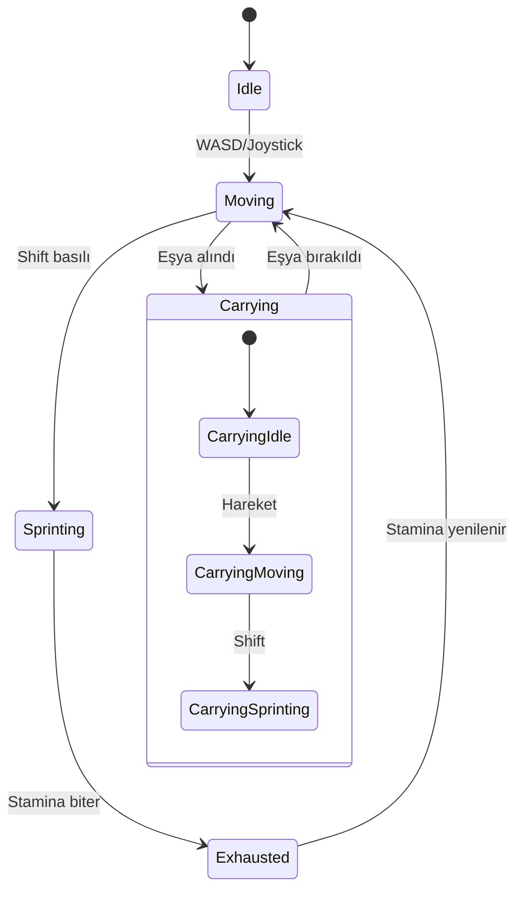

### 17.3 Ağ Senkronizasyonu

- **X/Z hareketi** ağ üzerinden senkronize
- **Koşma durumu** NetworkVariable
- **Taşıma durumu** NetworkVariable
- **Ses**: Yürüme ve koşma adım sesleri, volume kontrolü ile

### 17.4 Oyuncu Spawn Sistemi

- **Sahne**: Yalnızca "The Main Office" sahnesinde
- Önceden tanımlanmış spawn noktalarından rastgele seçilir
- Geç katılan oyuncular (late join) desteklenir
- Bağlantı koptuğunda oyuncu temizlenir

### 17.5 Karakter Özelleştirme

> **Kaynak**: [SkinToneManager.cs](file:///c:/Users/cicek/Documents/GitHub/Cargor/Assets/NewCss/SkinToneManager.cs)

- Ten rengi seçimi
- Ana menüde özelleştirme UI'ı (`MainMenuCustomizationUI`)

---

## 18. 🛏️ Dinlenme Odası Sistemi

> **Kaynak**: [BreakRoomManager.cs](file:///c:/Users/cicek/Documents/GitHub/Cargor/Assets/NewCss/BreakRoomScripts/BreakRoomManager.cs)

### 18.1 Amaç

Gün sonunda tüm oyuncuların dinlenme odasında toplanması gerekmektedir. Bu, oyuncuların birbirini beklemesini ve gün sonunu senkronize bitirmesini sağlar.

### 18.2 Mekanikler

| Özellik | Detay |
|---------|-------|
| Algılama | Trigger Collider ("Character" tag) |
| Hazır koşulu | **Tüm bağlı oyuncular** odanın içinde |
| Steam entegrasyonu | Lobby'den oyuncu sayısı alınır |
| Events | `OnBreakRoomReady`, `OnPlayerEntered`, `OnPlayerExited` |

### 18.3 Akış

1. Gün biter (saat 18:00)
2. Oyunculara "Dinlenme Odasına Git" mesajı gösterilir
3. Oyuncular odaya girer → `OnPlayerEntered` event'i
4. Tüm oyuncular girdiğinde → `isBreakRoomReady = true`
5. Gün sonu özet ekranı gösterilir
6. Yeni gün başlar

---

## 19. ⚖️ Zorluk Sistemi

> **Kaynak**: [DifficultyManager.cs](file:///c:/Users/cicek/Documents/GitHub/Cargor/Assets/NewCss/GameState/DifficultyManager.cs)

### 19.1 Oyuncu Sayısına Göre Ölçekleme

**CANLI (gerçekten okunan) P-ölçeklemeleri:**

| Parametre | Kaynak | 1P | 2P | 3P | 4P |
|-----------|--------|-----|-----|-----|-----|
| **Günlük müşteri kotası** (gün 16) | `GameEconomySettings.dailyCustomerCountP*` | 6 | 12 | 13 | 13 |
| **Müşteri varış aralığı** | `customerArrivalIntervalByPlayerCount` | 44s | 22s | 21s | 21s |
| Başlangıç parası | `DifficultyManager.moneyMultiplierPerPlayer=1.2` (üstel) | 500 | 600 | 720 | 864 |
| Stamina tüketimi | `staminaDrainMultiplierPerPlayer=1.1` | ×1.00 | ×1.10 | ×1.21 | ×1.33 |
| **Upgrade/perk/reroll maliyeti** | `upgradeCostMultiplierByPlayerCount` (**DİZİ**) | ×1.00 | ×2.00 | ×2.95 | ×3.70 |
| **Kira** | `baseRentByPlayerCount` | 500 | 1.000 | 1.450 | 1.800 |
| **Kutu ödülü** | `rewardPerBoxByPlayerCount` | 50 | 55 | 70 | 88 |
| **Tır kargosu** | `truckCargoMin/MaxExclusive` | 1–2 | 2–3 | 2–4 | 2–5 |
| **Hangar bekleme** | `hangarStayDurationByPlayerCount` | 120s | 60s | 40s | 30s |
| **Telefon zaman bedeli** | `timeSkipAmountByPlayerCount` | 115 dk | 59 dk | 55 dk | 55 dk |

> [!CAUTION]
> **`DifficultyManager`'ın müşteri/sabır ölçeklemeleri ÖLÜ KABLO.** `ScaledCustomerCount`,
> `ScaledMinPatience`, `ScaledMaxPatience`, `ScaledStaminaRegenRate` property'lerinin
> `DifficultyManager.cs` **DIŞINDA tek bir tüketicisi yok** (grep ile doğrulandı; yalnız
> `GetDifficultyInfo()` log'a basıyor). Dolayısıyla `baseCustomerCount=10`,
> `customerCountPerPlayer=5`, `baseMinPatience=35`, `baseMaxPatience=55`,
> `patienceReductionPerPlayer=5` alanları **hiçbir şey yapmıyor**:
> - Müşteri sayısını `GameEconomySettings` kota tablosu belirliyor (§7.1)
> - Sabri `Customer.prefab`'ın `minWaitTime=15` / `maxWaitTime=20` alanları belirliyor (§9.4)
>
> `ScaledStartingMoney` ise CANLI (`DifficultyManager.cs:455` → `MoneySystem.startingMoney`).
> Eski GDD'nin "müşteri 10/12/14/16" ve "sabır 8-14s → 2-8s" satırları hiçbir zaman canlı olmadı.

> [!NOTE]
> **Telefon ve upgrade maliyeti artık `DifficultyManager`'da DEĞİL.**
> `basePhoneCallChance`, `phoneChancePerPlayer`, `ScaledPhoneCallChance` ve
> `upgradeCostMultiplierPerPlayer` (tek float) **silindi**. Telefon P-ölçeklemesi
> `GameEconomySettings.timeSkipAmountByPlayerCount`'ta, upgrade maliyeti dizide.

### 19.2 Ölçülen Gelir Ölçeği

Sim v3.1 ölçümü — **1 : 1.73 : 2.40 : 2.95**. Kira ölçeği (1 : 2.00 : 2.90 : 3.60) bundan
bilinçli olarak dik: kalabalık takım koordinasyon avantajını kirayla geri ödüyor.

### 19.3 Tasarım Felsefesi

> Daha fazla oyuncu = daha fazla iş gücü, ama aynı zamanda daha fazla müşteri, daha yüksek kira
> ve çok daha pahalı upgrade'ler. Co-op'un gücü koordinasyonda, ham güçte değil.

---

## 20. 🌅 Gece-Gündüz Aydınlatma

> **Kaynak**: [DayLightController.cs](file:///c:/Users/cicek/Documents/GitHub/Cargor/Assets/NewCss/DayLightController.cs)

### 20.1 Güneş Animasyonu

Directional Light, `DayCycleManager` ilerlemesine göre animasyon gösterir:

| Özellik | Gün Başı (07:00) | Öğlen (12:30) | Gün Sonu (18:00) |
|---------|-----------------|---------------|-------------------|
| X Rotasyonu | -180° | 0° | +180° |
| Renk | Sıcak beyaz | Beyaz | Turuncu |
| Yoğunluk | 0.5 | 1.0 (pik) | 0.05 |

### 20.2 Geçişler

- Pürüzsüz (smooth) geçişler
- Yapılandırılabilir hız parametreleri
- Her yeni günde sıfırlanır

---

## 21. 🏁 Oyun Durumu: Kazanma ve Kaybetme

> **Kaynak**: [GameStateManager.cs](file:///c:/Users/cicek/Documents/GitHub/Cargor/Assets/NewCss/GameState/GameStateManager.cs)

### 21.1 Kazanma Koşulu

$$\text{KAZANDIN} = (\text{Gün} \geq 16)$$

16. günü tamamlamak — yani prestij sıfırlanmadan ve iflas etmeden o güne ulaşmak.

> [!WARNING]
> **`CheckWinCondition` prestije BAKMIYOR.** Yalnız `currentDay >= MAX_DAYS` kontrol ediliyor
> (`GameStateManager.cs:696-712`). Prestij kapısı fiilen `PrestigeManager.ModifyPrestige`
> (cs:154-157) içinde. **Kodun kendi docstring'i (cs:691, 706) bununla ÇELİŞİYOR** —
> "prestige > 0 and rent paid" diyor. Ya yorum düzeltilmeli ya kontrol gerçekten eklenmeli.
>
> İlgili sessiz kaçak: `PrestigeManager.SetPrestige` (cs:231) o kapıdan geçmiyor (clamp var,
> `TriggerLose` yok). Bugün dış çağıranı yok; ileride bağlanırsa prestij sessizce 0'a inebilir.

### 21.2 Kaybetme Koşulları (2 Yol)

| # | Koşul | Tetikleyen | Detay |
|---|-------|-----------|-------|
| 1 | **İflas** | Kira ödeyememe (2. kez) | Grace period kullanılmış + yine ödeyemiyor |
| 2 | **Prestij sıfırlanması** | Prestij ≤ 0 (**clamp öncesi ham değer**) | Çok fazla müşteri kaçırma/hata/görev cezası |

> ~~3. Kota başarısızlığı~~ — **kaldırıldı**, `QuotaManager` tamamen silindi. 2026-08-29'da gelen
> yeni müşteri kotası bir kaybetme koşulu DEĞİLDİR, yalnız hafif prestij cezası verir (bkz. §7).

> [!IMPORTANT]
> **Pratikte kaybetmenin tek yolu 1. madde.** Ekonomist Round 6 ölçümü: 16/16 senaryoda prestij
> hiç 0'a inmiyor, kaybeden hücreler NAKİT'ten iflas ediyor ve o anda bile prestijleri 18.9-43.4
> (bkz. §6.4). Prestij kaybı bugün ayırt edici bir fail-state değil.

> [!IMPORTANT]
> **Kazanılmış oyun kaybedilemez.** `TriggerWin` ve `TriggerLose` artık `gameEnded` guard'lı
> (`f013f5d`). Bu guard olmadan gün 16 zaferinden SONRA çalışan quest settlement'ı, tamamlanmayan
> bir görevin prestij cezasıyla prestiji sıfırlayıp zafer ekranının üstüne kayıp ekranı basıyordu.

### 21.3 Game Over Akışı

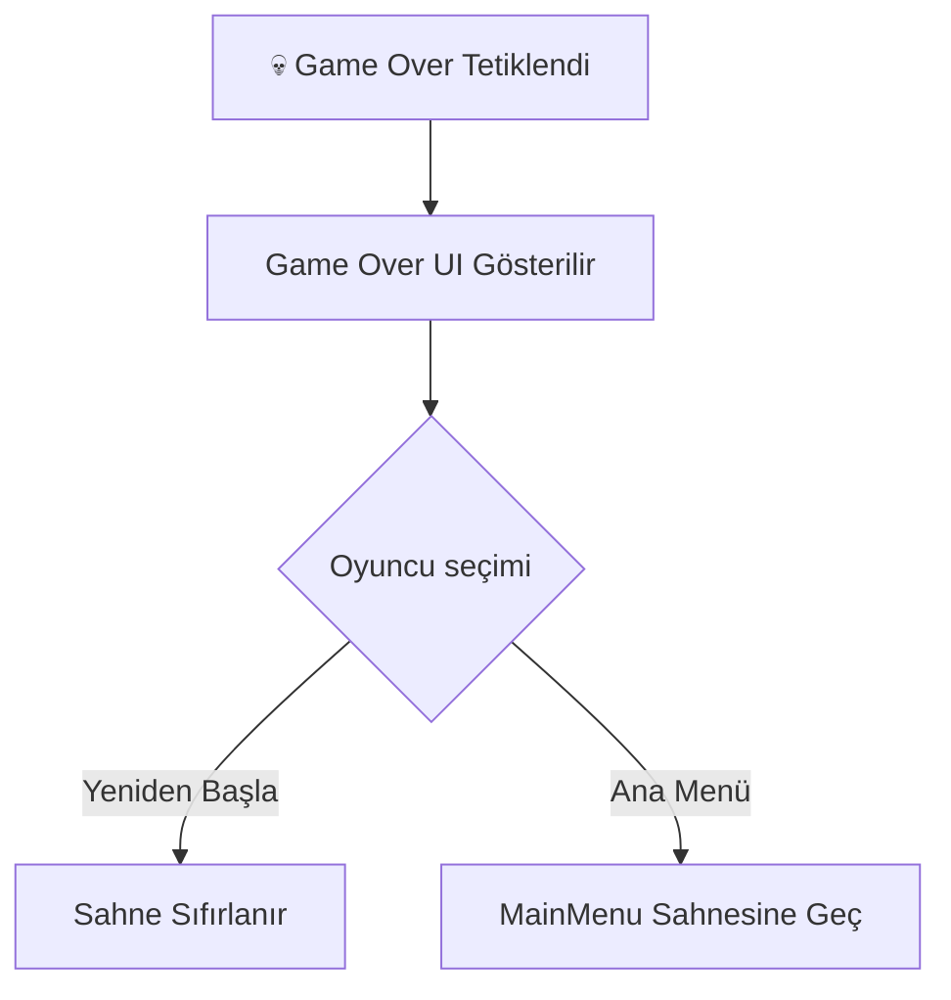

### 21.4 Önemli: DontDestroyOnLoad

`GameStateManager` singleton'dır ve `DontDestroyOnLoad` ile sahne geçişlerinde korunur.

---

## 22. 🎓 Tutorial Sistemi

> **Kaynak**: [TutorialManager.cs](file:///c:/Users/cicek/Documents/GitHub/Cargor/Assets/NewCss/Tutorial/TutorialManager.cs)

### 22.1 Özellikler

| Özellik | Detay |
|---------|-------|
| Yapı | Adım bazlı (step-based) akış |
| Metin efekti | Daktiloğraf (typewriter) efekti |
| Vurgulama | Hedef objelere outline |
| Kapı yönetimi | Tutorial kapıları ilerlemeye göre açılır/kapanır |
| Lokalizasyon | Türkçe + İngilizce |
| Ağ | NetworkBehaviour ile multiplayer senkronize |
| Sahne | Ayrı "Tutorial" sahnesi |

### 22.2 Tutorial Akışı

1. Oyuncu Tutorial sahnesine girer
2. Adım adım yönergeler gösterilir (typewriter efektiyle)
3. Her adımda hedef obje vurgulanır (outline)
4. Oyuncu eylemi tamamladığında sonraki adıma geçilir
5. Tüm adımlar tamamlanınca ana oyun sahnesine geçilir

---

## 23. 🌐 Multiplayer ve Ağ Mimarisi

### 23.1 Ağ Altyapısı

| Bileşen | Teknoloji |
|---------|-----------|
| Framework | Unity Netcode for GameObjects |
| Transport | Facepunch Transport (Steam P2P) |
| Topoloji | Host-Client (dedicated server yok) |
| Maksimum oyuncu | **4** |
| Otorite | **Server-authoritative** |

### 23.2 Senkronizasyon Stratejisi

| Veri | Yöntem | Yön |
|------|--------|-----|
| Oyuncu pozisyonu | NetworkVariable | Server → Client |
| Para | NetworkVariable | Server → Client (read-only) |
| Prestij | NetworkVariable | Server → Client |
| Gün sayısı | NetworkVariable | Server → Client |
| Eşya durumu | NetworkVariable | Server → Client |
| Oyuncu eylemleri | ServerRpc | Client → Server |
| Geri bildirimler | ClientRpc | Server → Client |

### 23.3 Güvenlik

- Tüm ekonomik işlemler **sunucu tarafında** hesaplanır
- Client sadece **input gönderir** (ServerRpc)
- Eşya kilitleme: Statik dictionary ile çift alma engeli

---

## 24. 🎮 Steam Entegrasyonu

> **Kaynak**: [SteamManager.cs](file:///c:/Users/cicek/Documents/GitHub/Cargor/Assets/NewCss/Steam/SteamManager.cs)

### 24.1 Özellikler

| Özellik | Detay |
|---------|-------|
| SDK | Steamworks.NET |
| Transport | Facepunch Transport (Steam Relay) |
| Lobi yönetimi | Oluşturma / Katılma |
| Lobi kodu | **Base36** encoded benzersiz kodlar |
| Oyuncu slotları | 4 max (dolu/boş sprite'lar) |
| Kick sistemi | Host oyuncuları atabilir |
| Versiyon kontrolü | Lobby data'da oyun versiyonu |
| Yükleme ekranı | İlerleme barı + animasyonlu noktalar |

### 24.2 Lobi Akışı

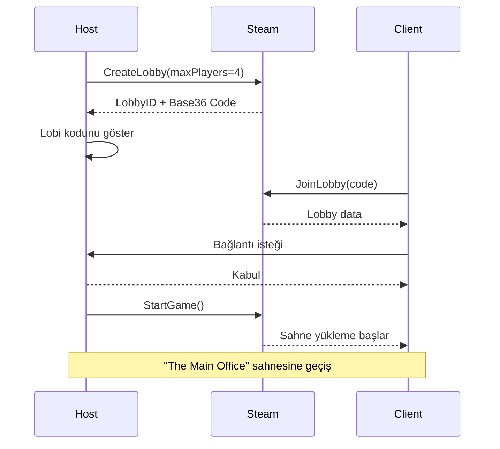

---

## 25. 🎮 Discord Entegrasyonu

> **Kaynak**: [DiscordController.cs](file:///c:/Users/cicek/Documents/GitHub/Cargor/Assets/Scripts/DiscordController.cs)

- Discord Rich Presence desteği
- Oyun durumu görüntüleme (hangi gün, kaç oyuncu vb.)
- Davet sistemi entegrasyonu

---

## 26. 🖥️ UI / UX Tasarımı

### 26.1 Sahneler ve UI Yapıları

| Klasör | İçerik |
|--------|--------|
| `Assets/MainMenu/` | Ana menü sahnesi |
| `Assets/Main Menu UI/` | Ana menü UI bileşenleri |
| `Assets/MENUUI/` | Menü UI elementleri |
| `Assets/Host Game/` | Oyun oluşturma UI'ı |
| `Assets/Join Room/` | Odaya katılma UI'ı |
| `Assets/WinLoseUI/` | Kazanma/Kaybetme ekranları |
| `Assets/SettingsUı/` | Ayarlar paneli |
| `Assets/LocalSettings/` | Yerel ayarlar |
| `Assets/Figma/` | Figma tasarım referansları |

### 26.2 Oyun İçi HUD Elemanları

| Eleman | Konum | Güncelleme |
|--------|-------|-----------|
| Gün sayısı ("Day N") | Üst | Her gün |
| Saat | Üst | 10 FPS throttle |
| Para | Üst-sağ | `OnMoneyChanged` event |
| Prestij | Üst-sağ | Anlık |
| Müşteri sabır barı | Müşteri üzeri | Sürekli |
| Telefon bekleme barı | Telefon alanı | E basılıyken |

### 26.3 Animasyonlar

| Animasyon | Dosya | Kullanım |
|-----------|-------|----------|
| Yürüme | `Walk_Forward.anim` | Karakter hareketi |
| Mağaza açılış | `ShopOpening.anim` | Mağaza açılış animasyonu |
| Mağaza kapanış | `ShopExit.anim` | Mağaza kapanış animasyonu |
| Takvim açılış | `DateOpening.anim` | Etkinlik takvimi açılış |
| Takvim kapanış | `DateExit.anim` | Etkinlik takvimi kapanış |
| Upgrade panel | `UpgradePanel.controller` | Panel açılış/kapanış |

### 26.4 Escape Menüsü

> **Kaynak**: [EscapeMenuManager.cs](file:///c:/Users/cicek/Documents/GitHub/Cargor/Assets/NewCss/EscapeMenuManager.cs)

- ESC tuşuyla açılır
- Ayarlar, devam et, çıkış seçenekleri
- Input binding yönetimi entegrasyonu (`InputBindingManager.cs`)

---

## 27. 🔊 Ses Tasarımı

### 27.1 Ses Kaynakları

| Ses | Dosya | Kullanım |
|-----|-------|----------|
| Tır motor sesi | `motor_sound_when_ope_#1.wav` | Tır gelişi |
| Tır çıkış sesi | `the_sound_of_a_car_m.wav` | Tır kalkışı |
| Tır bekleme sesi | `Clean_recording_of_a_#1.wav` | Tır hangarda beklerken (loop) |
| Kutu düşme sesi | BoxFallPenalty ses | 3D spatial audio |

### 27.2 Ses Kategorileri

| Kategori | Klasör | Örnekler |
|----------|--------|---------|
| Müzik | `Assets/Music/` | Arka plan müziği |
| Ses efektleri | `Assets/Sounds/` | Genel ses efektleri |
| Tır sesleri | TruckScripts içinde | Motor, çıkış, bekleme |
| Etkileşim sesleri | PlayerInventory.Audio | Alma, bırakma, fırlatma |
| UI sesleri | Çeşitli | Buton, bildirim |

### 27.3 3D Spatial Audio

- Kutu düşme sesleri 3D spatial audio ile oynatılır
- Tır motor sesleri mesafeye göre zayıflar
- Müşteri ses efektleri pozisyona bağlı

---

## 28. 🌍 Lokalizasyon

> **Kaynak**: [LocalizationHelper.cs](file:///c:/Users/cicek/Documents/GitHub/Cargor/Assets/NewCss/Localization/LocalizationHelper.cs)

### 28.1 Desteklenen Diller

| Dil | Kod | Durum |
|-----|-----|-------|
| 🇹🇷 Türkçe | `tr` | Birincil |
| 🇬🇧 İngilizce | `en` | İkincil |

### 28.2 Sistem

- Unity Localization paketi kullanılır
- `LocalizationHelper.GetLocalizedString(key)` ile merkezi erişim
- Upgrade isimleri lokalize edilir (`Upgrade_{ItemType}` formatında)
- Tutorial metinleri her iki dilde

---

## 29. 🏗️ Teknik Mimari

### 29.1 Proje Yapısı

```
Assets/
├── NewCss/                     # Ana oyun kodu namespace'i
│   ├── BoxScripts/             # Kutu mekanikleri
│   ├── BreakRoomScripts/       # Dinlenme odası
│   ├── CharacterScript/        # Oyuncu hareketi
│   ├── CustomerSripts/         # Müşteri AI, Prestij, Kuyruk
│   ├── Echonomy/               # Ekonomi scriptleri
│   ├── Events/                 # Etkinlik sistemi
│   ├── GameState/              # Oyun durumu, gün döngüsü, zorluk
│   ├── InfoScripts/            # Bilgi scriptleri
│   ├── Localization/           # Dil desteği
│   ├── Network/                # Ağ kodları
│   ├── NewPickup/              # Pickup sistemi (v2)
│   ├── Notes/                  # Not sistemi
│   ├── Phone/                  # Telefon sistemi
│   ├── PickUpScripts/          # Pickup sistemi (v1)
│   ├── Quest/                  # Görev sistemi
│   ├── Steam/                  # Steam entegrasyonu
│   ├── TableScripts/           # Raf ve masa
│   ├── TruckScripts/           # Tır sistemi
│   ├── Tutorial/               # Eğitim sistemi
│   ├── UIScripts/              # UI bileşenleri
│   ├── UpgradeScripts/         # Yükseltme sistemi
│   ├── GameEconomySettings.cs  # Ekonomi ScriptableObject
│   ├── PlayerSpawner.cs        # Oyuncu spawn
│   ├── DayLightController.cs   # Aydınlatma
│   ├── EscapeMenuManager.cs    # Pause menü
│   └── SkinToneManager.cs      # Karakter özelleştirme
├── Scripts/
│   ├── Discord/                # Discord entegrasyonu
│   └── Quest/                  # Ek görev scriptleri
├── Models/                     # 3D modeller ve materyaller
├── Scenes/                     # Unity sahneleri
├── Shaders/                    # Custom shader'lar
├── Font/                       # Yazı tipleri
├── Music/                      # Müzik dosyaları
├── Sounds/                     # Ses efektleri
└── UI/                         # UI asset'leri
```

### 29.2 Tasarım Kalıpları

| Kalıp | Kullanım | Örnekler |
|-------|----------|---------|
| **Singleton** | Tüm manager'lar | DayCycleManager, MoneySystem, PrestigeManager |
| **NetworkBehaviour** | Multiplayer senkronize objeler | Truck, CustomerAI, PlayerMovement |
| **ScriptableObject** | Yapılandırma verileri | GameEconomySettings, WaveSettings, ItemData |
| **Observer (Event)** | Sistem arası iletişim | OnNewDay, OnMoneyChanged, QuestTracker.Notify* |
| **Partial Class** | Büyük sınıf bölme | PlayerInventory (6 parça) |
| **Server-Auth** | Güvenli oyun durumu | Tüm ekonomik işlemler |

### 29.3 Sahne Yapısı

| Sahne | Dosya | Amaç |
|-------|-------|------|
| Main Menu | `MainMenu` (klasör) | Ana menü, lobi, ayarlar |
| Tutorial | `Tutorial.unity` (1.2 MB) | Eğitim sahnesi |
| The Main Office | `The Main Office.unity` (6.4 MB) | Ana oyun sahnesi |

### 29.4 Render Pipeline

- **URP** (Universal Render Pipeline) kullanılıyor
- Custom shader'lar (`Assets/Shaders/`)
- QuickOutline paketi (eşya vurgulama)
- Figma Bridge entegrasyonu (`UnityFigmaBridgeSettings.asset`)

---

## 30. 🔗 Sistem Bağlantı Haritası

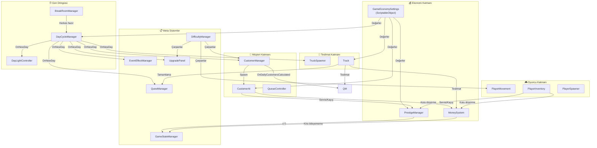

---

## 31. 📊 Ekonomi Simülasyon Verileri

> **Kaynak**: `tools/economy-sim/sim.js` (Node — `node tools/economy-sim/sim.js`).
> Analiz raporları: `plans/economy-full-balance-2026-08-30.md` (güncel tur) ve
> `plans/economy-rebuild-2026-07-30{,-faz2,-faz3,-faz4-final}.md` (tarihsel).

> [!CAUTION]
> **Yalnız `runFullSim(playerCount, opts)` (v4.0) kullanın.** Dosyadaki eski `runSim` /
> `runSimPlateUp` fonksiyonları **artık canlı kodu yansıtmıyor** (kapasite-bazlı kota, silinmiş
> V3 telefonu, sabit gün uzunluğu, "1 müşteri = 1 ürün" — dördü de kırık; sapma −%76…+%540,
> Slow/strict'te iflas GÜNÜ bile ayrışıyor). Silinmediler ama kullanılmamalılar.
>
> **C# içi `RunSimulation()` ContextMenu simülasyonu SİLİNDİ** — sim Unity'den bağımsız.

> [!WARNING]
> **`runFullSim`'in bilinen 3 model açığı (2026-08-30 itibarıyla düzeltilmedi):**
> 1. Telefonun `SkipTime` maliyetini TABAN yerine güncel gün süresiyle hesaplıyor (~%31 fazla
>    faturalandırma), erken-gün-bitişinde zaman atlamasını **çift sayıyor**, ve
>    `ForceSpawnNextCustomer`'ı varış kapasitesine kredilemiyor.
> 2. `QUEST_ASSETS` ödül kolonu **bayat** (2026-08-06 tier-düz tablosuyla senkron değil).
> 3. `ASSUMED4.phoneUseRate` (strict 0.60 / optimistic 0.10) bayat — gerçekçi davranış her iki
>    bantta da **%10-25**.
>
> Ayrıca modellenmeyenler: `wrongProductPrestigePenalty`, oyuncu tepki gecikmesi, dolu
> DisplayTable'ın ek kayıp kanalı → `lost` / `missedQuota` sayıları **ALT SINIR**.

### 31.1 Simülasyon Bantları

Sim iki uçtan koşturulur; gerçek oyun bu ikisinin arasında bir yerde:

| Bant | Anlamı |
|------|--------|
| **OPTIMISTIC** | Oyuncular hiç hata yapmaz, boşta durmaz — üretim tavanı |
| **STRICT** | Gerçekçi hata/gecikme payı — hayatta kalma tabanı |

**En duyarlı girdiler** (duyarlılık sırasıyla):

| # | Girdi | Etkisi |
|---|-------|--------|
| 1 | `kutu/dk/oyuncu` | 1.2 ↔ 2.0 arası 1P kümülatif geliri **%117** değiştiriyor |
| 2 | `tableBusySeconds` (masa meşguliyeti) | 4s ↔ 8s, Paketleme İstasyonu'nun değerini **4×** değiştiriyor |
| 3 | `agile_crew`'in üretime yansıması | ölçülmedi |
| 4 | telefon çağrısının gerçek-saniye maliyeti | ✅ **ölçüldü** (Round 7): doğal varış aralığının %79-81'i, bkz. §14.4 |

> [!CAUTION]
> **1. girdi hâlâ ÖLÇÜLMEDİ — tahmin.** Bir oyun günü yalnızca 200–330 gerçek saniye, bu yüzden
> mutlak TL değil **oranlarla** konuşulmalı. Play-test'te bu sayı ölçülünce tüm tablo tek katsayıyla
> kaydırılabilir.

### 31.2 Simülasyon Mantığı

Her simülasyon günü şu adımları takip eder:

1. **Gün süresi**: `200s + max(0, gün−3) × 10s` (sahne değeri; `.cs` default'u da 200'e hizalı)
2. **Beklenen müşteri**: `GetDailyCustomerCount(gün, P)` kota tablosu (§7.1) × event çarpanı —
   **eski `10 / 12 / 14 / 16` sabitleri artık geçersiz**
3. **Üretim kapasitesi**: `kutu/dk/oyuncu × süre × oyuncu` — **modelin en duyarlı girdisi**
4. **Masa çekişmesi**: sahnede `Table` taşıyan tam 2 obje var, ikisi de Paketleme İstasyonu
   `levelObjects`'i → **sv0'da TEK masa**. `tableBusySeconds` 2. en duyarlı girdi
5. **Tır penceresi**: P-bazlı kargo aralığı + hangar bekleme süresi (darboğaz DEĞİL, %10-42 kullanım)
6. **Gelir**: doğru teslimat × (rewardPerBox + prestij tier bonusu) + telefon + görev ödülü
7. **Ceza**: yanlış teslimat, kutu düşürme, kaçan müşteri, tamamlanmayan görev
8. **Kira kontrolü**: gün % 4 == 0 → hesapla ve öde / grace / iflas
9. **Upgrade**: Kira günü değilse ve kasa > 200 → fazlasının %50'si upgrade'e

### 31.3 Bant Sağlığı (2026-08-30, CANLI değerlerle)

> ~~Eski "10 Günlük Kapasite Karşılaştırması" tablosu kaldırıldı~~ — dayandığı kapasite-bazlı
> müşteri formülü koddan silindi (bkz. §9.6).

`runFullSim` v4.0, 16 senaryo (1-4P × Normal/Slow × strict/optimistic), CANLI kira
`{500,1000,1450,1800}` / g=1.20:

| Bant | Sonuç |
|------|-------|
| **Normal / optimistic** | Tüm P'ler rahat hayatta |
| **Normal / strict** | Tüm P'ler hayatta; 1P marjı ince görünüyor ama gerçek tampon **kullanılmamış grace** (kırılma eşiği üretimde −%40) |
| **Slow / optimistic** | Tüm P'ler hayatta |
| **Slow / strict** | ❌ **4/4 iflas** — 1P gün 16, 2P/3P/4P gün 12 |

**Slow/strict'in anatomisi**: ölüm gün 12'de görünür ama gün 4'te başlar — ilk kira kasayı
87-201 TL'ye süpürür, gün 8'de grace yanar, gün 12'de ×1.44 kirası karşılıksız kalır
(açık −265 / −303 / −519 / −595 TL). Kira / 4-günlük-gelir oranı **1.52-1.71**
(Normal/strict'te 0.88-1.27 ve düşerek gidiyor) → **eğri değil SEVİYE sorunu, açık ≈ %25-30**.
`rentGrowthMultiplier`'ı 1.10'a indirmek bile kurtarmıyor.

**Kota → para dönüşümü** (Round 2 §4): strict bantta 16/16 gün mekanik-bağlı, kota hiç bağlayıcı
değil; kutu/kota oranı Normal/strict 0.31-0.47, Slow/strict 0.20-0.31, Normal/optimistic 1.21-1.23.

> Bu tablo Round 3'ün önerdiği kira (`{290,650,1140,1630}`) **uygulanmadan önceki** durumu gösterir.

---


> **Bu belge, Cargor projesinin canlı bir tasarım referansıdır. Oyun geliştikçe güncellenmelidir.**
>
> 📝 *Son güncelleme: 30 Ağustos 2026 — Eclion Software (ekonomi Round 9: PlateUp kota + Telefon V4 senkronu)*
