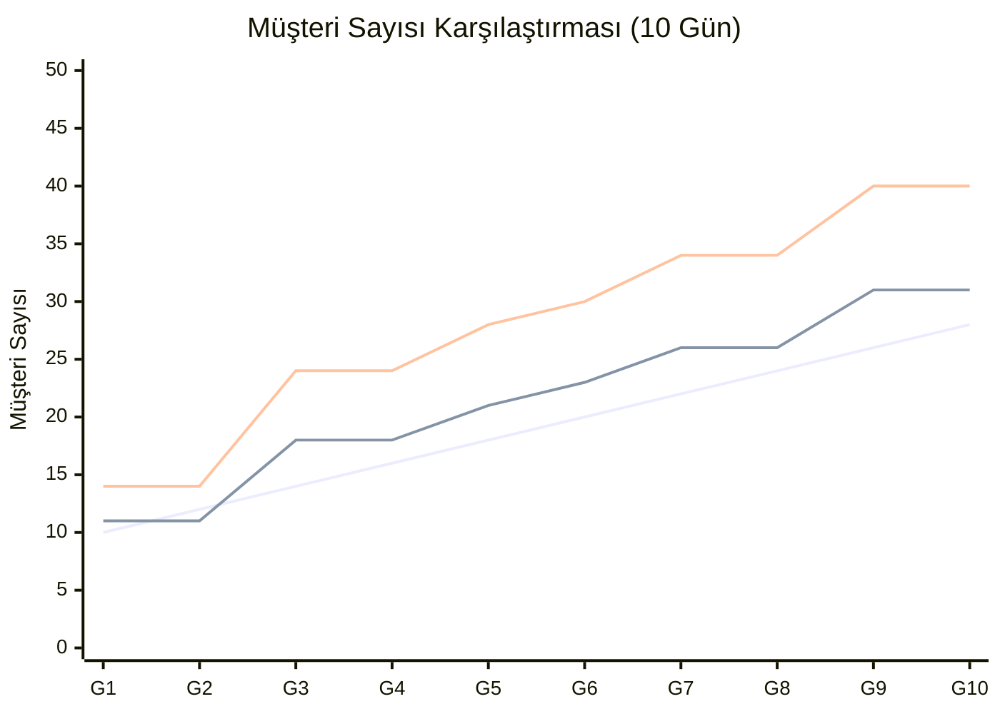

# 🎮 Senaryo Simülasyonu: Eski vs Yeni Müşteri Sistemi

> 🗄️ **ARŞİV / OBSOLETE (2026-02-14).** [2026-02-capacity-spawn-implementation-plan.md](2026-02-capacity-spawn-implementation-plan.md)'nin eşlik eden simülasyonu. Yeni ("kapasite-bazlı") sistem canlıya alındı; bu karşılaştırma yalnızca tarihsel. Güncel ekonomi/müşteri sim'i için [economy-audit-2026-07-13.md](../economy-audit-2026-07-13.md).

## Varsayılan Katsayılar

| Parametre | Değer |
|-----------|-------|
| `shelfMultiplier` | 3.0 |
| `levelMultiplier` | 2.0 |
| `minVariance` | -2 |
| `maxVariance` | +3 |
| `minCustomersPerDay` | 1 |
| `maxCustomersPerDay` | 50 |
| `baseCustomersPerDay` (eski) | 10 |
| `customerIncreasePerDay` (eski) | 2 |

---

## Senaryo 1: 🟢 Yeni Başlayan Oyuncu (Gün 1-3)

**Oyun durumu**: 2 raf, 1 masa = 3 interactable. Store Level = 1.

| Gün | ESKİ Formül | YENİ Formül (Opsiyon A) | YENİ (Opsiyon B, 1 Oyuncu) |
|-----|------------|------------------------|---------------------------|
| 1 | `10 + 0×2 = 10` | `(3×3)+(1×2)+rnd = 11 ± 2` → **9-14** | aynı (×1.0) |
| 2 | `10 + 1×2 = 12` | `(3×3)+(1×2)+rnd = 11 ± 2` → **9-14** | aynı |
| 3 | `10 + 2×2 = 14` | `(3×3)+(1×2)+rnd = 11 ± 2` → **9-14** | aynı |

> [!NOTE]
> **Analiz**: Eski sistemde gün geçtikçe artıyor ama oyuncu hiçbir şey yapmasa bile. Yeni sistemde raf/masa eklemedikçe müşteri sayısı **sabit kalıyor** — bu adil.

---

## Senaryo 2: 📈 Orta Seviye Oyuncu (Gün 5-7)

**Oyun durumu**: 5 raf, 2 masa = 7 interactable. Store Level = 3.

| Gün | ESKİ Formül | YENİ (A) | YENİ (B, 2 Oyuncu, ×1.3) |
|-----|------------|---------|--------------------------|
| 5 | `10 + 4×2 = 18` | `(7×3)+(3×2)+rnd = 27 ± 2` → **25-30** | `27 × 1.3 = 35 ± 3` → **32-38** |
| 6 | `10 + 5×2 = 20` | **25-30** (aynı kapasite) | **32-38** |
| 7 | `10 + 6×2 = 22` | **25-30** | **32-38** |

> [!WARNING]
> **Dikkat**: 7 raf+masa ile `shelfMultiplier=3` biraz agresif. Eğer çok fazla geliyorsa Inspector'dan `2.0`'a düşürmek yeterli:
> - `shelfMultiplier=2` → `(7×2)+(3×2)+rnd = 20 ± 2` → **18-23** — Eski sistemle uyumlu!

---

## Senaryo 3: 🏆 İleri Seviye Oyuncu (Gün 10+)

**Oyun durumu**: 10 raf, 4 masa = 14 interactable. Store Level = 5.

| Gün | ESKİ Formül | YENİ (A) | YENİ (B, 3 Oyuncu, ×1.6) |
|-----|------------|---------|--------------------------|
| 10 | `10 + 9×2 = 28` | `(14×3)+(5×2)+rnd = 52 ± 2` → **50** (capped!) | `52 × 1.6 = 83` → **50** (capped!) |
| 15 | `10 + 14×2 = 38` | **50** (aynı) | **50** |
| 20 | `10 + 19×2 = 48` | **50** | **50** |

> [!IMPORTANT]
> **Soft Cap iyi çalışıyor!** 14 interactable ile hesap 52'ye çıkıyor ama `maxCustomersPerDay=50` ile sınırlanıyor. Performans korunuyor.

---

## Senaryo 4: ⚠️ Edge Case — Oyuncu Hiç Gelişmezse

**Oyun durumu**: Gün 20'de hâlâ 2 raf, 1 masa = 3. Store Level = 1.

| Gün | ESKİ Formül | YENİ (A) |
|-----|------------|---------|
| 20 | `10 + 19×2 = 48` 😱 | `(3×3)+(1×2)+rnd = 11 ± 2` → **9-14** ✅ |

> [!CAUTION]
> **ESKİ SİSTEMİN EN BÜYÜK SORUNU BU!** Gün 20'de 48 müşteri geliyor ama oyuncunun 3 interactable'ı var. İmkansız. Yeni sistemde ise müşteri sayısı kapasiteyle orantılı kalıyor.

---

## Senaryo 5: 🎯 Hızlı Gelişen Oyuncu

**Oyun durumu**: Gün 3'te zaten 8 raf, 3 masa = 11. Store Level = 4.

| Gün | ESKİ Formül | YENİ (A) |
|-----|------------|---------|
| 3 | `10 + 2×2 = 14` 😴 | `(11×3)+(4×2)+rnd = 41 ± 2` → **39-44** 🔥 |

> [!TIP]
> Hızlı gelişen oyuncu ödüllendiriliyor! Eski sistemde gün 3 = 14 müşteri. Yeni sistemde kapasitesi yüksek → 40+ müşteri → daha fazla gelir fırsatı.

---

## Görsel Karşılaştırma (10 Günlük Simülasyon)

**Senaryo**: Oyuncu her 2 günde 1 raf ekliyor, store level her 3 günde 1 artıyor.

```
Gün  Raf+Masa  Level  ESKİ    YENİ(A)   YENİ(B,2P)
───  ────────  ─────  ────    ───────   ─────────
 1    3         1      10      9-14      12-18
 2    3         1      12      9-14      12-18
 3    4         2      14      16-21     21-27
 4    4         2      16      16-21     21-27
 5    5         2      18      19-24     25-31
 6    5         3      20      21-26     27-34
 7    6         3      22      24-29     31-38
 8    6         3      24      24-29     31-38
 9    7         4      26      29-34     38-44
10    7         4      28      29-34     38-44
```



## Sonuç

| Kriter | Eski Sistem | Yeni Sistem |
|--------|------------|-------------|
| Oyuncu gelişmezse | ❌ Müşteri artmaya devam → oyun kilitlenir | ✅ Sabit kalır |
| Oyuncu hızlı gelişirse | ❌ Müşteri hâlâ yavaş artar → oyun sıkılır | ✅ Kapasiteyle orantılı artar |
| Multiplayer dengesi | ⚠️ Sadece base değer artar | ✅ Çarpan ile ölçeklenir (Opsiyon B) |
| Soft Cap | ❌ Yok, sınırsız artış | ✅ 50 ile sınırlı |
| Inspector kontrolü | ❌ Sadece 2 parametre | ✅ 7 parametre, tam kontrol |
| Random variance | ❌ Yok, her gün aynı | ✅ ±2-3 sapma |
